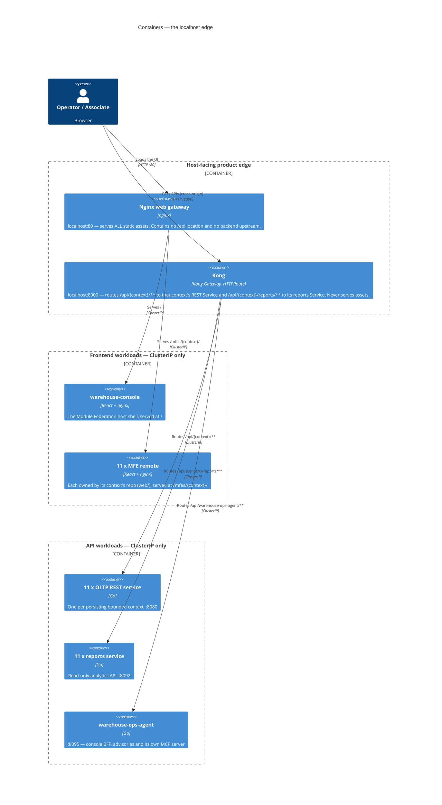
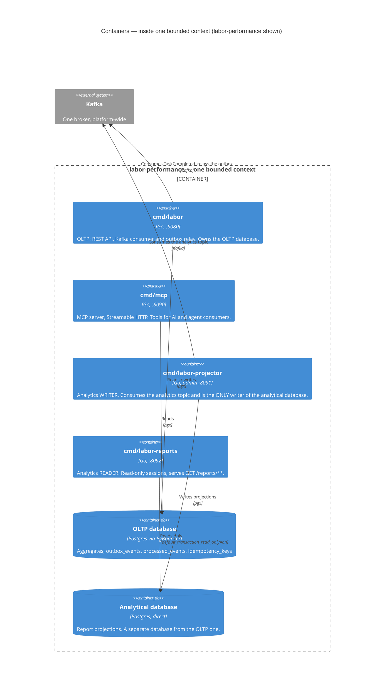
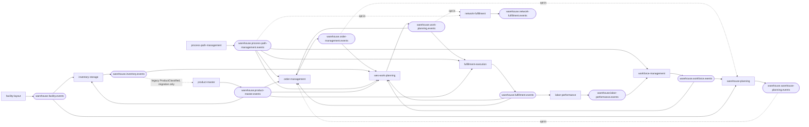

# C4 Level 2 — Containers

Zooming inside the single box from [System Context](/architecture/system-context).
A **container** here is C4's meaning of the word: a separately deployable or
runnable unit, whether that is a Go process, a Postgres database or the
broker. It is unrelated to Docker specifically.

This site covers fourteen backend contexts. Eleven of them ship **four Go
binaries and two databases** each, plus a Module Federation frontend remote,
because the analytical read side is a separate process family from the
operational one. The twelfth, `warehouse-ops-agent`, is one binary with no
database. The two newest, `inbound-receiving` and
`slotting-optimization` (decided 2026-10-08), have no deployed binaries yet
and are not drawn in the views below. (`network-inventory-planning`, the
fleet's fourteenth domain context, is deployed too but not documented on this site yet.) Binaries are listed from each repository's `cmd/` on
`origin/develop`, and workloads from its Helm chart's `templates/`.

## The edge: two independent gateways

The most commonly misread part of this architecture, so it is drawn first.
There are exactly two host-facing product entrypoints and **no proxy
relationship between them**:

The hard constraint behind this split: **Kong must never serve HTML, CSS,
JavaScript, fonts or images.** Asset delivery is nginx's job, and
`warehouse-infra`'s exposure-policy test fails any change that adds an `/api`
location to the web gateway. Kong is exposed through the Kubernetes Gateway
API (`HTTPRoute`, rendered by each chart's `httproute.yaml`), with plain
`Ingress` as the fallback when `deploy_gateway_api` is off.

Three consequences follow, and all three are load-bearing:

1. **CORS is not optional.** Assets come from `http://localhost` and APIs
   from `http://localhost:8000`, which are genuinely different origins. Kong
   grants exactly the web gateway's origin, never `*`. The endpoints are
   unauthenticated, so a wildcard would let any page on the internet read the
   warehouse's data through the user's own browser.
2. **Frontends cannot bake in their API base URL.** The console fetches
   `/config.json` from a ConfigMap before it mounts and publishes `apiOrigin`
   on `window.__WAREHOUSE_CONFIG__`. Every remote reads it from there.
3. **"All APIs through Kong" is a north-south rule only.** Service-to-service
   calls stay on direct ClusterIP and Kafka and never hairpin through either
   gateway.

The console's eleven remotes are `order_mgmt_mfe`, `inventory_mfe`,
`planning_mfe`, `fulfillment_mfe`, `workforce_mfe`, `facility_mfe`,
`process_path_mfe`, `labor_mfe`, `netfulfil_mfe` (keyed
`network_fulfillment_mfe` in the console's federation config),
`capacity_mfe` (warehouse-planning) and `productmaster_mfe`
(product-master, served at `/mfes/product-master/`). The console's
cross-cutting screens (the order lifecycle and the WMS and WES dashboards)
do not call every service
from the browser. They call `warehouse-ops-agent`'s BFF routes
`/console/orders/{id}/lifecycle`, `/console/reports/wms` and
`/console/reports/wes`, which fan out server-side.

## Inside one bounded context: four binaries, two databases

Every persisting bounded context follows the same internal shape.
`labor-performance` is drawn here as the representative example. Substitute
the names and the diagram holds for all eleven.

### Why the read side is separate processes

This is the estate-level CQRS split. Each context owns its analytical read
model as a **data product** built from its own analytics stream, rather than
every context feeding one central warehouse.

| Process | Database access | Guarantee it buys |
| --- | --- | --- |
| OLTP binary | Read-write on the OLTP database | Report queries run against a different database, so they never lock or block operational tables. |
| Projector | Read-write on the analytical database | Exactly one writer, so two racing writers can never corrupt the projection. |
| Reports binary | Sessions opened with `default_transaction_read_only=on` | A bug in the reader cannot mutate the read model. |

The report is rebuilt purely from events, with no second write from the
OLTP side. That makes it clean but **eventually consistent**: the contract
is a freshness lag, not real time, which is why every report has a
`/freshness` endpoint and the console's dashboard cards show it.

## The whole fleet at a glance

| Context | OLTP binary | MCP | Projector | Reports | MFE remote | Databases |
| --- | --- | --- | --- | --- | --- | --- |
| `order-management` | `cmd/order` | `cmd/mcp` | `cmd/order-projector` | `cmd/order-reports` | `order_mgmt_mfe` | 2 |
| `inventory-storage` | `cmd/inventory` | `cmd/mcp` | `cmd/inventory-projector` | `cmd/inventory-reports` | `inventory_mfe` | 2 |
| `wes-work-planning` | `cmd/wes` | `cmd/mcp` | `cmd/wes-projector` | `cmd/wes-reports` | `planning_mfe` | 2 |
| `fulfillment-execution` | `cmd/execution` | `cmd/mcp` | `cmd/fulfillment-projector` | `cmd/fulfillment-reports` | `fulfillment_mfe` | 2 |
| `workforce-management` | `cmd/workforce` | `cmd/mcp` | `cmd/workforce-projector` | `cmd/workforce-reports` | `workforce_mfe` | 2 |
| `facility-layout` | `cmd/facility` | `cmd/mcp` | `cmd/facility-projector` | `cmd/facility-reports` | `facility_mfe` | 2 |
| `process-path-management` | `cmd/pathmgmt` | `cmd/mcp` | `cmd/pathmgmt-projector` | `cmd/pathmgmt-reports` | `process_path_mfe` | 2 |
| `labor-performance` | `cmd/labor` | `cmd/mcp` | `cmd/labor-projector` | `cmd/labor-reports` | `labor_mfe` | 2 |
| `network-fulfillment` | `cmd/netfulfil` | `cmd/mcp` | `cmd/netfulfil-projector` | `cmd/netfulfil-reports` | `netfulfil_mfe` | 2 |
| `warehouse-planning` | `cmd/api` | `cmd/mcp` | `cmd/planning-projector` | `cmd/planning-reports` | `capacity_mfe` | 2 |
| `product-master` | `cmd/api` | `cmd/mcp` | `cmd/product-projector` | `cmd/product-reports` | `productmaster_mfe` | 2 |
| `warehouse-ops-agent` | `cmd/agent` | in-process at `/mcp` | none | none | none | **0** |

Per-context table counts are in [Data Models](/architecture/data-models),
and aggregate counts are in [Domain Model](/architecture/domain-model).

`warehouse-ops-agent` is the deliberate exception on every axis. It has one
binary and **no database**, and holds no persisted state: every fact it
reasons over is re-derived from upstream MCP and REST reads at request time.
It is a Customer of the other contexts' Open Host Services, with no aggregate
of its own. It is also the only context whose MCP server shares a process and
port with its main binary.

### The port convention

| Workload | Listen address | Env var | Kubernetes Service |
| --- | --- | --- | --- |
| OLTP | `:8080` | `HTTP_ADDR` | `:80` to 8080 |
| MCP | `:8090` | `MCP_ADDR` | `:8090` to 8090 |
| Projector | `:8091` | `ADMIN_ADDR` | none: admin and health only |
| Reports | `:8092` | `HTTP_ADDR` | `<context>-reports`, `:80` to 8092 |
| Frontend (nginx) | `:8080` | — | `:80` to 8080 |
| `warehouse-ops-agent` | `:8095` | `AGENT_ADDR` | REST and `/mcp` on one port |

Each chart's Services select on `app.kubernetes.io/component` as well as the
name and instance labels, so the OLTP, MCP, projector and reports pods of one
release are addressed separately.

### Where the databases actually live

The logical separation is real, but the physical deployment has less
isolation than the diagram might suggest. **One Postgres release**
(`postgres`, in the data namespace) hosts twenty-three databases: an OLTP
database and a `<service>_analytics` database for each of the eleven
persisting contexts on this site, plus `network-inventory-planning`'s OLTP
database, each with its own generated role. OLTP connections go through PgBouncer. Analytics connections go to
Postgres directly.

In the local cluster a single generated analytics role serves both the
projector and the reports binary (each chart's `reportsUrl` falls back to
`projectorUrl`). The read-only guarantee therefore comes from the reports
binary's read-only sessions. A distinct read-only role is the documented
promotion path in `warehouse-infra`.

## MCP servers

Every persisting context runs a `cmd/mcp` binary that serves MCP over
Streamable HTTP on `:8090`, and `warehouse-ops-agent` serves its own read-only
tools in-process at `/mcp`. Like REST, **MCP is unauthenticated
fleet-wide**.

The main MCP consumer inside the fleet is `warehouse-ops-agent`, which calls
upstream tools such as `get_rebalance_recommendation`,
`get_backlog_telemetry`, `get_staffing_gap`, `diagnose_stuck_tasks`,
`get_task_type_utilization`, `check_availability`, `estimate_travel_distance`
`get_process_path_capacity` and product-master's `list_products` (for
`find_master_data_gaps`). Several more are wired but unused.
labor-performance and process-path-management call no sibling over REST or
MCP. The per-tool status is on each context's
[Context Map](/strategic-design/context-map) page.

## Kafka: one broker, two topic families

There is exactly **one Kafka broker platform-wide**: a single combined
controller and broker in KRaft mode. Business topics are auto-created with
eight partitions. Consumers dead-letter messages they cannot process to
`<topic>.dlq`.

Two distinct topic families run over it, and conflating them is a common
misreading:

- **Integration topics** are the published language between bounded
  contexts. They are the edges on the
  [Context Map](/strategic-design/context-map).
- **Analytics topics** feed only that context's own projector. They are kept
  off the integration topics so that adding a report never changes a contract
  another context depends on.

Both families carry exactly one envelope: **CloudEvents 1.0 in structured
content mode**, with `content-type: application/cloudevents+json;
charset=UTF-8` on every message and `type` of the form
`com.warehouse.<wms|wes>.<context>.<entity>.<EventName>`. See the
[Event Standard](/strategic-design/event-standard-cloudevents).

### Integration topics

Who publishes what, and who consumes it, from the synced `apis/*/asyncapi.yaml`
and each context's context map. "opt-in" means the consumer is off unless
configured.

| Topic | Producer | Integration types | Consumers |
| --- | --- | ---: | --- |
| `warehouse.order-management.events` | order-management | 3 | wes-work-planning (`OrderAllocated`, `OrderPartiallyAllocated`); warehouse-planning, opt-in |
| `warehouse.inventory.events` | inventory-storage | 7 | wes-work-planning (`StockReserved`, `ReservationRevoked`); product-master's legacy importer (`ProductClassified`, emitted only by the one-shot backfill, migration only); the four transfer replies go to `network-inventory-planning`, not documented here |
| `warehouse.work-planning.events` | wes-work-planning | 11 | fulfillment-execution (`WorkReleased`); order-management and network-fulfillment (`PathCapacityChanged`) |
| `warehouse.fulfillment.events` | fulfillment-execution | 3 | wes-work-planning and labor-performance (`TaskCompleted`); order-management (`TaskCPTMissed`, `PackageManifested`) |
| `warehouse.workforce.events` | workforce-management | 1 | wes-work-planning, warehouse-planning (`ShiftPlanCommitted`) |
| `warehouse.facility.events` | facility-layout | 12 | inventory-storage, warehouse-planning |
| `warehouse.process-path-management.events` | process-path-management | 4 | fulfillment-execution, wes-work-planning, workforce-management, order-management, network-fulfillment |
| `warehouse.labor-performance.events` | labor-performance | 1 | workforce-management (`TaskPerformanceRecorded`) |
| `warehouse.warehouse-planning.events` | warehouse-planning | 4 | order-management, opt-in |
| `warehouse.network-fulfillment.events` | network-fulfillment | 5 | none yet |
| `warehouse.product-master.events` | product-master | 5 | inventory-storage, order-management, wes-work-planning, fulfillment-execution (`ProductClassified`, into local copies) |

The type counts are the messages each producer's `asyncapi.yaml` declares on
its integration channel. Several consumers are themselves behind a mode
switch (for example `PATH_CATALOGUE_SOURCE=kafka` or
`LOCATION_LOOKUP_MODE=kafka`). The per-edge status is on each context's
context map page.

### Analytics topics

One per persisting context, consumed only by that context's own projector:
`warehouse.order-management.analytics`, `warehouse.inventory.analytics`,
`warehouse.wes.analytics` (wes-work-planning), `warehouse.fulfillment.analytics`,
`warehouse.workforce.analytics`, `warehouse.facility.analytics`,
`warehouse.process-path-management.analytics`,
`warehouse.labor-performance.analytics`,
`warehouse.network-fulfillment.analytics`,
`warehouse.warehouse-planning.analytics` and
`warehouse.product-master.analytics`.

## What this diagram does not show

- **Replica counts and autoscaling.** Those live in each chart's `hpa.yaml`
  and `warehouse-infra`'s values. Drawing them here would go stale
  immediately.
- **The observability stack.** Every binary exports OTLP traces and metrics
  to a collector, with Jaeger, Prometheus/Grafana and Loki behind it. It is
  drawn at [level 1](/architecture/system-context) and omitted here to keep
  the product topology readable.
- **Any authentication container**, because there is none. Every REST and
  MCP endpoint in the fleet is unauthenticated.

Zoom in one more level to see inside a single Go process:
[Components](/architecture/components).
