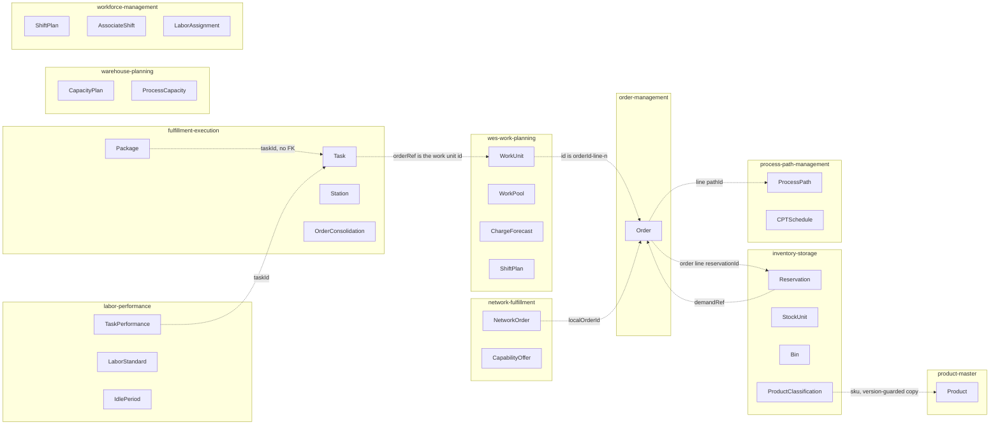

# Domain Model

The fleet-level view of what lives under `internal/domain/**` in each of the
twelve contexts documented on this site: which aggregate roots each one owns, the invariant
that makes each one a consistency boundary, and how aggregates in different
contexts refer to each other.

This page summarises. The full class diagrams, state machines and invariant
tables are on each context's own pages, synced from that repository's
`develop` branch:

- **Class Diagram**: every aggregate, entity, value object, enumeration and
  port, with the real Go names.
- **Aggregate Design Canvas**: one ddd-crew canvas per aggregate (state
  transitions, enforced invariants, corrective policies, handled commands,
  created events, throughput, size).

:::note[A table is not an aggregate]

This page is the **domain model**. The [Data Models](/architecture/data-models)
page is the *persistence shape* it is stored in, and the two are
deliberately not one-to-one. The domain layer has no knowledge of SQL (no
`pgx` types, no JSON struct tags), so the mapping between them lives entirely
in the outbound Postgres adapter.

:::

## The fleet at a glance

34 aggregate roots across eleven contexts. The twelfth, `warehouse-ops-agent`,
owns none, and that is a design decision. Counts are the per-aggregate
sections of each context's Aggregate Design Canvas, cross-checked against the
`<<AggregateRoot>>` classes in its class diagram.

| Context | Aggregate roots | # | Detailed pages |
| --- | --- | --- | --- |
| `order-management` | `Order` (entity `OrderLine`, value object `PromiseGroup`) | 1 | [class diagram](/contexts/order-management/class-diagram), [canvas](/contexts/order-management/aggregate-design-canvas) |
| `inventory-storage` | `StockUnit`, `Bin`, `Reservation` (entity `Allocation`), `ProductClassification` (a local copy since its ADR 0034) | 4 | [class diagram](/contexts/inventory-storage/class-diagram), [canvas](/contexts/inventory-storage/aggregate-design-canvas) |
| `wes-work-planning` | `ChargeForecast`, `ShiftPlan` (entity `PathPlan`), `WorkPool` (pool entries), `WorkUnit` | 4 | [class diagram](/contexts/wes-work-planning/class-diagram), [canvas](/contexts/wes-work-planning/aggregate-design-canvas) |
| `fulfillment-execution` | `Task`, `Station`, `Package`, `OrderConsolidation` | 4 | [class diagram](/contexts/fulfillment-execution/class-diagram), [canvas](/contexts/fulfillment-execution/aggregate-design-canvas) |
| `workforce-management` | `ShiftPlan`, `AssociateShift`, `LaborAssignment` | 3 | [class diagram](/contexts/workforce-management/class-diagram), [canvas](/contexts/workforce-management/aggregate-design-canvas) |
| `facility-layout` | `Site`, `Zone`, `Aisle`, `CrossAisle`, `LocationSlot`, `LocationType`, `PlacementRule`, `FixedStructure` | 8 | [class diagram](/contexts/facility-layout/class-diagram), [canvas](/contexts/facility-layout/aggregate-design-canvas) |
| `process-path-management` | `ProcessPath`, `CPTSchedule` (entity `Cutoff`) | 2 | [class diagram](/contexts/process-path-management/class-diagram), [canvas](/contexts/process-path-management/aggregate-design-canvas) |
| `labor-performance` | `LaborStandard`, `TaskPerformance`, `IdlePeriod` | 3 | [class diagram](/contexts/labor-performance/class-diagram), [canvas](/contexts/labor-performance/aggregate-design-canvas) |
| `network-fulfillment` | `NetworkOrder` (entity `Line`), `CapabilityOffer` | 2 | [class diagram](/contexts/network-fulfillment/class-diagram), [canvas](/contexts/network-fulfillment/aggregate-design-canvas) |
| `warehouse-planning` | `ProcessCapacity`, `CapacityPlan` | 2 | [class diagram](/contexts/warehouse-planning/class-diagram), [canvas](/contexts/warehouse-planning/aggregate-design-canvas) |
| `product-master` | `Product` (value objects `Classification`, `PhysicalProfile` with `UnitDimensions` and `Measurement`) | 1 | [class diagram](/contexts/product-master/class-diagram), [canvas](/contexts/product-master/aggregate-design-canvas) |
| `warehouse-ops-agent` | none: per-request decision objects in `internal/domain/policy` | 0 | [class diagram](/contexts/warehouse-ops-agent/class-diagram), [canvas](/contexts/warehouse-ops-agent/aggregate-design-canvas) |

## Aggregates across context boundaries

No aggregate in the fleet holds a pointer to, or a foreign key into, another
context's aggregate. Where one context needs another's identity, it stores it
as an opaque string and never parses it. The dashed edges below are those
identity references. Each comes from the referencing context's own
entity-relationship or sequence-diagram page.

Read the edges as "stores the identity of". Five chains are worth following:

- **Order to reservation and back.** `Order` keeps the `reservationId` that
  inventory-storage minted for each allocated line, and the `Reservation`
  keeps the order-management demand reference as `demandRef`. Neither side
  models the other's aggregate locally.
- **Order line to work unit to task.** wes-work-planning mints work unit ids
  of the form `orderId-line-n` when it applies `OrderAllocated`.
  fulfillment-execution stores that work unit id as the `Task`'s `orderRef`,
  and order-management parses it back out of `TaskCPTMissed` and
  `PackageManifested` to re-promise.
- **Task to performance.** labor-performance keys each `TaskPerformance` on
  the CloudEvents `id` of the `TaskCompleted` it scored and keeps the `taskId`
  as a plain reference.
- **Network order to local order.** network-fulfillment raises a held order
  in order-management and stores the returned id as `localOrderId`.
- **Product to its local copies.** inventory-storage's `ProductClassification`
  is keyed by the SKU of a product-master `Product` and stores its `version`.
  order-management, wes-work-planning and fulfillment-execution keep the same
  copy in a `product_classification_copy` table outside their domain
  aggregates.

Same-named aggregates in different contexts are different models. The two
`ShiftPlan`s are the clearest example: workforce-management's is the headcount
a human committed, and wes-work-planning's is its own committed split.
Workforce's plan reaches wes-work-planning only as the `LaborPlanObserved`
read model (wes-work-planning ADR-0006). warehouse-planning also declares its
own `ProcessPath` locally. It shares only the `path_id` string with
process-path-management, by convention (warehouse-planning ADR 0001 Addendum).

## Per context: what each aggregate protects

Each aggregate is listed with one headline invariant and the error that
enforces it. The full invariant tables are on the linked canvas pages.

### order-management

`Order` is the only aggregate. It is the consistency boundary for intake,
allocation, release, hold and cancellation of one customer order.

- At least one line (`order.ErrNoLines`). A line is allocated only from
  `Pending` (`ErrLineNotPending`), and only `RetryAllocate` brings a line back
  from `Backordered` (`ErrLineNotBackordered`).
- **BR3**: a ship-complete order releases nothing while any line is
  unallocated (`ErrShipCompleteBlocked`). **BR6**: no cancellation once any
  line is `Released` (`ErrOrderAlreadyReleased`).
- A held order must be ship-complete (`ErrHeldOrderMustBeShipComplete`,
  ADR 0020). That rule is what lets network-fulfillment raise held orders.
- The order-level `Status` is derived from the line statuses on every call
  and never stored.

`PathSelectionPolicy`, `PromisePolicy` and the `PlannedCapacityWindow` read
model live beside the aggregate but are not aggregates.
[Canvas](/contexts/order-management/aggregate-design-canvas).

### inventory-storage

- `StockUnit`: a quantity of one SKU at one bin. Quantity never goes negative
  (`shared.ErrNegativeQuantity`). There is deliberately no "SKU balance"
  aggregate to contend on.
- `Bin`: a full bin rejects a stow (`location.ErrBinFull`). It has no SKU
  field, which is what makes storage chaotic.
- `Reservation`: revocable and expiring. Its `Allocation`s record which stock
  unit and bin each unit came from, so a revoke returns exactly that quantity.
  The reserved quantity cannot exceed the usable quantity
  (`usecases.ErrInsufficientUsable`).
- `ProductClassification`: at least one handling tag
  (`product.ErrNoHandlingTags`). Since ADR 0034 it is a version-guarded local
  copy of product-master's classification, applied from `ProductClassified`;
  product-master is the source of truth, and this context no longer authors
  it (`PUT /products/{sku}/classification` answers `410`). Placement and DOT
  segregation at stow stay here.

[Canvas](/contexts/inventory-storage/aggregate-design-canvas).

### wes-work-planning

- `ChargeForecast`: an input fact with at least one CPT bucket
  (`charge.ErrNoBuckets`).
- `ShiftPlan`: the planned heads on a path cannot exceed its installed
  stations (`plan.ErrHeadsExceedStations`).
- `WorkPool`: hands each entry out at most once, and on a release-fed pool
  the WIP limit is a hard invariant (`release.ErrWIPLimitReached`). Backlog
  depth and WIP are computed from the entries, never stored.
- `WorkUnit`: released only from `Pending` (`workunit.ErrAlreadyReleased`) and
  never completed twice (`ErrAlreadyCompleted`).

`WorkPool` and `WorkUnit` are separate aggregates that one use case saves in
one transaction. `ReleasePolicy` is a domain service, not a method on either
of them. [Canvas](/contexts/wes-work-planning/aggregate-design-canvas).

### fulfillment-execution

- `Task`: at most one active claim (`task.ErrAlreadyClaimed`, persisted by
  the `SaveClaim` compare-and-set, ADR-0034). The claiming station must hold
  every required capability (`task.ErrCapabilityMismatch`). A claim is a
  lease that expires.
- `Station`: one occupant at a time (`station.ErrOccupied`).
- `Package`: cannot seal without scanned contents (`pack.ErrNoScannedContents`),
  and SLAM runs once, on a sealed package (`ErrNotSealed`, `ErrAlreadyProcessed`).
- `OrderConsolidation`: the PACK task is created exactly once, on the
  arrival that completes the required set (ADR-0016).

[Canvas](/contexts/fulfillment-execution/aggregate-design-canvas).

### workforce-management

- `ShiftPlan`: planned heads per path cannot exceed installed stations,
  whether supplied by the caller or read live from fulfillment-execution
  (`ErrPlannedHeadsExceedInstalled`, `ErrExceedsInstalledCapacity`).
- `AssociateShift`: no assignment while on break (`associate.ErrOnBreak`) and
  no mutation after the shift ends (`ErrShiftEnded`).
- `LaborAssignment`: at most one active assignment per associate. This is
  structural, because the root is keyed by associate and has a single active
  slot. The associate must also hold the path's certification
  (`assignment.ErrCertificationRequired`).

[Canvas](/contexts/workforce-management/aggregate-design-canvas).

### facility-layout

Eight small aggregates, because physical geography is hierarchical but each
level changes independently. `LocationSlot` is the heart of the model:

- A code has seven `[A-Z0-9]` segments (`shared.ErrMalformedLocationCode`).
  It is globally unique even after decommission
  (`usecases.ErrDuplicateLocationCode`), and its site, zone and aisle must
  exist and be active.
- `Site` decommission is one-way (`site.ErrAlreadyDecommissioned`).
- `CrossAisle` joins two distinct aisles (`ErrCrossAisleSameAisle`, also a DB
  `CHECK`).
- `PlacementRule` constrains at least one zone dimension (`ErrEmptyPredicate`).
  `RuleSet.Check` evaluates the rules at slot registration, and Deny wins.

The site layout, zone grid and travel graph are read models assembled per
request, not aggregates. [Canvas](/contexts/facility-layout/aggregate-design-canvas).

### process-path-management

- `ProcessPath`: `matchPrefix` is lower-case and never coerced
  (`ErrMatchPrefixNotLowercase`). A path needs at least one required
  capability (`ErrNoRequiredCapabilities`).
- `CPTSchedule`: one per site, because a CPT belongs to a departure, not to a
  path (ADR 0010). It needs a valid IANA timezone (`ErrInvalidTimezone`) and
  unique cutoff ids (`ErrDuplicateCptId`), and is always replaced wholesale.

[Canvas](/contexts/process-path-management/aggregate-design-canvas).

### labor-performance

- `LaborStandard`: `expectedSeconds > 0` (`ErrNonPositiveExpectedSeconds`).
  History is append-only. A revision closes the prior record and opens a new
  one, so scored rows stay historically accurate.
- `TaskPerformance`: immutable once recorded. It carries
  `standardSecondsAtCompletion` frozen at scoring time. `efficiencyPct` is
  `nil` rather than `0` when nothing was scorable ("never fabricate a
  number"), and a record is written at most once per CloudEvents `id`.
- `IdlePeriod`: the gap must be strictly positive (`ErrNegativeGap`), and
  it is capped so that a shift-spanning gap cannot poison a mean (ADR 0014).

[Canvas](/contexts/labor-performance/aggregate-design-canvas).

### network-fulfillment

- `NetworkOrder`: owns the network protocol (one answer, a 24h deadline, the
  mapping to a local order) and none of the fulfillment. It needs a non-empty
  `NetworkRef` (`ErrEmptyNetworkRef`), and a translated order has at least
  one line (`ErrNoLines`).
- `CapabilityOffer`: a replaceable snapshot that never advertises more than
  physically exists (`ErrAdvertisedExceedsPhysical`). It is persisted but
  neither published to Kafka nor submitted to the network yet.

[Canvas](/contexts/network-fulfillment/aggregate-design-canvas).

### warehouse-planning

- `ProcessCapacity`: the minimum across its registered constraints, all of
  which share one native unit (`ErrUnitMismatch`).
- `CapacityPlan`: assigned demand is never negative (`ErrNegativeDemand`),
  the path rate is an ORDER rate (`ErrPathRateNotOrder`), and
  `shortage = max(0, demand - capacity)`. A plan is published once
  (`ErrAlreadyPublished`).

[Canvas](/contexts/warehouse-planning/aggregate-design-canvas).

### product-master

- `Product`: one aggregate per SKU (`product.ErrInvalidSKU`). A
  classification has at least one handling tag (`ErrNoHandlingTags`), a
  TemperatureClass if and only if `TemperatureSensitive`
  (`ErrTemperatureClassRequired`, `ErrTemperatureClassNotApplicable`) and a
  DOT hazard class only with `Hazmat` (`ErrDOTHazardClassNotApplicable`). A
  measurement older than the current one is refused (`ErrStaleMeasurement`).
  A command that changes nothing raises no event and bumps no `version`.

[Canvas](/contexts/product-master/aggregate-design-canvas).

### warehouse-ops-agent

No aggregate root and no persisted state. `internal/domain/policy` is
deliberately not a domain in the DDD sense: it holds pure functions (`Decide`,
`Arbitrate`, `CorrelateUtilization`) that build per-request decision objects
from upstream reads. Its only rules are boundary validation of untrusted
input, such as `policy.ParseRebalanceAction`. The canvas page lists them in
place of invariants. [Canvas](/contexts/warehouse-ops-agent/aggregate-design-canvas).

## Patterns that hold across every context

1. **Private fields, behaviour-bearing methods.** State changes go through
   methods that can refuse. No public setter lets a caller bypass an
   invariant.
2. **Errors are named domain vocabulary.** `ErrShipCompleteBlocked`,
   `ErrWIPLimitReached` and `ErrAdvertisedExceedsPhysical` each *are* the
   business rule, expressed as a value.
3. **Cross-aggregate references are identities.** That holds inside a
   context (`WorkPool` and `WorkUnit`, `Package` and `Task`) and across
   contexts (the diagram above).
4. **Rules that need siblings live in the use case.** An aggregate cannot see
   its siblings, so uniqueness ("code unique", "id unique") is checked in the
   use case and reported as a `usecases.Err…` value.
5. **Lost updates are refused, not merged.** The aggregates that are
   read-modified-saved concurrently use a version guard or a compare-and-set
   in the repository (for example `ports.ErrConcurrentModification` in
   order-management, `SaveClaim` in fulfillment-execution, and the
   `WorkPool` version check in wes-work-planning).
6. **The domain layer imports nothing framework-shaped.** Every one of the
   twelve repositories has `internal/architecture/*_test.go` fitness tests
   that fail the build if it does. See [Components](/architecture/components).
