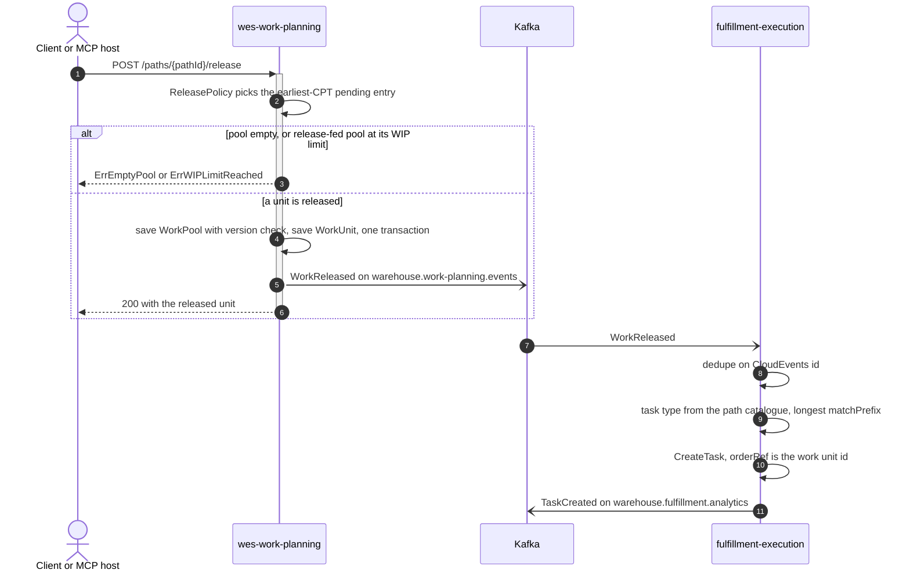
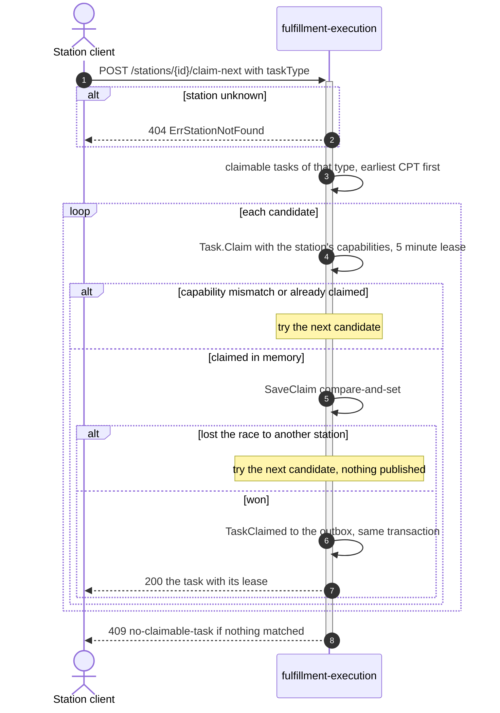
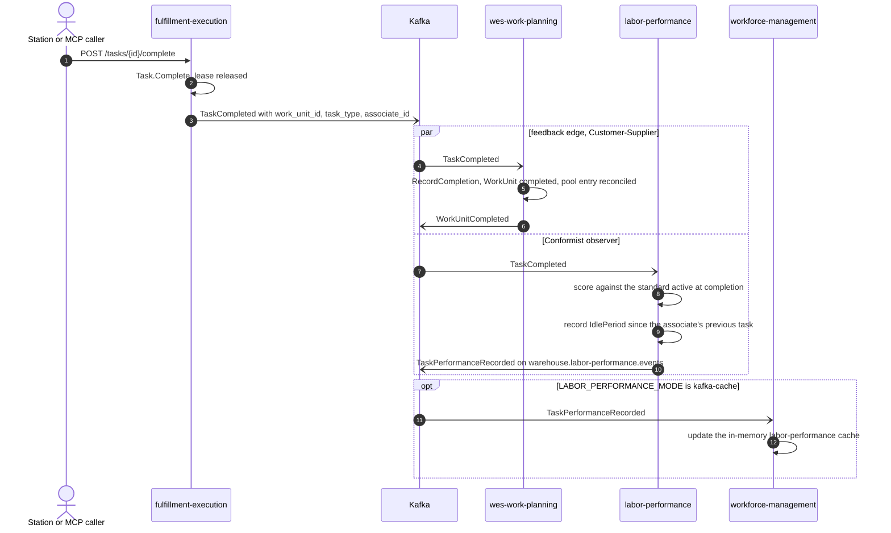
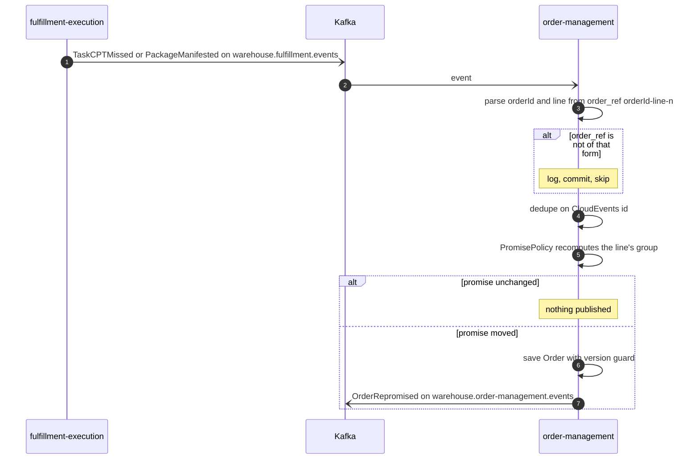
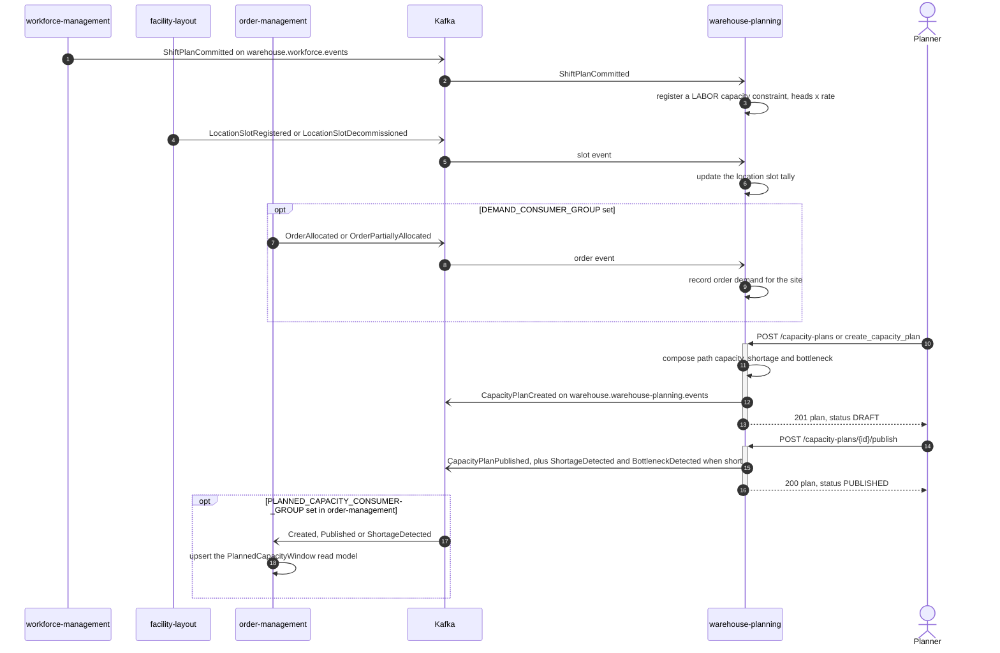
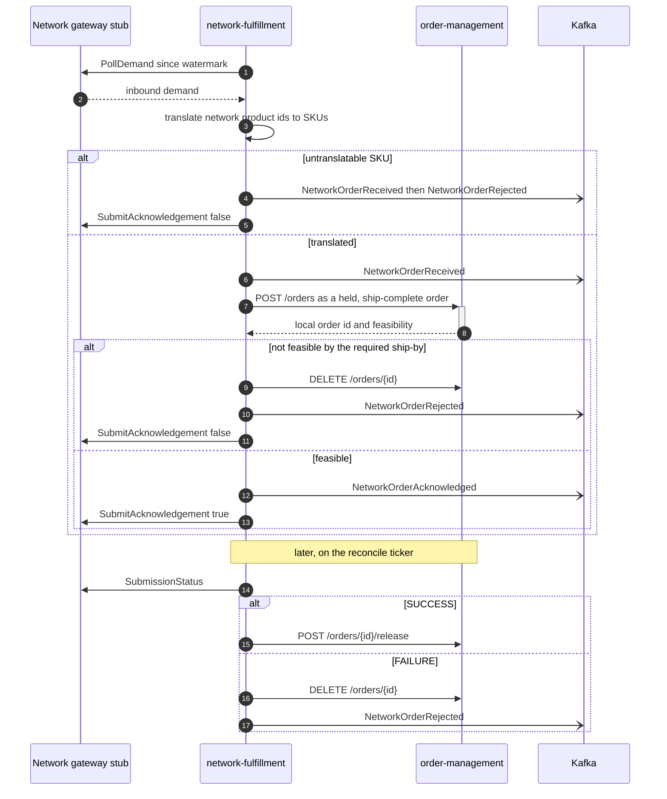
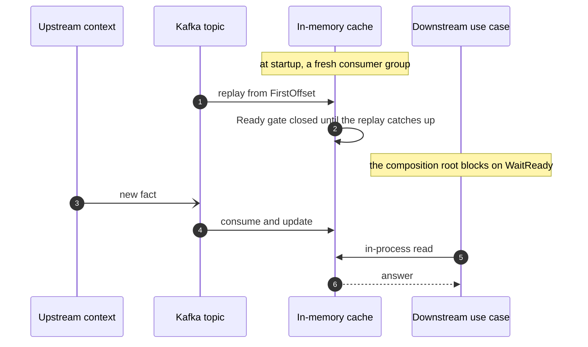
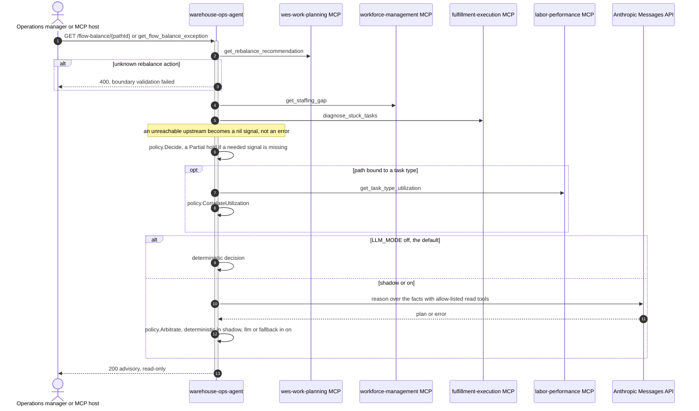

# Runtime Flows

Fleet-level sequence diagrams for the scenarios that cross bounded-context
boundaries. Each participant here is a whole context. The detailed version of
every step, with the real adapter, use case, aggregate, repository and outbox
participants and every error branch, is on that context's own **Sequence
Diagrams** page, traced from the use-case code on `develop`:

| Context | Detailed sequence diagrams |
| --- | --- |
| `order-management` | [Sequence Diagrams](/contexts/order-management/sequence-diagrams) |
| `inventory-storage` | [Sequence Diagrams](/contexts/inventory-storage/sequence-diagrams) |
| `wes-work-planning` | [Sequence Diagrams](/contexts/wes-work-planning/sequence-diagrams) |
| `fulfillment-execution` | [Sequence Diagrams](/contexts/fulfillment-execution/sequence-diagrams) |
| `workforce-management` | [Sequence Diagrams](/contexts/workforce-management/sequence-diagrams) |
| `facility-layout` | [Sequence Diagrams](/contexts/facility-layout/sequence-diagrams) |
| `process-path-management` | [Sequence Diagrams](/contexts/process-path-management/sequence-diagrams) |
| `labor-performance` | [Sequence Diagrams](/contexts/labor-performance/sequence-diagrams) |
| `network-fulfillment` | [Sequence Diagrams](/contexts/network-fulfillment/sequence-diagrams) |
| `warehouse-planning` | [Sequence Diagrams](/contexts/warehouse-planning/sequence-diagrams) |
| `warehouse-ops-agent` | [Sequence Diagrams](/contexts/warehouse-ops-agent/sequence-diagrams) |

See [Diagram Notation](/architecture/diagram-notation) for the arrow
conventions. Solid arrows are synchronous calls and dashed arrows their
responses. Open arrows (`-)`) are asynchronous Kafka publishes, where the
sender neither waits nor learns who consumed the message.

Four mechanics recur in every flow below and are drawn only once here:

- **Transactional outbox.** A use case saves its aggregate and inserts the
  events it raised into `outbox_events` in one transaction. A relay in the
  OLTP binary drains the rows to Kafka. "Publishes" below always means
  "commits an outbox row that the relay publishes".
- **CloudEvents 1.0, structured mode.** Every message is a CloudEvents
  envelope with `content-type: application/cloudevents+json; charset=UTF-8`.
  Consumers dispatch on the full `type` and ignore unknown types.
- **Consumer idempotency.** A consumer that writes state marks the
  CloudEvents `id` as processed in the same transaction, so an at-least-once
  redelivery is a no-op.
- **Dead-lettering.** A message that is not a valid CloudEvent, or whose
  handler keeps failing after bounded retries, goes to
  `<topic>.dlq` and the offset is committed. Delivery never blocks on a
  poison message.

## 1. Order intake, allocation and release

One `POST /orders` expresses the whole intent. Allocation and release are
internal steps of that request. Release to the WES tier is a Kafka
choreography: order-management does not call wes-work-planning. Its old
synchronous `POST /paths/{pathId}/work-units` call is deliberately absent
since order-management ADR 0005.

```mermaid
sequenceDiagram
    autonumber
    actor Client as Order source
    participant OM as order-management
    participant INV as inventory-storage
    participant K as Kafka
    participant WP as wes-work-planning

    Client->>+OM: POST /orders with Idempotency-Key
    OM->>OM: resolve a process path per line, Order created
    OM-)K: OrderReceived on warehouse.order-management.analytics only

    loop every line
        OM->>+INV: POST /reservations with Idempotency-Key
        alt 201 reserved
            INV-->>-OM: reservation id
            OM->>OM: Order.Allocate, OrderLineAllocated
        else 409 insufficient stock, a business fact
            INV-->>OM: 409
            OM->>OM: Order.MarkBackordered, OrderLineBackordered
        else transport error, 5xx or open circuit breaker
            INV-->>OM: error
            OM->>OM: save what was allocated, OrderAllocationPartiallyFailed
            Note over OM: the pass aborts, nothing is backordered on a guess
        end
    end

    OM->>OM: PromisePolicy sets promise groups
    opt not held and EnsureReleasable passes
        OM->>OM: Release every Allocated line
    end
    OM-)K: OrderAllocated or OrderPartiallyAllocated on warehouse.order-management.events
    OM-->>-Client: 201 with the order as saved

    K-)WP: OrderAllocated
    WP->>WP: dedupe on CloudEvents id
    WP->>WP: enqueue one WorkUnit per line, id orderId-line-n, CPT from promise_date
```

**The branch that matters** is the three-way split on the reservation call.
A `409` is inventory's real answer ("not enough stock"), so the line becomes
`Backordered` and allocation continues. Anything else (a timeout, a 5xx, an
open breaker) is *ambiguous*: the reservation may or may not exist upstream.
The pass therefore stops, saves what it already allocated, and publishes
`OrderAllocationPartiallyFailed` rather than inventing a backorder. The
request still returns `201`, because the order was received. The response
shows whatever was saved. `POST /orders/{id}/retry-allocation` and
`POST /orders/{id}/release` (for held orders) re-enter the same allocation
pass.

No outcome event is published when the order ends fully `Backordered`. Its
per-line facts already tell the story. Details:
[order-management diagrams 1 and 2](/contexts/order-management/sequence-diagrams),
[wes-work-planning diagram 7](/contexts/wes-work-planning/sequence-diagrams).

## 2. Release into execution

How queued work becomes a claimable task. Release is pull-driven: a caller
asks wes-work-planning to release the next unit for a path, over REST or the
MCP tool `release_next_work`.

The pool update, the work-unit change and the outbox rows commit together or
not at all. A concurrent release that loses the pool's version check is
retried. Details:
[wes-work-planning diagram 2](/contexts/wes-work-planning/sequence-diagrams),
[fulfillment-execution diagram 2](/contexts/fulfillment-execution/sequence-diagrams).

## 3. Pull-based claim

No dispatcher assigns work. A station asks, and fulfillment-execution answers
with the earliest-CPT task the station is equipped for.

A claim is a **lease**, not an assignment. If it expires, the sweep returns
the task to the pool. A task can be claimed, but never lost. Details:
[fulfillment-execution diagrams 3 and 9](/contexts/fulfillment-execution/sequence-diagrams).

## 4. Completion and the consumers it feeds

`TaskCompleted` is published once on `warehouse.fulfillment.events` and
consumed by two contexts with different relationships to it. A third context
consumes what one of them derives from it.

The same message, two strategic relationships. wes-work-planning is the
**Customer/Supplier** feedback edge: completion is what reconciles the pool,
so the conductor can admit more work. Its context map rules out Partnership
and Shared Kernel. labor-performance is a **Conformist**. It takes the event
exactly as published and has no write path back to execution. It also makes
no REST or MCP call to any sibling.

`efficiencyPct` stays `null` when nothing was scorable, and a redelivered
`TaskCompleted` is a no-op because the CloudEvents `id` is the performance
record's key. Details:
[wes-work-planning diagram 3](/contexts/wes-work-planning/sequence-diagrams),
[labor-performance diagram 2](/contexts/labor-performance/sequence-diagrams).

## 5. Re-promise loop

When execution misses a CPT or manifests a package, order-management
recomputes the delivery promise of the affected line's shipment group.

Details: [order-management diagram 7](/contexts/order-management/sequence-diagrams).

## 6. Capacity planning and planned capacity

warehouse-planning builds its capacity model from other contexts' events,
and order-management can consume the plans it publishes.

Both of the order-management edges are opt-in. Each is off unless its
consumer group is configured. order-management ignores `BottleneckDetected`.
Details: [warehouse-planning diagrams 2 to 7](/contexts/warehouse-planning/sequence-diagrams),
[order-management diagram 8](/contexts/order-management/sequence-diagrams).

## 7. Network demand

network-fulfillment is the anti-corruption layer to an external retail
fulfillment network. The network gateway is a stub today, and
`NETWORK_MODE=live` refuses to boot.

Every network-fulfillment event goes to `warehouse.network-fulfillment.events`.
No fleet context consumes that topic yet. Details:
[network-fulfillment diagrams 1 to 4](/contexts/network-fulfillment/sequence-diagrams).

## 8. Event-fed cache instead of a synchronous call

A pattern that recurs across the fleet. A downstream context keeps an
in-memory cache of an upstream's published facts, so the request path never
makes a network call to that upstream.

| Upstream topic and types | Downstream cache | Selected by |
| --- | --- | --- |
| process-path-management `ProcessPath*` (and `CPTScheduleChanged` where needed) | path catalogues in fulfillment-execution, wes-work-planning, workforce-management, order-management, network-fulfillment `PATH_CATALOGUE_SOURCE=kafka` in the first four. The default is a YAML file in fulfillment-execution, wes-work-planning and workforce-management, and `none` in order-management. network-fulfillment's cache is behind `CAPABILITY_OFFER_ENABLED` |
| facility-layout `ZoneRegistered`, `LocationSlotRegistered`, `LocationSlotDecommissioned` | inventory-storage's location classification cache | `LOCATION_LOOKUP_MODE=kafka`. `http` is the wired rollback to `GET /locations/{code}/classification` |
| labor-performance `TaskPerformanceRecorded` | workforce-management's labor-performance cache | `LABOR_PERFORMANCE_MODE=kafka-cache`. `http` calls `GET /task-types/{taskType}/performance`, and the service default is `permissive` |
| wes-work-planning `PathCapacityChanged` | path-capacity caches in order-management and network-fulfillment | order-management's path catalogue source, and network-fulfillment's `CAPABILITY_OFFER_ENABLED` |

A durable variant of the same pattern carries product master data.
`product-master`'s `ProductClassified` on `warehouse.product-master.events`
feeds a Postgres local copy, not an in-memory cache, in four contexts:
inventory-storage's `product_classifications` (consumer group
`PRODUCT_MASTER_CONSUMER_GROUP`, ADR 0034) and the
`product_classification_copy` tables of order-management (ADR 0036),
wes-work-planning (ADR-0035) and fulfillment-execution (ADR-0039), selected by
`PRODUCT_CLASSIFICATION_MODE=kafka` with a stable
`PRODUCT_CLASSIFICATION_CONSUMER_GROUP`. Each consumer commits its offset
after the row is written, applies a message only when its `version` is newer
than the stored one, and so does not replay from `FirstOffset` at startup.
This replaced the synchronous `GET /products/{sku}/classification` calls to
inventory-storage, and `http` mode is now rejected at boot. The reference
deployment runs all four in `kafka` mode.

Each one trades read-your-writes freshness for availability: the downstream
keeps answering while the upstream is down, and new facts arrive without a
restart. The per-edge status (live, opt-in, wired-but-unused) is on each
context's [Context Map](/strategic-design/context-map) page.

## 9. The agentic read path

`warehouse-ops-agent` holds no database and no state. Every fact in an
advisory is re-derived at request time from upstream MCP tools, and the agent
never writes to any context.

Every degradation path lands in the same place: the deterministic decision.
A missing binding, an unreachable MCP server, a `null` utilization or a
failing LLM call all produce a *less enriched* answer, never a wrong one.
The LLM is consulted **behind** a policy layer and has no actuators. The
daily brief, the stranded-reservation check, the travel-factor explanation
and the console BFF fan-outs (`/console/orders/{id}/lifecycle`,
`/console/reports/wms`, `/console/reports/wes`) are on
[the agent's sequence diagrams page](/contexts/warehouse-ops-agent/sequence-diagrams).
