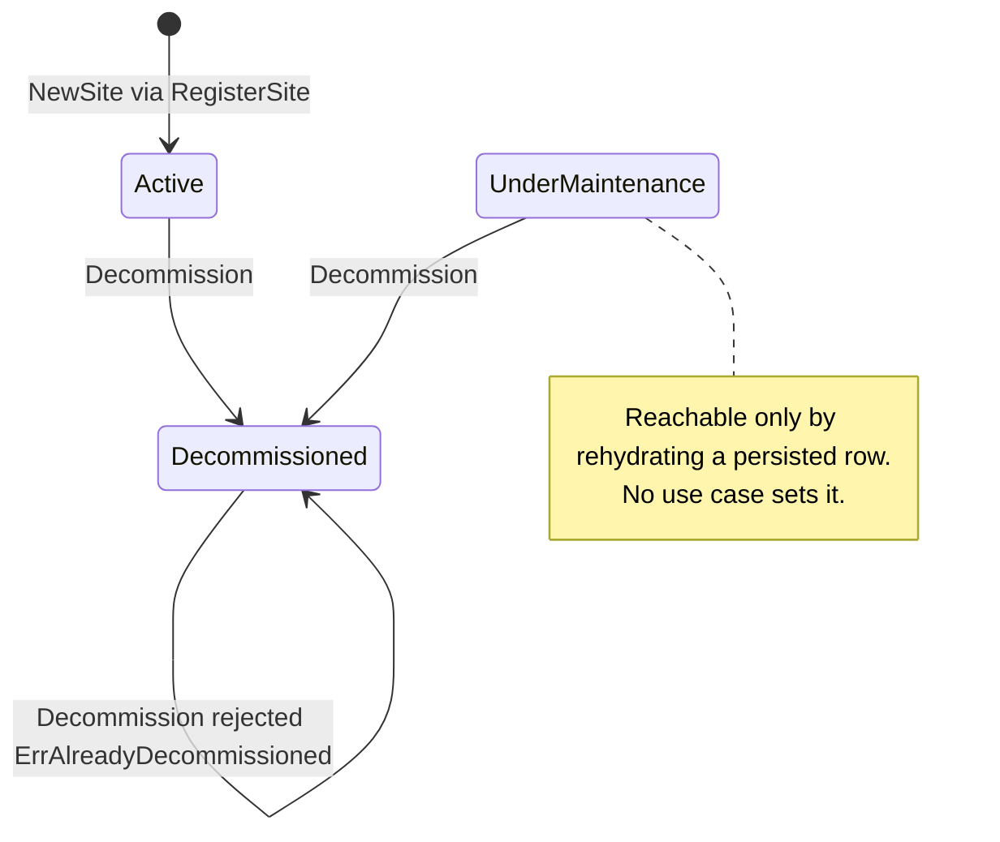
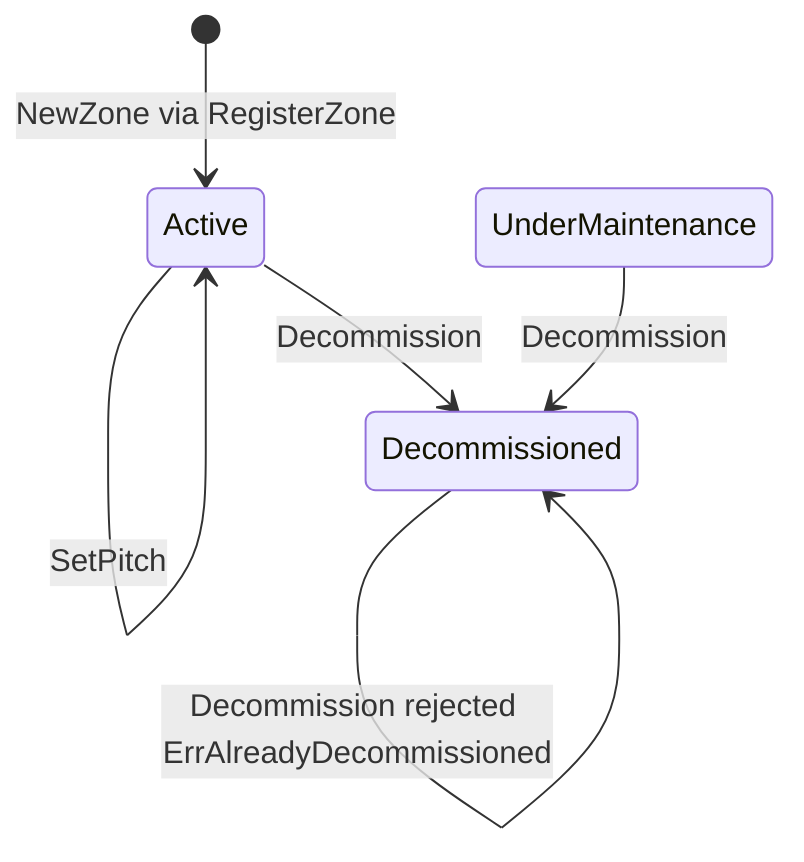
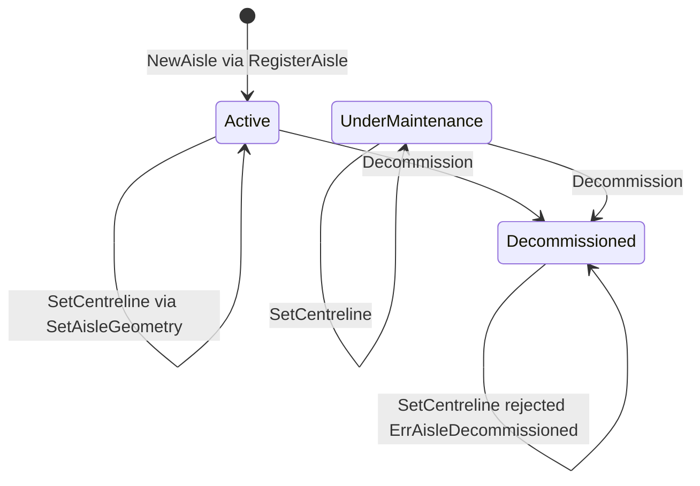
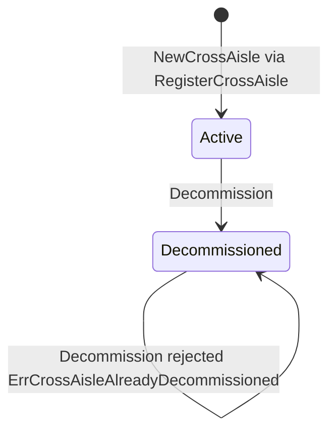
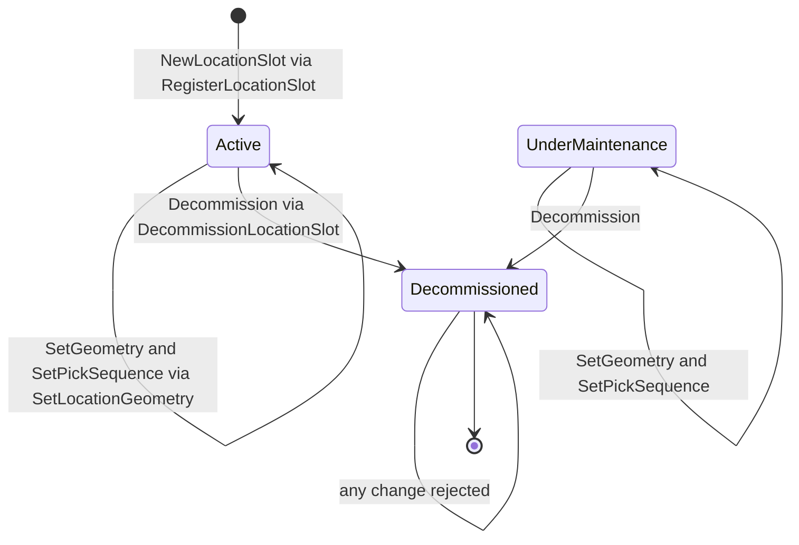
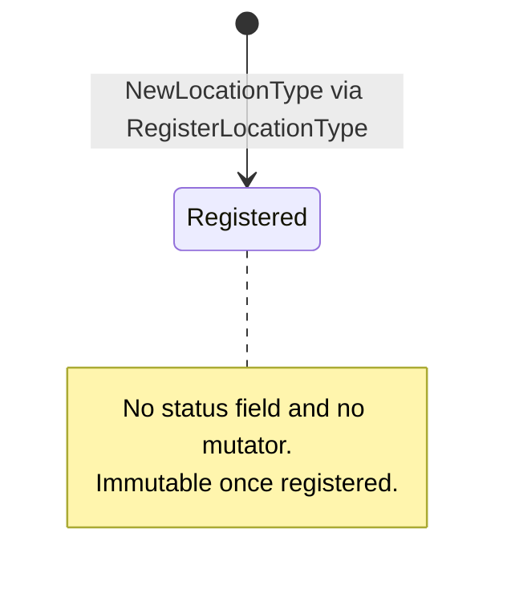
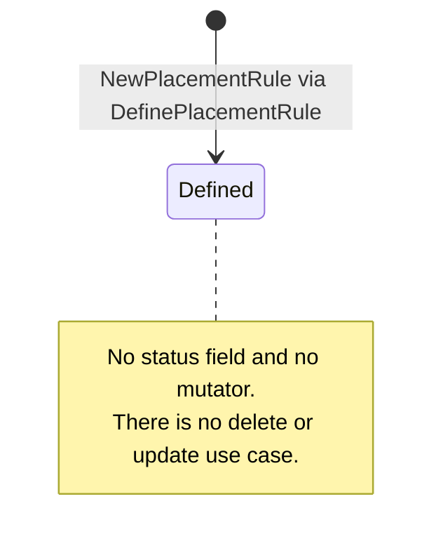
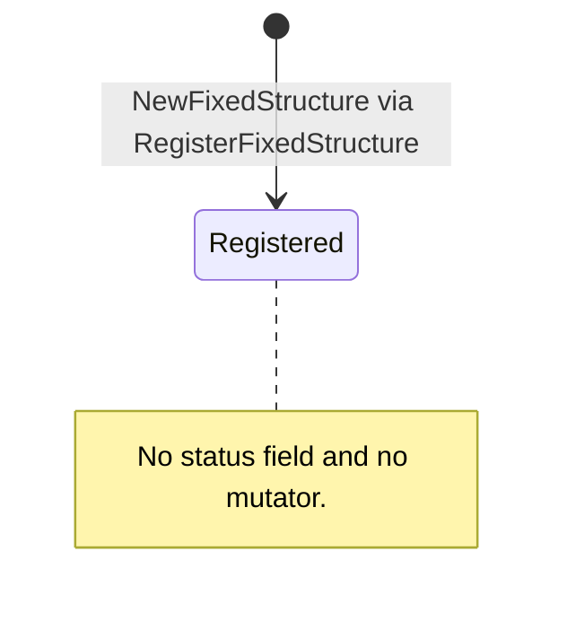

# Aggregate Design Canvas

:::info[Synced from facility-layout]
This page is a copy of [`docs/docs/ddd/aggregate-design-canvas.md`](https://github.com/IQVO/facility-layout/blob/develop/docs/docs/ddd/aggregate-design-canvas.md) on `develop`, derived from that repository's code. Edit it there, then re-sync.
:::

Following the [ddd-crew Aggregate Design Canvas v1.1](https://github.com/ddd-crew/aggregate-design-canvas),
one section per aggregate root. An aggregate root here is a domain type with
its **own repository port** in `internal/application/ports/ports.go` — there
are eight. The narrative companions are [Aggregates](https://github.com/IQVO/facility-layout/blob/develop/docs/docs/ddd/aggregates.md) (the
hierarchy and identities) and [Invariants](https://github.com/IQVO/facility-layout/blob/develop/docs/docs/ddd/invariants.md) (the
chain-of-custody flow and the full invariant table).

Conventions on this page:

- CloudEvents types are written in full; all share the prefix
  `com.warehouse.wms.facility-layout.` (`internal/domain/shared/events.go`).
- HTTP status in brackets is the RFC 7807 mapping in
  `internal/adapters/inbound/http/errors.go`.
- **Throughput** and **Size** are **estimates**, reasoned from the domain
  (a warehouse map changes slowly), not measured.
- `Rehydrate*` constructors are persistence-only and skip invariants; they are
  not commands.

Read models and projections are **not** aggregates — see
[Read models and projections](#read-models-and-projections-not-aggregates) at
the end.

## Site

### 1. Name

`site.Site` — `internal/domain/site/site.go`. Identity: `SiteCode` (e.g. `WH1`).

### 2. Description

A physical facility/building; the root of the location hierarchy. Its code is
the first segment of every `LocationCode` inside it.

### 3. State Transitions

Source: `internal/domain/site/site.go`, `internal/domain/shared/enums.go`.
Omitted: `RehydrateSite`. No use case calls `Site.Decommission` today.

### 4. Enforced Invariants

| Invariant | Enforced by |
|---|---|
| Code non-empty | `ErrEmptySiteCode` [400] — `NewSite` |
| Code is `[A-Z0-9]` only | `ErrInvalidSiteCode` [400] — `validateSiteCode` |
| Name non-empty | `ErrEmptySiteName` [400] — `NewSite` |
| Code unique | `usecases.ErrDuplicateSite` [409] — `RegisterSite` (an aggregate cannot see its siblings) |
| Decommission is one-way | `site.ErrAlreadyDecommissioned` [409] |

### 5. Corrective Policies

None inside the aggregate. A duplicate code is refused, not merged.
`ImportFacilityLayout.ensureSite` reuses an existing Active site instead of
re-registering it, and rejects the row with `ErrSiteNotActive` otherwise.

### 6. Handled Commands

`RegisterSite` (`POST /sites`), and implicitly `ImportFacilityLayout`
(`POST /locations/import`) for a site seen for the first time.

### 7. Created Events

`com.warehouse.wms.facility-layout.site.SiteRegistered`

### 8. Throughput (estimate)

A handful of writes per site lifetime; reads (layout, chain-of-custody
lookups) far outnumber writes. No concurrency hotspot.

### 9. Size (estimate)

One event per instance (`SiteRegistered`); lives for years; three fields.

## Zone

### 1. Name

`zone.Zone` — `internal/domain/zone/zone.go`. Identity: `SITE-AREA-ZONE`
(e.g. `WH1-STOR-AMB`), the first three `LocationCode` segments.

### 2. Description

A behavioural classification scoped to a Site, bundling the Area and Zone
segments. Its `TemperatureClass` and `Hazmat` flag are what placement rules
match on. Optional `bayPitchM` / `levelPitchM` feed the travel graph's
estimated-distance fallback.

### 3. State Transitions

Source: `internal/domain/zone/zone.go`, `internal/application/usecases/register_zone.go`.
Omitted: `RehydrateZone`; `SetPitch` is only called during `RegisterZone`.
No use case calls `Zone.Decommission` today.

### 4. Enforced Invariants

| Invariant | Enforced by |
|---|---|
| Scoped to a site | `zone.ErrEmptySiteCode` [400] |
| Area and zone codes present, `[A-Z0-9]` | `ErrEmptyAreaCode`, `ErrEmptyZoneCode`, `ErrInvalidCode` [400] |
| Temperature class is Ambient / Chilled / Frozen | `shared.ErrUnknownTemperatureClass` [422] |
| Bay and level pitch both > 0 when set | `ErrInvalidPitch` [422] — `SetPitch` |
| Parent site exists and is Active | `usecases.ErrSiteNotFound` [404], `ErrSiteNotActive` [409] — `RegisterZone` |
| Zone id unique within the site | `usecases.ErrDuplicateZone` [409]; DB `UNIQUE (site_code, area_code, zone_code)` |
| Decommission is one-way | `zone.ErrAlreadyDecommissioned` [409] |

### 5. Corrective Policies

Unset pitch falls back to `DefaultBayPitchM` (1.2 m) and `DefaultLevelPitchM`
(1.5 m) — `BayPitchM()` / `LevelPitchM()`.

### 6. Handled Commands

`RegisterZone` (`POST /sites/{siteCode}/zones`), `ImportFacilityLayout`.

### 7. Created Events

`com.warehouse.wms.facility-layout.zone.ZoneRegistered`

### 8. Throughput (estimate)

Tens of writes per site lifetime. Read on every slot registration (chain of
custody) and every travel-graph build.

### 9. Size (estimate)

One event per instance; lives as long as its site; eight fields.

## Aisle

### 1. Name

`aisle.Aisle` — `internal/domain/aisle/aisle.go`. Identity:
`ZoneID-AISLE` (e.g. `WH1-STOR-AMB-A07`).

### 2. Description

A physical corridor scoped to a Zone. `SequenceHint` is the walk order;
`Direction` (`OneWay` / `TwoWay`) shapes the travel graph; an optional
`centreline` Segment gives real distances.

### 3. State Transitions

Source: `internal/domain/aisle/aisle.go`, `internal/application/usecases/set_aisle_geometry.go`.
Omitted: `RehydrateAisle`; the `ErrAlreadyDecommissioned` self-loop. No use
case calls `Aisle.Decommission` today.

### 4. Enforced Invariants

| Invariant | Enforced by |
|---|---|
| Scoped to a zone | `ErrEmptyZoneID` [400] |
| Aisle code present, `[A-Z0-9]` | `ErrEmptyAisleCode`, `ErrInvalidAisleCode` [400] |
| `sequenceHint` ≥ 0 | `ErrNegativeSequenceHint` [422]; DB `CHECK (sequence_hint >= 0)` |
| Direction is OneWay / TwoWay | `shared.ErrUnknownDirection` [422] |
| Parent zone exists and is Active | `usecases.ErrZoneNotFound` [404], `ErrZoneNotActive` [409] — `RegisterAisle` |
| Aisle code unique within the zone | `usecases.ErrDuplicateAisle` [409] |
| Centreline is a real segment with distinct ends | `shared.ErrSegmentEndpointsNotReal`, `ErrSegmentStartEndEqual` [422] — `shared.NewSegment` |
| No geometry change once decommissioned | `ErrAisleDecommissioned` [409] |

### 5. Corrective Policies

With no centreline, adjacent-bay distance falls back to the zone's bay pitch
and the travel edge is flagged `Estimated` (`travel.bayDistance`).

### 6. Handled Commands

`RegisterAisle` (`POST /zones/{zoneId}/aisles`), `SetAisleGeometry`
(`PUT /zones/{zoneId}/aisles/{aisleCode}/geometry`), `ImportFacilityLayout`.

### 7. Created Events

`com.warehouse.wms.facility-layout.aisle.AisleRegistered`,
`com.warehouse.wms.facility-layout.aisle.AisleGeometryUpdated`

### 8. Throughput (estimate)

Tens to low hundreds of writes per zone lifetime, mostly at commissioning.
Not versioned: geometry is the aisle's only mutator
([ADR 0025](https://github.com/IQVO/facility-layout/blob/develop/docs/docs/adr/0025-optimistic-concurrency-version-column.md)).

### 9. Size (estimate)

1 + n events per instance (registration plus each centreline change);
small, fixed-size state.

## CrossAisle

### 1. Name

`aisle.CrossAisle` — `internal/domain/aisle/cross_aisle.go`. Identity:
`(zoneId, fromAisle, toAisle, atBay)` — the table's composite primary key.

### 2. Description

A walkable connection between two aisles of one zone at a bay ordinal, giving
the travel graph a shortcut between aisles (ADR 0017).

### 3. State Transitions

Source: `internal/domain/aisle/cross_aisle.go` (its own private
`crossAisleStatus` enum: `Active`, `Decommissioned` — no `UnderMaintenance`).
No use case calls `CrossAisle.Decommission` today.

### 4. Enforced Invariants

| Invariant | Enforced by |
|---|---|
| Zone, from-aisle, to-aisle and bay present | `ErrCrossAisleEmptyZoneID`, `ErrCrossAisleEmptyFromAisle`, `ErrCrossAisleEmptyToAisle`, `ErrCrossAisleEmptyBay` [400] |
| Two distinct aisles | `ErrCrossAisleSameAisle` [422]; DB `CHECK (from_aisle <> to_aisle)` |
| Zone exists | `usecases.ErrZoneNotFound` [404] |
| Both aisles belong to that zone | `usecases.ErrCrossAisleAisleMismatch` [422] |
| One connection per pair and bay, either direction | `usecases.ErrDuplicateCrossAisle` [409] — `CrossAisleRepo.FindByAisles` |

### 5. Corrective Policies

A cross-aisle whose bay is not a waypoint on both aisles is silently skipped
by `travel.Build`. Every cross-aisle edge is estimated from the zone's bay
pitch (`travel.crossAisleDistance`).

### 6. Handled Commands

`RegisterCrossAisle` (`POST /zones/{zoneId}/cross-aisles`).

### 7. Created Events

`com.warehouse.wms.facility-layout.crossaisle.CrossAisleRegistered`

### 8. Throughput (estimate)

A few per zone, at commissioning.

### 9. Size (estimate)

One event per instance; five fields.

## LocationSlot

### 1. Name

`slot.LocationSlot` — `internal/domain/slot/location_slot.go`. Identity: its
`LocationCode` (e.g. `WH1-STOR-AMB-A07-03-02-B`).

### 2. Description

The coded leaf location — the heart of this context. Owns whether a code
exists, is active, what it is **for** (`role`, plus `FunctionalAttributes`
for Dock / WorkCenter), its capacity envelope and optional geometry
(position, dimensions, pick-sequence override). Never what is stored in it.

### 3. State Transitions

Source: `internal/domain/slot/location_slot.go`,
`internal/application/usecases/decommission_location_slot.go`,
`set_location_geometry.go`. Omitted: `RehydrateLocationSlot`. A
decommissioned code is never re-registered (`ErrDuplicateLocationCode`).

### 4. Enforced Invariants

| Invariant | Enforced by |
|---|---|
| Code has 7 `[A-Z0-9]` segments | `shared.ErrMalformedLocationCode`, `ErrEmptyLocationSegment`, `ErrInvalidLocationSegment` [400] |
| Code globally unique, even after decommission | `usecases.ErrDuplicateLocationCode` [409] |
| Site, zone and aisle exist and are Active (no orphan slots) | `ErrSiteNotFound` / `ErrZoneNotFound` / `ErrAisleNotFound` [404], `ErrSiteNotActive` / `ErrZoneNotActive` / `ErrAisleNotActive` [409] — `RegisterLocationSlot.resolveChain` |
| Location type exists | `usecases.ErrLocationTypeNotFound` [404] |
| Type present, code present | `ErrMissingLocationType`, `ErrMissingLocationCode` [400] |
| Zone attributes match the code's zone | `ErrZoneMismatch` [422] |
| Capacity present when the role requires it | `shared.ErrInvalidMaxWeight` [422] |
| Placement rules satisfied, naming the rule | `placement.ErrPlacementRuleViolated` [422] — `RuleSet.Check` |
| Dock needs a dockFlow; WorkCenter at least one activity; no other role may carry either | `ErrDockFlowRequired`, `ErrWorkCenterActivitiesRequired`, `ErrFunctionalAttributesNotAllowed`, `ErrUnknownDockFlow`, `ErrUnknownActivity` [422] — `NewFunctionalAttributes` |
| Geometry: z ≥ 0, dimensions > 0, all-or-nothing | `shared.ErrInvalidZ`, `ErrInvalidDimensions` [422]; DB `location_slots_geometry_all_or_nothing` |
| Pick sequence ≥ 0 | `ErrNegativePickSequence` [422] |
| No change once decommissioned | `ErrAlreadyDecommissioned`, `ErrSlotDecommissioned` [409] |
| No write from a stale read | `ports.ErrConcurrentModification` [409] — Postgres `SlotRepo.Save` version check ([ADR 0025](https://github.com/IQVO/facility-layout/blob/develop/docs/docs/adr/0025-optimistic-concurrency-version-column.md)) |

### 5. Corrective Policies

- No capacity override → the type's default envelope is used.
- Duplicate activities are de-duplicated and sorted (`dedupeActivities`).
- Rule changes never retroactively invalidate an existing slot.
- A concurrent-modification `409` tells the caller to re-fetch and retry.

### 6. Handled Commands

`RegisterLocationSlot` (`POST /locations`), `DecommissionLocationSlot`
(`POST /locations/{locationCode}/decommission`), `SetLocationGeometry`
(`PUT /locations/{locationCode}/geometry`), `ImportFacilityLayout`
(`POST /locations/import`).

### 7. Created Events

`com.warehouse.wms.facility-layout.locationslot.LocationSlotRegistered`,
`com.warehouse.wms.facility-layout.locationslot.LocationSlotDecommissioned`,
`com.warehouse.wms.facility-layout.locationslot.LocationGeometryUpdated`.
`com.warehouse.wms.facility-layout.locationslot.FacilityLayoutImported`
shares the entity segment but describes a whole import, not one slot.

### 8. Throughput (estimate)

The busiest aggregate: thousands to tens of thousands of registrations per
site, in bursts during commissioning or bulk import; then a trickle of
geometry updates and decommissions. Read on every stow check that uses the
REST fallback.

### 9. Size (estimate)

Typically 2–4 events per instance over a multi-year lifetime (registered,
maybe geometry, maybe decommissioned). State is about 20 scalar fields.

## LocationType

### 1. Name

`placement.LocationType` — `internal/domain/placement/placement.go`.
Identity: its name (e.g. `PalletRack`).

### 2. Description

A reusable slot shape/kind with a `LocationRole` and a default capacity
envelope. Well-known names (`PalletRack`, `Shelf`, `ToteWall`, `BulkFloor`,
`Staging`, `Amnesty`) are constants, not an enum.

### 3. State Transitions

Source: `internal/domain/placement/placement.go`, `role.go`.

### 4. Enforced Invariants

| Invariant | Enforced by |
|---|---|
| Name non-empty | `ErrEmptyLocationTypeName` [400] |
| Role is one of the nine `LocationRole` values | `ErrUnknownLocationRole` [422] |
| Capacity required when `role.RequiresCapacity()` | `shared.ErrInvalidMaxWeight` [422] |
| Capacity, when given, has weight and volume > 0 | `shared.ErrInvalidMaxWeight`, `ErrInvalidMaxVolume` [422] — `shared.NewCapacity` |
| Name unique | `usecases.ErrDuplicateLocationType` [409] |

### 5. Corrective Policies

Missing role defaults to `Storage` at the API edge and in the
`0002_location_roles` migration default.

### 6. Handled Commands

`RegisterLocationType` (`POST /location-types`).

### 7. Created Events

`com.warehouse.wms.facility-layout.locationtype.LocationTypeRegistered`

### 8. Throughput (estimate)

Single digits to tens per platform; reference data.

### 9. Size (estimate)

One event per instance.

## PlacementRule

### 1. Name

`placement.PlacementRule` — `internal/domain/placement/placement.go`.
Identity: a caller-supplied rule id.

### 2. Description

Declares a `LocationType` as **Allow** or **Deny** in every zone matching a
`ZonePredicate` (zone code, temperature class, hazmat — AND semantics).
Evaluated by `RuleSet.Check` at slot registration: Deny wins; any matching
Allow turns the zone into an allow-list.

### 3. State Transitions

Source: `internal/domain/placement/placement.go`, `rules.go`,
`internal/application/usecases/define_placement_rule.go`.

### 4. Enforced Invariants

| Invariant | Enforced by |
|---|---|
| Id non-empty | `ErrEmptyRuleID` [400] |
| References a location type | `ErrEmptyRuleLocationType` [400] |
| Referenced location type exists | `usecases.ErrLocationTypeNotFound` [404]; DB FK `placement_rules.location_type` |
| Effect is Allow / Deny | `ErrUnknownEffect` [422] |
| Predicate constrains at least one dimension | `ErrEmptyPredicate` [422] |
| Id unique | `usecases.ErrDuplicatePlacementRule` [409] |

### 5. Corrective Policies

None: a rule is either valid or refused. Violations at slot time name the
rule (`PlacementRule.Describe`).

### 6. Handled Commands

`DefinePlacementRule` (`POST /placement-rules`).

### 7. Created Events

`com.warehouse.wms.facility-layout.placementrule.PlacementRuleDefined`

### 8. Throughput (estimate)

Tens per platform; read in full (`PlacementRuleRepo.List`) on every slot
registration.

### 9. Size (estimate)

One event per instance.

## FixedStructure

### 1. Name

`structure.FixedStructure` — `internal/domain/structure/fixed_structure.go`.
Identity: an opaque id minted by the use case.

### 2. Description

A site-scoped physical obstacle — `Wall`, `Column`, `Office`, `Conveyor` or
`Other` — with a rectangular footprint and a label, drawn on the floor plan.
Not a location stock can occupy.

### 3. State Transitions

Source: `internal/domain/structure/fixed_structure.go`.

### 4. Enforced Invariants

| Invariant | Enforced by |
|---|---|
| Id, site and label present | `ErrEmptyID`, `ErrEmptySiteCode`, `ErrEmptyLabel` [400] |
| Kind is one of the five | `ErrUnknownKind` [422] |
| Footprint is real | `ErrEmptyFootprint` [422]; `shared.NewRect`, `NewDimensions` |
| Site exists | `usecases.ErrSiteNotFound` [404] |
| Id unique | `usecases.ErrDuplicateFixedStructure` [409] |

### 5. Corrective Policies

None.

### 6. Handled Commands

`RegisterFixedStructure` (`POST /sites/{siteCode}/structures`).

### 7. Created Events

`com.warehouse.wms.facility-layout.structure.FixedStructureRegistered`

### 8. Throughput (estimate)

Tens per site, at commissioning.

### 9. Size (estimate)

One event per instance.

## Read models and projections (not aggregates)

| Read model | Built by | Stored? |
|---|---|---|
| Site layout (zones → aisles → slots) | `GetSiteLayout` | No — assembled from repositories per request; also the MCP resource `layout://facility/{siteCode}` |
| Zone grid (level × aisle/bay) | `GetZoneGrid` | No |
| Zone travel graph | `GetZoneTravelGraph` → `travel.Build` | No |
| Travel distance | `EstimateTravelDistance` → `travel.Graph.Distance` or `crossZoneBeeline` | No |
| Locations by role | `ListLocationsByRole` | No |
| Location classification (zone hazmat / temperature) | `GetLocationClassification` | No |
| Layout Catalog Growth & Change | `cmd/facility-projector` → `catalog_growth_rollup` (analytics DB) | Yes, analytics database only ([ADR 0010](https://github.com/IQVO/facility-layout/blob/develop/docs/docs/adr/0010-analytical-data-product.md)) |

`travel.Graph` is a pure-domain **service object**, not an aggregate: it is
built per request from Zone, Aisle, LocationSlot and CrossAisle state and
never persisted.
