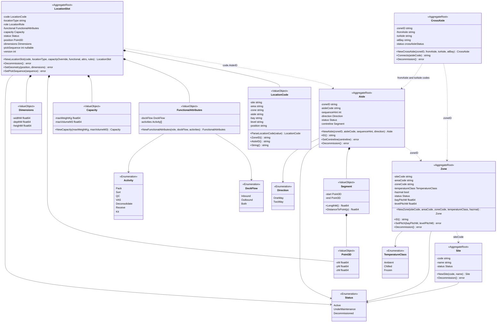
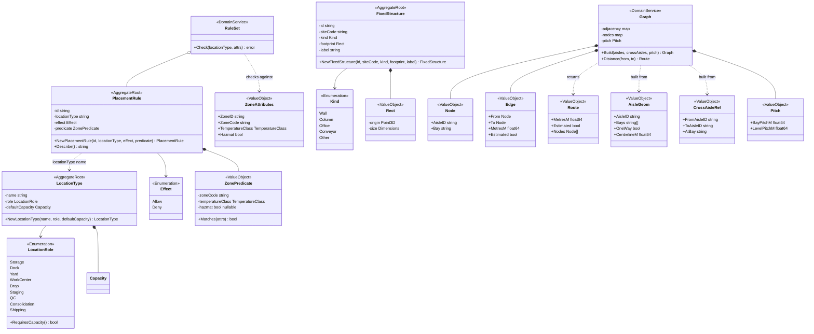
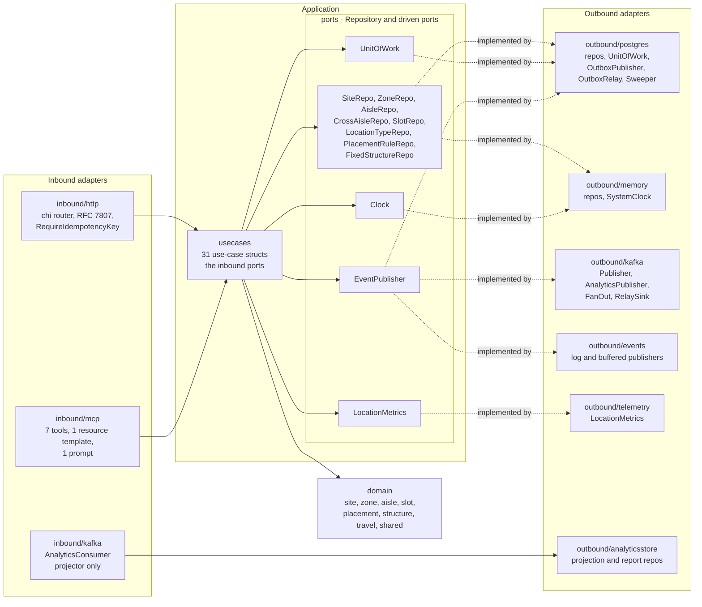

# UML class diagrams

:::info[Synced from facility-layout]
This page is a copy of [`docs/docs/ddd/class-diagram.md`](https://github.com/IQVO/facility-layout/blob/develop/docs/docs/ddd/class-diagram.md) on `develop`, derived from that repository's code. Edit it there, then re-sync.
:::

UML class diagrams of `internal/domain/**`, split into four views so each
stays readable. Names are the real Go type names; fields are the real
(unexported) struct fields, shown with `-`; methods shown are the ones that
**change state** or carry a decision, plus constructors. Getters are omitted.

Stereotypes: `<<AggregateRoot>>`, `<<Entity>>`, `<<ValueObject>>`,
`<<Enumeration>>`, `<<DomainEvent>>`, `<<Repository>>` (an outbound port),
`<<DomainService>>`.

Relationship conventions: `*--` composition (the part has no life outside the
whole, e.g. a value object held by value); `..>` a reference **by identity**
(a string id, never an object pointer — aggregates in this context never hold
each other); `-->` a typed dependency.

## 1. Structural aggregates and their value objects

Source: `internal/domain/site/site.go`, `zone/zone.go`, `aisle/aisle.go`,
`aisle/cross_aisle.go`, `slot/location_slot.go`, `slot/functional.go`,
`shared/location_code.go`, `shared/capacity.go`, `shared/geometry.go`,
`shared/enums.go`. Omitted: getters, `Rehydrate*` constructors, the
`set` marker fields on the geometry value objects, and `CrossAisle`'s private
`crossAisleStatus` enum (`Active`, `Decommissioned`). `LocationSlot.role` and
`locationType` are copied from the `LocationType` at registration (shown in
view 2). `pickSequence` is a Go `*int` (nil means "derive the order").

## 2. Placement, fixed structures and the travel graph

Source: `internal/domain/placement/placement.go`, `placement/role.go`,
`placement/rules.go`, `structure/fixed_structure.go`, `shared/geometry.go`,
`travel/graph.go`. Omitted: the `Capacity` and `Point3D`/`Dimensions` boxes
(view 1), the well-known LocationType name constants (`PalletRack`, `Shelf`,
`ToteWall`, `BulkFloor`, `Staging`, `Amnesty` — strings, not an enum), and
the Dijkstra priority queue. `RuleSet` is a Go slice type `[]PlacementRule`
with behaviour. `ZonePredicate.hazmat` is a `*bool` (nil = wildcard). The
LocationRole constant for staging is named `RoleStaging` in Go; its value is
`Staging`.

## 3. Domain events (the Published Language)

```mermaid
classDiagram
    class DomainEvent {
        <<interface>>
        +EventName() string
        +EventType() string
        +OccurredAt() time
    }
    class base {
        +Name string
        +Type string
        +At time
    }
    class SiteRegistered {
        <<DomainEvent>>
        siteCode, siteName
    }
    class ZoneRegistered {
        <<DomainEvent>>
        zoneId, siteCode, areaCode, zoneCode, temperatureClass, hazmat
    }
    class AisleRegistered {
        <<DomainEvent>>
        aisleId, zoneId, aisleCode, sequenceHint, direction
    }
    class LocationTypeRegistered {
        <<DomainEvent>>
        locationType, role, maxWeightKg, maxVolumeM3
    }
    class PlacementRuleDefined {
        <<DomainEvent>>
        ruleId, locationType, effect, predicate
    }
    class LocationSlotRegistered {
        <<DomainEvent>>
        locationCode, aisleId, zoneId, locationType, role, dockFlow, activities, maxWeightKg, maxVolumeM3
    }
    class LocationSlotDecommissioned {
        <<DomainEvent>>
        locationCode
    }
    class FacilityLayoutImported {
        <<DomainEvent>>
        rowsSubmitted, slotsImported, rowsRejected
    }
    class LocationGeometryUpdated {
        <<DomainEvent>>
        locationCode, xM, yM, zM, widthM, depthM, heightM, pickSequence
    }
    class AisleGeometryUpdated {
        <<DomainEvent>>
        aisleId, startXM, startYM, startZM, endXM, endYM, endZM, lengthM
    }
    class FixedStructureRegistered {
        <<DomainEvent>>
        structureId, siteCode, kind, xM, yM, zM, widthM, depthM, heightM, label
    }
    class CrossAisleRegistered {
        <<DomainEvent>>
        zoneId, fromAisle, toAisle, atBay
    }

    DomainEvent <|.. base
    base <|-- SiteRegistered
    base <|-- ZoneRegistered
    base <|-- AisleRegistered
    base <|-- LocationTypeRegistered
    base <|-- PlacementRuleDefined
    base <|-- LocationSlotRegistered
    base <|-- LocationSlotDecommissioned
    base <|-- FacilityLayoutImported
    base <|-- LocationGeometryUpdated
    base <|-- AisleGeometryUpdated
    base <|-- FixedStructureRegistered
    base <|-- CrossAisleRegistered
```

Source: `internal/domain/shared/events.go`. Field lists are the JSON tags
(the wire `data` of the CloudEvent). "Inheritance" here is Go struct
embedding of the unexported `base`. Full types, topics and keys:
[Domain events](/contexts/facility-layout/domain-events).

## 4. Hexagonal view — ports and adapters

Source: `internal/application/ports/ports.go`, `cmd/facility/main.go`
(`buildAdapters`, `memoryAdapters`, `outboxAdapters`), `cmd/mcp/main.go`,
`cmd/facility-projector/main.go`, `internal/adapters/**`. The analytics
consumer writes through `internal/analytics/report` ports implemented by
`outbound/analyticsstore` and never touches the OLTP application layer
(ADR 0010, enforced by `internal/architecture`). `cmd/facility-reports` reads
the same store through `inbound/http/reports_handler.go`. Omitted:
`internal/pgtx` (transaction-in-context helper), `outbound/bootretry`, and
`kafka/cloudevents` (the CloudEvents helper used by every Kafka adapter).
