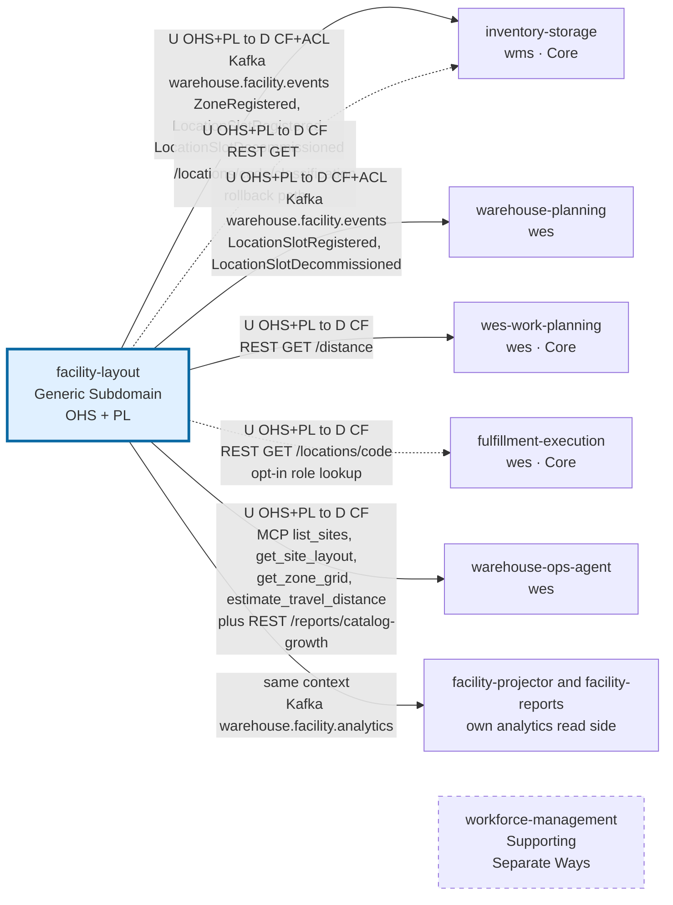

# Context map

:::info[Synced from facility-layout]
This page is a copy of [`docs/docs/ecosystem/context-map.md`](https://github.com/IQVO/facility-layout/blob/develop/docs/docs/ecosystem/context-map.md) on `develop`, derived from that repository's code. Edit it there, then re-sync.
:::

Following the [ddd-crew Context Mapping](https://github.com/ddd-crew/context-mapping)
notation: every edge names the **upstream (U)** and **downstream (D)** side,
the integration pattern(s) on each side, and the technology that carries it.
This page is this bounded context's slice of the fleet map and is part of the
[DDD artifact pack](https://github.com/IQVO/facility-layout/blob/develop/docs/docs/ddd/ddd-artifacts.md).

:::info[Current state, verified against each repository's `develop`]
`facility-layout` has **no outbound dependency** on any other service: it
calls no one and consumes no other context's events. It is upstream of five
backend contexts — `inventory-storage`, `warehouse-planning`,
`wes-work-planning`, `fulfillment-execution` and `warehouse-ops-agent` — and
of its own browser micro-frontend. Every consumer that calls it synchronously
defaults to a `permissive` mode, so none of them needs this service to start.
:::

## The map

Source: `internal/adapters/outbound/kafka/publisher.go`,
`internal/adapters/inbound/http/server.go`,
`internal/adapters/inbound/mcp/tools.go`, and the consumer files in the
table below (each sibling repository's `develop`).

Arrows point **from upstream to downstream** — the direction the model flows
— not the direction of the network call: a REST consumer initiates the
request, but it conforms to this context's model. A solid line is live
wiring; a dashed line is wired in code but opt-in or a rollback path;
`workforce-management` is linked invisibly to show Separate Ways. Omitted:
the browser micro-frontend (`facility-mfe`, not a bounded context — see
below), e2e test harnesses, and the `.dlq` topics.

## Relationships, with evidence

| # | Downstream | U/D patterns | Technology | Status | Evidence |
|---|---|---|---|---|---|
| 1 | `inventory-storage` | U: OHS + PL · D: Conformist + ACL (local location-classification cache) | Kafka `warehouse.facility.events` — `com.warehouse.wms.facility-layout.zone.ZoneRegistered`, `com.warehouse.wms.facility-layout.locationslot.LocationSlotRegistered`, `com.warehouse.wms.facility-layout.locationslot.LocationSlotDecommissioned` | **Live** when `LOCATION_LOOKUP_MODE=kafka` (process-unique group, replay from the first offset, readiness gated on catch-up) | `inventory-storage`: `internal/adapters/outbound/facilitycache/consumer.go`; this repo: [ADR 0013](https://github.com/IQVO/facility-layout/blob/develop/docs/docs/adr/0013-first-published-language-consumer.md) |
| 2 | `inventory-storage` | U: OHS + PL · D: Conformist | REST `GET /locations/{locationCode}/classification` | **Wired, rollback path** (`LOCATION_LOOKUP_MODE=http` + `FACILITY_LAYOUT_BASE_URL`) | `inventory-storage`: `internal/adapters/outbound/facilitylayout/client.go`; [ADR 0008](https://github.com/IQVO/facility-layout/blob/develop/docs/docs/adr/0008-location-classification-read-endpoint.md) |
| 3 | `warehouse-planning` | U: OHS + PL · D: Conformist + ACL (hand-mirrored payload folded into a position/station tally) | Kafka `warehouse.facility.events` — `com.warehouse.wms.facility-layout.locationslot.LocationSlotRegistered`, `com.warehouse.wms.facility-layout.locationslot.LocationSlotDecommissioned` | **Live** whenever `KAFKA_BROKERS` is set (group `STORAGE_CAPACITY_CONSUMER_GROUP`, default `warehouse-planning-storage-capacity`) | `warehouse-planning`: `internal/adapters/inbound/kafka/storage_capacity_consumer.go`, `cmd/api/main.go` |
| 4 | `wes-work-planning` | U: OHS + PL · D: Conformist | REST `GET /distance?from=&to=` → `metresM`, `estimated`, `route` | **Live** (`TRAVEL_DISTANCE_MODE=http` + `FACILITY_LAYOUT_BASE_URL`) | `wes-work-planning`: `internal/adapters/outbound/traveldistance/client.go` |
| 5 | `fulfillment-execution` | U: OHS + PL · D: Conformist | REST `GET /locations/{locationCode}` — the slot's `role` | **Wired, opt-in** (`LOCATION_ROLE_MODE=http` + `FACILITY_LAYOUT_BASE_URL`; default `permissive`) | `fulfillment-execution`: `internal/adapters/outbound/facilitylayout/client.go`; [ADR 0016](https://github.com/IQVO/facility-layout/blob/develop/docs/docs/adr/0016-functional-location-roles.md) |
| 6 | `warehouse-ops-agent` | U: OHS + PL · D: Conformist | MCP (Streamable HTTP) tools `list_sites`, `get_site_layout`, `get_zone_grid`, `estimate_travel_distance`; REST `GET /reports/catalog-growth` (+ `/freshness`) on `cmd/facility-reports` | **Live** (`FACILITY_LAYOUT_MCP_ENDPOINT`, `FACILITY_LAYOUT_REPORTS_REST_URL`) | `warehouse-ops-agent`: `internal/adapters/outbound/mcpclient/facility_layout.go`, `internal/config/config.go` |
| 7 | own analytics read side | same bounded context, not a context relationship | Kafka `warehouse.facility.analytics`, group `facility-analytics` | **Live** with `EVENT_PUBLISHER=kafka` | this repo: `internal/adapters/inbound/kafka/analytics_consumer.go`; [ADR 0010](https://github.com/IQVO/facility-layout/blob/develop/docs/docs/adr/0010-analytical-data-product.md) |
| 8 | `workforce-management` | **Separate Ways** | — | **Deliberately absent** — it stops at the process-path boundary and never links an associate to a location | no client or consumer in its code |
| — | `order-management`, `process-path-management`, `labor-performance`, `network-fulfillment`, `network-inventory-planning`, `product-master` | no relationship | — | **Absent** — no client of this context's REST/MCP surface and no consumer of its topics on `develop`; `product-master` (SKU master data, the third `wms` context) neither calls this service nor consumes `warehouse.facility.events`, and this service consumes nothing from it | org-wide code search for `FACILITY_LAYOUT` and `warehouse.facility.events` |
| — | anything **this** context calls | — | — | **Deliberately absent** — `facility-layout` has no outbound adapter to another service, ever | `internal/adapters/outbound/` holds only Postgres, memory, Kafka publishers, telemetry, boot-retry and analytics-store adapters |

On `warehouse.facility.events`, nine of the twelve event types have no
external consumer today: `SiteRegistered`, `AisleRegistered`,
`LocationTypeRegistered`, `PlacementRuleDefined`, `FacilityLayoutImported`
and the four ADR 0017 geometry events.

## The console: a live, browser-facing client that is not a context

Besides the backend consumers above, this service has one **live**
integration outside the backend fleet: `facility-mfe`, a Module Federation
remote owned in this repo's own `web/` directory, calling this service's own
REST API directly from the browser — the read models (sites, layout, grid,
`/distance`) and the configuration writes (sites, zones, aisles, location
types, placement rules, slots, bulk import;
[ADR 0027](https://github.com/IQVO/facility-layout/blob/develop/docs/docs/adr/0027-console-write-screens.md)). It is composed at runtime
by the separate `warehouse-console` shell repo, per
[ADR-0011](https://github.com/IQVO/facility-layout/blob/develop/docs/docs/adr/0011-micro-frontend-console-adoption.md), which adopts the
fleet-wide decision recorded in `warehouse-ops-agent`'s
[ADR-0002](https://github.com/IQVO/warehouse-ops-agent/blob/main/docs/docs/adr/0002-micro-frontend-console-architecture.md).

This is **not** a bounded-context relationship in the Evans/Vernon sense —
`warehouse-console` has no domain model and owns no aggregate — but it is a
real inbound HTTP surface (browser → this service's REST API, through the
CORS middleware configured by `CORS_ALLOWED_ORIGINS`). It is deliberately
**separate** from the "no outbound dependency, ever" property discussed
below: a UI client calling this service's own published REST API is the same
category of consumer as any other REST client.

`facility-layout` is explicitly **not** one of the services
`warehouse-ops-agent`'s `console-bff` fans out to for the cross-cutting Order
Lifecycle screen — it has no order reference in its own aggregates. Its role
in the console is limited to `facility-mfe`'s own screens over its own data.

## What is planned, and not yet built

- **Event-driven travel input for `wes-work-planning`.** It reads distance
  synchronously today. Consuming `AisleRegistered`, `AisleGeometryUpdated`
  and `CrossAisleRegistered` to keep a local travel graph is a design option,
  not code.
- **Routed cross-zone travel.** The travel graph is per zone. Across zones,
  `/distance` and `estimate_travel_distance` return a straight-line
  (beeline) estimate flagged `estimated: true` when **both** slots carry
  recorded position geometry, and refuse (`422 no-route-between-zones`)
  otherwise. A routed path across zones does not exist yet
  ([ADR 0017](https://github.com/IQVO/facility-layout/blob/develop/docs/docs/adr/0017-geometry-and-travel-graph.md)).

## The strategic relationship, in context-mapping vocabulary

### Open Host Service + Published Language

This service defines an **Open Host Service**: a stable, general-purpose
protocol any number of consumers may use, rather than a bilateral contract
negotiated per consumer. Its **Published Language** is the twelve past-tense
[domain events](/contexts/facility-layout/domain-events) (CloudEvents 1.0,
`com.warehouse.wms.facility-layout.<entity>.<EventName>`) plus the REST and
MCP surfaces, expressed in its own vocabulary (`LocationCode`, `Zone`,
`Aisle`, `LocationType`, `PlacementRule`).

Two design choices exist to make that language *publishable*:

- `LocationSlotRegistered` denormalises `zoneId` and `aisleId` into the
  payload. A consumer routing on zone must not have to know how to parse this
  context's code format. A Published Language that requires the consumer to
  reimplement the producer's parsing is a leaked internal representation.
- The `EventPublisher` port is a single method,
  `Publish(ctx, event) error` — the shape a Kafka producer satisfies, which
  is why adding the broker adapter
  ([ADR 0009](https://github.com/IQVO/facility-layout/blob/develop/docs/docs/adr/0009-kafka-integration-publisher.md)) was purely
  additive.

### Conformist (and ACL), downstream

The consumers are **Conformists**: they accept this context's model rather
than negotiating a shared one. The two event consumers additionally keep an
**anti-corruption layer** of their own — `inventory-storage` folds the events
into a zone/location classification cache keyed the way its stow check needs
(the SKU side of that check comes from its local copy of `product-master`'s
classification, not from here), and
`warehouse-planning` folds them into a capacity tally — so neither adopts
`LocationSlot` as an internal type. That is the right pattern precisely
*because* this is a Generic Subdomain: there is nothing to differentiate by
modelling location differently.

### No outbound dependency, ever

The most important property of this context map is a non-edge: **nothing
points out of `facility-layout` into another context.** It does not read
`inventory-storage`'s stock. It does not know what a Task, an Assignment, a
Wave or a Shift is. None of its consumers get write access to its aggregates.

A context that everyone depends on has to be cheap to depend on. No coupling
back means no startup ordering constraints, no circular deployment
dependencies, and no cascade beyond a plain read failure.

### Why this is a Generic Subdomain at all

The platform's DDD reference lists, among the disciplines to enforce:

> **Extract generic logic instead of duplicating it.** Cartonization is a
> good example: rather than implementing box-selection logic separately in
> both WMS (for planning/estimates) and WES (at point of pack), model it as
> its own Generic Subdomain both contexts call into.

Physical location is the same case in a different costume: needed by the WMS
tier for stow validity, needed by the WES tier for travel and capacity,
owned by neither. See [Subdomain classification](https://github.com/IQVO/facility-layout/blob/develop/docs/docs/ddd/subdomain-classification.md)
and the [Core Domain Chart](/contexts/facility-layout/core-domain-chart).

## Where to go next

How a new consumer should integrate — which endpoint or event, and the rules
it must follow — is on [Consuming this service](https://github.com/IQVO/facility-layout/blob/develop/docs/docs/ecosystem/consuming-this-service.md).
