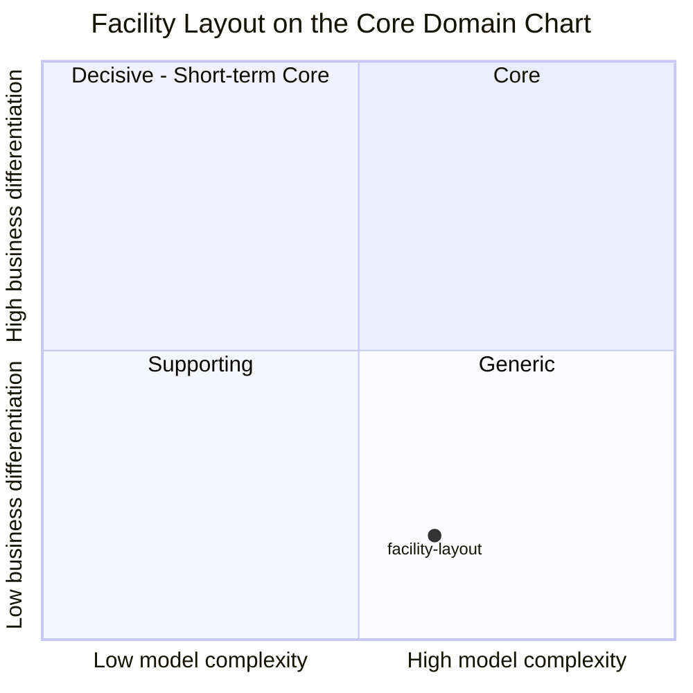

# Core Domain Chart

:::info[Synced from facility-layout]
This page is a copy of [`docs/docs/ddd/core-domain-chart.md`](https://github.com/IQVO/facility-layout/blob/develop/docs/docs/ddd/core-domain-chart.md) on `develop`, derived from that repository's code. Edit it there, then re-sync.
:::

Following the [ddd-crew Core Domain Charts](https://github.com/ddd-crew/core-domain-charts):
the bounded context is plotted on **model complexity** (x) against
**business differentiation** (y). The classification matches
[Subdomain classification](https://github.com/IQVO/facility-layout/blob/develop/docs/docs/ddd/subdomain-classification.md): **Facility Layout
is a Generic Subdomain.**

Source: `docs/docs/ddd/subdomain-classification.md`, `internal/domain/**`,
`docs/docs/adr/0002-hierarchical-location-code.md`,
`docs/docs/adr/0003-placement-rules-at-registration-time.md`,
`docs/docs/adr/0017-geometry-and-travel-graph.md`. Omitted: the other fleet
contexts (each plots itself on its own chart) and any time axis.

## Why this position

**Low business differentiation (y ≈ 0.18).** The location-code hierarchy
(Site → Area → Zone → Aisle → Bay → Level → Position) is the industry's WMS
convention, adopted rather than invented
([ADR 0002](https://github.com/IQVO/facility-layout/blob/develop/docs/docs/adr/0002-hierarchical-location-code.md)). Location roles are
taken from Oracle WMS Cloud's Location Master and SAP EWM's storage-type role
(`internal/domain/placement/role.go`). Nothing in this context is where a
retailer or 3PL wins; it has to be **correct**, not clever. That is the
definition of Generic, and it is the same bucket the platform reference puts
Cartonization and WCS in.

**Moderate-to-high model complexity (x ≈ 0.62).** It is not a CRUD table:

- **8 aggregate roots**, each with its own repository port — `Site`, `Zone`,
  `Aisle`, `CrossAisle`, `LocationSlot`, `LocationType`, `PlacementRule`,
  `FixedStructure` (`internal/application/ports/ports.go`).
- **59 typed domain errors** in `internal/domain/**`, each a named invariant
  mapped to an RFC 7807 problem type
  (`internal/adapters/inbound/http/errors.go`).
- A real **chain-of-custody** check at slot registration (Site → Zone → Aisle
  must exist and be `Active`) plus a Deny-wins / allow-list **placement rule
  engine** (`placement.RuleSet.Check`,
  [ADR 0003](https://github.com/IQVO/facility-layout/blob/develop/docs/docs/adr/0003-placement-rules-at-registration-time.md)).
- Role-conditional functional attributes (`dockFlow`, `activities`,
  [ADR 0016](https://github.com/IQVO/facility-layout/blob/develop/docs/docs/adr/0016-functional-location-roles.md)).
- A pure-domain **travel graph** with Dijkstra shortest path over one-way
  aisles and cross-aisles (`internal/domain/travel/graph.go`,
  [ADR 0017](https://github.com/IQVO/facility-layout/blob/develop/docs/docs/adr/0017-geometry-and-travel-graph.md)).

That complexity is why it sits right of centre — but it is complexity in
service of correctness, not of differentiation, so the point stays in the
Generic quadrant rather than drifting up toward Core.

## Evolution note

| Stage (Wardley) | Applies? | Evidence |
|---|---|---|
| Genesis | No | Nothing here is novel. |
| Custom-built | Partly | The travel graph and placement-rule engine are hand-built, because the fleet needs them in-process and with no outbound dependency. |
| Product | **Yes — current** | The model mirrors commercial WMS location masters (location roles, storage types, location codes). |
| Commodity | Direction of travel | A future platform could replace this service with an off-the-shelf WMS location master; the Open Host Service + Published Language boundary ([Context map](/contexts/facility-layout/context-map)) is what makes that swap cheap for consumers. |

Strategically this means: **keep the model boring, keep the contract
stable, and do not invest differentiating effort here.** Investment that
would push the point *up* (business differentiation) belongs in the Core
contexts that consume this one — `inventory-storage`, `wes-work-planning`,
`fulfillment-execution`.
