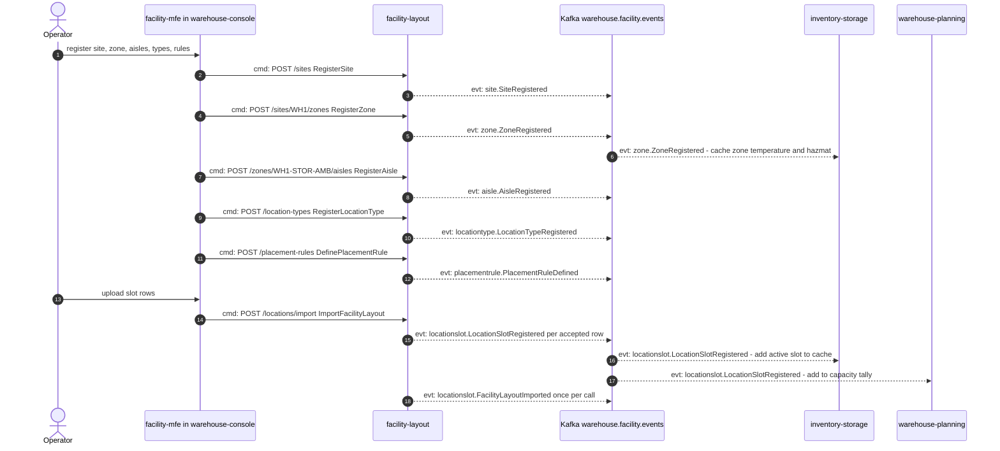
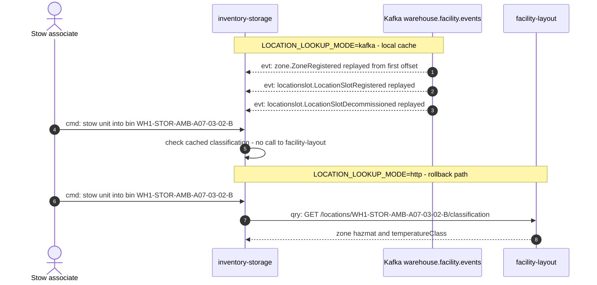
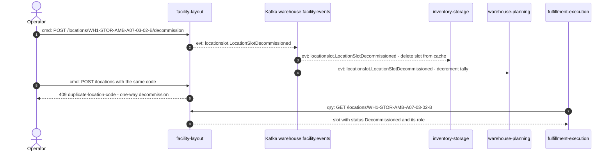
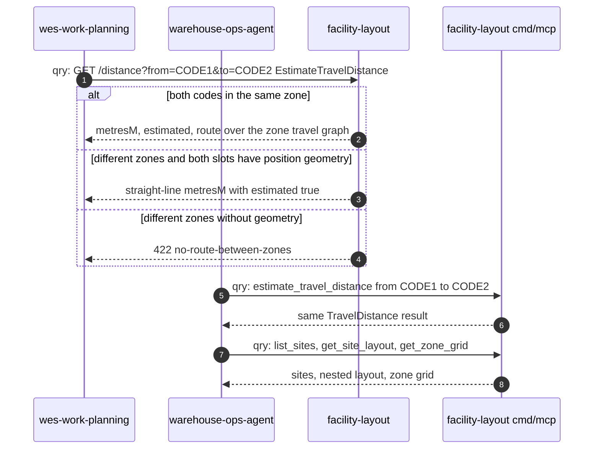

# Domain Message Flow

:::info[Synced from facility-layout]
This page is a copy of [`docs/docs/ddd/domain-message-flow.md`](https://github.com/IQVO/facility-layout/blob/develop/docs/docs/ddd/domain-message-flow.md) on `develop`, derived from that repository's code. Edit it there, then re-sync.
:::

Following [ddd-crew Domain Message Flow Modelling](https://github.com/ddd-crew/domain-message-flow-modelling).
Each scenario shows **contexts and actors as participants** and only real
messages. Every arrow is numbered and prefixed:

- `cmd:` — a command (REST write)
- `qry:` — a query (REST `GET` or MCP tool)
- `evt:` — a domain event (Kafka, CloudEvents 1.0; type prefix
  `com.warehouse.wms.facility-layout.` omitted inside the diagrams, written
  in full in the tables)

Downstream behaviour is taken from each consumer's own `develop` branch (see
the [Context map](/contexts/facility-layout/context-map) for file paths).

## 1. Commissioning a zone of the building

An operator loads a new storage zone through the console micro-frontend,
which calls this service's own REST API.

Source: `internal/adapters/inbound/http/server.go`,
`internal/application/usecases/register_*.go`, `define_placement_rule.go`,
`import_facility_layout.go`; consumers `inventory-storage`
`internal/adapters/outbound/facilitycache/consumer.go`, `warehouse-planning`
`internal/adapters/inbound/kafka/storage_capacity_consumer.go`.
Omitted: the analytics topic copy of every event, the Idempotency-Key header
on each creation `POST`, and per-row rejections (reported in the import
response, no event).

## 2. Stow-time location check (inventory-storage)

`inventory-storage` must not stow into a slot that does not exist, is retired,
or sits in the wrong kind of zone. It has two modes, selected by its own
`LOCATION_LOOKUP_MODE`.

Source: `inventory-storage` `cmd/inventory/main.go` (`buildLocationLookup`),
`internal/adapters/outbound/facilitycache/consumer.go`,
`internal/adapters/outbound/facilitylayout/client.go`; this repo
`GetLocationClassification`, [ADR 0008](https://github.com/IQVO/facility-layout/blob/develop/docs/docs/adr/0008-location-classification-read-endpoint.md),
[ADR 0013](https://github.com/IQVO/facility-layout/blob/develop/docs/docs/adr/0013-first-published-language-consumer.md).
Omitted: `permissive` mode (the default — no check at all) and the
inventory-storage stow command's own events.

## 3. Retiring a slot

A slot is permanently decommissioned; downstream caches drop it.

Source: `internal/application/usecases/decommission_location_slot.go`,
`register_location_slot.go` (`ErrDuplicateLocationCode`),
[ADR 0005](https://github.com/IQVO/facility-layout/blob/develop/docs/docs/adr/0005-one-way-decommission.md); `fulfillment-execution`
`internal/adapters/outbound/facilitylayout/client.go` (opt-in
`LOCATION_ROLE_MODE=http`). Omitted: the analytics copy and the
`409 concurrent-modification` branch.

## 4. Travel distance for planning and for the ops agent

`wes-work-planning` prices travel between two locations; the ops agent asks
the same question over MCP.

Source: `internal/application/usecases/estimate_travel_distance.go`,
`internal/domain/travel/graph.go`, `internal/adapters/inbound/mcp/tools.go`;
`wes-work-planning` `internal/adapters/outbound/traveldistance/client.go`;
`warehouse-ops-agent` `internal/adapters/outbound/mcpclient/facility_layout.go`.
Omitted: `wes-work-planning`'s `permissive` default and circuit breaker; no
event is produced (read model).

## Message catalogue used above

| # | Message | Kind | Channel |
|---|---|---|---|
| 1 | RegisterSite | cmd | `POST /sites` |
| 2 | RegisterZone | cmd | `POST /sites/{siteCode}/zones` |
| 3 | RegisterAisle | cmd | `POST /zones/{zoneId}/aisles` |
| 4 | RegisterLocationType | cmd | `POST /location-types` |
| 5 | DefinePlacementRule | cmd | `POST /placement-rules` |
| 6 | ImportFacilityLayout | cmd | `POST /locations/import` |
| 7 | RegisterLocationSlot | cmd | `POST /locations` |
| 8 | DecommissionLocationSlot | cmd | `POST /locations/{locationCode}/decommission` |
| 9 | GetLocationClassification | qry | `GET /locations/{locationCode}/classification` |
| 10 | GetLocationSlot | qry | `GET /locations/{locationCode}` |
| 11 | EstimateTravelDistance | qry | `GET /distance`, MCP `estimate_travel_distance` |
| 12 | list_sites / get_site_layout / get_zone_grid | qry | MCP |
| 13 | SiteRegistered | evt | `com.warehouse.wms.facility-layout.site.SiteRegistered` |
| 14 | ZoneRegistered | evt | `com.warehouse.wms.facility-layout.zone.ZoneRegistered` |
| 15 | AisleRegistered | evt | `com.warehouse.wms.facility-layout.aisle.AisleRegistered` |
| 16 | LocationTypeRegistered | evt | `com.warehouse.wms.facility-layout.locationtype.LocationTypeRegistered` |
| 17 | PlacementRuleDefined | evt | `com.warehouse.wms.facility-layout.placementrule.PlacementRuleDefined` |
| 18 | LocationSlotRegistered | evt | `com.warehouse.wms.facility-layout.locationslot.LocationSlotRegistered` |
| 19 | LocationSlotDecommissioned | evt | `com.warehouse.wms.facility-layout.locationslot.LocationSlotDecommissioned` |
| 20 | FacilityLayoutImported | evt | `com.warehouse.wms.facility-layout.locationslot.FacilityLayoutImported` |
