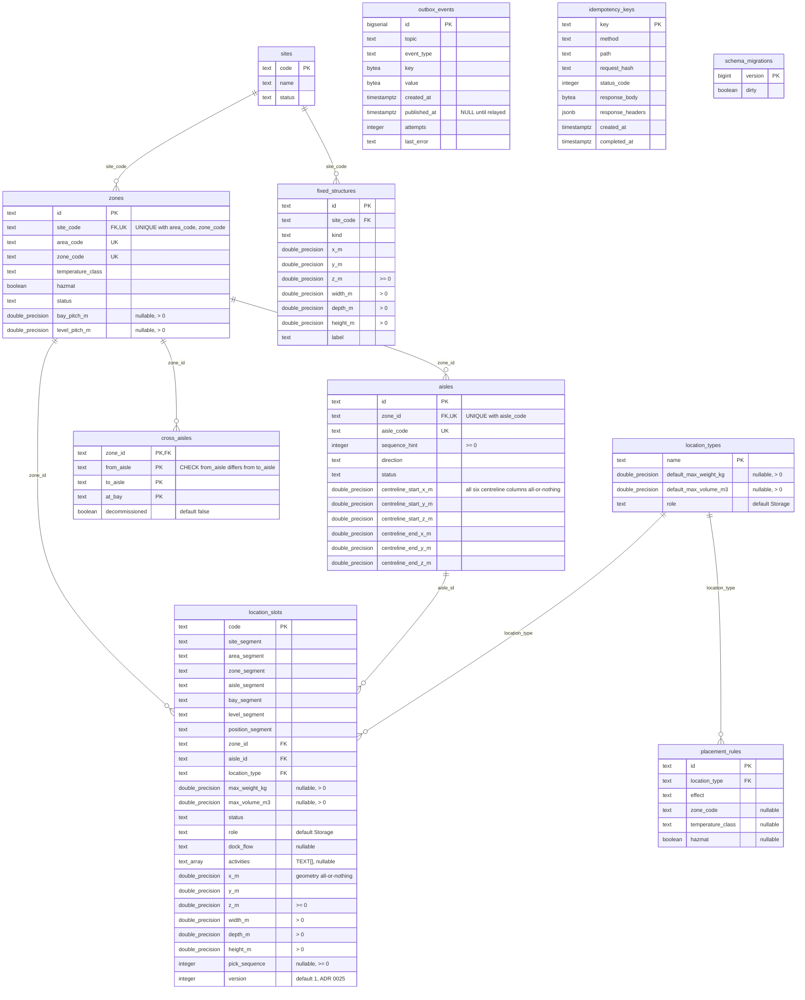
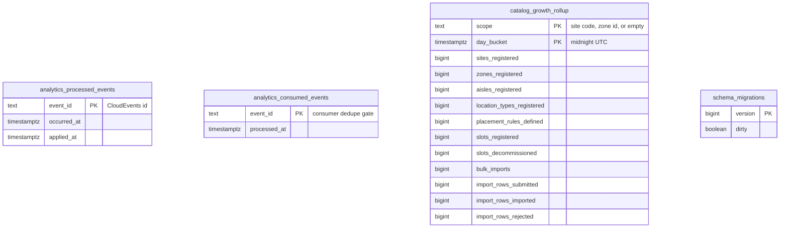

# Entity-relationship diagram

:::info[Synced from facility-layout]
This page is a copy of [`docs/docs/ddd/entity-relationship.md`](https://github.com/IQVO/facility-layout/blob/develop/docs/docs/ddd/entity-relationship.md) on `develop`, derived from that repository's code. Edit it there, then re-sync.
:::

The **final** schema after applying `migrations/*.up.sql` in order
(`0001_init` → `0007_slot_version`), and separately the analytics database
(`migrations/analytics/0001_report.up.sql`). Both are applied by
golang-migrate (`internal/adapters/outbound/postgres/migrate.go`), which
also creates its own `schema_migrations` bookkeeping table in each database.

A relationship line is drawn **only** where a real `FOREIGN KEY`
(`REFERENCES`) exists. Key markers: `PK` primary key, `FK` foreign key, `UK`
part of a `UNIQUE` constraint, `PK,FK` both.

## OLTP database (`DATABASE_URL`)

Source: `migrations/0001_init.up.sql` … `migrations/0007_slot_version.up.sql`.
Omitted: indexes (`idx_zones_site_code`, `idx_aisles_zone_id`,
`idx_location_slots_aisle_id`, `idx_location_slots_zone_id`,
`idx_location_slots_grid`, `idx_location_slots_role`,
`idx_fixed_structures_site_code`, `idx_cross_aisles_zone_id`,
`idx_placement_rules_location_type`, partial
`idx_outbox_events_unpublished`, `idx_idempotency_keys_created_at`) and the
`events` table that `0001` created and `0005` dropped. Postgres types are
written with underscores (`double_precision`, `text_array` for `TEXT[]`)
because Mermaid attribute types must be one word.

### Logical links with no foreign key

These are real references the code relies on, deliberately **not** enforced
by a foreign key — each one is an aggregate boundary or an infrastructure
concern:

| From | To | Why no FK |
|---|---|---|
| `cross_aisles.from_aisle`, `to_aisle` | `aisles.aisle_code` (within `zone_id`) | They are aisle **codes**, not aisle ids; `RegisterCrossAisle` checks both belong to the zone (`ErrCrossAisleAisleMismatch`). |
| `location_slots.site_segment` … `position_segment` | `sites` / `zones` / `aisles` | Denormalised `LocationCode` segments for the zone-grid query; the chain is enforced by `RegisterLocationSlot.resolveChain` and the `zone_id` / `aisle_id` FKs. |
| `placement_rules.zone_code`, `temperature_class`, `hazmat` | `zones` columns | A predicate, not a reference: a rule matches **any** zone with those attributes. |
| `outbox_events` | any aggregate table | One row per encoded Kafka message; `event_type` and `key` name the source. |
| `idempotency_keys` | any aggregate table | Cached HTTP outcome keyed by the caller's `Idempotency-Key`. |

## Analytics database (`ANALYTICS_DATABASE_URL`)

Written only by `cmd/facility-projector`, read only by
`cmd/facility-reports` ([ADR 0010](https://github.com/IQVO/facility-layout/blob/develop/docs/docs/adr/0010-analytical-data-product.md)).
No foreign keys.

Source: `migrations/analytics/0001_report.up.sql`. Omitted: indexes
`idx_analytics_processed_events_occurred_at`,
`idx_catalog_growth_rollup_day_bucket`.

## Table ≠ aggregate

| Table | Kind | Aggregate / owner | Notes |
|---|---|---|---|
| `sites` | aggregate | `Site` | |
| `zones` | aggregate | `Zone` | id = `SITE-AREA-ZONE` |
| `aisles` | aggregate | `Aisle` | id = `ZoneID-AISLE`; centreline columns are the `Segment` value object flattened |
| `cross_aisles` | aggregate | `CrossAisle` | composite natural key; status stored as a boolean |
| `location_types` | aggregate | `LocationType` | capacity columns are the `Capacity` value object flattened |
| `placement_rules` | aggregate | `PlacementRule` | predicate columns are the `ZonePredicate` value object flattened |
| `location_slots` | aggregate | `LocationSlot` | `LocationCode`, `Capacity`, `FunctionalAttributes`, `Point3D`, `Dimensions` flattened into one row; the only versioned table |
| `fixed_structures` | aggregate | `FixedStructure` | `Rect` flattened |
| `outbox_events` | infrastructure | transactional outbox ([ADR 0018](https://github.com/IQVO/facility-layout/blob/develop/docs/docs/adr/0018-transactional-outbox.md)) | published rows deleted after `OUTBOX_RETENTION` by the sweeper ([ADR 0026](https://github.com/IQVO/facility-layout/blob/develop/docs/docs/adr/0026-housekeeping-sweeper.md)) |
| `idempotency_keys` | infrastructure | Idempotency-Key middleware ([ADR 0019](https://github.com/IQVO/facility-layout/blob/develop/docs/docs/adr/0019-idempotency-key-middleware.md)) | deleted after `IDEMPOTENCY_KEY_TTL` by the sweeper |
| `schema_migrations` | infrastructure | golang-migrate | one per database |
| `analytics_processed_events` | projection infrastructure | analytics projection | claimed in the same transaction as the rollup UPSERT |
| `analytics_consumed_events` | projection infrastructure | analytics consumer dedupe gate | |
| `catalog_growth_rollup` | projection | Layout Catalog Growth and Change report | derived, rebuildable from the analytics topic |

This repository has **no** `processed_events` inbox table in the OLTP
database: the service consumes no other context's events.
