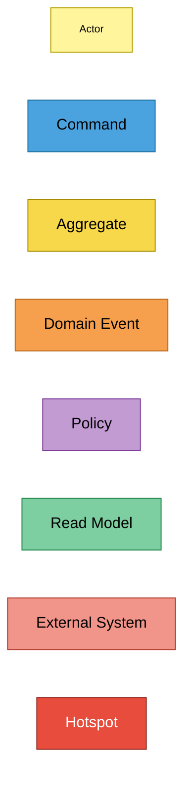
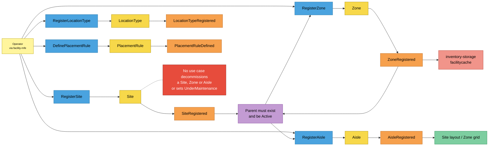
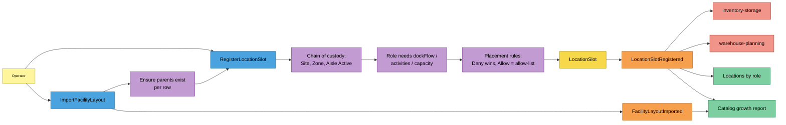
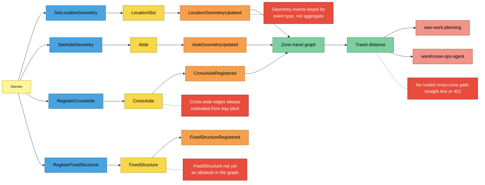
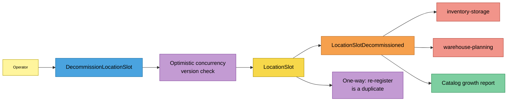

# EventStorming (design level)

:::info[Synced from facility-layout]
This page is a copy of [`docs/docs/ddd/eventstorming.md`](https://github.com/IQVO/facility-layout/blob/develop/docs/docs/ddd/eventstorming.md) on `develop`, derived from that repository's code. Edit it there, then re-sync.
:::

Design-level EventStorming in the
[ddd-crew EventStorming glossary & cheat sheet](https://github.com/ddd-crew/eventstorming-glossary-cheat-sheet)
notation. Each flow reads left to right: **Actor → Command → Aggregate →
Domain Event → Policy → next Command / Read Model / External System**.
Hotspots are real gaps recorded in the code, ADRs or this site — none are
invented for the exercise.

## Legend

## Process 1 — Building the map (structure and placement rules)

Source: `internal/application/usecases/register_site.go`, `register_zone.go`,
`register_aisle.go`, `register_location_type.go`, `define_placement_rule.go`,
`internal/domain/shared/enums.go`. Omitted: the analytics topic and the
Idempotency-Key check.

## Process 2 — Registering a slot (single or bulk)

Source: `internal/application/usecases/register_location_slot.go`,
`import_facility_layout.go`, `internal/domain/slot/location_slot.go`,
`functional.go`, `internal/domain/placement/rules.go`,
`internal/adapters/inbound/kafka/analytics_consumer.go`. Omitted:
`SetLocationGeometry` invoked by import rows that carry geometry (Process 3),
and the rejection branches (see [Invariants](https://github.com/IQVO/facility-layout/blob/develop/docs/docs/ddd/invariants.md)).

## Process 3 — Geometry and travel distance

Source: `internal/application/usecases/set_location_geometry.go`,
`set_aisle_geometry.go`, `register_cross_aisle.go`,
`register_fixed_structure.go`, `travel_graph_builder.go`,
`estimate_travel_distance.go`, `internal/domain/travel/graph.go`,
`internal/adapters/outbound/kafka/publisher.go`. The read models are built
per request from repository state, not from the events — the event arrows
show what makes the read model change. Omitted: zone pitch (set only at
`RegisterZone`).

## Process 4 — Retiring a slot

Source: `internal/application/usecases/decommission_location_slot.go`,
`internal/adapters/outbound/postgres/slot_repo.go` (version guard),
[ADR 0005](https://github.com/IQVO/facility-layout/blob/develop/docs/docs/adr/0005-one-way-decommission.md),
[ADR 0025](https://github.com/IQVO/facility-layout/blob/develop/docs/docs/adr/0025-optimistic-concurrency-version-column.md).

## Sticky evidence

| Sticky | Kind | Code evidence |
|---|---|---|
| Operator | Actor | `web/` (`facility-mfe`), or any REST client |
| RegisterSite … DefinePlacementRule | Command | `internal/application/usecases/register_site.go`, `register_zone.go`, `register_aisle.go`, `register_location_type.go`, `define_placement_rule.go` |
| RegisterLocationSlot, ImportFacilityLayout, DecommissionLocationSlot | Command | `register_location_slot.go`, `import_facility_layout.go`, `decommission_location_slot.go` |
| SetLocationGeometry, SetAisleGeometry, RegisterCrossAisle, RegisterFixedStructure | Command | `set_location_geometry.go`, `set_aisle_geometry.go`, `register_cross_aisle.go`, `register_fixed_structure.go` |
| Site, Zone, Aisle, CrossAisle, LocationSlot, LocationType, PlacementRule, FixedStructure | Aggregate | `internal/domain/site`, `zone`, `aisle`, `slot`, `placement`, `structure` |
| 12 events | Domain Event | `internal/domain/shared/events.go` |
| Parent must exist and be Active / Chain of custody | Policy | `RegisterZone`, `RegisterAisle`, `RegisterLocationSlot.resolveChain` |
| Placement rules | Policy | `placement.RuleSet.Check` |
| Role needs dockFlow / activities / capacity | Policy | `slot.NewFunctionalAttributes`, `LocationRole.RequiresCapacity` |
| Ensure parents exist per row | Policy | `ImportFacilityLayout.ensureSite`, `ensureZone`, `ensureAisle` |
| One-way decommission | Policy | `ErrDuplicateLocationCode`, `slot.ErrAlreadyDecommissioned` |
| Optimistic concurrency | Policy | Postgres `SlotRepo.Save`, `ports.ErrConcurrentModification` |
| Site layout, Zone grid, Locations by role, Zone travel graph, Travel distance | Read Model | `get_site_layout.go`, `get_zone_grid.go`, `reads.go`, `get_zone_travel_graph.go`, `estimate_travel_distance.go` |
| Catalog growth report | Read Model | `cmd/facility-projector`, `catalog_growth_rollup` |
| inventory-storage, warehouse-planning, wes-work-planning, warehouse-ops-agent | External System | see [Context map](/contexts/facility-layout/context-map) |
| H1 nothing decommissions Site/Zone/Aisle or sets UnderMaintenance | Hotspot | `internal/domain/shared/enums.go` (UnderMaintenance comment); only `DecommissionLocationSlot` calls a `Decommission` method |
| H2 no routed cross-zone path | Hotspot | `estimate_travel_distance.go` (`crossZoneBeeline`), [ADR 0017](https://github.com/IQVO/facility-layout/blob/develop/docs/docs/adr/0017-geometry-and-travel-graph.md) |
| H3 cross-aisle edges always estimated | Hotspot | `travel.crossAisleDistance` |
| H4 FixedStructure not an obstacle | Hotspot | `internal/domain/structure/fixed_structure.go` package comment ("in a later phase") |
| H5 geometry and import events keyed by event type | Hotspot | `kafka.aggregateKey` default branch — all occurrences of those five event types share one partition |
