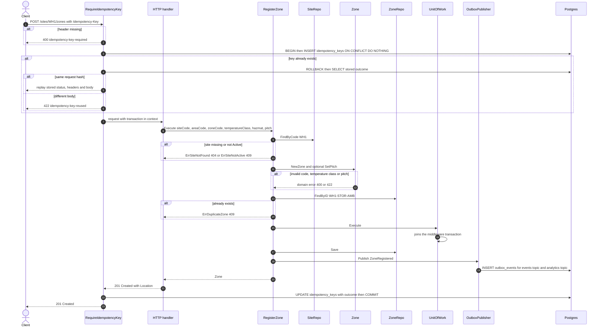
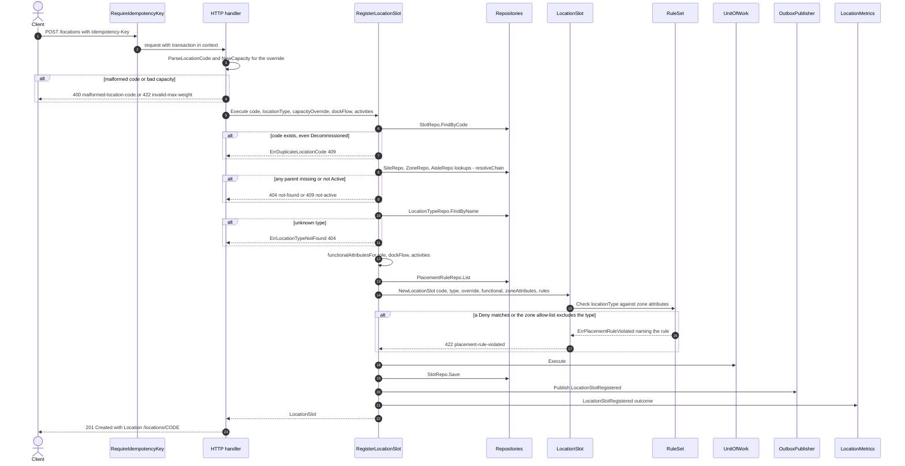
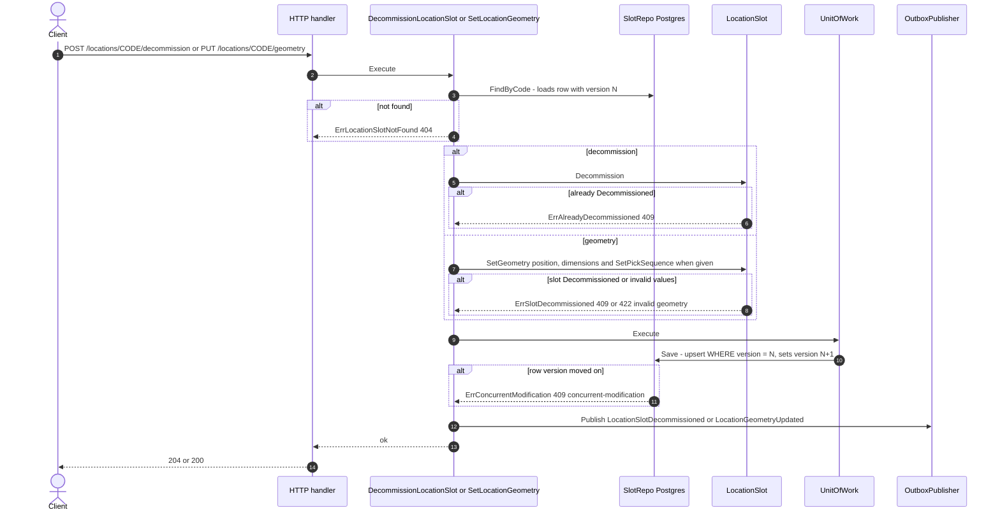
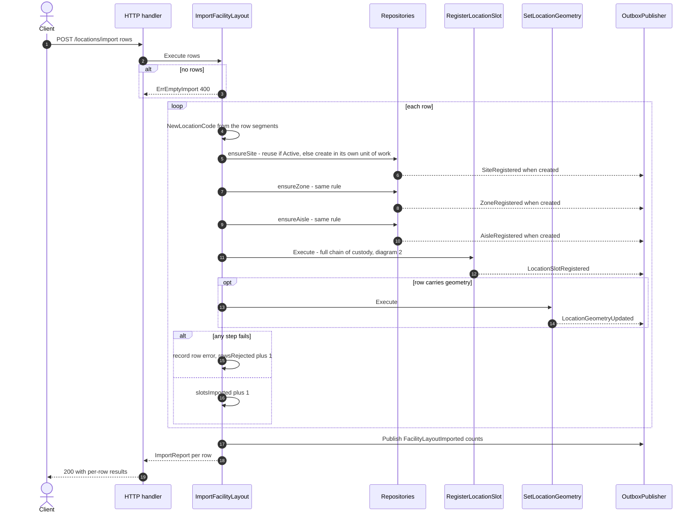
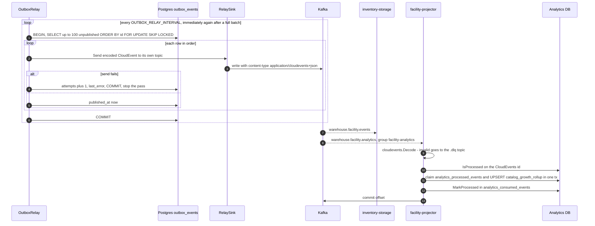
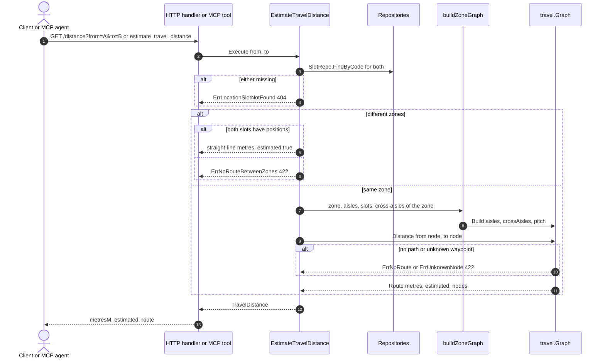

# UML sequence diagrams

:::info[Synced from facility-layout]
This page is a copy of [`docs/docs/ddd/sequence-diagrams.md`](https://github.com/IQVO/facility-layout/blob/develop/docs/docs/ddd/sequence-diagrams.md) on `develop`, derived from that repository's code. Edit it there, then re-sync.
:::

Derived from the use-case function bodies in
`internal/application/usecases/` and the adapters they run through. All
diagrams show the **Postgres + `EVENT_PUBLISHER=kafka`** configuration, the
only one with a `UnitOfWork` and the transactional outbox
(`cmd/facility/main.go`, `outboxAdapters`). In the other configurations:

- no `DATABASE_URL` → in-memory repositories, no Idempotency-Key check, no
  transaction; the publisher is the log publisher or (with
  `EVENT_PUBLISHER=kafka`) a direct `FanOut` to both topics;
- `DATABASE_URL` without `kafka` → Postgres repositories and the
  Idempotency-Key check, but the log publisher and **no** `UnitOfWork`
  (`Save` and `Publish` run back to back, `atomically` with a nil unit of
  work).

Participants: **Client**, the **inbound adapter** (HTTP handler, MCP tool,
Kafka consumer), the **use case**, the **aggregate**, the **repositories**,
the **outbox / publisher** and the **downstream** topic.

## 1. Register a structural resource (site, zone, aisle, location type, placement rule, cross-aisle, fixed structure)

Seven creation use cases share one shape. `RegisterZone` is shown; the table
below lists how each differs.

Source: `internal/adapters/inbound/http/idempotency.go`
(`RequireIdempotencyKey`, `replayCachedResponse`, `runFreshRequest`),
`internal/application/usecases/register_zone.go`, `atomically.go`,
`internal/adapters/outbound/postgres/unit_of_work.go` (a nested `Execute`
joins the transaction already in the context),
`outbox_publisher.go`. Omitted: request JSON decoding errors (400), the
OpenTelemetry spans, and the relay (diagram 5).

| Use case | Route | Pre-checks before the save | Event |
|---|---|---|---|
| `RegisterSite` | `POST /sites` | `FindByCode` duplicate → `ErrDuplicateSite` | `SiteRegistered` |
| `RegisterZone` | `POST /sites/{siteCode}/zones` | site exists and Active; zone id unique | `ZoneRegistered` |
| `RegisterAisle` | `POST /zones/{zoneId}/aisles` | zone exists and Active; aisle id unique | `AisleRegistered` |
| `RegisterLocationType` | `POST /location-types` | name unique | `LocationTypeRegistered` |
| `DefinePlacementRule` | `POST /placement-rules` | location type exists; rule id unique | `PlacementRuleDefined` |
| `RegisterCrossAisle` | `POST /zones/{zoneId}/cross-aisles` | zone exists; both aisles in the zone; pair+bay unique | `CrossAisleRegistered` |
| `RegisterFixedStructure` | `POST /sites/{siteCode}/structures` | site exists; id unique | `FixedStructureRegistered` |

## 2. Register a location slot — the chain of custody

Source: `internal/adapters/inbound/http/server.go`
(`handleRegisterLocationSlot`), `internal/application/usecases/register_location_slot.go`
(`Execute`, `register`, `resolveChain`, `functionalAttributesFor`,
`registrationOutcome`), `internal/domain/slot/location_slot.go`,
`internal/domain/placement/rules.go`. The metrics call runs for **every**
attempt, accepted or rejected (outcome `accepted`,
`rejected_by_placement_rule` or `rejected`). Omitted: the idempotency
branches (diagram 1) and the zone-mismatch and capacity-required errors.

## 3. Update a slot — decommission and geometry (optimistic concurrency)

Source: `internal/application/usecases/decommission_location_slot.go`,
`set_location_geometry.go`, `internal/adapters/outbound/postgres/slot_repo.go`
(`Save`), [ADR 0025](https://github.com/IQVO/facility-layout/blob/develop/docs/docs/adr/0025-optimistic-concurrency-version-column.md).
Neither route is wrapped by the Idempotency-Key middleware
([ADR 0019](https://github.com/IQVO/facility-layout/blob/develop/docs/docs/adr/0019-idempotency-key-middleware.md)). `SetAisleGeometry`
(`PUT /zones/{zoneId}/aisles/{aisleCode}/geometry`) follows the same shape on
`Aisle.SetCentreline` without a version check (aisles are not versioned) and
publishes `AisleGeometryUpdated`. Omitted: request decoding and status-code
details of the handlers.

## 4. Bulk import — partial success

Source: `internal/application/usecases/import_facility_layout.go`
(`Execute`, `importRow`, `ensureSite`, `ensureZone`, `ensureAisle`),
[ADR 0006](https://github.com/IQVO/facility-layout/blob/develop/docs/docs/adr/0006-partial-success-bulk-import.md). Each step is its own
`atomically` scope: a row that fails at the slot step keeps any parent it
already created. The route is not wrapped by the Idempotency-Key middleware,
and answers `200` even when every row was rejected (the per-row report
carries the failures — see [Bulk import](https://github.com/IQVO/facility-layout/blob/develop/docs/docs/api-reference/bulk-import.md)).
Omitted: request decoding errors.

## 5. Outbox relay and the downstream consumers

Source: `internal/adapters/outbound/postgres/outbox_relay.go`
(`Run`, `RelayOnce`), `internal/adapters/outbound/kafka/relay_sink.go`,
`internal/adapters/kafka/cloudevents/cloudevents.go`,
`internal/adapters/inbound/kafka/analytics_consumer.go`
(`handleMessage`, `HandleMessage`),
`internal/adapters/outbound/analyticsstore/postgres_projection.go`. Omitted:
the projector's bounded retry with backoff before dead-lettering
([ADR 0030](https://github.com/IQVO/facility-layout/blob/develop/docs/docs/adr/0030-dlq-bounded-retry-and-slog-otel-bridge.md)), the
housekeeping sweeper that later deletes published rows, and the
`warehouse-planning` consumer (same topic as `inventory-storage`).

## 6. Read models over REST and MCP

Source: `internal/application/usecases/estimate_travel_distance.go`,
`travel_graph_builder.go`, `internal/domain/travel/graph.go`,
`internal/adapters/inbound/mcp/tools.go`. The other read models
(`GetSiteLayout`, `GetZoneGrid`, `GetZoneTravelGraph`, `ListLocationsByRole`,
`GetLocationClassification` and the single-resource reads) follow the same
"load through repositories, assemble, return" shape with no transaction and
no event. Omitted: response DTO mapping.
