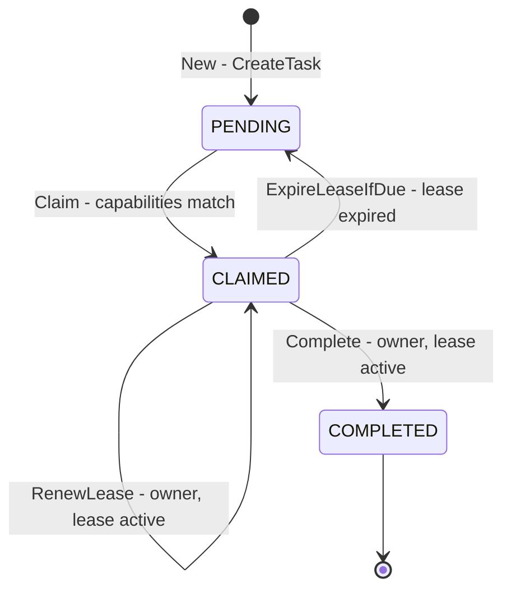
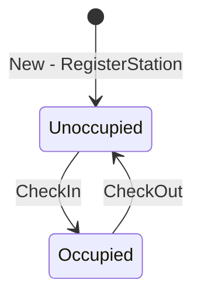
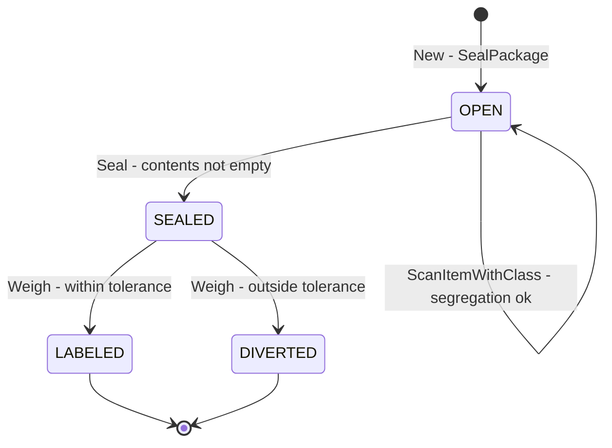
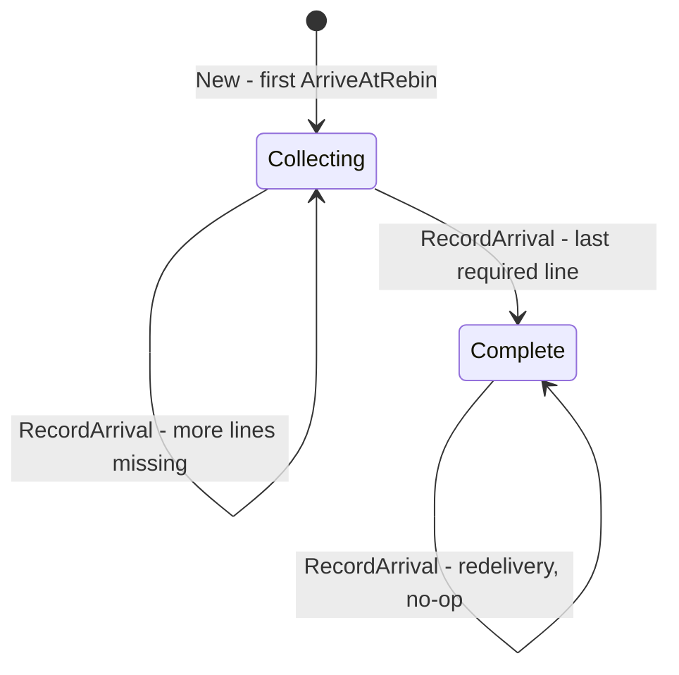

# Aggregate design canvas

:::info[Synced from fulfillment-execution]
This page is a copy of [`docs/docs/ddd/aggregate-design-canvas.md`](https://github.com/IQVO/fulfillment-execution/blob/develop/docs/docs/ddd/aggregate-design-canvas.md) on `develop`, derived from that repository's code. Edit it there, then re-sync.
:::

One [ddd-crew Aggregate Design Canvas v1.1](https://github.com/ddd-crew/aggregate-design-canvas)
per aggregate root in `internal/domain/`. The numbered invariants (T1, S1,
P1, C1, ...) match [Aggregates & invariants](https://github.com/IQVO/fulfillment-execution/blob/develop/docs/docs/ddd/aggregates-and-invariants.md),
which has the failing-path test for each. Throughput and size figures are
**estimates** for a single mid-size fulfilment centre, labelled as such —
the code holds no such numbers.

## Task

### 1. Name

`task.Task` — `internal/domain/task/task.go`.

### 2. Description

A unit of physical work (`PICK`, `PACK`, `REBIN`, `SLAM`) with a CPT
deadline, an `orderRef` (the work unit id), an optional `sourceOrderId` (the
upstream order id from `WorkReleased.ref`, published as
`TaskCompleted.order_ref` — [ADR-0040](https://github.com/IQVO/fulfillment-execution/blob/develop/docs/docs/adr/0040-task-completed-carries-order-ref.md)), an optional
`sourceLineNo` (the order line from `WorkReleased.line_no`, order work only, range 1..2147483647 with
anything larger left unknown (0),
published as `TaskCompleted.line_no` — [ADR-0041](https://github.com/IQVO/fulfillment-execution/blob/develop/docs/docs/adr/0041-task-completed-carries-line-no.md)),
required capabilities and two packing hints
(`fragile`, `giftWrap`). It is the consistency boundary for "who holds this
work right now": at most one active lease, owned by one station.

### 3. State Transitions

Source: `internal/domain/task/task.go` (`Pending`, `Claimed`, `Completed`;
`Claim`, `RenewLease`, `ExpireLeaseIfDue`, `Complete`). Omits the lazy
expiry inside `Claim` / `RenewLease` / `Complete` (they run the same
`CLAIMED → PENDING` edge before deciding) and the read-only predicates
`IsAvailable` and `IsCPTMissed`.

### 4. Enforced Invariants

| # | Invariant | Enforced by |
| --- | --- | --- |
| T1 | At most one active claim at a time | `Task.Claim` → `task.ErrAlreadyClaimed`; persisted by `TaskRepo.SaveClaim` compare-and-set ([ADR-0034](https://github.com/IQVO/fulfillment-execution/blob/develop/docs/docs/adr/0034-concurrency-control-for-consolidation-and-claim.md)) |
| T2 | The claiming station must hold every required capability | `Task.Claim` → `task.ErrCapabilityMismatch` (`CapabilitySet.HasAll`) |
| T3 | An expired lease frees the task before any further decision | `Task.ExpireLeaseIfDue`, called lazily from `Claim`, `RenewLease`, `Complete` |
| T4 | No double-complete: a completed task rejects every further operation | `Task.Claim` / `RenewLease` / `Complete` → `task.ErrAlreadyCompleted` |
| T5 | Only the claim owner may renew or complete | `Task.RenewLease` / `Task.Complete` → `task.ErrNotOwner` |
| T6 | Renew and complete require an active claim | `Task.RenewLease` / `Task.Complete` → `task.ErrNotClaimed` |

### 5. Corrective Policies

- **Lease expiry sweep** — `ExpireLeases` (`POST /tasks/expire-leases`)
  frees every lapsed claim and raises `LeaseExpired`.
- **CPT-miss sweep** — `SweepCPTMisses` (`POST /tasks/sweep-cpt-misses`)
  reports open tasks at or past CPT as `TaskCPTMissed`; it changes nothing,
  so `order-management` re-promises.
- **Claim race** — a station that loses the `SaveClaim` compare-and-set
  silently moves to the next candidate.

### 6. Handled Commands

`CreateTask` (REST `POST /tasks`, the `WorkReleased` consumer,
`ArriveAtRebin`), `ClaimNext` (`POST /stations/{stationId}/claim-next`),
`RenewLease` (`POST /tasks/{id}/renew-lease`), `CompleteTask`
(`POST /tasks/{id}/complete`, MCP `complete_task`), `ExpireLeases`,
`SweepCPTMisses` (reads only).

### 7. Created Events

| Event | Full CloudEvents type |
| --- | --- |
| `TaskCreated` | `com.warehouse.wes.fulfillment-execution.task.TaskCreated` |
| `TaskClaimed` | `com.warehouse.wes.fulfillment-execution.task.TaskClaimed` |
| `LeaseExpired` | `com.warehouse.wes.fulfillment-execution.task.LeaseExpired` |
| `TaskCompleted` | `com.warehouse.wes.fulfillment-execution.task.TaskCompleted` |
| `TaskCPTMissed` | `com.warehouse.wes.fulfillment-execution.task.TaskCPTMissed` |
| `ItemPicked` (defined, never raised) | `com.warehouse.wes.fulfillment-execution.task.ItemPicked` |

### 8. Throughput (estimate)

High. Every unit of work creates a task, and every task is touched by a
claim, usually a renewal or two, and a completion — **estimate:** thousands
of commands per hour per site at peak. Contention is per task and short:
only concurrent `claim-next` calls on the same task type race, and the
compare-and-set resolves them.

### 9. Size (estimate)

Small and short-lived. **Estimate:** 3–6 events per instance (created,
claimed, optionally one or two lease expiries and re-claims, completed,
occasionally CPT-missed), lifetime minutes to hours, one row in `tasks`.

## Station

### 1. Name

`station.Station` — `internal/domain/station/station.go`.

### 2. Description

A work position with a fixed capability set, an optional facility-layout
`locationCode`, and at most one occupant (an associate or a robot).
`ClaimNext` reads its capabilities; `CompleteTask`'s published event reads
its occupant.

### 3. State Transitions

Source: `internal/domain/station/station.go` (`CheckIn`, `CheckOut`,
`IsOccupied`). There is no status enum: occupancy is the nil-ness of
`occupant`. Omits re-registration (`RegisterStation` saves a fresh
`Station` over an existing id).

### 4. Enforced Invariants

| # | Invariant | Enforced by |
| --- | --- | --- |
| S1 | One occupant at a time | `Station.CheckIn` → `station.ErrOccupied` |
| S2 | Cannot check out an empty station | `Station.CheckOut` → `station.ErrNotOccupied` |
| S3 | A station can only accept tasks whose required capabilities it holds | `Station.ValidateAccept` → `station.ErrCapabilityMismatch` |

Plus an application-level rule at registration: a `locationCode` that
facility-layout knows must have role `WorkCenter`
(`usecases.ErrStationLocationNotWorkCenter`,
[ADR-0024](https://github.com/IQVO/fulfillment-execution/blob/develop/docs/docs/adr/0024-station-location-code-and-workcenter-role-check.md)).

### 5. Corrective Policies

None. A station left occupied stays occupied until someone checks it out;
`associate_id` on `TaskCompleted` is best-effort for that reason.

### 6. Handled Commands

`RegisterStation` (`POST /stations`), `CheckInStation`
(`POST /stations/{stationId}/check-in`), `CheckOutStation`
(`POST /stations/{stationId}/check-out`).

### 7. Created Events

None — registration and occupancy are operational state, not domain facts.

### 8. Throughput (estimate)

Low. **Estimate:** a handful of check-ins and check-outs per station per
shift; registration only when the floor changes. Read on every claim.

### 9. Size (estimate)

Tiny and long-lived: one row in `stations`, no events, lifetime months.

## Package

### 1. Name

`pack.Package` — `internal/domain/package/package.go` (Go package `pack`,
because `package` is a keyword).

### 2. Description

The Pack output: one sealed carton for one PACK task, with its scanned
contents, the DOT hazard classes of those contents, two handling flags
derived from the task, a derived `SortLane`, and the SLAM outcome.

### 3. State Transitions

Source: `internal/domain/package/package.go` (`Open`, `Sealed`, `Labeled`,
`Diverted`; `ScanItemWithClass`, `Seal`, `Weigh`). Omits that the `OPEN`
state never reaches the database: `SealPackage` builds, scans and seals in
memory and saves the package already `SEALED`.

### 4. Enforced Invariants

| # | Invariant | Enforced by |
| --- | --- | --- |
| P1 | Cannot seal without scanned contents | `Package.Seal` → `pack.ErrNoScannedContents` |
| P2 | Cannot scan into or re-seal a sealed package | `Package.ScanItemWithClass` / `Seal` → `pack.ErrAlreadySealed` |
| P3 | SLAM requires a sealed package | `Package.Weigh` → `pack.ErrNotSealed` |
| P4 | SLAM runs once | `Package.Weigh` → `pack.ErrAlreadyProcessed` |
| P5 | Outside `WeightTolerance` (0.05) the package is diverted, not labelled | `Package.Weigh` (returns `labelApplied = false`) |
| P6 | Incompatible DOT hazard classes may not share a package | `Package.ScanItemWithClass` → `pack.ErrPackageSegregationViolation` (`pack.IsSegregationIncompatible`) |

Plus application-level rules in `SealPackage`: the task must be a `PACK`
task (`usecases.ErrWrongTaskType`) and the caller must hold an unexpired
lease on it (`Task.VerifyHeldBy` → `task.ErrNotClaimed` for a missing or
expired lease, `task.ErrNotOwner` for an active lease of another station;
[ADR-0038](https://github.com/IQVO/fulfillment-execution/blob/develop/docs/docs/adr/0038-seal-package-expired-lease-is-not-claimed.md)); one package per task
(`PackageRepo.FindByTaskId` short-circuit, unique index
`idx_packages_task_id`).

### 5. Corrective Policies

- A diverted package goes to manual handling; nothing in this context
  re-weighs it.
- A hazard lookup failure is treated as "no hazard class" (fail-open), so
  sealing never blocks on the classification copy (product-master's
  `ProductClassified`, ADR-0039).

### 6. Handled Commands

`SealPackage` (`POST /tasks/{id}/seal-package`), `RunSlam`
(`POST /packages/{id}/slam`). Reads: `GetPackage`, `GetPackagesByOrderRef`.

### 7. Created Events

| Event | Full CloudEvents type |
| --- | --- |
| `PackageSealed` | `com.warehouse.wes.fulfillment-execution.package.PackageSealed` |
| `LabelApplied` | `com.warehouse.wes.fulfillment-execution.package.LabelApplied` |
| `PackageManifested` | `com.warehouse.wes.fulfillment-execution.package.PackageManifested` |
| `WeightDiscrepancyDetected` | `com.warehouse.wes.fulfillment-execution.package.WeightDiscrepancyDetected` |
| `PackageDiverted` | `com.warehouse.wes.fulfillment-execution.package.PackageDiverted` |

### 8. Throughput (estimate)

Medium. **Estimate:** one seal and one SLAM per shipped carton, so
roughly one package command per PACK task; no contention (one station holds
the PACK task, one SLAM line weighs the carton).

### 9. Size (estimate)

Small: exactly 3 events per instance (sealed, then labelled + manifested or
discrepancy + diverted), lifetime minutes, one row in `packages`.

## OrderConsolidation

### 1. Name

`consolidation.OrderConsolidation` —
`internal/domain/consolidation/order_consolidation.go`.

### 2. Description

Tracks which of an order's required lines have reached Rebin. When the set
is complete, the order's PACK task is created exactly once. Lines are
identified by string id only; it holds no reference to `Task`
([ADR-0016](https://github.com/IQVO/fulfillment-execution/blob/develop/docs/docs/adr/0016-rebin-and-order-consolidation.md)).

### 3. State Transitions

Source: `internal/domain/consolidation/order_consolidation.go`
(`RecordArrival`, `IsComplete`), `internal/application/usecases/arrive_at_rebin.go`.
There is no status enum: "complete" is `IsComplete()`. Omits the unknown-line
rejection, which leaves the state unchanged.

### 4. Enforced Invariants

| # | Invariant | Enforced by |
| --- | --- | --- |
| C1 | Only a line in the required set can arrive | `OrderConsolidation.RecordArrival` → `consolidation.ErrUnknownLine` |
| C2 | Arrivals are idempotent, and the PACK task is created exactly once, on the arrival that completes the set | `RecordArrival` (re-recording is a no-op); `ArriveAtRebin` (`wasAlreadyComplete` check), serialized per order by `FindByOrderRefForUpdate` ([ADR-0034](https://github.com/IQVO/fulfillment-execution/blob/develop/docs/docs/adr/0034-concurrency-control-for-consolidation-and-claim.md)) |

### 5. Corrective Policies

Redelivered arrivals are idempotent no-ops. There is no timeout for an
order whose last line never arrives.

### 6. Handled Commands

`ArriveAtRebin` (`POST /rebin/arrivals`).

### 7. Created Events

`ItemArrivedAtRebin` and `OrderConsolidated` — domain events with **no**
CloudEvents type: neither encoder's allowlist includes them, so they never
leave the process. On completion the aggregate's use case also raises
`TaskCreated` (`com.warehouse.wes.fulfillment-execution.task.TaskCreated`)
through `CreateTask`.

### 8. Throughput (estimate)

Medium, only for multi-line orders routed through Rebin. **Estimate:** one
command per line. Contention is per order and serialized by the row lock.

### 9. Size (estimate)

Small: one event per line plus one at completion, lifetime minutes, one
row in `order_consolidations`.

## Read models and projections (not aggregates)

| Read model | Built from | Served by |
| --- | --- | --- |
| Queue depth | `TaskRepo.CountByTypeAndStatus(type, PENDING)` on demand | `GetQueueDepth`, `GET /queues/{taskType}/depth`, MCP `get_queue_status` |
| Installed capacity | `StationRepo.CountByCapability` on demand | `GetInstalledCapacity`, `GET /capacity/{capability}` |
| Tasks by order | `TaskRepo.FindByOrderRef` | `GET /tasks?orderRef=` |
| Package read model | `PackageRepo.FindById`, `FindByOrderRef` | `GET /packages/{id}`, `GET /packages?orderRef=` ([ADR-0033](https://github.com/IQVO/fulfillment-execution/blob/develop/docs/docs/adr/0033-package-read-model.md)) |
| Claimable work / stuck tasks | `TaskRepo` through `mcp.TaskQueries` | MCP `find_claimable_work`, `diagnose_stuck_tasks` |
| Throughput and on-time-to-CPT rollup | `warehouse.fulfillment.analytics` → `cmd/fulfillment-projector` → `throughput_rollup` | `cmd/fulfillment-reports` `GET /reports/throughput`, MCP report tools |

`pathcatalog.Catalogue` is configuration, not an aggregate: it is loaded
from YAML or replayed from Kafka and never changed by a command of this
context.
