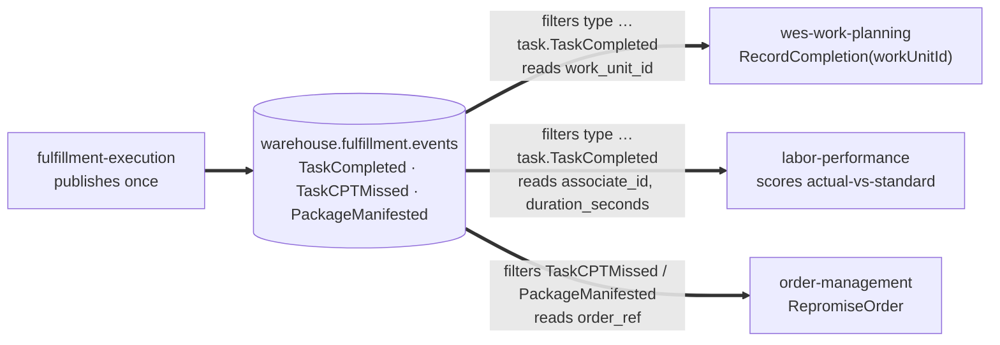

# Async API

This page is the narrative companion to the
[generated AsyncAPI reference](/api-reference/async/fulfillment-execution) —
what this context actually does with Kafka, in prose. Every message is a
CloudEvents 1.0 event (structured mode, header
`content-type: application/cloudevents+json; charset=UTF-8`) per the
fleet-wide, mandatory [Event Standard](/strategic-design/event-standard-cloudevents).

## Topics

| Direction | Topic | Event(s) | Adapter |
| --- | --- | --- | --- |
| Consume | `warehouse.work-planning.events` | `WorkReleased` | `internal/adapters/inbound/kafka/consumer.go` |
| Publish | `warehouse.fulfillment.events` | `TaskCompleted`, `TaskCPTMissed`, `PackageManifested` | `internal/adapters/outbound/kafka/publisher.go` |
| Publish (internal) | `warehouse.fulfillment.analytics` | ten event types (all but `TaskCPTMissed` and the two Rebin events), consumed only by this service's `cmd/fulfillment-projector` | `internal/adapters/outbound/kafka/analytics_publisher.go` |
| Consume (opt-in) | `warehouse.process-path-management.events` | process-path catalogue events | `internal/adapters/outbound/kafkacatalog` — only when `PATH_CATALOGUE_SOURCE=kafka` |

Client library on both sides: `github.com/segmentio/kafka-go` (pure Go, no
cgo). Broker list comes from `KAFKA_BROKERS`, default `localhost:9092` — the
shared platform broker in the `warehouse-infra` kind cluster, exposed on the
host. This repository's own `docker-compose.yml` deliberately defines only
Postgres.

## Consuming: `WorkReleased`

The CloudEvents 1.0 envelope shared by every service in the fleet:

```json
{
  "specversion": "1.0",
  "id": "uuid-v4",
  "source": "/warehouse/wes-work-planning",
  "type": "com.warehouse.wes.work-planning.workunit.WorkReleased",
  "subject": "wu-8a1f",
  "time": "2026-08-21T22:00:00Z",
  "datacontenttype": "application/json",
  "dataschema": "urn:warehouse:wes-work-planning:events:WorkReleased:v1",
  "data": {
    "path_id": "pick-zone-a",
    "work_unit_id": "wu-8a1f",
    "cpt": "2026-08-23T18:00:00Z",
    "ref": "order-4471",
    "fragile": false,
    "gift_wrap": false
  }
}
```

`fragile` and `gift_wrap` are optional packing hints (default `false`).

The consumer validates the CloudEvent, filters on the full
`type == "com.warehouse.wes.work-planning.workunit.WorkReleased"` and
silently ignores every other type on the topic (a message that is not a
valid CloudEvent is a poison message: never retried, never parsed as a
legacy shape, dead-lettered), then translates at the boundary (the
Anti-Corruption Layer) rather than deserialising into a shared type:

| From `WorkReleased.data` | Becomes | Via |
| --- | --- | --- |
| `path_id` | `task.Type` | process-path catalogue lookup, longest `matchPrefix` wins (case-insensitive); an unknown id is a **hard error**, not a silent `PICK` |
| `work_unit_id` | `shared.OrderRef` | direct |
| `cpt` | `shared.CPT` | RFC 3339 timestamp |
| *(from the matched path)* | `shared.CapabilitySet` | the path definition's `requiredCapabilities` |
| `fragile` / `gift_wrap` | `Task.Fragile` / `Task.GiftWrap` | direct, default `false` |
| `ref` | *(unused)* | decoded but not mapped — `work_unit_id` is the correlation key |

The catalogue comes from `PATH_CATALOGUE_SOURCE`: `file` (default) loads
`PATH_CATALOGUE_FILE` once at boot; `kafka` replays
`warehouse.process-path-management.events` into memory and follows live
changes
([ADR-0017](https://github.com/IQVO/fulfillment-execution/blob/develop/docs/docs/adr/0017-process-path-catalogue-as-configuration.md)).
The retired prefix-guessing convention is gone.

The consumer then calls the **existing** `CreateTask` use case — no
parallel code path exists for the Kafka-originated flow. Idempotency:
`ProcessedEvents.MarkProcessed(ctx, id)` (the CloudEvents `id`) runs before task creation,
returning `true` only if this call newly recorded the id, so redelivery
(Kafka is at-least-once) produces no duplicate task. A handling error is
retried in process (3 attempts in total, exponential backoff); after that,
or immediately for a non-CloudEvent, the raw message is dead-lettered to
`warehouse.work-planning.events.dlq` with `x-dlq-*` headers when
`EVENT_PUBLISHER=kafka` wires the DLQ writer, and the loop continues. Consumer group:
`WORK_RELEASED_CONSUMER_GROUP` (default `fulfillment-execution`); a second
process on the shared broker must set a unique value.

## Publishing: `TaskCompleted`

```json
{
  "specversion": "1.0",
  "id": "uuid-v4",
  "source": "/warehouse/fulfillment-execution",
  "type": "com.warehouse.wes.fulfillment-execution.task.TaskCompleted",
  "subject": "task-8a1f",
  "time": "2026-08-22T14:04:00Z",
  "datacontenttype": "application/json",
  "dataschema": "urn:warehouse:fulfillment-execution:events:TaskCompleted:v1",
  "data": {
    "task_id": "task-8a1f",
    "station_id": "station-03",
    "work_unit_id": "wu-8a1f",
    "associate_id": "assoc-42",
    "duration_seconds": 187,
    "task_type": "PICK"
  }
}
```

The domain event carries only `TaskId` and `StationId`; the Kafka publisher
enriches the wire payload at publish time via repository lookups —
`work_unit_id` from `TaskRepo.FindById(...).OrderRef()`, `associate_id` from
`StationRepo.FindById(...).Occupant()`, and `duration_seconds` computed
from the same `Task`'s `ClaimedAt()`, and `task_type` read straight off the
loaded `Task`
([ADR-0023](https://github.com/IQVO/fulfillment-execution/blob/develop/docs/docs/adr/0023-task-type-on-wire.md)). Message key is the task id, so all
events for one task land on the same partition and preserve order.
`associate_id` is omitted when the station has no checked-in occupant;
`duration_seconds` is `0` when `ClaimedAt()` is `nil` (a pre-migration
task) — both degrade gracefully rather than failing the publish.

## Publishing: `TaskCPTMissed` and `PackageManifested`

Added by
[ADR-0025](https://github.com/IQVO/fulfillment-execution/blob/develop/docs/docs/adr/0025-cpt-missed-sweep-and-package-manifested.md)
as this service's half of order-management's promise feedback loop. Same
topic, same CloudEvents envelope, same publisher:

| `type` | `data` | Raised when |
| --- | --- | --- |
| `com.warehouse.wes.fulfillment-execution.task.TaskCPTMissed` | `task_id`, `order_ref`, `task_type`, `cpt` | `POST /tasks/sweep-cpt-misses` finds a task still open (Pending or Claimed) at or past its CPT; re-fires every pass while overdue. Nothing inside this service schedules the sweep. |
| `com.warehouse.wes.fulfillment-execution.package.PackageManifested` | `package_id`, `order_ref` | SLAM passes, alongside `LabelApplied` |

Every field comes straight off the domain event — no repository enrichment.
`order-management`'s `RepromiseOrder` consumer keys on `order_ref`.
`PackageManifested` is also the evidence for the on-time-to-CPT KPI on this
service's throughput analytics data product
([ADR-0026](https://github.com/IQVO/fulfillment-execution/blob/develop/docs/docs/adr/0026-on-time-to-cpt-kpi.md)).

With `EVENT_PUBLISHER=kafka` and a `DATABASE_URL`, all three published
events go through the transactional outbox — written in the same
transaction as the aggregate, relayed by an in-process relay to both the
integration and analytics topics
([ADR-0020](https://github.com/IQVO/fulfillment-execution/blob/develop/docs/docs/adr/0020-transactional-outbox.md)).

## A shared fan-out topic, three independent consumers

`warehouse.fulfillment.events` is published to **once**, but read by
**three different bounded contexts**, each subscribing independently and
each filtering by the full CloudEvents `type`:



- **`wes-work-planning`** consumes it to close the drum-buffer-rope feedback
  loop: Execution → Orchestration. It reads `work_unit_id` and calls its
  own `RecordCompletion(workUnitId)`.
- **`labor-performance`** consumes the *same* event from the *same* topic,
  independently, as a pure Conformist downstream reader with zero write
  access back to this service. It reads `associate_id` and
  `duration_seconds` to score actual-vs-standard task performance.
- **`order-management`** consumes `TaskCPTMissed` and `PackageManifested`
  to re-promise orders whose work missed, or made, its CPT.

This is a deliberate choice, not an accident: `labor-performance` could
instead poll a new `GET /tasks/{id}/completion-details`-style endpoint, but
that would duplicate the completion signal across two mechanisms that could
disagree, and would add a new synchronous inbound dependency onto this
service's completion path. Enriching the one existing event both consumers
already have to read keeps the coupling one-way and event-driven — this
service publishes what it knows, once, at the moment it knows it, and each
downstream reader takes only the fields it needs.

## The `type` convention

```
com.warehouse.<subdomain>.<bounded-context>.<entity>.<EventName>
```

e.g. `com.warehouse.wes.fulfillment-execution.task.TaskCompleted`, on topic
`warehouse.fulfillment.events`. The same `type` names the occurrence on the
analytics topic `warehouse.fulfillment.analytics`; `dataschema`
(`urn:warehouse:fulfillment-execution:<events|analytics>:<EventName>:v1`)
names the payload shape. The publisher emits only CloudEvents and every
consumer accepts only CloudEvents; there is no other envelope
([ADR-0032](https://github.com/IQVO/fulfillment-execution/blob/develop/docs/docs/adr/0032-cloudevents-mandatory-envelope.md)).

## See also

For the exact generated schema, message examples, and channel bindings,
see the [Generated API Reference](/api-reference/async/fulfillment-execution),
built directly from this context's own `apis/asyncapi.yaml`.
