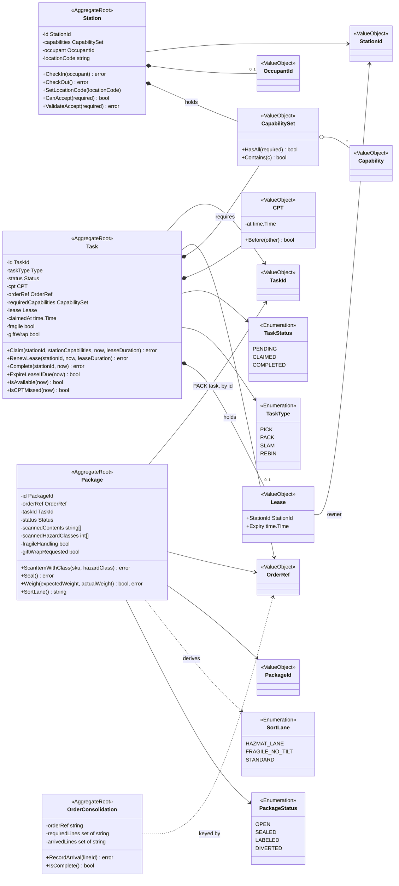
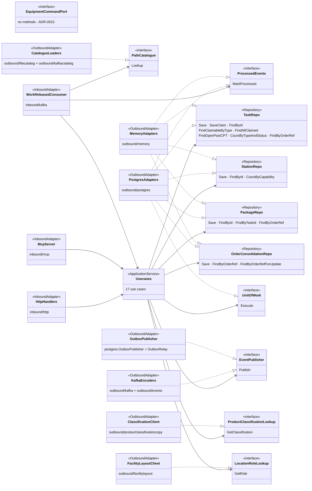

# Class diagram

:::info[Synced from fulfillment-execution]
This page is a copy of [`docs/docs/ddd/class-diagram.md`](https://github.com/IQVO/fulfillment-execution/blob/develop/docs/docs/ddd/class-diagram.md) on `develop`, derived from that repository's code. Edit it there, then re-sync.
:::

UML class diagrams drawn from `internal/domain/**` and
`internal/application/ports/`. Names are the real Go identifiers; fields
are the unexported struct fields (shown private, `-`), methods are the
state-changing ones and key queries (public, `+`). Go has no classes or
enums: an `<<Enumeration>>` is a named string type with a `const` block,
and a `<<Repository>>` is a port interface.

## 1. Aggregates, entities and value objects

Source: `internal/domain/task/task.go`, `internal/domain/station/station.go`,
`internal/domain/package/package.go`,
`internal/domain/consolidation/order_consolidation.go`,
`internal/domain/shared/{ids,capability,cpt}.go`. The two Go types named
`Status` are shown as `TaskStatus` and `PackageStatus`, and `task.Type` as
`TaskType`, to keep the names unique in one diagram. Omits constructors
(`New`, `Rehydrate`, `RehydrateWithLocation`), plain getters, and the
segregation matrix in `segregation.go` (`IsSegregationIncompatible`).
Aggregates reference each other **by id only** — `Package.taskId`,
`Lease.StationId` — never by object; no aggregate holds another.

## 2. Domain events and configuration types

```mermaid
classDiagram
    direction TB
    class DomainEvent {
        <<interface>>
        +EventName() string
        +OccurredAt() time.Time
    }
    class TaskCreated {
        <<DomainEvent>>
        +TaskId TaskId
    }
    class TaskClaimed {
        <<DomainEvent>>
        +TaskId TaskId
        +StationId StationId
    }
    class LeaseExpired {
        <<DomainEvent>>
        +TaskId TaskId
    }
    class TaskCompleted {
        <<DomainEvent>>
        +TaskId TaskId
        +StationId StationId
    }
    class TaskCPTMissed {
        <<DomainEvent>>
        +TaskId TaskId
        +OrderRef OrderRef
        +TaskType string
        +CPT time.Time
    }
    class ItemPicked {
        <<DomainEvent>>
        +TaskId TaskId
    }
    class PackageSealed {
        <<DomainEvent>>
        +PackageId PackageId
    }
    class WeightDiscrepancyDetected {
        <<DomainEvent>>
        +PackageId PackageId
        +ExpectedWeight float64
        +ActualWeight float64
    }
    class PackageDiverted {
        <<DomainEvent>>
        +PackageId PackageId
    }
    class LabelApplied {
        <<DomainEvent>>
        +PackageId PackageId
    }
    class PackageManifested {
        <<DomainEvent>>
        +PackageId PackageId
        +OrderRef OrderRef
    }
    class ItemArrivedAtRebin {
        <<DomainEvent>>
        +OrderRef OrderRef
        +LineId string
    }
    class OrderConsolidated {
        <<DomainEvent>>
        +OrderRef OrderRef
    }
    class Catalogue {
        <<ValueObject>>
        +Lookup(id) PathDefinition, error
        +Ids() string[]
    }
    class PathDefinition {
        <<ValueObject>>
        +Id string
        +MatchPrefix string
        +Direct bool
        +RequiredCapabilities string[]
        +DestinationLocationRole string
    }

    DomainEvent <|.. TaskCreated
    DomainEvent <|.. TaskClaimed
    DomainEvent <|.. LeaseExpired
    DomainEvent <|.. TaskCompleted
    DomainEvent <|.. TaskCPTMissed
    DomainEvent <|.. ItemPicked
    DomainEvent <|.. PackageSealed
    DomainEvent <|.. WeightDiscrepancyDetected
    DomainEvent <|.. PackageDiverted
    DomainEvent <|.. LabelApplied
    DomainEvent <|.. PackageManifested
    DomainEvent <|.. ItemArrivedAtRebin
    DomainEvent <|.. OrderConsolidated
    Catalogue *-- "*" PathDefinition
```

Source: `internal/domain/shared/events.go`,
`internal/domain/pathcatalog/path_definition.go`. Every event embeds an
unexported `base` struct (`Name`, `At`) that implements `DomainEvent`; it is
drawn as interface realization. Omits the `New...` constructors.

## 3. Hexagonal view: ports and adapters

Source: `internal/application/ports/ports.go`, `ports/equipment.go`,
`internal/adapters/**`, `cmd/execution/main.go`,
`internal/composition/publisher.go`. Omits `Clock` and `Metrics` ports
(implemented by `memory` clock and `internal/observability`), the MCP
adapter's narrow `TaskQueries` read port, the analytics side
(`inbound/kafka/analytics_consumer.go`, `outbound/analyticsstore`), and the
idempotency and readiness middleware. The dependency direction is enforced
by arch-go in `internal/architecture/` (`make arch-test`).
