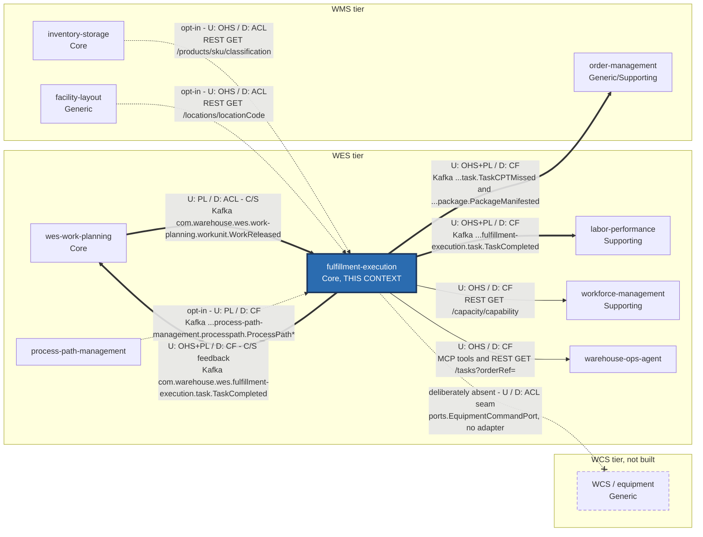
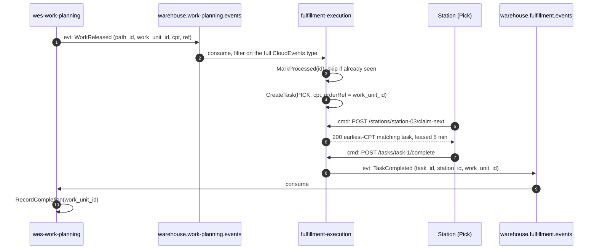

# Context map

:::info[Synced from fulfillment-execution]
This page is a copy of [`docs/docs/ecosystem/context-map.md`](https://github.com/IQVO/fulfillment-execution/blob/develop/docs/docs/ecosystem/context-map.md) on `develop`, derived from that repository's code. Edit it there, then re-sync.
:::

`warehouse-systems` is a fleet of Go services, one bounded context each, plus
an external WCS tier that is not built. This page is this service's slice of
the fleet context map, drawn with the
[ddd-crew Context Mapping](https://github.com/ddd-crew/context-mapping)
vocabulary. It is honest about the difference between **live** (a real
topic or route, a real adapter, running code, on by default), **opt-in**
(the adapter exists but an env var switches it on), and **deliberately
absent** (a real relationship in the domain with no wire, by decision).

## Pattern legend

| Abbreviation | Pattern | Sits on |
| --- | --- | --- |
| **U / D** | Upstream / Downstream — who can change the contract and who must follow | each end of an edge |
| **OHS** | Open Host Service — a general-purpose protocol published for many clients | upstream end |
| **PL** | Published Language — a documented interchange format (here: CloudEvents types + `apis/asyncapi.yaml`, `apis/openapi.yaml`) | upstream end |
| **CF** | Conformist — downstream adopts the upstream model without translation | downstream end |
| **ACL** | Anti-Corruption Layer — downstream translates at its boundary | downstream end |
| **C/S** | Customer/Supplier — downstream's needs are a real input to upstream's planning | the edge |
| **P** | Partnership | the edge (none here) |
| **SK** | Shared Kernel | the edge (none here — no shared Go types or tables) |
| **Separate Ways** | No integration, by decision | — |

## The map

Every arrow points from **upstream to downstream** (the direction the model
flows), whatever the transport direction of the call.

Source: `internal/adapters/inbound/kafka/consumer.go`,
`internal/adapters/outbound/kafka/publisher.go`,
`internal/adapters/outbound/kafkacatalog/consumer.go`,
`internal/adapters/outbound/productclassification/client.go`,
`internal/adapters/outbound/facilitylayout/client.go`,
`internal/adapters/inbound/http/router.go`, `cmd/mcp/router.go`,
`internal/application/ports/equipment.go`, `apis/asyncapi.yaml`.
Thick arrows are Kafka (live when `EVENT_PUBLISHER=kafka`); thin solid
arrows are synchronous calls into this service; dotted arrows are opt-in or
absent. Omitted: edges between *other* contexts (see each service's own
map), this service's internal analytics topic
(`warehouse.fulfillment.analytics`, produced and consumed only by this
context), and browser clients (`warehouse-console` / the `web/` MFE), which
are not bounded contexts. Path parameters are written without braces in the
diagram labels.

## Relationships with evidence

| # | Upstream → Downstream | Patterns | Technology | Status | Evidence (this repo) |
| --- | --- | --- | --- | --- | --- |
| 1 | `wes-work-planning` → **this** | C/S; U: PL; D: **ACL** | Kafka `warehouse.work-planning.events`, `com.warehouse.wes.work-planning.workunit.WorkReleased`; group `WORK_RELEASED_CONSUMER_GROUP` (default `fulfillment-execution`) | **Live** (consumer always starts) | `internal/adapters/inbound/kafka/consumer.go` (`TypeWorkReleased`, `WorkReleasedData`, `handleClaimedEvent` → `CreateTask`) |
| 2 | **this** → `wes-work-planning` | C/S (feedback edge); U: OHS + PL; D: CF | Kafka `warehouse.fulfillment.events`, `com.warehouse.wes.fulfillment-execution.task.TaskCompleted` | **Live** with `EVENT_PUBLISHER=kafka` | `internal/adapters/outbound/kafka/publisher.go` (`encodeTaskCompleted`, `work_unit_id` enrichment) |
| 3 | **this** → `labor-performance` | U: OHS + PL; D: CF | Kafka `warehouse.fulfillment.events`, `com.warehouse.wes.fulfillment-execution.task.TaskCompleted` (`associate_id`, `duration_seconds`, `task_type`) | **Live** with `EVENT_PUBLISHER=kafka` | same publisher; [ADR-0014](https://github.com/IQVO/fulfillment-execution/blob/develop/docs/docs/adr/0014-labor-performance-integration-hooks.md), [ADR-0023](https://github.com/IQVO/fulfillment-execution/blob/develop/docs/docs/adr/0023-task-type-on-wire.md) |
| 4 | **this** → `order-management` | U: OHS + PL; D: CF | Kafka `warehouse.fulfillment.events`, `com.warehouse.wes.fulfillment-execution.task.TaskCPTMissed`, `com.warehouse.wes.fulfillment-execution.package.PackageManifested` | **Live** with `EVENT_PUBLISHER=kafka` | `publisher.go` (`encodeTaskCPTMissed`, `encodePackageManifested`); [ADR-0025](https://github.com/IQVO/fulfillment-execution/blob/develop/docs/docs/adr/0025-cpt-missed-sweep-and-package-manifested.md) |
| 5 | **this** → `workforce-management` | U: OHS; D: CF | REST `GET /capacity/{capability}` (called by workforce-management) | **Live** | `internal/adapters/inbound/http/router.go`, `usecases.GetInstalledCapacity`; [ADR-0018](https://github.com/IQVO/fulfillment-execution/blob/develop/docs/docs/adr/0018-installed-capacity-read-endpoint.md) |
| 6 | **this** → `warehouse-ops-agent` | U: OHS; D: CF | MCP Streamable HTTP (`cmd/mcp`, tools `get_queue_status`, `find_claimable_work`, `diagnose_stuck_tasks`, `complete_task`, plus `get_fulfillment_throughput_report` / `get_on_time_to_cpt` when `REPORTS_BASE_URL` is set); REST `GET /tasks?orderRef=` from the console BFF | **Live** | `cmd/mcp/router.go`, `internal/adapters/inbound/mcp/tools.go`; [ADR-0008](https://github.com/IQVO/fulfillment-execution/blob/develop/docs/docs/adr/0008-mcp-inbound-adapter.md), [ADR-0013](https://github.com/IQVO/fulfillment-execution/blob/develop/docs/docs/adr/0013-fulfillment-mfe-console-adoption.md) |
| 7 | `process-path-management` → **this** | U: PL; D: CF | Kafka `warehouse.process-path-management.events`, `com.warehouse.wes.process-path-management.processpath.ProcessPathCreated` / `ProcessPathUpdated` / `ProcessPathDeactivated`; per-process group | **Opt-in** (`PATH_CATALOGUE_SOURCE=kafka`; default `file` reads the same shape from YAML) | `internal/adapters/outbound/kafkacatalog/consumer.go`; [ADR-0017](https://github.com/IQVO/fulfillment-execution/blob/develop/docs/docs/adr/0017-process-path-catalogue-as-configuration.md) |
| 8 | `inventory-storage` → **this** | U: OHS; D: **ACL** (`ports.ClassificationInfo`) | REST `GET /products/{sku}/classification`, called per scanned SKU at seal time, behind retry + circuit breaker | **Opt-in** (`PRODUCT_CLASSIFICATION_MODE=http` + `INVENTORY_STORAGE_BASE_URL`; default permissive no-op) | `internal/adapters/outbound/productclassification/`; [ADR-0010](https://github.com/IQVO/fulfillment-execution/blob/develop/docs/docs/adr/0010-package-segregation-and-sort-lane.md), [ADR-0029](https://github.com/IQVO/fulfillment-execution/blob/develop/docs/docs/adr/0029-resilience-circuit-breakers-retry-dlq-shutdown.md) |
| 9 | `facility-layout` → **this** | U: OHS; D: **ACL** (`ports.LocationRoleInfo`), conforming to the `LocationRole` vocabulary | REST `GET /locations/{locationCode}`, called once per `RegisterStation` with a `locationCode`, behind retry + circuit breaker | **Opt-in** (`LOCATION_ROLE_MODE=http` + `FACILITY_LAYOUT_BASE_URL`; default permissive no-op) | `internal/adapters/outbound/facilitylayout/`; [ADR-0024](https://github.com/IQVO/fulfillment-execution/blob/develop/docs/docs/adr/0024-station-location-code-and-workcenter-role-check.md) |
| 10 | **this** → WCS / equipment | Strategically U: this; D: WCS; ACL seam on this side | none | **Deliberately absent** — the port declares no methods and has no adapter | `internal/application/ports/equipment.go`; [ADR-0015](https://github.com/IQVO/fulfillment-execution/blob/develop/docs/docs/adr/0015-wcs-equipment-anti-corruption-seam.md) |
| 11 | `inventory-storage`, `facility-layout`, `order-management` events → **this** | Separate Ways | none | **Deliberately absent** — stock, layout and order facts reach this context only through what `wes-work-planning` releases (plus the two opt-in lookups above) | no consumer for those topics in `internal/adapters/inbound/kafka/` |

All REST and MCP surfaces are unauthenticated
([ADR-0022](https://github.com/IQVO/fulfillment-execution/blob/develop/docs/docs/adr/0022-remove-rest-mcp-auth.md)). No Shared Kernel and no
Partnership exist: no Go type, table or library is shared with another
context — even the DOT segregation matrix is a deliberate, documented
duplicate of inventory-storage's (`internal/domain/package/segregation.go`).

## The control loop with Work Planning

Edges 1 and 2 form a closed loop: Work Planning releases, this service
executes, Work Planning learns that it landed — the **drum-buffer-rope
feedback edge: Execution → Orchestration**.

Source: `internal/adapters/inbound/kafka/consumer.go`,
`internal/application/usecases/claim_next.go`,
`internal/application/usecases/complete_task.go`,
`internal/adapters/outbound/kafka/publisher.go`. Omits the outbox relay hop
and the analytics fan-out (see [Domain message flow](/contexts/fulfillment-execution/domain-message-flow)).

## Why the WES tier is two services, not one

The reference model describes Work Orchestration and Task & Labor Management
as a **Partnership** — "they evolve together; sequencing and assignment are
two halves of one optimization loop."

This platform splits them anyway. Work Planning answers *how much* work
should be on the floor and when to release it — changing when flow-balancing
policy changes. Fulfillment Execution answers *how a released unit safely
reaches completion* — changing when dispatch or claim semantics change.
Those are different reasons to change, on different cadences. So the edge
is Customer/Supplier over a Published Language, not a Partnership.

The cost of the split is real: the two must agree on `work_unit_id` as a
correlation key and on the CPT semantics that drive priority. That agreement
is the published language on both topics, and it is exactly what the
`apis/asyncapi.yaml` catalogue documents.

The *strategic* reasoning behind each pattern is on
[Context relationships](https://github.com/IQVO/fulfillment-execution/blob/develop/docs/docs/ddd/context-relationships.md); the operational
detail (envelopes, mappings, idempotency, configuration) is on
[Integration contracts](https://github.com/IQVO/fulfillment-execution/blob/develop/docs/docs/ecosystem/integration-contracts.md).
