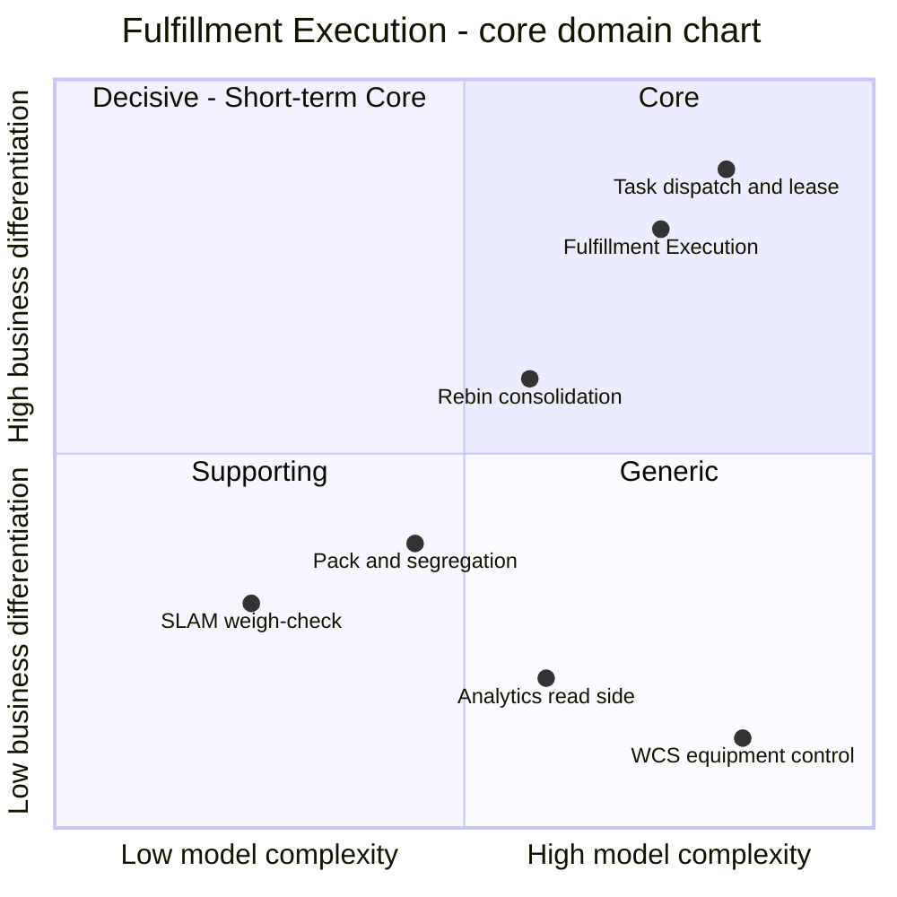

# Core domain chart

:::info[Synced from fulfillment-execution]
This page is a copy of [`docs/docs/ddd/core-domain-chart.md`](https://github.com/IQVO/fulfillment-execution/blob/develop/docs/docs/ddd/core-domain-chart.md) on `develop`, derived from that repository's code. Edit it there, then re-sync.
:::

The [ddd-crew Core Domain Chart](https://github.com/ddd-crew/core-domain-charts)
plots a subdomain on two axes: **business differentiation** (how much
competitive advantage it gives) and **model complexity** (how much domain
logic it carries). Top-right is **Core**; top-left is **Decisive /
short-term Core** (differentiating but simple, often a quick win that
erodes); bottom-left is **Supporting** (simple and undifferentiated — build
it cheaply); bottom-right is **Generic** (complex but solved elsewhere — buy
or reuse it). The classification here must agree with
[Subdomain classification](https://github.com/IQVO/fulfillment-execution/blob/develop/docs/docs/ddd/subdomain-classification.md): Fulfillment
Execution as a whole is **Core**. The chart also plots its internal slices,
because the subdomain classification page classifies the slices separately
(Picking is Core; Packing and SLAM are Supporting), and the neighbours it
depends on, for contrast.

Source: `docs/docs/ddd/subdomain-classification.md`,
`internal/domain/task/task.go`, `internal/domain/package/package.go`,
`internal/domain/package/segregation.go`,
`internal/domain/consolidation/order_consolidation.go`,
`internal/analytics/`, `internal/application/ports/equipment.go`.
Positions are a judgement, not a measurement; the evidence for each is
below. Omits the upstream and downstream bounded contexts (each charts
itself in its own repository).

## Why it sits where it does

| Item | Quadrant | Evidence |
| --- | --- | --- |
| **Fulfillment Execution** (the context) | **Core** | Classified Core on [Subdomain classification](https://github.com/IQVO/fulfillment-execution/blob/develop/docs/docs/ddd/subdomain-classification.md): the WES tier is Core when operational efficiency is the differentiator and this platform builds its own execution layer; Picking is Core outright. Four aggregate roots (`Task`, `Station`, `Package`, `OrderConsolidation`) enforcing 17 numbered invariants, each with a failing-path test ([Aggregates & invariants](https://github.com/IQVO/fulfillment-execution/blob/develop/docs/docs/ddd/aggregates-and-invariants.md)); 115 domain unit tests; 10 Gherkin feature files; arch-go fitness tests; mutation testing on `./internal/domain/task`. |
| Task dispatch and lease | Core, top-right | The differentiating policy: pull-based `claimNext` with CPT ordering ([ADR-0002](https://github.com/IQVO/fulfillment-execution/blob/develop/docs/docs/adr/0002-pull-based-claimnext-dispatch.md)), at-most-once leases ([ADR-0003](https://github.com/IQVO/fulfillment-execution/blob/develop/docs/docs/adr/0003-lease-based-at-most-once-claiming.md)), a compare-and-set claim save ([ADR-0034](https://github.com/IQVO/fulfillment-execution/blob/develop/docs/docs/adr/0034-concurrency-control-for-consolidation-and-claim.md)). Six task invariants (T1–T6) and the largest test file (`task_test.go`, 41 tests). |
| Rebin consolidation | Core, lower | Fan-in of an order's lines before Pack ([ADR-0016](https://github.com/IQVO/fulfillment-execution/blob/develop/docs/docs/adr/0016-rebin-and-order-consolidation.md)). Small model (2 invariants) but on the throughput path, and it needs per-order serialization (advisory lock + `FOR UPDATE`). |
| Pack and segregation | Supporting | Packing is Supporting per the reference model. The model is not trivial — live DOT hazard lookups and a 49 CFR §177.848-derived segregation matrix ([ADR-0010](https://github.com/IQVO/fulfillment-execution/blob/develop/docs/docs/adr/0010-package-segregation-and-sort-lane.md)) — but the rules are industry-standard, not a differentiator. Cartonization is absent on purpose. |
| SLAM weigh-check | Supporting | Reduced to one invariant (`Package.Weigh` within `WeightTolerance = 0.05`); no carrier integration, no manifest generation. |
| Analytics read side | Generic | Throughput and on-time-to-CPT projections (`cmd/fulfillment-projector`, `cmd/fulfillment-reports`, [ADR-0012](https://github.com/IQVO/fulfillment-execution/blob/develop/docs/docs/adr/0012-analytical-data-product.md), [ADR-0026](https://github.com/IQVO/fulfillment-execution/blob/develop/docs/docs/adr/0026-on-time-to-cpt-kpi.md)): counters per hour bucket, no domain rules. The machinery (separate database, idempotent projector, freshness endpoint) is real work, but it is standard analytics plumbing. |
| WCS equipment control | Generic | Real equipment control is complex, but "device-agnostic control is a largely solved integration category." `ports.EquipmentCommandPort` declares no methods and has no adapter ([ADR-0015](https://github.com/IQVO/fulfillment-execution/blob/develop/docs/docs/adr/0015-wcs-equipment-anti-corruption-seam.md)). |

## Evolution

On a Wardley-style evolution axis (genesis → custom-built → product →
commodity):

- **Task dispatch and lease: custom-built.** The behaviour is stable and
  tested, but it is specific to this platform's pull model and is still
  being extended (claim compare-and-set, lease sweep and CPT sweep are recent
  ADRs). Nothing here is bought.
- **Rebin consolidation: custom-built, early.** Added late (ADR-0016), its
  two events are not yet published, and the Pack task is created from
  caller-supplied parameters.
- **Pack segregation and SLAM: moving toward product.** The rules come from
  regulation and standard practice. If the platform ever adopted a vendor
  pack-station or SLAM line, these would be the first slices to give up.
- **Analytics and WCS: product / commodity.** Projections are plain
  counters; equipment control would be bought and integrated behind the
  anti-corruption seam.

The chart therefore predicts what the code already shows: investment
(tests, ADRs, invariants) concentrates on dispatch and lease, and the
Supporting slices stay deliberately thin.
