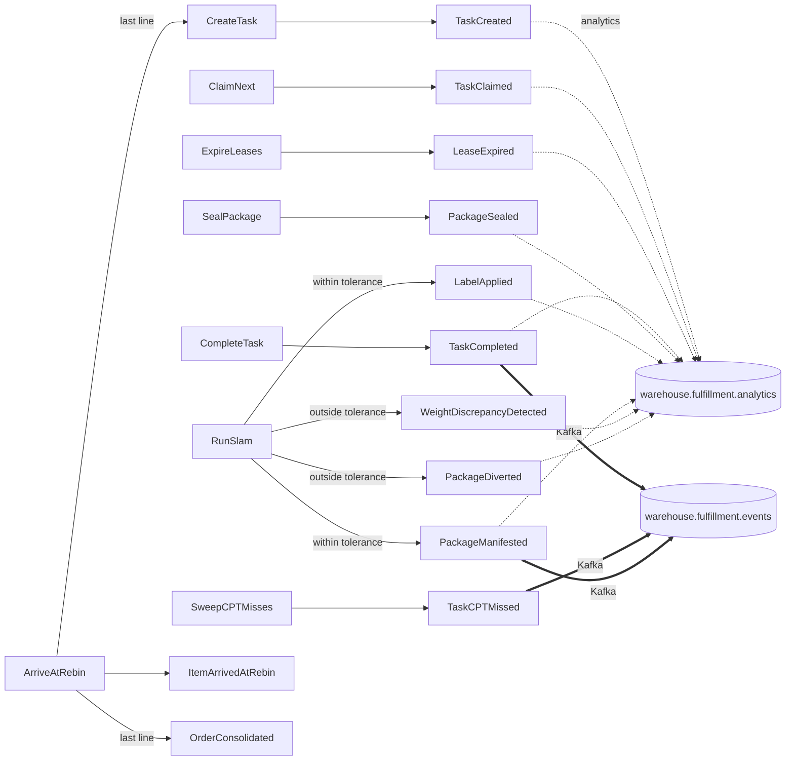

# Domain events

:::info[Synced from fulfillment-execution]
This page is a copy of [`docs/docs/ddd/domain-events.md`](https://github.com/IQVO/fulfillment-execution/blob/develop/docs/docs/ddd/domain-events.md) on `develop`, derived from that repository's code. Edit it there, then re-sync.
:::


Thirteen past-tense facts, all defined in `internal/domain/shared/events.go`.
Every one satisfies the same tiny interface:

```go
type DomainEvent interface {
    EventName() string
    OccurredAt() time.Time
}
```

Events are **deliberately thin** — most carry only the aggregate id.
Enrichment for the wire happens in the outbound adapter, never on the event
itself (see "Why the events stay thin" below).

## How an event leaves the process

A use case hands its events to `ports.EventPublisher`. What happens next is
decided at the composition root (`internal/composition/publisher.go`):

| `EVENT_PUBLISHER` | `DATABASE_URL` | What `Publish` does |
| --- | --- | --- |
| `log` (default) | any | Logs the event to stdout. Nothing reaches Kafka. |
| `kafka` | set | Runs **two encoders** inside the use case's own transaction — the integration encoder (`internal/adapters/outbound/kafka/publisher.go`) and the analytics encoder (`analytics_publisher.go`) — and inserts one `outbox_events` row per encoded message. The in-process relay in `cmd/execution` drains the rows onto Kafka in id order ([ADR-0020](https://github.com/IQVO/fulfillment-execution/blob/develop/docs/docs/adr/0020-transactional-outbox.md)). `cmd/mcp` only inserts; it never runs the relay. |
| `kafka` | unset | Same two encoders, written straight to the broker through `events.MultiPublisher` (no transaction to bind them to). |

Each encoder has an **allowlist**. An event outside it is skipped, not
errored — that is how the two Rebin events stay in-process.

## Wire conventions (all published events)

- **Envelope:** CloudEvents 1.0, structured content mode, built only by
  `internal/adapters/kafka/cloudevents` (official `sdk-go/v2/event`); Kafka
  header `content-type: application/cloudevents+json; charset=UTF-8`
  ([ADR-0032](https://github.com/IQVO/fulfillment-execution/blob/develop/docs/docs/adr/0032-cloudevents-mandatory-envelope.md)).
- **`type`:** `com.warehouse.wes.fulfillment-execution.<entity>.<EventName>`,
  where `entity` is `task` or `package` (the raising aggregate).
- **`source`:** `/warehouse/fulfillment-execution`.
- **`dataschema`:** `urn:warehouse:fulfillment-execution:events:<EventName>:v1`
  on the integration topic, `urn:warehouse:fulfillment-execution:analytics:<EventName>:v1`
  on the analytics topic.
- **Partition key = `subject` = the raising aggregate's id** (task id or
  package id), written with the `kafkago.Hash` balancer, so every event of
  one aggregate lands on one partition, in order
  ([ADR-0035](https://github.com/IQVO/fulfillment-execution/blob/develop/docs/docs/adr/0035-kafka-hash-partition-key.md)).
- **`id`:** UUID v4 minted once in `Encode` and persisted in the outbox row,
  so a relay retry republishes the same `id` (the consumer dedupe key).

## The catalogue

| Event | Full CloudEvents `type` | Raised by (use case) | Domain payload | `warehouse.fulfillment.events` (integration) `data` | `warehouse.fulfillment.analytics` `data` |
| --- | --- | --- | --- | --- | --- |
| `TaskCreated` | `com.warehouse.wes.fulfillment-execution.task.TaskCreated` | `CreateTask` (REST `POST /tasks`, the `WorkReleased` consumer, and `ArriveAtRebin` on consolidation) | `TaskId` | — | `task_id`, `task_type` |
| `TaskClaimed` | `com.warehouse.wes.fulfillment-execution.task.TaskClaimed` | `ClaimNext` | `TaskId`, `StationId` | — | `task_id`, `task_type`, `station_id` |
| `LeaseExpired` | `com.warehouse.wes.fulfillment-execution.task.LeaseExpired` | `ExpireLeases` | `TaskId` | — | `task_id`, `task_type` |
| `TaskCompleted` | `com.warehouse.wes.fulfillment-execution.task.TaskCompleted` | `CompleteTask` (REST and MCP `complete_task`) | `TaskId`, `StationId` | `task_id`, `station_id`, `work_unit_id`, `associate_id`?, `duration_seconds`?, `task_type`?, `order_ref`? ([ADR-0040](https://github.com/IQVO/fulfillment-execution/blob/develop/docs/docs/adr/0040-task-completed-carries-order-ref.md)) | `task_id`, `task_type`, `station_id`, `order_ref`? |
| `TaskCPTMissed` | `com.warehouse.wes.fulfillment-execution.task.TaskCPTMissed` | `SweepCPTMisses` | `TaskId`, `OrderRef`, `TaskType`, `CPT` | `task_id`, `order_ref`, `task_type`?, `cpt` | — |
| `ItemPicked` | `com.warehouse.wes.fulfillment-execution.task.ItemPicked` | *(no use case raises it today)* | `TaskId` | — | `task_id`, `task_type` (encoder exists, never fed) |
| `PackageSealed` | `com.warehouse.wes.fulfillment-execution.package.PackageSealed` | `SealPackage` | `PackageId` | — | `package_id` |
| `WeightDiscrepancyDetected` | `com.warehouse.wes.fulfillment-execution.package.WeightDiscrepancyDetected` | `RunSlam` (outside tolerance) | `PackageId`, `ExpectedWeight`, `ActualWeight` | — | `package_id`, `expected_g`, `actual_g` |
| `PackageDiverted` | `com.warehouse.wes.fulfillment-execution.package.PackageDiverted` | `RunSlam` (outside tolerance) | `PackageId` | — | `package_id` |
| `LabelApplied` | `com.warehouse.wes.fulfillment-execution.package.LabelApplied` | `RunSlam` (within tolerance) | `PackageId` | — | `package_id` |
| `PackageManifested` | `com.warehouse.wes.fulfillment-execution.package.PackageManifested` | `RunSlam` (within tolerance, alongside `LabelApplied`) | `PackageId`, `OrderRef` | `package_id`, `order_ref` | `package_id`, `order_ref`, `task_type`, `station_id`, `on_time`, `resolved` |
| `TransferPicked` | `com.warehouse.wes.fulfillment-execution.transfer.TransferPicked` | `CompleteTask` (task with a TRANSFER_PICK correlation block) | `TaskId`, correlation block | `transfer_ref`, `demand_id`?, `work_unit_id`, `task_id`, `work_kind`, `site_id`?, `sku`?, `quantity`? | `task_id` |
| `TransferDispatched` | `com.warehouse.wes.fulfillment-execution.transfer.TransferDispatched` | `CompleteTask` (TRANSFER_DISPATCH) | `TaskId`, correlation block | same shape as `TransferPicked` | `task_id` |
| `TransferArrived` | `com.warehouse.wes.fulfillment-execution.transfer.TransferArrived` | `CompleteTask` (TRANSFER_ARRIVAL) | `TaskId`, correlation block | same shape as `TransferPicked` | `task_id` |
| `ItemArrivedAtRebin` | *(none — never encoded)* | `ArriveAtRebin` | `OrderRef`, `LineId` | — | — |
| `OrderConsolidated` | *(none — never encoded)* | `ArriveAtRebin` (completing arrival) | `OrderRef` | — | — |

`?` marks a field tagged `omitempty` — omitted when the value is unavailable
(no occupant checked in, no recorded claim, task no longer found). The
partition key is the task id for every `task.*` row and the package id for
every `package.*` row.

Source: `internal/domain/shared/events.go`,
`internal/adapters/outbound/kafka/publisher.go` (`inIntegrationContract`,
`TaskCompletedData`, `TaskCPTMissedData`, `PackageManifestedData`),
`internal/adapters/outbound/kafka/analytics_publisher.go`
(`inAnalyticsContract`, `marshalData`), `apis/asyncapi.yaml`.

:::caution[Published is not the same as defined]
Only **`TaskCompleted`, `TaskCPTMissed` and `PackageManifested`** form the
integration contract. Ten events go to the analytics topic (everything but
`TaskCPTMissed` and the two Rebin events). `ItemArrivedAtRebin` and
`OrderConsolidated` (ADR-0016) are in neither allowlist and are not in
`apis/asyncapi.yaml`; if they are ever published their entity would be
`orderconsolidation`.

`ItemPicked` is defined, tested and has an analytics encoder, but no use
case raises it. The Pick path is modelled at task granularity (claim →
complete) rather than item granularity; the event stays in the catalogue
because it is part of the intended model.
:::

## Who consumes what

| Topic | `type` | Consumer | Effect |
| --- | --- | --- | --- |
| `warehouse.fulfillment.events` | `com.warehouse.wes.fulfillment-execution.task.TaskCompleted` | `wes-work-planning` | `RecordCompletion(work_unit_id)` — the drum-buffer-rope feedback edge |
| `warehouse.fulfillment.events` | `com.warehouse.wes.fulfillment-execution.task.TaskCompleted` | `labor-performance` | Per-associate / per-task-type attribution ([ADR-0014](https://github.com/IQVO/fulfillment-execution/blob/develop/docs/docs/adr/0014-labor-performance-integration-hooks.md), [ADR-0023](https://github.com/IQVO/fulfillment-execution/blob/develop/docs/docs/adr/0023-task-type-on-wire.md)) |
| `warehouse.fulfillment.events` | `com.warehouse.wes.fulfillment-execution.task.TaskCPTMissed`, `com.warehouse.wes.fulfillment-execution.package.PackageManifested` | `order-management` | `RepromiseOrder` promise feedback loop ([ADR-0025](https://github.com/IQVO/fulfillment-execution/blob/develop/docs/docs/adr/0025-cpt-missed-sweep-and-package-manifested.md)) |
| `warehouse.fulfillment.events` | `...transfer.TransferPicked`, `...transfer.TransferDispatched`, `...transfer.TransferArrived` | `network-inventory-planning` (transfer saga), destination receipt/stow | Transfer custody facts, one per completed transfer task, selected by `work_kind` ([ADR-0036](https://github.com/IQVO/fulfillment-execution/blob/develop/docs/docs/adr/0036-transfer-task-types-and-facts.md)) |
| `warehouse.fulfillment.analytics` | `...task.TaskClaimed`, `...task.TaskCompleted`, `...task.LeaseExpired`, `...package.WeightDiscrepancyDetected`, `...package.PackageManifested` | this service's `cmd/fulfillment-projector`, group `fulfillment-analytics` | Projects the throughput rollup ([Throughput report](https://github.com/IQVO/fulfillment-execution/blob/develop/docs/docs/analytics/throughput-report.md)); every other analytics type is acknowledged without projecting |

The downstream consumers are the ones listed in `apis/asyncapi.yaml`; their
consumer-group ids live in their own repositories.

## Events consumed from other contexts

| Source | Topic | Full `type` | Consumer | Group | Effect |
| --- | --- | --- | --- | --- | --- |
| `wes-work-planning` | `warehouse.work-planning.events` | `com.warehouse.wes.work-planning.workunit.WorkReleased` | `internal/adapters/inbound/kafka/consumer.go` | `WORK_RELEASED_CONSUMER_GROUP` (default `fulfillment-execution`) | `CreateTask` — idempotent on the CloudEvents `id` via `processed_events`; a failure after 3 attempts (or any non-CloudEvent) is dead-lettered to `warehouse.work-planning.events.dlq` when `EVENT_PUBLISHER=kafka` wires the DLQ writer |
| `process-path-management` | `warehouse.process-path-management.events` | `com.warehouse.wes.process-path-management.processpath.ProcessPathCreated` / `ProcessPathUpdated` / `ProcessPathDeactivated` | `internal/adapters/outbound/kafkacatalog/consumer.go` | unique per process (`fulfillment-execution-process-path-catalogue-` + host, pid, start time), replays from the first offset | Rebuilds the in-memory process-path catalogue — **only when `PATH_CATALOGUE_SOURCE=kafka`** |

## Which use case raises what



Source: `internal/application/usecases/*.go` and the two encoders'
allowlists. Omits `ItemPicked` (never raised) and the log publisher.

`RegisterStation`, `CheckInStation`, `CheckOutStation`, `RenewLease` and the
five reads (`GetQueueDepth`, `GetTasksByOrderRef`, `GetInstalledCapacity`,
`GetPackage`, `GetPackagesByOrderRef`) raise **nothing**. Registering or
staffing a station is an operational action with no existing fact that fits
it, and the deliberate choice was not to invent events just for symmetry.
`RenewLease` changes only the lease expiry.

## The calls with two facts

`RunSlam` publishes **two** events on each branch, in a single call:

```go
// outside tolerance
uc.Publisher.Publish(ctx,
    shared.NewWeightDiscrepancyDetected(packageId, expectedWeight, actualWeight, now),
    shared.NewPackageDiverted(packageId, now),
)
// within tolerance
uc.Publisher.Publish(ctx,
    shared.NewLabelApplied(packageId, now),
    shared.NewPackageManifested(packageId, p.OrderRef(), now),
)
```

They are separate on purpose. `WeightDiscrepancyDetected` is the
**measurement** — it carries both weights and is what a quality or
loss-prevention consumer wants. `PackageDiverted` is the **routing
decision**. On the pass branch, `LabelApplied` is the local fact and
`PackageManifested` is the promise-loop fact `order-management` keys on.

Note the argument order: the event is constructed as
`(packageId, expected, actual, now)` while the use case's own signature is
`Execute(ctx, packageId, actualWeight, expectedWeight)`. The API request body
names both fields explicitly (`actualWeight`, `expectedWeight`) so callers
are never relying on positional order.

## `TaskCPTMissed` re-fires

`SweepCPTMisses` changes no task state, so a task that stays open past its
CPT raises `TaskCPTMissed` again on every sweep pass — each a new occurrence
with a new `id`. A consumer must be idempotent on its own business key
(order-management's `RepromiseOrder` is designed for exactly that, per
ADR-0025).

## Why the events stay thin

`TaskCompleted` carries only `TaskId` and `StationId`. The wire format needs
`work_unit_id` so Work Planning can correlate the completion back to the
unit it released, plus `associate_id`, `duration_seconds` and `task_type`
for labor-performance.

None of those are added to the domain event. The integration encoder looks
the task back up through `ports.TaskRepo` (`OrderRef()`, `ClaimedAt()`,
`Type()`) and the station through `ports.StationRepo` (current occupant):

```go
t, err := p.Tasks.FindById(ctx, tc.TaskId)
...
data := TaskCompletedData{
    TaskId:     string(tc.TaskId),
    StationId:  string(tc.StationId),
    WorkUnitId: workUnitId, // enriched here, in the adapter
    ...
}
```

`work_unit_id` is an *integration* concern — it exists because a particular
downstream consumer needs a particular correlation key. Pushing it into the
domain event would make the domain model shaped by a consumer's needs. The
analytics encoder applies the same pattern for `task_type` and for the
on-time-to-CPT verdict on `PackageManifested`
([ADR-0026](https://github.com/IQVO/fulfillment-execution/blob/develop/docs/docs/adr/0026-on-time-to-cpt-kpi.md)).

`associate_id` reflects whoever is checked in **at publish time**, not
necessarily whoever performed the whole task — a best-effort fact.

## Handling flags did not extend any event payload

The same discipline applied when `Task.Fragile`, `Task.GiftWrap`,
`Package.FragileHandling`, `Package.GiftWrapRequested` and
`Package.SortLane()` were added: `TaskCreated` still carries only `TaskId`,
and `PackageSealed` only `PackageId`. The flags are visible on the REST
responses (`TaskResponse.fragile` / `giftWrap`, `PackageResponse.fragileHandling`
/ `giftWrapRequested` / `sortLane`), which is where anything needing them
reads them today. `SortLane` is a WES-tier decision only — no WCS
integration exists to consume it
([ADR-0010](https://github.com/IQVO/fulfillment-execution/blob/develop/docs/docs/adr/0010-package-segregation-and-sort-lane.md)).

See the [Events reference](https://github.com/IQVO/fulfillment-execution/blob/develop/docs/docs/api-reference/events.md) for envelope examples
and the [Domain Message Flow](/contexts/fulfillment-execution/domain-message-flow) page for the events
in end-to-end scenarios.
