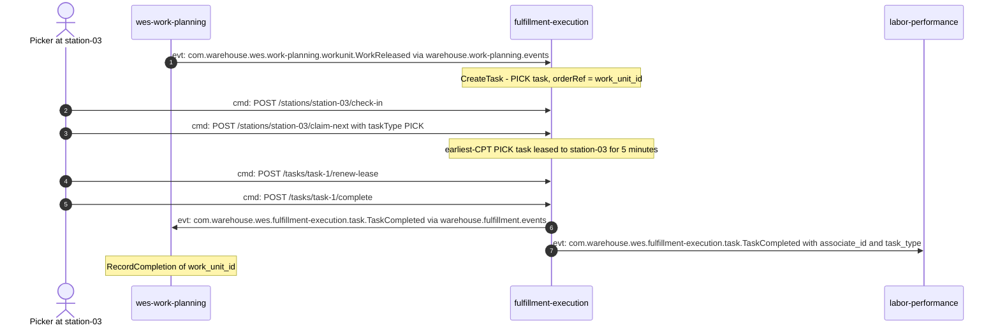
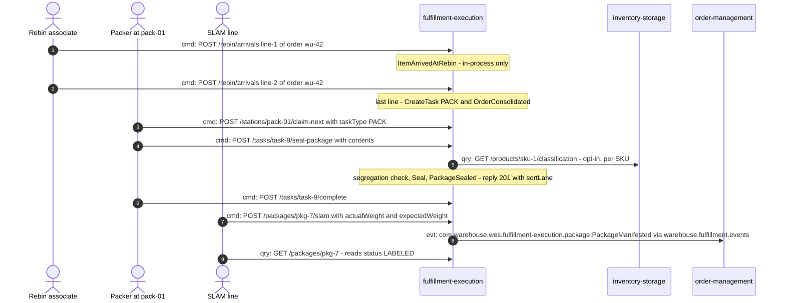
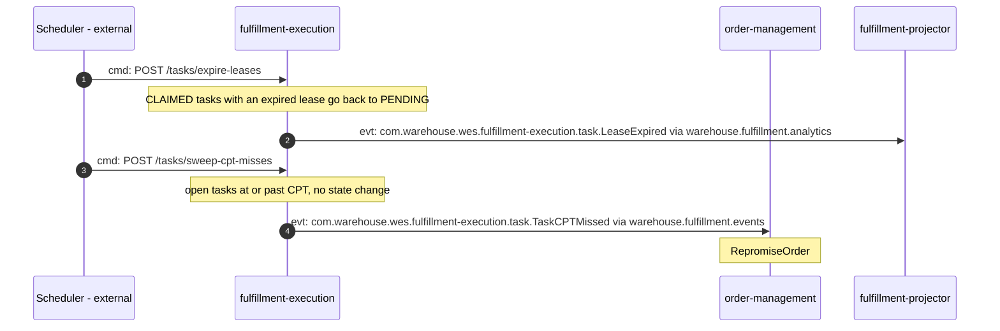
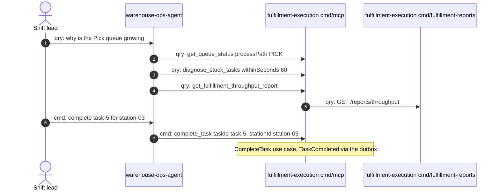

# Domain message flow

:::info[Synced from fulfillment-execution]
This page is a copy of [`docs/docs/ddd/domain-message-flow.md`](https://github.com/IQVO/fulfillment-execution/blob/develop/docs/docs/ddd/domain-message-flow.md) on `develop`, derived from that repository's code. Edit it there, then re-sync.
:::

[ddd-crew Domain Message Flow Modelling](https://github.com/ddd-crew/domain-message-flow-modelling)
shows how a business scenario moves between actors and bounded contexts.
Every arrow is prefixed **`cmd:`** (command — asks for a change),
**`evt:`** (event — states a fact) or **`qry:`** (query — asks for data),
and numbered. Replies are left out (they are implied by a `qry:` or a
synchronous `cmd:`); notes say what the receiving context decides. Only
real messages appear: a REST route from
`internal/adapters/inbound/http/router.go`, an MCP tool from
`internal/adapters/inbound/mcp/`, or a CloudEvents type from the consumers
and publishers. Kafka hops are drawn directly between contexts; the topic
is named in the message.

## Scenario 1 — single-line order: release to completion

A work unit is released, a Pick station pulls it, completes it, and
planning and labour learn that it landed.

Source: `internal/adapters/inbound/kafka/consumer.go`,
`internal/adapters/inbound/http/router.go`,
`internal/application/usecases/claim_next.go`, `complete_task.go`,
`internal/adapters/outbound/kafka/publisher.go`. Omits the analytics topic,
the outbox relay hop, and the optional lease renewal loop (shown once).

## Scenario 2 — multi-line order: Rebin, Pack and SLAM

Each picked line reaches Rebin; the last one creates the PACK task; the
packer seals the carton; the SLAM line weighs it and manifests it to order
management.

Source: `internal/application/usecases/arrive_at_rebin.go`, `seal_package.go`,
`run_slam.go`, `get_package.go`,
`internal/adapters/outbound/productclassification/client.go`,
`internal/adapters/outbound/kafka/publisher.go`. Omits the divert branch
(outside tolerance the package becomes `DIVERTED`, raising
`WeightDiscrepancyDetected` and `PackageDiverted` on the analytics topic
only, and nothing reaches order-management), the `TaskCompleted` fan-out
already shown in scenario 1, and the Pick tasks that produced the lines.

## Scenario 3 — the sweeps: a lapsed lease and a missed CPT

An external scheduler drives both sweeps; nothing in this repository runs
them on a timer.

Source: `internal/application/usecases/expire_leases.go`,
`sweep_cpt_misses.go`, `internal/adapters/outbound/kafka/publisher.go`,
`analytics_publisher.go`, `internal/analytics/`. Omits that the same
overdue task is reported again on every later sweep.

## Scenario 4 — an operator agent triages a backlog over MCP

Source: `internal/adapters/inbound/mcp/tools.go`, `report_tool.go`,
`cmd/mcp/main.go`, `internal/adapters/inbound/http/reports_handler.go`.
Omits the `triage_backlog` prompt and `queue://fulfillment/...` resources
(alternative ways to reach the same reads), and the report tools' absence
when `REPORTS_BASE_URL` is unset.
