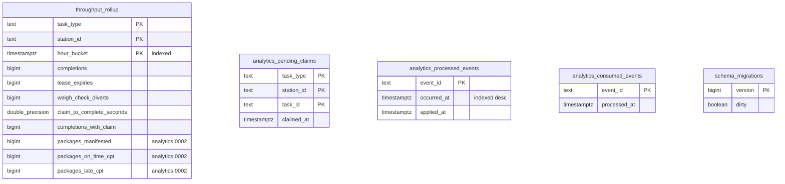

# Entity-relationship diagram

:::info[Synced from fulfillment-execution]
This page is a copy of [`docs/docs/ddd/entity-relationship.md`](https://github.com/IQVO/fulfillment-execution/blob/develop/docs/docs/ddd/entity-relationship.md) on `develop`, derived from that repository's code. Edit it there, then re-sync.
:::

Two separate PostgreSQL databases, each migrated by golang-migrate at
startup:

- **OLTP** (`DATABASE_URL`, migrated over `MIGRATIONS_DATABASE_URL` when
  set — [ADR-0031](https://github.com/IQVO/fulfillment-execution/blob/develop/docs/docs/adr/0031-migrations-direct-postgres-connection.md))
  — `migrations/0001` to `0013`, applied by `cmd/execution`.
- **Analytics** (`ANALYTICS_DATABASE_URL`) — `migrations/analytics/0001`
  and `0002`, applied by `cmd/fulfillment-projector` and read by
  `cmd/fulfillment-reports` ([ADR-0012](https://github.com/IQVO/fulfillment-execution/blob/develop/docs/docs/adr/0012-analytical-data-product.md)).

Without `DATABASE_URL`, `cmd/execution` runs on the in-memory adapters and
none of this exists.

**There is not a single `FOREIGN KEY` in either schema**, so the diagrams
draw no relationship lines. The logical links are explained below the
diagrams — each one crosses an aggregate boundary, which is exactly why it
is held by id and not by a constraint.

## OLTP schema (`tasks` after 0017; other tables as of 0014)

```mermaid
erDiagram
    tasks {
        text id PK
        text task_type "PICK, PACK, SLAM, REBIN, DISPATCH, ARRIVAL"
        text status "PENDING, CLAIMED, COMPLETED"
        timestamptz cpt
        text order_ref "indexed"
        text_array required_capabilities
        text lease_station_id "nullable"
        timestamptz lease_expiry "nullable"
        boolean fragile "0003"
        boolean gift_wrap "0005"
        timestamptz claimed_at "0007, nullable"
        text transfer_ref "0014, nullable - present means transfer work"
        text demand_id "0014, nullable"
        text work_kind "0014, nullable - TRANSFER_PICK|TRANSFER_DISPATCH|TRANSFER_ARRIVAL"
        text site_id "0014, nullable"
        text sku "0014, nullable"
        integer quantity "0014, nullable"
        text source_order_id "0016, nullable - order id from WorkReleased.ref, order work only"
        integer source_line_no "0017, nullable - order line from WorkReleased.line_no, order work only"
    }
    stations {
        text id PK
        text_array capabilities
        text occupant "nullable"
        text location_code "0010, nullable"
    }
    packages {
        text id PK
        text order_ref "indexed, 0013"
        text status "OPEN, SEALED, LABELED, DIVERTED"
        text_array scanned_contents
        boolean fragile_handling "0003"
        integer_array scanned_hazard_classes "0004"
        boolean gift_wrap_requested "0005"
        text task_id UK "0011, partial unique where not null"
    }
    order_consolidations {
        text order_ref PK
        text_array required_lines
        text_array arrived_lines
    }
    outbox_events {
        bigserial id PK
        text topic
        text event_type
        bytea key
        bytea value
        jsonb headers
        timestamptz created_at
        timestamptz published_at "nullable, partial index where null"
        integer attempts
        text last_error
    }
    processed_events {
        text event_id PK "CloudEvents id"
        timestamptz processed_at
    }
    idempotency_keys {
        text key PK
        text method
        text path
        text request_hash
        integer status_code
        bytea response_body
        jsonb response_headers
        timestamptz created_at "indexed"
        timestamptz completed_at
    }
    domain_events {
        bigserial id PK
        text event_name
        timestamptz occurred_at
        jsonb payload
    }
    schema_migrations {
        bigint version PK
        boolean dirty
    }
```

Source: `migrations/0001_init.up.sql` to `migrations/0013_package_order_ref_index.up.sql`,
plus `0016_task_source_order_id` and `0017_task_source_line_no` for the two
`tasks` columns above (`0015`'s product-classification copy table is not drawn)
applied in order; `schema_migrations` is golang-migrate's own table
(`internal/adapters/outbound/postgres/migrate.go`). Array columns are shown
as `text_array` / `integer_array` (Postgres `TEXT[]` / `INTEGER[]`).
Omits indexes other than the ones noted (`idx_tasks_type_status_cpt` on
`task_type, status, cpt` drives `FindClaimableByType`) and column defaults.

## Analytics schema (final, after analytics 0002)

Source: `migrations/analytics/0001_report.up.sql`,
`migrations/analytics/0002_on_time_to_cpt.up.sql`,
`internal/adapters/outbound/analyticsstore/*.go`. Omits column defaults.

## Logical links without a foreign key

| From | To | Why there is no FK |
| --- | --- | --- |
| `packages.task_id` | `tasks.id` | `Package` and `Task` are separate aggregates; `SealPackage` checks the task in the application layer. The partial unique index enforces one package per PACK task. |
| `tasks.lease_station_id` | `stations.id` | The lease names its owner by id; a station can be re-registered without touching tasks. |
| `tasks.order_ref`, `packages.order_ref`, `order_consolidations.order_ref` | upstream `work_unit_id` | Not a table here at all — an opaque id from `wes-work-planning`. |
| `throughput_rollup`, `analytics_pending_claims` | `tasks`, `stations` | Different database; built only from events. |

## Table ≠ aggregate

| Table | Aggregate / role | Kind |
| --- | --- | --- |
| `tasks` | `task.Task` (the `Lease` value object is flattened into `lease_station_id` + `lease_expiry`) | aggregate |
| `stations` | `station.Station` | aggregate |
| `packages` | `pack.Package` | aggregate |
| `order_consolidations` | `consolidation.OrderConsolidation` | aggregate |
| `outbox_events` | transactional outbox, drained by the relay in `cmd/execution` ([ADR-0020](https://github.com/IQVO/fulfillment-execution/blob/develop/docs/docs/adr/0020-transactional-outbox.md)) | infrastructure |
| `processed_events` | inbox dedupe for the `WorkReleased` consumer (`ports.ProcessedEvents`) | infrastructure |
| `idempotency_keys` | `Idempotency-Key` replay store for `POST /tasks` ([ADR-0028](https://github.com/IQVO/fulfillment-execution/blob/develop/docs/docs/adr/0028-idempotency-key-middleware.md)) | infrastructure |
| `domain_events` | created by `0001_init`; **Decided 2026-10-06: KEEP — legacy, unused; retained (additive migrations only).** Not read or written by any code; dropping is destructive and needs explicit approval, dead schema is harmless | legacy infrastructure |
| `schema_migrations` | golang-migrate version table (one per database) | infrastructure |
| `throughput_rollup` | throughput and on-time-to-CPT projection ([ADR-0026](https://github.com/IQVO/fulfillment-execution/blob/develop/docs/docs/adr/0026-on-time-to-cpt-kpi.md)) | analytics projection |
| `analytics_pending_claims` | claim times waiting for a completion | analytics projection state |
| `analytics_processed_events` | projection idempotency and freshness | analytics infrastructure |
| `analytics_consumed_events` | consumer-level dedupe for the analytics consumer | analytics infrastructure |
