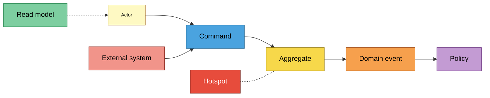
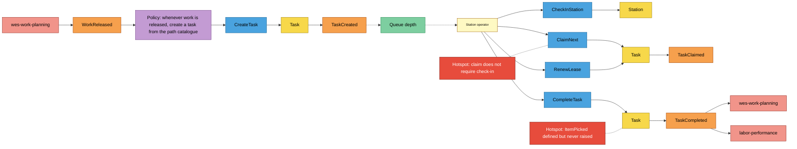
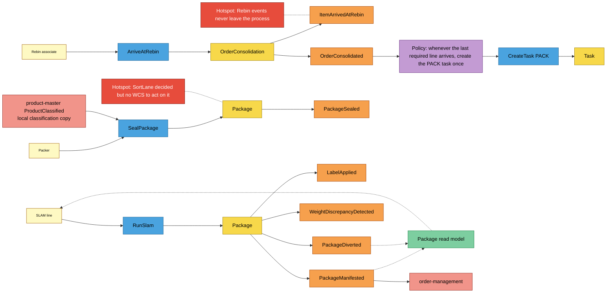
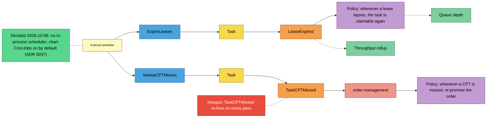

# EventStorming

:::info[Synced from fulfillment-execution]
This page is a copy of [`docs/docs/ddd/eventstorming.md`](https://github.com/IQVO/fulfillment-execution/blob/develop/docs/docs/ddd/eventstorming.md) on `develop`, derived from that repository's code. Edit it there, then re-sync.
:::

Design-level [EventStorming](https://github.com/ddd-crew/eventstorming-glossary-cheat-sheet)
of the three main processes, reconstructed from the code rather than from a
workshop. Read each board left to right: an **actor** issues a
**command**, an **aggregate** decides, a **domain event** records the
fact, a **policy** reacts ("whenever ... then ..."), **read models** inform
the next decision, and **external systems** sit on the edges. **Hotspots**
are real open issues from the ADRs and docs, not invented ones.

## Legend

Source: [ddd-crew EventStorming cheat sheet](https://github.com/ddd-crew/eventstorming-glossary-cheat-sheet)
colours as fixed by the fleet documentation brief.

## Process 1 — release, dispatch and completion

Source: `internal/adapters/inbound/kafka/consumer.go`,
`internal/application/usecases/create_task.go`, `check_in_station.go`,
`claim_next.go`, `renew_lease.go`, `complete_task.go`,
`internal/domain/task/task.go`, `internal/domain/station/station.go`.
Omits `RegisterStation` (setup, no event) and the MCP `complete_task` path
(same command).

## Process 2 — Rebin, Pack and SLAM

Source: `internal/application/usecases/arrive_at_rebin.go`,
`seal_package.go`, `run_slam.go`, `get_package.go`,
`internal/domain/consolidation/order_consolidation.go`,
`internal/domain/package/package.go`. Omits the PACK task's claim and
completion (process 1 applies unchanged) and the policy ordering detail:
in code `CreateTask` runs before `OrderConsolidated` is published, in the
same transaction.

## Process 3 — sweeps

Source: `internal/application/usecases/expire_leases.go`,
`sweep_cpt_misses.go`, `internal/analytics/`,
`internal/adapters/outbound/kafka/publisher.go`. Omits the lazy expiry
inside `Claim` / `RenewLease` / `Complete`, which frees a lapsed lease
without raising `LeaseExpired`. The re-promise policy lives in
`order-management`, not here.

## Sticky inventory

| Sticky | Kind | Code evidence |
| --- | --- | --- |
| Station operator, Packer, Rebin associate, SLAM line | Actor | REST callers of `router.go` |
| External scheduler | Actor | callers of `POST /tasks/expire-leases`, `POST /tasks/sweep-cpt-misses` |
| `CreateTask`, `CheckInStation`, `ClaimNext`, `RenewLease`, `CompleteTask`, `ArriveAtRebin`, `SealPackage`, `RunSlam`, `ExpireLeases`, `SweepCPTMisses` | Command | `internal/application/usecases/*.go` |
| `Task`, `Station`, `Package`, `OrderConsolidation` | Aggregate | `internal/domain/{task,station,package,consolidation}` |
| `WorkReleased` | Domain event (inbound) | `com.warehouse.wes.work-planning.workunit.WorkReleased`, `internal/adapters/inbound/kafka/consumer.go` |
| `TaskCreated`, `TaskClaimed`, `LeaseExpired`, `TaskCompleted`, `TaskCPTMissed`, `PackageSealed`, `LabelApplied`, `PackageManifested`, `WeightDiscrepancyDetected`, `PackageDiverted`, `ItemArrivedAtRebin`, `OrderConsolidated` | Domain event | `internal/domain/shared/events.go` |
| Create a task from the path catalogue | Policy | `consumer.go` → `PathCatalogue.Lookup` → `CreateTask` ([ADR-0017](https://github.com/IQVO/fulfillment-execution/blob/develop/docs/docs/adr/0017-process-path-catalogue-as-configuration.md)) |
| Create the PACK task once | Policy | `arrive_at_rebin.go` (`wasAlreadyComplete`, `IsComplete`) |
| A lapsed lease is claimable again | Policy | `Task.IsAvailable`, `TaskRepo.FindClaimableByType` |
| Re-promise on CPT miss | Policy (downstream) | `order-management`, [ADR-0025](https://github.com/IQVO/fulfillment-execution/blob/develop/docs/docs/adr/0025-cpt-missed-sweep-and-package-manifested.md) |
| Queue depth, Package read model, Throughput rollup | Read model | `get_queue_depth.go`; `get_package.go` ([ADR-0033](https://github.com/IQVO/fulfillment-execution/blob/develop/docs/docs/adr/0033-package-read-model.md)); `throughput_rollup` ([ADR-0012](https://github.com/IQVO/fulfillment-execution/blob/develop/docs/docs/adr/0012-analytical-data-product.md)) |
| `wes-work-planning`, `labor-performance`, `order-management`, `product-master` | External system | `apis/asyncapi.yaml`; `inbound/kafka/product_classified_consumer.go` |
| Claim does not require check-in | Hotspot | [Aggregates & invariants](https://github.com/IQVO/fulfillment-execution/blob/develop/docs/docs/ddd/aggregates-and-invariants.md) "Honest status"; `claim_next.go` never reads occupancy |
| `ItemPicked` never raised | Hotspot | [Domain events](/contexts/fulfillment-execution/domain-events); no caller of `shared.NewItemPicked` outside tests |
| Rebin events never leave the process | Hotspot | not in `inIntegrationContract` / `inAnalyticsContract`, not in `apis/asyncapi.yaml` ([ADR-0016](https://github.com/IQVO/fulfillment-execution/blob/develop/docs/docs/adr/0016-rebin-and-order-consolidation.md)) |
| SortLane with no WCS | Hotspot | `Package.SortLane`; `ports.EquipmentCommandPort` has no methods ([ADR-0010](https://github.com/IQVO/fulfillment-execution/blob/develop/docs/docs/adr/0010-package-segregation-and-sort-lane.md), [ADR-0015](https://github.com/IQVO/fulfillment-execution/blob/develop/docs/docs/adr/0015-wcs-equipment-anti-corruption-seam.md)) |
| Sweeps are not scheduled in-process | Decided 2026-10-06: no in-process scheduler; chart CronJobs on by default — `expire-leases` every minute, `sweep-cpt-misses` every 5 minutes (ADR 0037) | [Task lifecycle](https://github.com/IQVO/fulfillment-execution/blob/develop/docs/docs/overview/task-lifecycle.md); no ticker in `cmd/execution/main.go` (by design, ADR-0003/0025); `charts/fulfillment-execution/templates/sweeps-cronjob.yaml` (`sweeps.enabled`, default on, per-environment schedules) |
| `TaskCPTMissed` re-fires | Hotspot | `sweep_cpt_misses.go` changes no state ([ADR-0025](https://github.com/IQVO/fulfillment-execution/blob/develop/docs/docs/adr/0025-cpt-missed-sweep-and-package-manifested.md)) |
