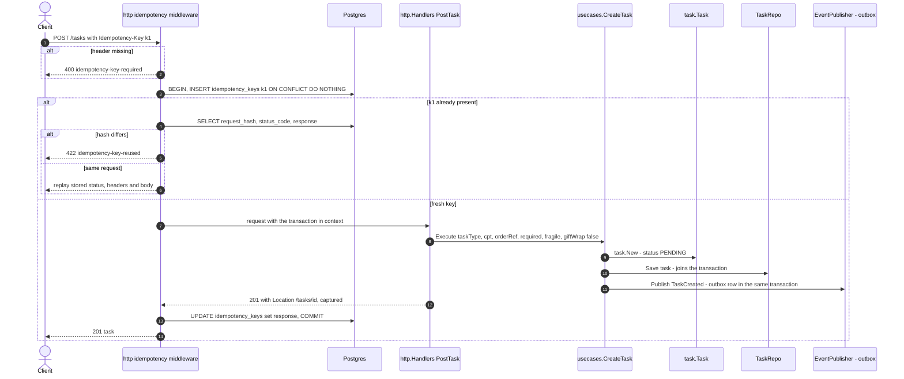
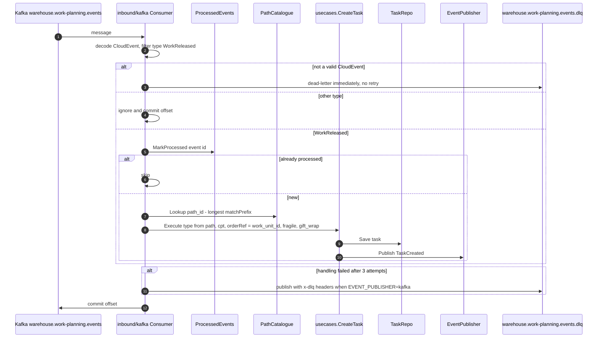
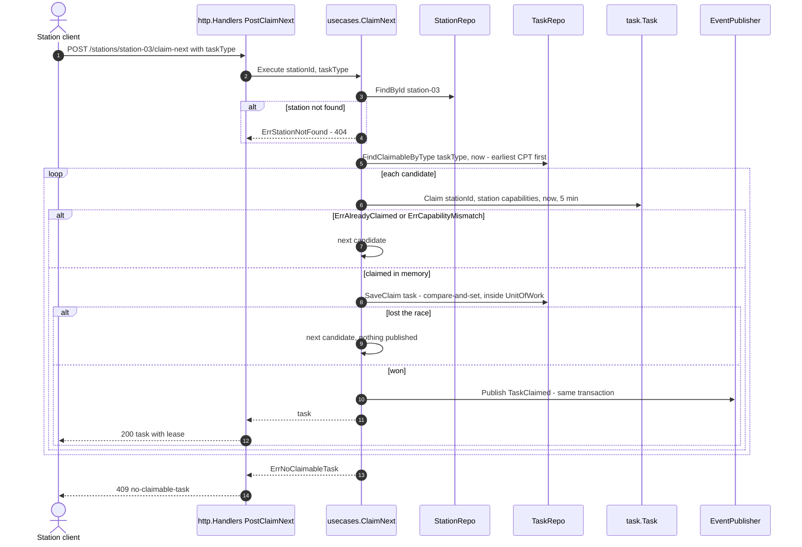
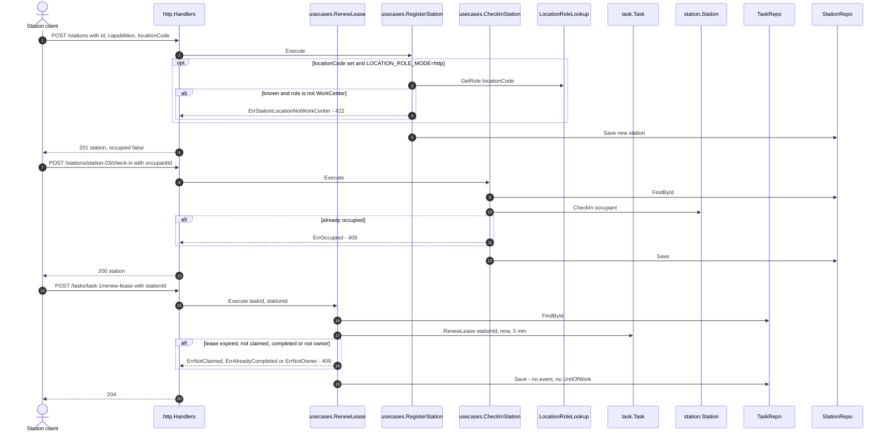
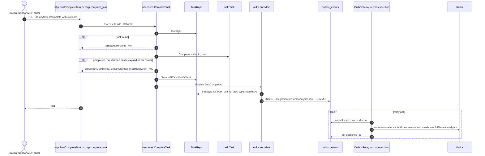
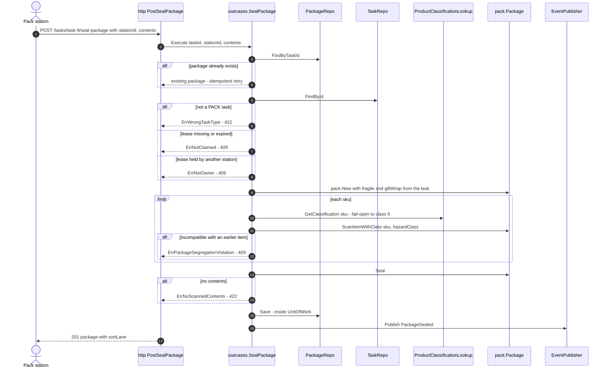
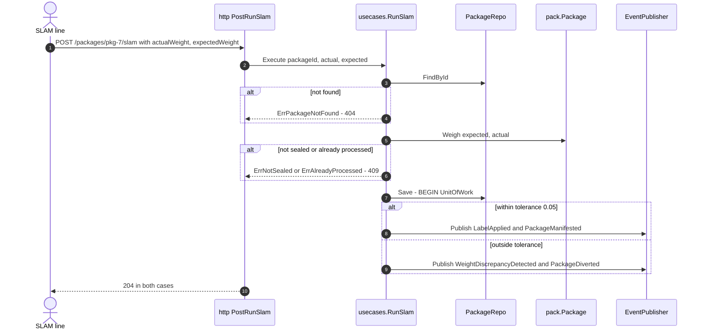
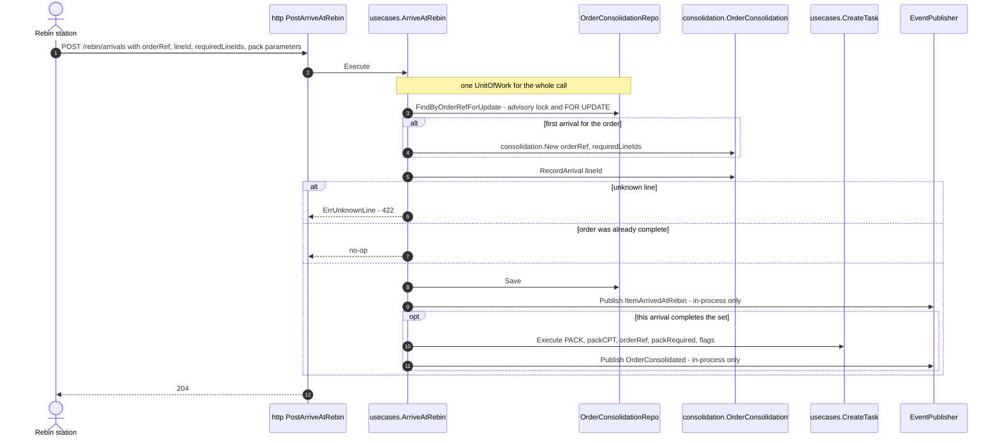
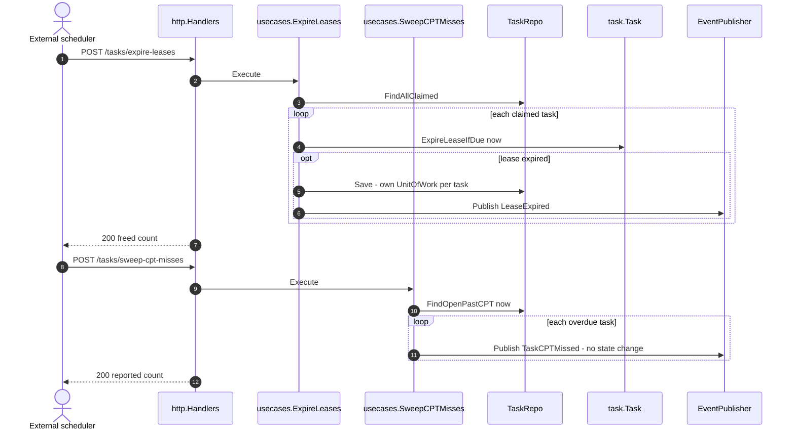

# Sequence diagrams

:::info[Synced from fulfillment-execution]
This page is a copy of [`docs/docs/ddd/sequence-diagrams.md`](https://github.com/IQVO/fulfillment-execution/blob/develop/docs/docs/ddd/sequence-diagrams.md) on `develop`, derived from that repository's code. Edit it there, then re-sync.
:::

One diagram per command use case (grouped where the flow is the same),
drawn from the function bodies in `internal/application/usecases/` and the
adapters that call them. Transaction boundaries are the `atomically(ctx,
UnitOfWork, ...)` blocks: with Postgres they are one database transaction,
and with `EVENT_PUBLISHER=kafka` the publisher writes `outbox_events` rows
inside it. Read-only use cases (`GetQueueDepth`, `GetTasksByOrderRef`,
`GetInstalledCapacity`, `GetPackage`, `GetPackagesByOrderRef`) are a single
repository call and are not drawn.

Common to every REST diagram: a domain or application error is mapped by
`writeError` (`internal/adapters/inbound/http/errors.go`) to an RFC 7807
problem with the status listed on [Aggregates & invariants](https://github.com/IQVO/fulfillment-execution/blob/develop/docs/docs/ddd/aggregates-and-invariants.md).

## 1. Create a task over REST, with the Idempotency-Key middleware

Source: `internal/adapters/inbound/http/idempotency.go`, `handlers.go`
(`PostTask`), `internal/application/usecases/create_task.go`,
`internal/pgtx/`, `internal/adapters/outbound/postgres/outbox_publisher.go`.
Omits the in-memory mode, where the middleware is not wired and the call
goes straight to the handler, and request validation (`400
invalid-request`). REST always passes `giftWrap = false`.

## 2. Create a task from WorkReleased

Source: `internal/adapters/inbound/kafka/consumer.go` (`HandleMessage`,
`handleMessageWithRetry`, `SendToDeadLetter`) and
`internal/application/usecases/consume_work_released.go`
(`ApplyWorkReleased`). Omits backoff timing and the `recover.go` panic
guard. Since ADR-0036 the `MarkProcessed` claim, the catalogue lookup,
the `CreateTask` save and the `TaskCreated` outbox publish all run inside
ONE UnitOfWork — a failed create rolls the claim back with it, so a
redelivery re-applies instead of being lost.

## 3. Claim the next task

Source: `internal/application/usecases/claim_next.go`,
`internal/adapters/outbound/postgres/task_repo.go` (`SaveClaim`),
`internal/domain/task/task.go` (`Claim`). Omits the `Metrics.TaskClaimed`
counter. The compare-and-set writes only while the row is still `PENDING`
or `CLAIMED` with an expired lease ([ADR-0034](https://github.com/IQVO/fulfillment-execution/blob/develop/docs/docs/adr/0034-concurrency-control-for-consolidation-and-claim.md)).

## 4. Renew a lease, and station setup

Source: `internal/application/usecases/register_station.go`,
`check_in_station.go`, `check_out_station.go`, `renew_lease.go`,
`internal/adapters/outbound/facilitylayout/client.go`. Omits check-out
(same shape as check-in, `ErrNotOccupied` on an empty station). None of
these raise a domain event.

## 5. Complete a task — REST or MCP — and the outbox relay

Source: `internal/application/usecases/complete_task.go`,
`internal/adapters/inbound/mcp/tools.go`,
`internal/adapters/outbound/kafka/publisher.go`, `analytics_publisher.go`,
`internal/adapters/outbound/postgres/outbox_publisher.go`, `outbox_relay.go`,
`internal/composition/publisher.go`. Omits the station lookup for
`associate_id`, the `Metrics.TaskCompleted` counter, and the non-Postgres
path where the encoders write to Kafka directly. `cmd/mcp` inserts outbox
rows but never runs the relay.

## 6. Seal a package

Source: `internal/application/usecases/seal_package.go`,
`internal/domain/package/package.go`, `segregation.go`,
`internal/adapters/outbound/productclassification/`. Omits the retry and
circuit breaker around the classification client. The ownership check is
`Task.VerifyHeldBy(stationId, now)`: it requires a lease held by the caller
that has not expired at the `Clock`'s `now` (expiry is inclusive, as in
`Complete`), and it does not free the task, so an expired lease is rejected
with `ErrNotClaimed` (the same error `Complete` and `RenewLease` return for
that condition) even when no sweep has run yet; a missing lease is also
`ErrNotClaimed`, and an active lease held by another station stays
`ErrNotOwner` (decided 2026-10-06,
[ADR-0038](https://github.com/IQVO/fulfillment-execution/blob/develop/docs/docs/adr/0038-seal-package-expired-lease-is-not-claimed.md)).

## 7. Run SLAM

Source: `internal/application/usecases/run_slam.go`,
`internal/domain/package/package.go` (`Weigh`). Omits the follow-up
`GET /packages/pkg-7` a caller uses to learn the outcome
([ADR-0033](https://github.com/IQVO/fulfillment-execution/blob/develop/docs/docs/adr/0033-package-read-model.md)).

## 8. Arrive at Rebin

Source: `internal/application/usecases/arrive_at_rebin.go`,
`internal/adapters/outbound/postgres/order_consolidation_repo.go`,
`internal/domain/consolidation/order_consolidation.go`. Omits `CreateTask`'s
inner save and `TaskCreated` (diagram 1). The requiredLineIds of later
arrivals are ignored: the set is fixed by the first arrival.

## 9. The sweeps

Source: `internal/application/usecases/expire_leases.go`,
`sweep_cpt_misses.go`. Omits the partial-failure branch: on the first
error both sweeps stop and return the count so far.
