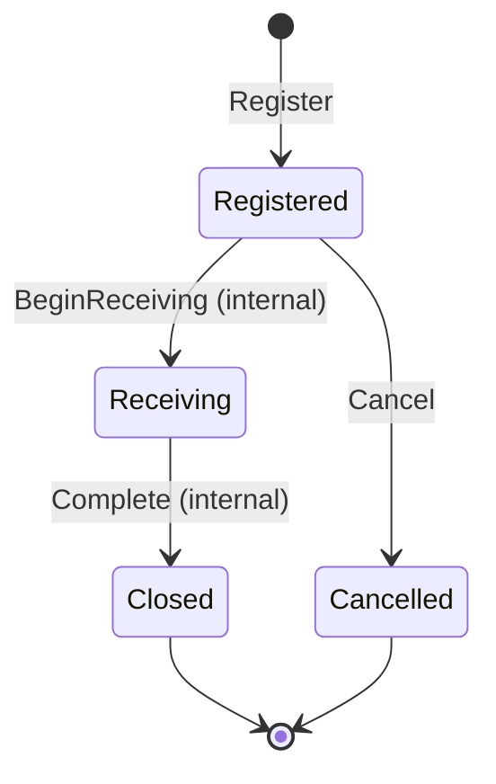
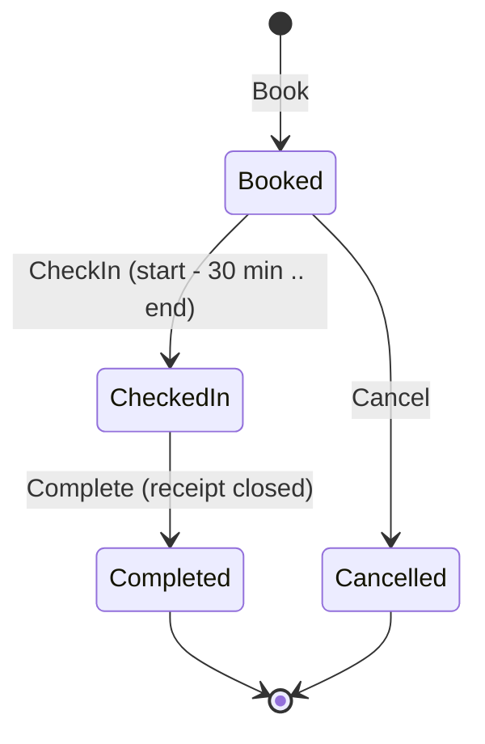
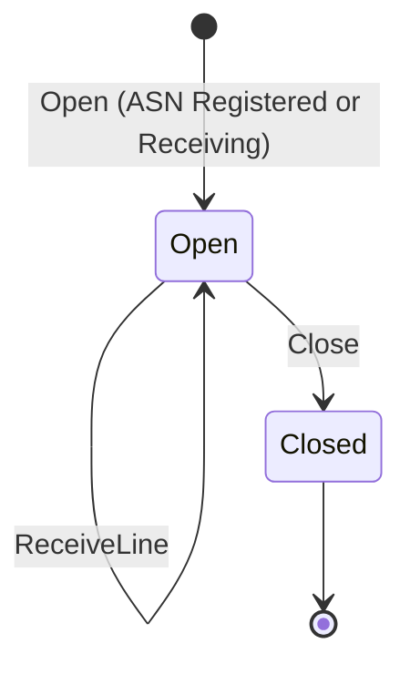

# Aggregate design canvas

:::info[Synced from inbound-receiving]
This page is a copy of [`docs/docs/ddd/aggregate-design-canvas.md`](https://github.com/IQVO/inbound-receiving/blob/develop/docs/docs/ddd/aggregate-design-canvas.md) on `develop`, derived from that repository's code. Edit it there, then re-sync.
:::

Following the ddd-crew [Aggregate Design Canvas v1.1](https://github.com/ddd-crew/aggregate-design-canvas),
one canvas per aggregate root. Sections 8 (throughput) and 9 (size) are
**estimates**, labelled as such: nothing in the repository measures them.

Source: `internal/domain/{asn,appointment,receipt}/*.go`,
`internal/application/usecases/*.go`, ADR 0002.

## Asn

### 1. Name

`Asn` (package `internal/domain/asn`), identity `Number`.

### 2. Description

The supplier's advance ship notice: which SKUs in which expected quantities are
about to arrive. The consistency boundary for its own lines and its own
lifecycle; the physical receiving belongs to `Receipt`, which only holds a
snapshot.

### 3. State transitions

Source: `State` constants and `Cancel`, `BeginReceiving`, `Complete` in
`internal/domain/asn/asn.go`. Omits: the events (section 7).

### 4. Enforced invariants

| Invariant | Enforced by |
| --- | --- |
| Number is 1..64 characters of `[A-Za-z0-9._-]` | `NewNumber`, `ErrInvalidNumber` |
| Supplier reference non-blank, at most 64 characters, no control characters | `validateSupplierRef`, `ErrInvalidSupplierRef` |
| At least one line | `buildLines`, `ErrNoLines` |
| Line numbers exactly `1..n` in order | `buildLines`, `ErrInvalidLineNo` |
| SKUs unique across lines | `buildLines`, `ErrDuplicateSKU` |
| Each SKU valid; each `expectedQty` 1..2147483647 | `shared.NewSKU`, `shared.ValidateQuantity` |
| Only a `Registered` ASN can be cancelled | `Cancel`: `ErrAsnInProgress` from `Receiving`, `ErrAsnTerminal` from `Closed` / `Cancelled` |
| Only a `Receiving` ASN can be completed | `Complete`, `ErrAsnNotReceiving` |
| Version starts at 1, +1 per accepted change, guards the write | `Register`, `Cancel`, `BeginReceiving`, `Complete`; `Save(ctx, a, loadedVersion)` |

### 5. Corrective policies

None in the domain. A violated rule is refused with the typed error. A write
that loses a version race is `repository.ErrConcurrentModification` (`409
concurrent-modification`); an `If-Match` that no longer matches is
`ErrVersionMismatch` (`412 version-mismatch`).

### 6. Handled commands

`Register` (`RegisterAsn`), `Cancel` (`CancelAsn`), `BeginReceiving` (from
`OpenReceipt`) and `Complete` (from `CloseReceipt`).

### 7. Created events

`ASNRegistered`, `ASNCancelled`. `BeginReceiving` and `Complete` raise none.

### 8. Throughput (estimate)

One registration per delivery announced; one cancel at most; two internal
transitions per delivery received. Low and bursty around supplier cut-offs.

### 9. Size (estimate)

One row plus its lines (`asns`, `asn_lines`); a delivery of tens of lines is
typical. Never grows after registration except for `state` and `version`.

## DockAppointment

### 1. Name

`DockAppointment` (package `internal/domain/appointment`), identity `ID`
(`appt-<uuid>`).

### 2. Description

A carrier's booked half-open time window at one dock door, covering one or more
ASNs. The cross-aggregate rule that active appointments may not overlap on a
door is the domain service `Schedule`, not a method of one appointment.

### 3. State transitions

Source: `State` constants and `CheckIn`, `Complete`, `Cancel` in
`internal/domain/appointment/appointment.go`.

### 4. Enforced invariants

| Invariant | Enforced by |
| --- | --- |
| Id is `appt-` plus a lowercase UUID | `NewID`, `ErrInvalidID` |
| Door code 1..64 characters, no whitespace, control characters or `/` | `NewDoorCode`, `ErrInvalidDoorCode` |
| Carrier non-blank, at most 100 characters, no control characters | `validateCarrier`, `ErrInvalidCarrier` |
| Window ends after it starts and lasts at most 4 hours | `NewWindow`, `ErrInvalidWindow` (`MaxWindow`) |
| A new booking does not start before the injected clock's now | `Book`, `ErrWindowInPast` |
| At least one ASN, none twice | `buildAsnNumbers`, `ErrNoAsns`, `ErrDuplicateAsn` |
| Only `Booked` can check in or cancel; only `CheckedIn` can complete | `ErrNotBooked`, `ErrNotCheckedIn` |
| Check-in from `start - CheckInLeadTime` (30 min) to `end`, both inclusive | `allowsCheckIn`, `ErrOutsideCheckInWindow` |
| No two `Booked` / `CheckedIn` appointments overlap on one door | `Schedule.CheckNoOverlap`, `ErrWindowOverlap`; race closed by the per-door advisory lock in `BookAppointment` |
| Version starts at 1, +1 per accepted change, guards the write | every command; `Save(ctx, d, loadedVersion)` |

### 5. Corrective policies

None in the domain. Two concurrent bookings of one door are serialised by the
use case taking `pg_advisory_xact_lock` for that door inside the unit of work;
the loser sees `ErrWindowOverlap` (`409 door-window-overlap`).

### 6. Handled commands

`Book` (`BookAppointment`), `CheckIn` (`CheckInAppointment`), `Cancel`
(`CancelAppointment`) and `Complete` (from `CloseReceipt`).

### 7. Created events

`DockAppointmentBooked`, `DockAppointmentCheckedIn`,
`DockAppointmentCancelled`, `DockAppointmentCompleted`.

### 8. Throughput (estimate)

A few appointments per door per shift; check-in and completion once each.

### 9. Size (estimate)

One row plus one `appointment_asns` row per covered ASN. The partial index
`idx_appointments_active_door` keeps the overlap read to the active appointments
of one door.

## Receipt

### 1. Name

`Receipt` (package `internal/domain/receipt`), identity `ID` (`rcpt-<uuid>`).
The richest aggregate.

### 2. Description

The counted physical receiving of one ASN, opened against a snapshot of its
lines. Counts Good and Damaged units per line and, on close, reports the
discrepancies against what was announced.

### 3. State transitions

Source: `State` constants and `Open`, `ReceiveLine`, `Close` in
`internal/domain/receipt/receipt.go`.

### 4. Enforced invariants

| Invariant | Enforced by |
| --- | --- |
| Opened only against a `Registered` or `Receiving` ASN | `Open`, `ErrAsnNotReceivable` |
| Lines mirror the ASN's (`1..n`, unique SKUs, positive expected quantities) and never change shape | `buildLines` (`asn.ErrNoLines`, `asn.ErrInvalidLineNo`, `asn.ErrDuplicateSKU`) |
| Only an `Open` receipt receives or closes | `ReceiveLine`, `Close`, `ErrReceiptClosed` |
| The line must exist | `ReceiveLine`, `ErrLineNotOnAsn` |
| Quantity 1..2147483647 and each line's running total stays within that bound | `shared.ValidateQuantity`, `shared.ErrInvalidQuantity` |
| Condition is `Good` or `Damaged` | `ParseCondition`, `ErrInvalidCondition` |
| Received quantities only grow; over-receipt is accepted | `ReceiveLine` (counters are only incremented) |
| `closed_at` is set exactly when the receipt is `Closed` | `validateTimestamps`, `ErrInvalidTimestamps` |
| A closed receipt never changes | `ErrReceiptClosed` |
| At most one open receipt per ASN | **not domain code**: `OpenReceipt.requireNoOpenReceipt` plus the partial unique index `receipts_one_open_per_asn` |
| Version starts at 1, +1 per accepted change, guards the write | every command; `Save(ctx, r, loadedVersion)` |

### 5. Corrective policies

None in the domain. Over-receipt and shortages are not corrected, they are
reported: `Close` raises `ReceiptClosed` carrying the discrepancies. A tolerance
policy is a later, separately decided change (ADR 0002).

### 6. Handled commands

`Open` (`OpenReceipt`), `ReceiveLine` (`ReceiveLine`) and `Close`
(`CloseReceipt`).

### 7. Created events

`ReceiptOpened`, `ReceiptLineReceived`, `ReceiptClosed`.

### 8. Throughput (estimate)

One open and one close per delivery; one `ReceiveLine` per scan batch, so the
highest write rate of the three aggregates (every call bumps the version and
writes one outbox row).

### 9. Size (estimate)

One row plus one `receipt_lines` row per ASN line, each carrying two counters.
It is bounded by the ASN's line count, not by the number of `ReceiveLine` calls.
