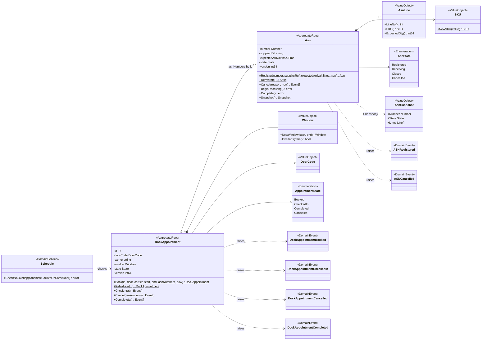
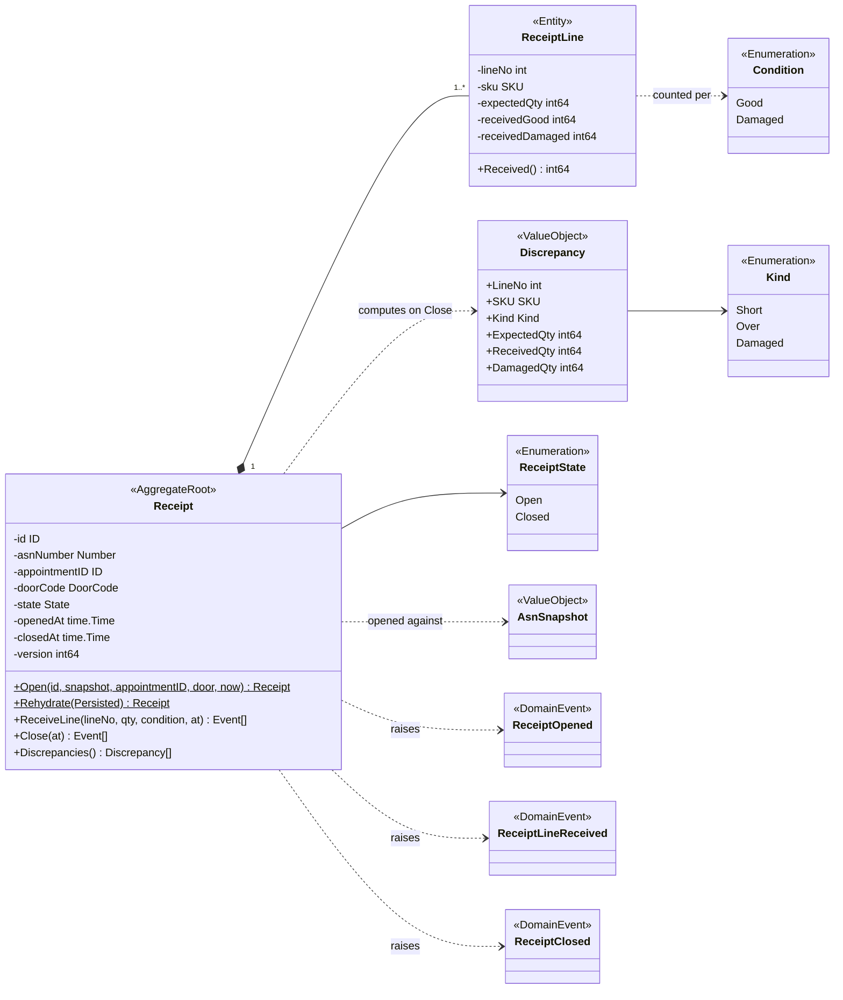
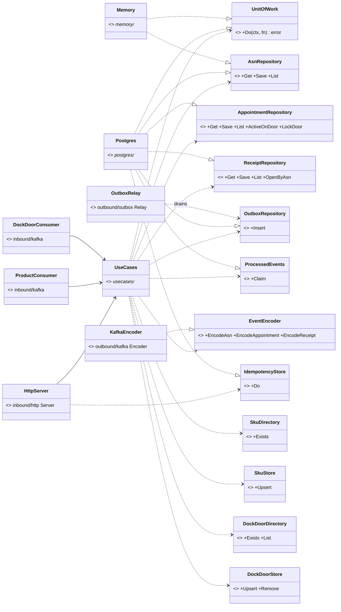

# Class diagrams

:::info[Synced from inbound-receiving]
This page is a copy of [`docs/docs/ddd/class-diagram.md`](https://github.com/IQVO/inbound-receiving/blob/develop/docs/docs/ddd/class-diagram.md) on `develop`, derived from that repository's code. Edit it there, then re-sync.
:::

UML class diagrams of the domain model and of the hexagonal ports with their
adapters. Type and method names are the real ones; unexported fields are shown
only where they carry an invariant. The domain is split in two diagrams to keep
each readable.

## Asn and DockAppointment

Source: `internal/domain/asn/{asn,events}.go`,
`internal/domain/appointment/{appointment,events}.go`,
`internal/domain/shared/*.go`. Omits: getters, `Header`, the `Event` interfaces
and the sentinel errors. `DockAppointment` holds ASN **numbers** (by id), not
`Asn` objects.

## Receipt

Source: `internal/domain/receipt/{receipt,events}.go`. Omits: getters, `Header`,
`LineState` and `Persisted` (the persisted shapes used by `Rehydrate`). The
`appointmentID` and `doorCode` references are by id and empty for a walk-in.

## Ports and adapters

Source: `internal/application/ports/*.go`, `cmd/api/main.go` (`adapters`,
`buildAdapters`, `buildServer`), the adapter packages under `internal/adapters`.
Omits: `Clock` and `IDGenerator` (trivial `clock.System`, `idgen.UUID`), the
in-memory implementations of every other port (the `Memory` adapter implements
the same ports as `Postgres`; only two edges are drawn), the Kafka relay sink,
telemetry and the Postgres pool. Adapters never import each other: only
`cmd/api` wires them to the use cases.
