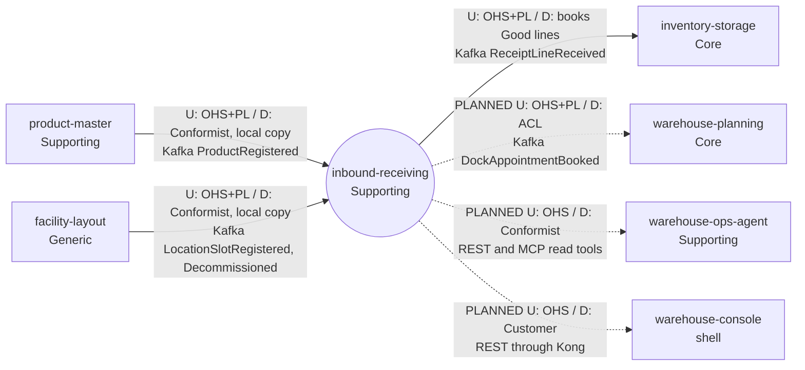

# Context map

:::info[Synced from inbound-receiving]
This page is a copy of [`docs/docs/ddd/context-map.md`](https://github.com/IQVO/inbound-receiving/blob/develop/docs/docs/ddd/context-map.md) on `develop`, derived from that repository's code. Edit it there, then re-sync.
:::

This context's slice of the fleet map, following ddd-crew
[Context Mapping](https://github.com/ddd-crew/context-mapping). Every edge is
labelled `U` (upstream) / `D` (downstream) with the pattern on each side and the
technology. Solid edges are live in code on `develop` of both sides; dotted edges
are **planned, not built**. Neighbour classifications come from the
warehouse-docs contexts table.

Source: `docs/adr/0001-inbound-receiving-bounded-context.md` (Context map),
`docs/adr/0003-local-copies-and-handover.md`,
`internal/adapters/inbound/kafka/product_consumer.go`,
`internal/adapters/inbound/kafka/dock_door_consumer.go`,
`internal/adapters/outbound/kafka/encoder.go`, `cmd/api/main.go`; on the
consumer side (on `develop`) inventory-storage
`internal/adapters/inbound/kafka/inbound_receipt_consumer.go` and its ADR 0037.
Omits: the Kafka broker, Kong and the operators who call the REST API directly.

## Relationships

| # | Upstream | Downstream | Patterns (U / D) | Technology | Status | Evidence |
| --- | --- | --- | --- | --- | --- | --- |
| 1 | `product-master` | `inbound-receiving` | OHS + Published Language / **Conformist** with a local copy: only existence matters, so the copy is the `known_skus` table | Kafka `warehouse.product-master.events`, `com.warehouse.wms.product-master.product.ProductRegistered` | **Live**, opt-in by `PRODUCT_MODE=kafka` (default `permissive`) and `PRODUCT_CONSUMER_GROUP` | `product_consumer.go`, ADR 0003 |
| 2 | `facility-layout` | `inbound-receiving` | OHS + PL / **Conformist** with a local copy: the payload is the camelCase domain event struct taken as published; only `role=Dock` with `dockFlow` `Inbound` or `Both` is kept in `dock_doors` | Kafka `warehouse.facility.events`, `...facility-layout.locationslot.LocationSlotRegistered` and `...LocationSlotDecommissioned` | **Live**, opt-in by `DOCK_DOOR_MODE=kafka` (default `permissive`) and `DOCK_DOOR_CONSUMER_GROUP` | `dock_door_consumer.go`, ADR 0003 |
| 3 | `inbound-receiving` | `inventory-storage` | OHS + PL / books `condition=Good` lines through its existing ReceiveStock use case; event-driven, no synchronous call in either direction, no acknowledgement event back | Kafka `warehouse.inbound-receiving.events`, `com.warehouse.wms.inbound-receiving.receipt.ReceiptLineReceived` | **Live**, opt-in by `INBOUND_RECEIPT_CONSUMER_GROUP` on the inventory-storage side (unset = not started) | inventory-storage ADR 0037, `inbound_receipt_consumer.go` |
| 4 | `inbound-receiving` | `warehouse-planning` | OHS + PL / ACL (as its other event consumers) | Kafka `warehouse.inbound-receiving.events`, `...dockappointment.DockAppointmentBooked` | **Planned, not built.** warehouse-planning's CapacityPlan has no inbound process path, so this is its own ADR there; nothing here depends on it | ADR 0001 and ADR 0003 ("Planned, not built") |
| 5 | `inbound-receiving` | `warehouse-ops-agent` | OHS (REST, MCP read tools) / Conformist | REST; MCP | **Planned, not built** ("later phases", ADR 0001); this repo has no MCP server | ADR 0001 |
| 6 | `inbound-receiving` | `warehouse-console` | OHS / Customer | REST through Kong | **Planned, not built** ("later phases", ADR 0001); no web remote and no Kong route in this repo | ADR 0001 |

The other published types (`ASNRegistered`, `ASNCancelled`,
`DockAppointmentBooked`, `DockAppointmentCheckedIn`,
`DockAppointmentCancelled`, `DockAppointmentCompleted`, `ReceiptOpened`,
`ReceiptClosed`) have no consumer on `develop` of any sibling today.

There is no Shared Kernel and no Partnership: no sibling Go package is imported
(the consumed payloads are restated locally), and the published payloads are the
only shared contract. `inbound-receiving` calls no sibling at request time, and
no context calls it at request time (ADR 0001).
