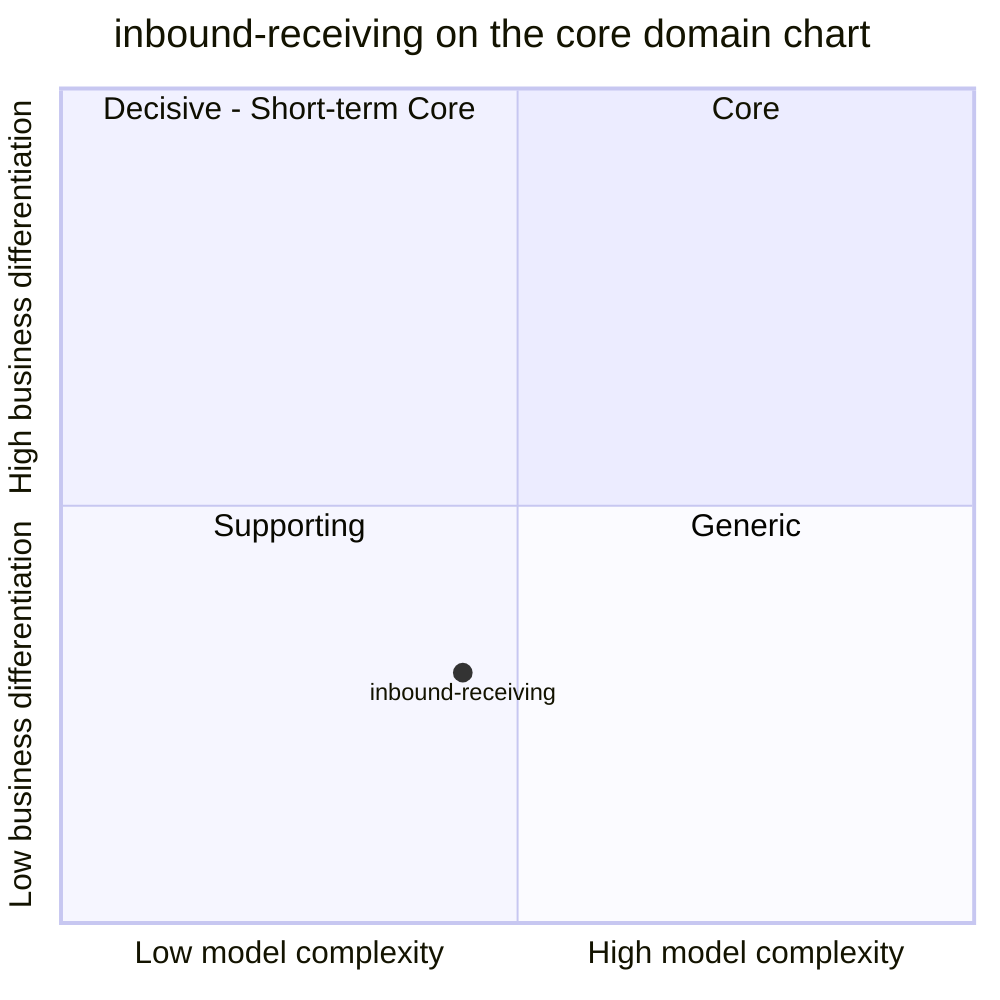

# Core domain chart

:::info[Synced from inbound-receiving]
This page is a copy of [`docs/docs/ddd/core-domain-chart.md`](https://github.com/IQVO/inbound-receiving/blob/develop/docs/docs/ddd/core-domain-chart.md) on `develop`, derived from that repository's code. Edit it there, then re-sync.
:::

Following the ddd-crew [Core Domain Charts](https://github.com/ddd-crew/core-domain-charts):
business differentiation on the vertical axis, model complexity on the
horizontal axis. Mermaid numbers the quadrants 1 = top-right (Core),
2 = top-left, 3 = bottom-left (Supporting), 4 = bottom-right (Generic).

Source: `docs/adr/0001-inbound-receiving-bounded-context.md` (Classification),
`docs/adr/0002-aggregates-and-invariants.md`,
`internal/domain/{asn,appointment,receipt}/*.go`.
Omits: the sibling contexts (their own charts place them).

## Classification: Supporting

[ADR 0001](https://iqvo.github.io/inbound-receiving/docs/adr/0001-inbound-receiving-bounded-context) classifies
`inbound-receiving` as a **Supporting subdomain**: "Every warehouse needs it and
the rules (what counts as a discrepancy, how long a door window may be) differ
per retailer, but it is not where this platform differentiates. Policy objects
(appointment window, discrepancy kinds) are replaceable." The point sits in the
bottom-left quadrant.

**Business differentiation is low (y = 0.30).** Nobody chooses a warehouse for
how it records a receipt, and competitor WMS products (the 2026-10-08 review
cited in the ADR) treat inbound execution as an expected standard capability. It
is not at the very bottom because the ASN, appointment and discrepancy rules
differ per retailer, which rules out adopting a generic document as-is.

**Model complexity is moderate (x = 0.44).** Slightly above `product-master`
(0.36). Evidence from the code:

- Three aggregates (`Asn`, `DockAppointment`, `Receipt`) that reference each
  other by id and a `shared` package of three value types (SKU, quantity,
  reason).
- One domain service (`appointment.Schedule`) and three cross-aggregate rules
  that live in the application and database instead of the domain: one open
  receipt per ASN (partial unique index), no door double-booking (per-door
  advisory lock) and closing a receipt completing the ASN and the appointment in
  one unit of work.
- The one computation is the per-line discrepancy (`Short`, `Over`, `Damaged`),
  a few integer comparisons.
- No long-running process and no computation over sets; both local-copy
  consumers are existence tables.

## Evolution

**Custom-built, in genesis.** The context was decided and built on 2026-10-08
(ADRs 0001 to 0004) and the service merged the same day. The warehouse-docs
contexts table agrees (Evolution: custom-built, genesis). A commercial WMS
inbound module is the obvious commodity alternative for the document workflow;
the discrepancy and appointment policies are the parts that stay replaceable
objects. Tolerance rules, quarantine and yard management are explicitly later
or out of scope (ADR 0001, ADR 0002).
