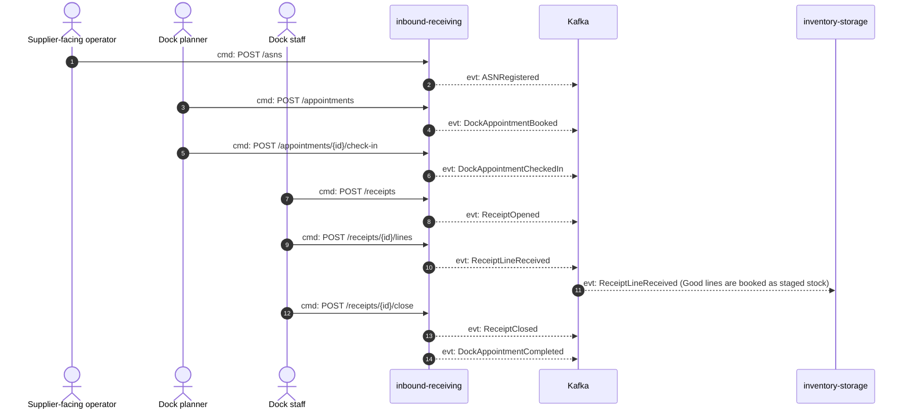
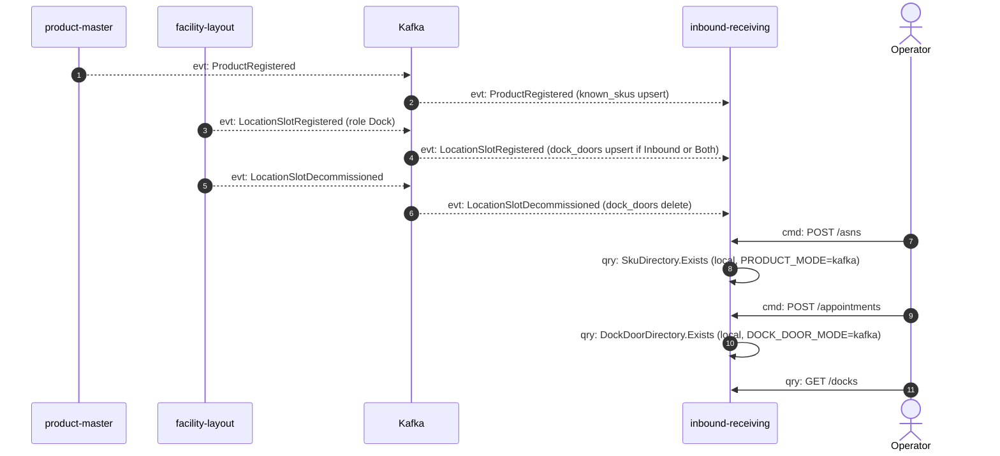
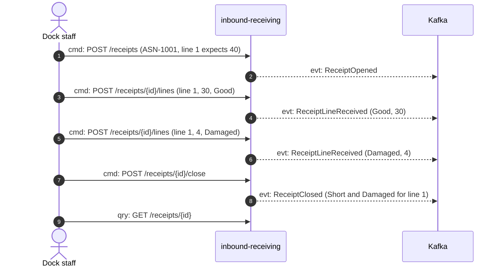

# Domain message flow

:::info[Synced from inbound-receiving]
This page is a copy of [`docs/docs/ddd/domain-message-flow.md`](https://github.com/IQVO/inbound-receiving/blob/develop/docs/docs/ddd/domain-message-flow.md) on `develop`, derived from that repository's code. Edit it there, then re-sync.
:::

Following ddd-crew [Domain Message Flow Modelling](https://github.com/ddd-crew/domain-message-flow-modelling).
Arrows are prefixed `cmd:` (command), `evt:` (event) or `qry:` (query), and only
real messages appear: REST routes from `NewRouter`, CloudEvents types from
`apis/asyncapi.yaml`.

## Scenario 1: a delivery announced, appointed, received and handed over

Source: `internal/adapters/inbound/http/server.go`,
`internal/application/usecases/{asn,appointment,receipt}.go`,
`internal/adapters/outbound/kafka/encoder.go`, inventory-storage
`internal/adapters/inbound/kafka/inbound_receipt_consumer.go`.
Omits: the outbox relay hop between the use case and Kafka (every `evt:` leaves
through `outbox_events`), the repeated `ReceiveLine` calls, and the cancel paths.
`DockAppointmentCompleted` is raised only when the receipt was opened from an
appointment. Its key is `appointment_id`, so its order relative to
`ReceiptClosed` is not guaranteed.

## Scenario 2: the local copies behind the SKU and door checks

Source: `internal/adapters/inbound/kafka/{product_consumer,dock_door_consumer}.go`,
`internal/application/usecases/{consumers,asn,appointment,queries}.go`.
Omits: the `processed_events` claim and offset commits (see the
[sequence diagrams](/contexts/inbound-receiving/sequence-diagrams)). The two `qry:` rows are
in-process port calls, not messages to a sibling.

## Scenario 3: a short and damaged delivery, with the discrepancy report

Source: `Receipt.ReceiveLine` and `Receipt.Close` in
`internal/domain/receipt/receipt.go`; the numbers follow the `closeReceipt`
example in `apis/openapi.yaml`. Line 1 ends with `received_qty` 34 (30 good plus
4 damaged), so `Close` raises `Short` and `Damaged` for it, in that order.
