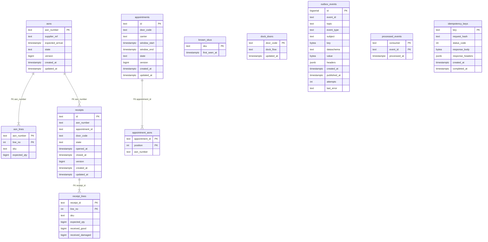

# Entity-relationship diagram

:::info[Synced from inbound-receiving]
This page is a copy of [`docs/docs/ddd/entity-relationship.md`](https://github.com/IQVO/inbound-receiving/blob/develop/docs/docs/ddd/entity-relationship.md) on `develop`, derived from that repository's code. Edit it there, then re-sync.
:::

The final OLTP schema after all migrations. There is one migration so far,
`0001_inbound_receiving`, so this is its full content. A relationship line is
drawn **only where a real `FOREIGN KEY` exists**; logical links without one are
described in prose below.

Source: `internal/adapters/outbound/postgres/migrations/0001_inbound_receiving.up.sql`.
Omits: `CHECK` constraints and indexes (listed below), the `"C"` collation on the
text identifiers, and `schema_migrations` (golang-migrate's own table).

## Table to aggregate

"Table is not aggregate": the mapping is not one to one.

| Table | Role | Backs |
| --- | --- | --- |
| `asns`, `asn_lines` | domain | the `Asn` aggregate (root row plus its lines) |
| `appointments`, `appointment_asns` | domain | the `DockAppointment` aggregate (root row plus the ASN numbers it covers, in booking order) |
| `receipts`, `receipt_lines` | domain | the `Receipt` aggregate (root row plus the snapshot of the ASN's lines and the two counters) |
| `known_skus`, `dock_doors` | local copy | read models fed by `ProductRegistered` and the facility-layout slot events; not an aggregate |
| `outbox_events` | infrastructure | the transactional outbox (unique `(event_id, topic)`; partial index on unpublished rows) |
| `processed_events` | infrastructure | idempotency guard of the consumers, primary key `(consumer, event_id)` |
| `idempotency_keys` | infrastructure | the `Idempotency-Key` middleware's store |

## Where there is no foreign key, on purpose

- `appointment_asns.asn_number` has no FK to `asns`: `Asn` and `DockAppointment`
  are separate aggregates that reference each other by id. The book use case
  checks the ASNs exist and are receivable inside the unit of work.
- `receipts.appointment_id` and `receipts.door_code` have no FK to
  `appointments`: a walk-in receipt has neither, and the appointment is a
  separate aggregate. `receipts.asn_number` **does** have an FK to `asns`.
- `known_skus` is deliberately existence-only (`sku`, `first_seen_at`): there is
  no foreign key from `asn_lines.sku` or `receipt_lines.sku` to it, because the
  copy is only consulted in `kafka` mode.

## Constraints that carry domain rules

| Constraint | Rule |
| --- | --- |
| `receipts_one_open_per_asn` (unique, partial on `state = 'Open'`) | at most one open receipt per ASN (ADR 0002) |
| `UNIQUE (asn_number, sku)` on `asn_lines` | SKUs unique across an ASN's lines |
| `UNIQUE (appointment_id, asn_number)` on `appointment_asns` | an ASN is covered once per appointment |
| `CHECK (window_end > window_start)` on `appointments` | the window ends after it starts |
| `CHECK ((state = 'Closed') = (closed_at IS NOT NULL))` on `receipts` | `closed_at` is set exactly when closed |
| `CHECK (received_good + received_damaged <= 2147483647)` on `receipt_lines` | the per-line total stays within the quantity bound |
| `CHECK (version >= 1)` on the aggregate roots | version starts at 1 |
| `idx_appointments_active_door` (partial on `Booked`, `CheckedIn`) | serves the overlap read of one door |
| `outbox_events_event_id_topic_key` | a relay retry never duplicates a row |
