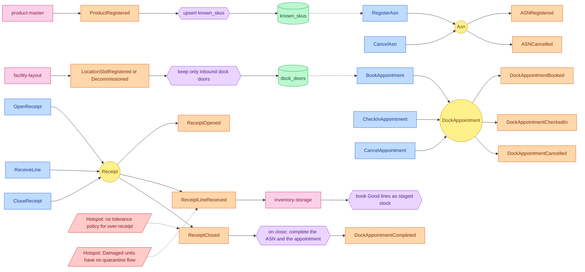

# EventStorming

:::info[Synced from inbound-receiving]
This page is a copy of [`docs/docs/ddd/eventstorming.md`](https://github.com/IQVO/inbound-receiving/blob/develop/docs/docs/ddd/eventstorming.md) on `develop`, derived from that repository's code. Edit it there, then re-sync.
:::

Design-level EventStorming following the ddd-crew
[EventStorming glossary and cheat sheet](https://github.com/ddd-crew/eventstorming-glossary-cheat-sheet).
This is a reconstruction from the code on `develop`, not a workshop output.

Sticky colours: **Command** blue, **Aggregate** yellow, **Domain event** orange,
**Policy** lilac, **Read model** green, **External system** pink, **Hotspot**
red.

Source: `internal/application/usecases/*.go`, `internal/domain/*/events.go`,
`internal/adapters/inbound/kafka/*.go`; inventory-storage
`internal/adapters/inbound/kafka/inbound_receipt_consumer.go`.
Omits: the internal `BeginReceiving` and `Complete` transitions of the ASN
(they raise no event), error branches and the planned consumers.

## Legend

| Sticky | Meaning here |
| --- | --- |
| Command | A use case in `internal/application/usecases`, reached by a REST `POST`. |
| Aggregate | `Asn`, `DockAppointment`, `Receipt` in `internal/domain`. |
| Domain event | A type in `apis/asyncapi.yaml`, raised by the aggregate and published through the outbox. |
| Policy | Reactive logic: `CloseReceipt` completing the ASN and appointment (in the same unit of work), the two local-copy consumers, and inventory-storage's consumer. |
| Read model | The two local-copy tables `known_skus` and `dock_doors`; they are read by `RegisterAsn` / `BookAppointment` only when the mode is `kafka`. |
| External system | `product-master`, `facility-layout`, `inventory-storage`. |

## Hotspots

Taken from real gaps in the ADRs, not invented:

1. **No tolerance policy.** v1 reports every difference; accepting up to x %
   over-receipt silently is "a later, separately decided change" (ADR 0002).
2. **Damaged units have no quarantine flow.** They are recorded and counted but
   not booked as stock; "a quarantine flow is a later ADR" (ADR 0001, ADR 0003).
3. **No compensation on the far side.** If `inventory-storage` rejects a line it
   skips and logs; the receipt's counts stay the source of truth (ADR 0003).
4. **Fail-open local copies.** In `permissive` mode a typo SKU or door is
   accepted (ADR 0001, Consequences).
5. **`DockAppointmentCompleted` ordering.** Keyed by `appointment_id`, so its
   order relative to `ReceiptClosed` is not guaranteed (ADR 0004).
