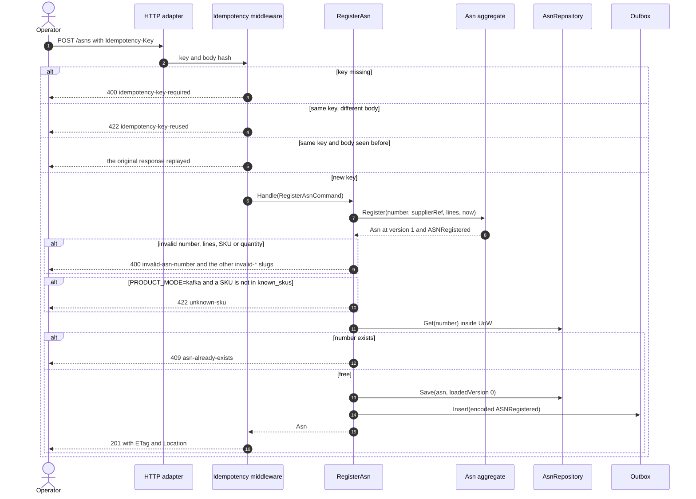
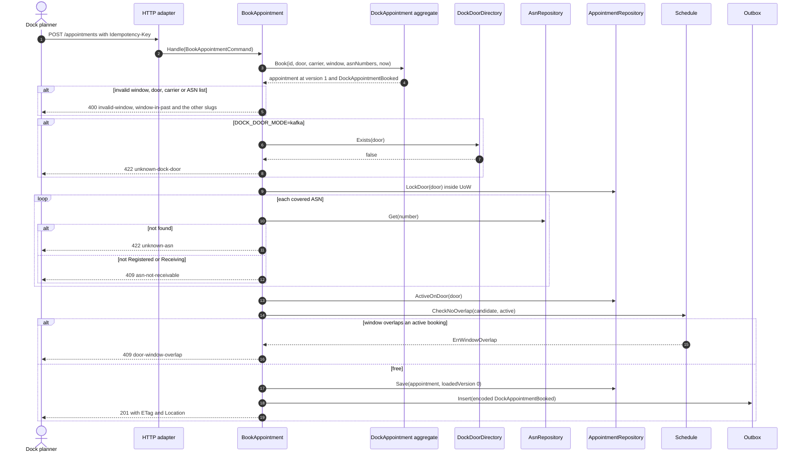
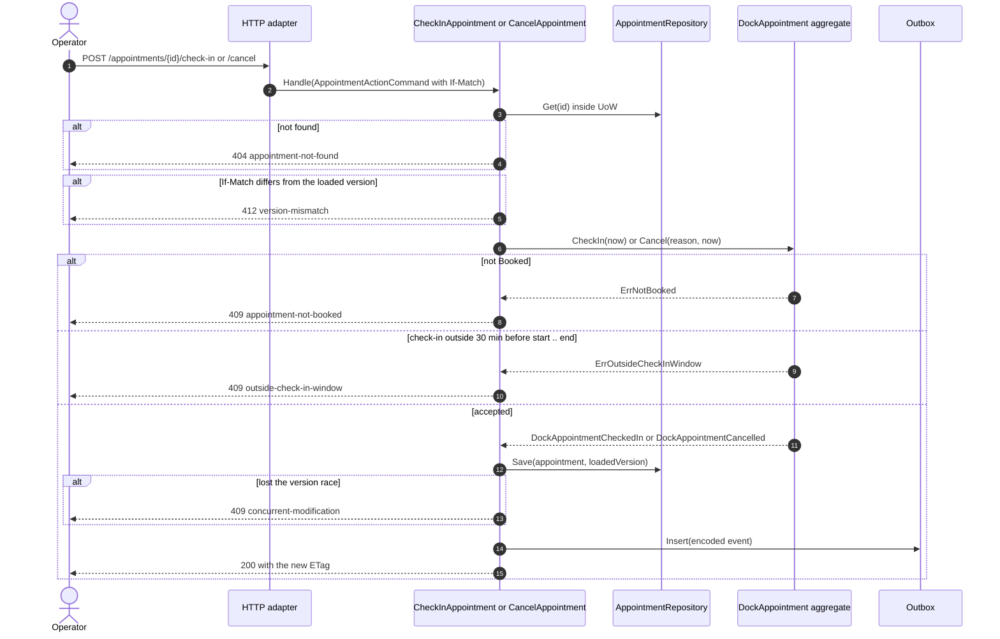
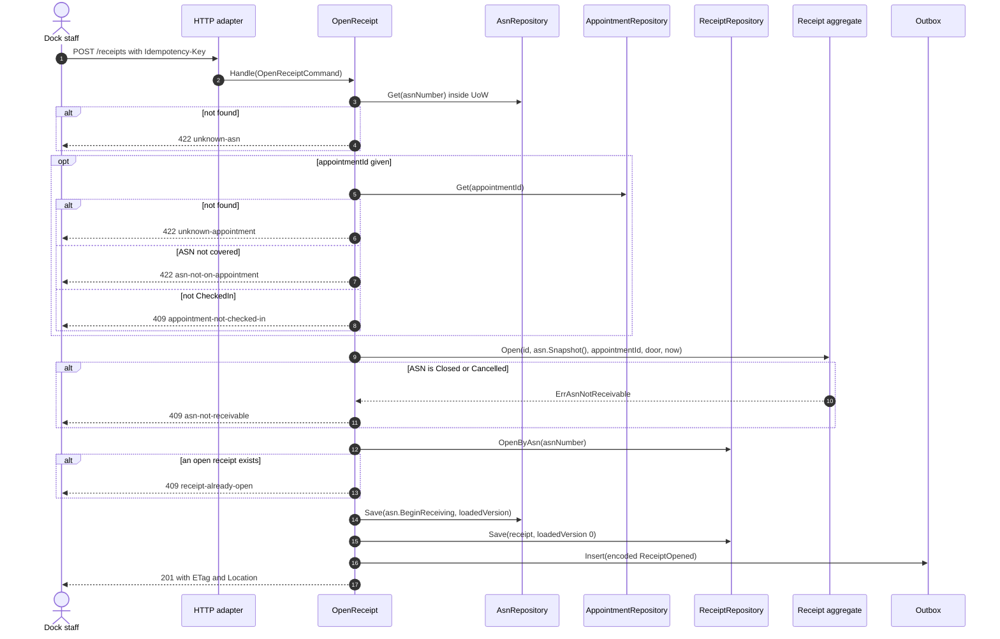
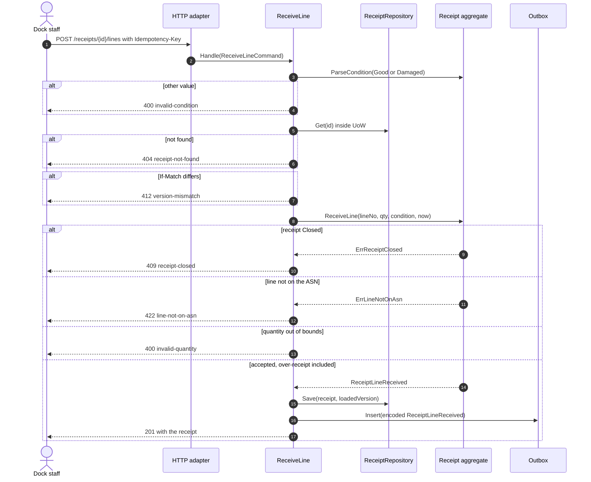
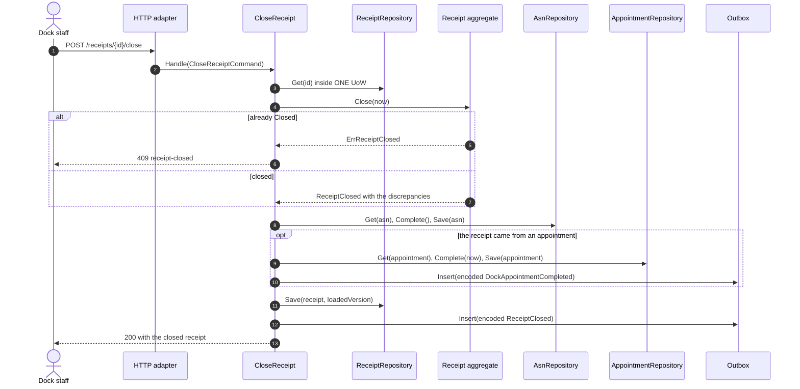
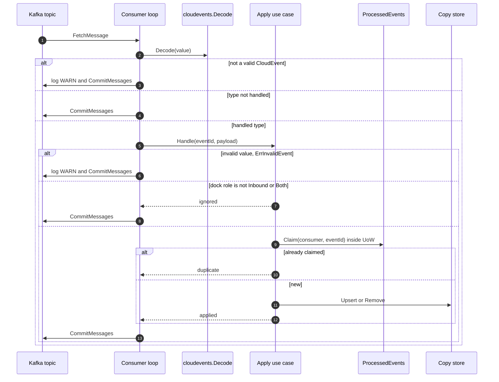
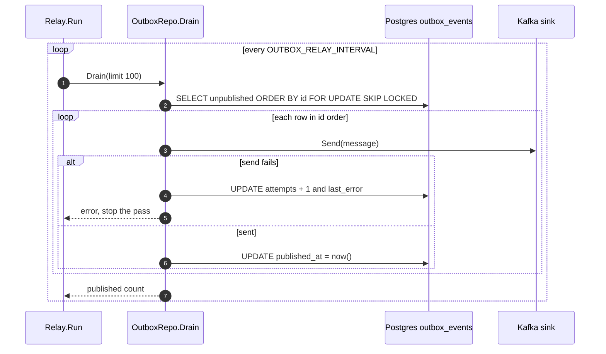

# Sequence diagrams

:::info[Synced from inbound-receiving]
This page is a copy of [`docs/docs/ddd/sequence-diagrams.md`](https://github.com/IQVO/inbound-receiving/blob/develop/docs/docs/ddd/sequence-diagrams.md) on `develop`, derived from that repository's code. Edit it there, then re-sync.
:::

One diagram per command use case plus the local-copy consumers and the outbox
relay: inbound adapter, application service, aggregate, repository, outbox. The
`Idempotency-Key` middleware wraps the creating `POST`s and is drawn once, in the
first diagram. `UoW` is `ports.UnitOfWork` (one Postgres transaction).

## Register an ASN

Source: `internal/adapters/inbound/http/{server,idempotency}.go`,
`internal/application/usecases/asn.go`, `internal/domain/asn/asn.go`.
Omits: the other POSTs behave the same way in the middleware; the response is
stored with the key in the same transaction.

## Book a dock appointment

Source: `internal/application/usecases/appointment.go`,
`internal/domain/appointment/appointment.go`,
`internal/adapters/outbound/postgres/appointment_repository.go` (`LockDoor` is
`pg_advisory_xact_lock`). Omits: the idempotency middleware (see the first
diagram).

## Check in and cancel an appointment

Source: `internal/application/usecases/appointment.go` (`Writer.act`),
`internal/domain/appointment/appointment.go`. `ASN` cancel follows the same
shape (`CancelAsn`, `ErrAsnInProgress` / `ErrAsnTerminal` instead).

## Open a receipt

Source: `internal/application/usecases/receipt.go` (`OpenReceipt.open`),
`internal/domain/receipt/receipt.go`. The ASN save raises no event; the partial
unique index `receipts_one_open_per_asn` closes the race the `OpenByAsn` read
cannot.

## Receive a line

Source: `internal/application/usecases/receipt.go` (`ReceiveLine.Handle`),
`internal/domain/receipt/receipt.go`.

## Close a receipt

Source: `internal/application/usecases/receipt.go` (`CloseReceipt.Handle`,
`completeAsn`, `completeAppointment`). The ASN completion raises no event. All
three saves and both outbox rows commit together or not at all.

## Local-copy consumer (product and dock door)

Source: `internal/adapters/inbound/kafka/{kafka,product_consumer,dock_door_consumer}.go`,
`internal/application/usecases/consumers.go`. A transient error from the use case
retries the same message with capped backoff and never commits past it.

## Outbox relay

Source: `internal/adapters/outbound/outbox/relay.go`,
`internal/adapters/outbound/postgres/outbox_repository.go`,
`internal/adapters/outbound/kafka/relay_sink.go`. A full batch is followed
immediately by another pass. A crash between send and update republishes the row
with the same CloudEvents id, which is what lets consumers dedupe.
