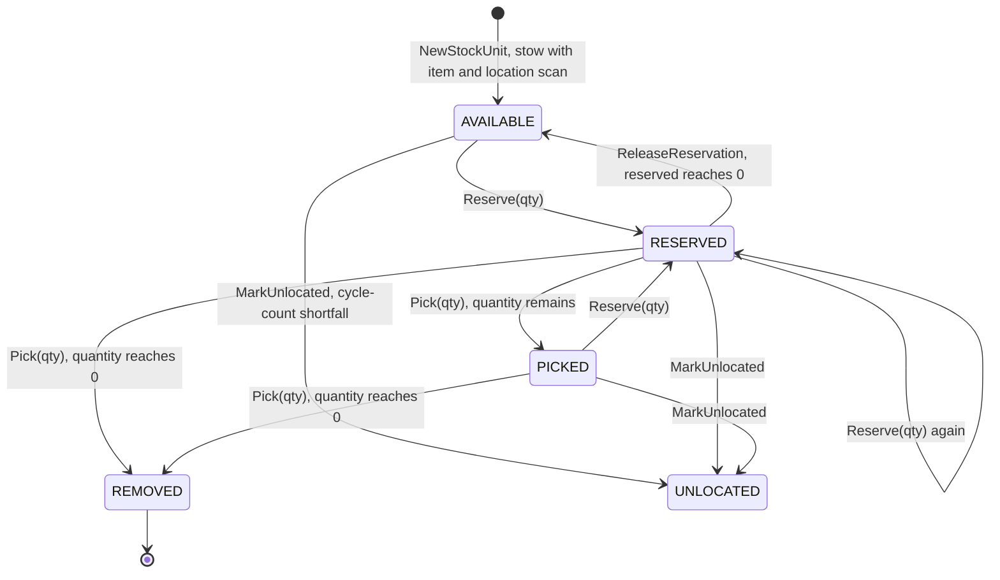
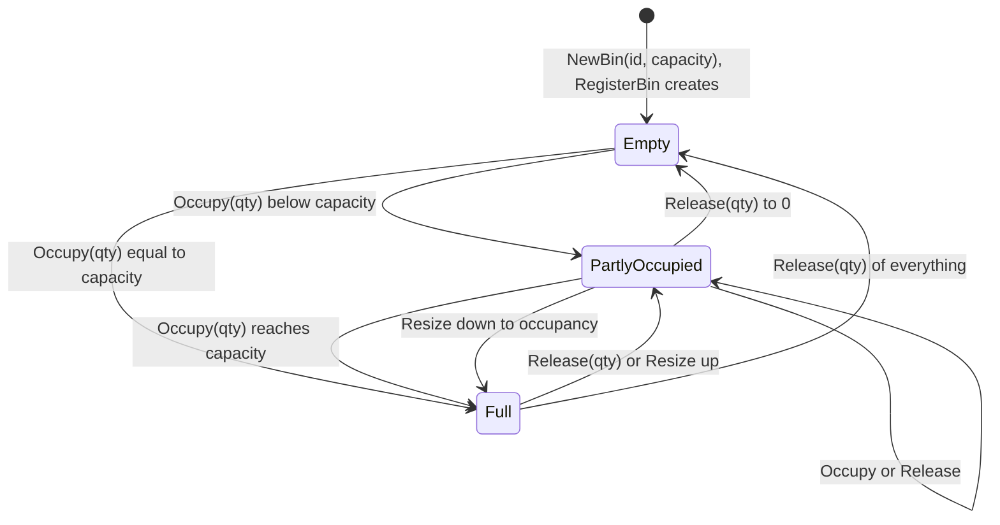
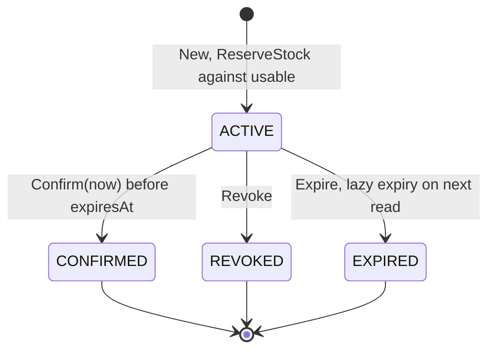
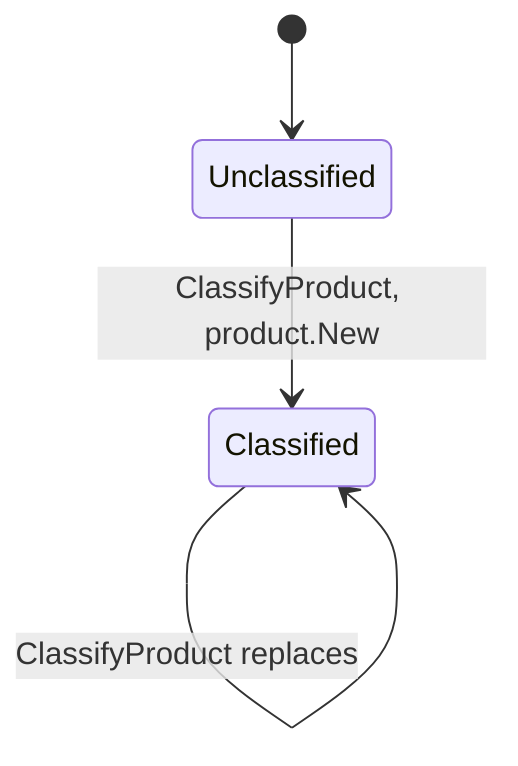

# Aggregate Design Canvas

:::info[Synced from inventory-storage]
This page is a copy of [`docs/docs/ddd/aggregate-design-canvas.md`](https://github.com/IQVO/inventory-storage/blob/develop/docs/docs/ddd/aggregate-design-canvas.md) on `develop`, derived from that repository's code. Edit it there, then re-sync.
:::

Following the [ddd-crew Aggregate Design Canvas](https://github.com/ddd-crew/aggregate-design-canvas)
(v1.1), one canvas per aggregate root found in `internal/domain/`. There
are **four**: `StockUnit`, `Bin`, `Reservation`, `ProductClassification`.
Every invariant below is enforced **in the domain layer** (or, where noted,
in the use case that owns the cross-aggregate rule) and has a failing-path
test.

Aggregates reference each other **by identity, never by pointer**: a
`Reservation` holds `Allocation{StockUnitID, BinID}` values, a `StockUnit`
holds a `BinId`. Each aggregate is loaded, changed and saved through its own
repository port, and every `Save` is version-guarded (ADR 0019). A use case
that touches several aggregates (stow, revoke, confirm-pick, expiry) keeps
them consistent inside one `UnitOfWork` transaction (ADR 0017) — the one
place this context deliberately trades "one aggregate per transaction" for
a single database transaction.

Throughput and size figures are **estimates** for a single mid-size
fulfilment centre, not measurements — the service has no production
traffic.

---

## StockUnit

### 1. Name

`StockUnit` — `internal/domain/stock.StockUnit`

### 2. Description

A quantity of one SKU at one bin, with a reserved portion and a lifecycle
state. It is the core aggregate of the context: every physical item has
exactly one known bin, or is flagged `UNLOCATED`. Total stock for a SKU is a
sum across units; there is deliberately no "SKU balance" aggregate to
contend on.

| Field | Meaning |
| --- | --- |
| `id` | Identity, minted by `StockRepo.NextID` |
| `sku` | Item scan |
| `binID` | Location scan — never changes after creation |
| `quantity` | On-hand at this bin |
| `reserved` | Portion bound to demand |
| `state` | `AVAILABLE` / `RESERVED` / `PICKED` / `REMOVED` / `UNLOCATED` |
| `version` | Optimistic-concurrency metadata, never read by business logic |

### 3. State Transitions

Source: `internal/domain/stock/state.go`, `internal/domain/stock/stock_unit.go`.
Omitted: `ReleaseReservation` on a `PICKED` unit (state stays `PICKED`);
`Pick` performs no state check of its own, so a still-reserved `UNLOCATED`
unit can be picked into `PICKED`/`REMOVED` — the guard is that
`RunCycleCount` only marks units it can count.

`MarkUnlocated` is deliberately unconditional — it takes no error return. A
cycle count that finds stock missing must always be able to say so.

### 4. Enforced Invariants

| # | Invariant | Enforced by | Failing-path test |
| --- | --- | --- | --- |
| S1 | A stow requires both an item scan and a location scan | `NewStockUnit` → `stock.ErrStowRequiresItemAndLocation` | `TestNewStockUnit_RequiresSKU`, `TestNewStockUnit_RequiresBin` |
| S2 | Quantity is never negative | `shared.NewQuantity` / `Quantity.Sub` → `shared.ErrNegativeQuantity` | `TestNewQuantity_RejectsNegative`, `TestQuantity_Sub_RejectsNegativeResult` |
| S3 | A stow of zero or fewer units is invalid | `NewStockUnit` → `shared.ErrZeroQuantity` | `TestNewStockUnit_RejectsZeroQuantity` |
| S4 | Reserved never exceeds usable — no negative usable | `Reserve` → `stock.ErrInsufficientUsable` | `TestStockUnit_Reserve_ExceedsUsable_Rejected` |
| S5 | Unlocated or removed stock is never reservable and contributes 0 usable | `Reserve` → `stock.ErrUnitUnlocated`; `Usable()` returns 0 | `TestStockUnit_Reserve_UnlocatedUnit_Rejected`, `TestStockUnit_Usable_RemovedState_IsZero` |
| S6 | A pick cannot exceed what was reserved, nor what is on hand | `Pick` → `stock.ErrInsufficientReserved` | `TestStockUnit_Pick_ExceedsReserved_Rejected`, `TestStockUnit_Pick_ExceedsOnHandQuantity_Rejected` |
| S7 | Release cannot return more than was reserved | `ReleaseReservation` → `stock.ErrInsufficientReserved` | `TestStockUnit_ReleaseReservation_ExceedsReserved_Rejected` |
| S8 | No lost update | `postgres.StockRepo.Save` version guard → `usecases.ErrConcurrentModification` | `optimistic_concurrency_integration_test.go` |

### 5. Corrective Policies

- **Revoke / expiry release.** When a reservation is revoked or lazily
  expired, `releaseAllocations` calls `ReleaseReservation` on every unit it
  drew from, in the same transaction.
- **Cycle-count shortfall.** `RunCycleCount` marks whole units `UNLOCATED`
  until the shortfall is covered, so lost stock stops counting toward usable
  at once. Overage is not corrected here — it is reported for a separate
  receiving/audit process.
- **Concurrent modification.** A lost version race surfaces as `409`; the
  caller re-fetches and retries.

### 6. Handled Commands

| Command | Method | Use case / entry point |
| --- | --- | --- |
| Stow | `NewStockUnit` | `StowStock` — `POST /stock/stow` |
| Reserve | `Reserve` | `ReserveStock` — `POST /reservations` |
| Release reservation | `ReleaseReservation` | `RevokeReservation` (`DELETE /reservations/{id}`, MCP `revoke_reservation`), lazy expiry |
| Pick | `Pick` | `ConfirmPick` — `POST /reservations/{id}/confirm-pick` |
| Mark unlocated | `MarkUnlocated` | `RunCycleCount` — `POST /bins/{binId}/cycle-count` |

### 7. Created Events

The aggregate itself raises nothing; the use cases build these from it
(`internal/domain/shared/events.go`).

| Event | Full CloudEvents `type` | Raised by |
| --- | --- | --- |
| StockReceived | `com.warehouse.wms.inventory-storage.stock.StockReceived` | `ReceiveStock` (no unit exists yet) |
| ItemStowed | `com.warehouse.wms.inventory-storage.stock.ItemStowed` | `StowStock` |
| LocationRecorded | not published (would be `...stock.LocationRecorded`) — **decided 2026-10-06: stays in-process**, no consumer | `StowStock` |
| ItemUnlocated | `com.warehouse.wms.inventory-storage.stock.ItemUnlocated` | `RunCycleCount` |

### 8. Throughput (estimate)

High. Every stow creates one unit; every reservation, revoke, pick and
expiry touches one or more units of a SKU. Contention concentrates on fast
movers whose few units are drawn by many concurrent reservations — the
reason `Save` is version-guarded.

### 9. Size (estimate)

Small: seven fields. A unit lives from stow until `REMOVED` or
`UNLOCATED` — typically a few to a few dozen state changes over hours to
weeks, depending on how many reservations draw from it.

---

## Bin

### 1. Name

`Bin` — `internal/domain/location.Bin`

### 2. Description

A coded slot in chaotic storage: an id, a capacity and an occupancy. Any SKU
may occupy any free bin; the only hard constraint is
`sum(stock in bin) <= capacity`. The `Bin` has **no SKU field and no SKU
affinity** — that absence is what makes storage chaotic rather than
fixed-slot. It knows nothing about zones or aisles (that is
`facility-layout`).

| Field | Meaning |
| --- | --- |
| `id` | Bin code, e.g. `A-1-1` |
| `capacity` | Maximum units the slot holds |
| `occupied` | Units currently stowed |
| `version` | Optimistic-concurrency metadata |

### 3. State Transitions

`Bin` has no status enum; the states below are derived from `occupied`
and `IsFull()`.

Source: `internal/domain/location/bin.go`, `internal/application/usecases/register_bin.go`.
Omitted: rejected transitions (they return errors and leave state unchanged);
a bin is never deleted.

### 4. Enforced Invariants

| # | Invariant | Enforced by | Failing-path test |
| --- | --- | --- | --- |
| B1 | `occupied <= capacity`; a full bin rejects a stow | `Occupy` → `location.ErrBinFull` | `TestBin_Occupy_ExceedsCapacity_Rejected`, `TestStowStock_ExceedsBinCapacity_Rejected` |
| B2 | Capacity must be positive | `NewBin` / `Resize` → `location.ErrInvalidCapacity` | `TestNewBin_RejectsInvalidCapacity` |
| B3 | A bin needs an id | `NewBin` → `shared.ErrEmptyBinID` | `TestNewBin_RejectsEmptyID` |
| B4 | A bin can never be resized below what it holds (exactly to occupancy is allowed) | `Resize` → `location.ErrCapacityBelowOccupancy` | `TestBin_Resize`, `TestRegisterBin`, `TestRegisterBin_Endpoint` |
| B5 | You cannot release more than is occupied | `Release` → `location.ErrReleaseExceedsOccupancy` | `TestBin_Release_ExceedsOccupancy_Rejected` |
| B6 | Occupying or releasing zero units is meaningless | `Occupy` / `Release` → `shared.ErrZeroQuantity` | `TestBin_Occupy_RejectsZeroQuantity`, `TestBin_Release_RejectsZeroQuantity` |
| B7 | A resize racing a stow never clobbers occupancy | `postgres.LocationRepo.Save` version guard → `usecases.ErrConcurrentModification` | `optimistic_concurrency_integration_test.go` |

### 5. Corrective Policies

- **Pick frees capacity.** `ConfirmPick` calls `Bin.Release` for each
  allocation in the same transaction as the `StockUnit.Pick`.
- **Declarative convergence.** `RegisterBin` is idempotent: repeating it
  with the same capacity is a no-op, so an inventory-control client can
  safely re-send its whole bin list.

### 6. Handled Commands

| Command | Method | Use case / entry point |
| --- | --- | --- |
| Register / resize | `NewBin`, `Resize` | `RegisterBin` — `PUT /bins/{binId}` |
| Occupy | `Occupy` | `StowStock` — `POST /stock/stow` |
| Release | `Release` | `ConfirmPick` — `POST /reservations/{id}/confirm-pick` |

### 7. Created Events

`RegisterBin` raises **no** event (ADR 0025). The cycle-count facts are
grouped under the `bin` entity because they are about a bin, though
`RunCycleCount` reads `StockUnit`s and never loads the `Bin` aggregate:

| Event | Full CloudEvents `type` |
| --- | --- |
| CycleCountCompleted | `com.warehouse.wms.inventory-storage.bin.CycleCountCompleted` |
| DiscrepancyDetected | `com.warehouse.wms.inventory-storage.bin.DiscrepancyDetected` |

### 8. Throughput (estimate)

High on stow and pick (every stow and every confirmed allocation writes its
bin), low on registration (layout changes). Hot spots are bins near the
receive dock under chaotic stow.

### 9. Size (estimate)

Tiny: four fields. Long-lived — a bin exists as long as the physical slot,
accumulating one change per stow and per picked allocation (thousands over
its life), but each change only moves two integers.

---

## Reservation

### 1. Name

`Reservation` — `internal/domain/reservation.Reservation`

### 2. Description

A **revocable**, expiring binding of a quantity of a SKU to a demand. It
records `Allocation`s — which `StockUnit` it drew from, the pick location
(`BinID`, ADR 0025) and how much — so a revoke returns exactly that
quantity and a confirm-pick consumes exactly it. Nothing binds a future
reservation to the same holding: that is what makes a failed pick
recoverable (ADR 0003).

| Field | Meaning |
| --- | --- |
| `id` | Identity, minted by `ReservationRepo.NextID` |
| `sku`, `quantity` | What is claimed |
| `demandRef` | Opaque upstream reference (order + line); replay-guard and lookup key |
| `allocations` | `[]Allocation{StockUnitID, BinID, Quantity}` |
| `status` | `ACTIVE` / `CONFIRMED` / `REVOKED` / `EXPIRED` |
| `createdAt`, `expiresAt` | `expiresAt = createdAt + timeout` (default 30 min) |
| `version` | Optimistic-concurrency metadata |

### 3. State Transitions

Source: `internal/domain/reservation/reservation.go`,
`internal/application/usecases/reservation_expiry.go`.
Omitted: the rejected transitions — any call on a non-`ACTIVE` reservation
returns `ErrAlreadyResolved`.

### 4. Enforced Invariants

| # | Invariant | Enforced by | Failing-path test |
| --- | --- | --- | --- |
| R1 | Reserved quantity ≤ usable quantity at reserve time | `ReserveStock.allocate` → `usecases.ErrInsufficientUsable`; `StockUnit.Reserve` re-checks per unit | `TestReserveStock_ExceedsUsable_Rejected` |
| R2 | Revoke returns quantity to usable | `RevokeReservation` → `releaseAllocations` → `StockUnit.ReleaseReservation` | `TestRevokeReservation_ReturnsQuantityToUsable`, `TestStockUnit_ReleaseReservation_ReturnsToUsable` |
| R3 | No double-consume: only `ACTIVE` may transition | `Revoke` / `Confirm` / `Expire` → `reservation.ErrAlreadyResolved` | `TestReservation_Revoke_Twice_Rejected`, `TestReservation_Confirm_Twice_Rejected`, `TestReservation_Expire_Twice_Rejected`, `TestConfirmPick_AfterRevoke_Rejected` |
| R4 | Expires after a timeout; never confirmed late | `IsExpired(now)`; `Confirm` → `reservation.ErrExpired` | `TestReservation_IsExpired`, `TestReservation_Confirm_AfterExpiry_Rejected` |
| R5 | Must allocate against something | `New` → `reservation.ErrNoAllocations` | `TestNew_RequiresAtLeastOneAllocation` |
| R6 | One active reservation per (demandRef, SKU, quantity) — best effort | `ReserveStock.activeReservationFor` / `isReplayOf` (use case, not DB-enforced) | `reserve_stock_multi_line_test.go` |
| R7 | Empty `demandRef` is rejected | HTTP handler → `400 missing-demand-ref` | `server_test.go` |

### 5. Corrective Policies

- **Lazy expiry.** `expireIfDue` runs on every read path
  (`GetReservationsByDemandRef`, `ReserveStock`'s replay guard,
  `RevokeReservation`, `ConfirmPick`): a timed-out `ACTIVE` reservation is
  released, set `EXPIRED` and `ReservationExpired` is raised in one
  transaction. There is no background sweeper.
- **Revoke as compensation.** A failed physical pick is compensated by
  `DELETE /reservations/{id}`; deciding what to do next is
  `wes-work-planning`'s or `order-management`'s call, not this context's.

### 6. Handled Commands

| Command | Method | Use case / entry point |
| --- | --- | --- |
| Reserve | `New` | `ReserveStock` — `POST /reservations` (Idempotency-Key) |
| Revoke | `Revoke` | `RevokeReservation` — `DELETE /reservations/{id}`, MCP `revoke_reservation` |
| Confirm pick | `Confirm` | `ConfirmPick` — `POST /reservations/{id}/confirm-pick` |
| Expire | `Expire` | lazy, inside the four read paths above |

### 7. Created Events

| Event | Full CloudEvents `type` | Topics |
| --- | --- | --- |
| StockReserved | `com.warehouse.wms.inventory-storage.reservation.StockReserved` | integration + analytics |
| ReservationRevoked | `com.warehouse.wms.inventory-storage.reservation.ReservationRevoked` | integration + analytics |
| ReservationExpired | `com.warehouse.wms.inventory-storage.reservation.ReservationExpired` | analytics only |
| StockPicked | `com.warehouse.wms.inventory-storage.reservation.StockPicked` | analytics only |

### 8. Throughput (estimate)

Highest of the four: one reservation per order line, plus one revoke or
confirm each, plus reads by `demandRef` from the Order Lifecycle console.
Each reservation is written by one caller at a time, so per-instance
contention is low; contention moves to the `StockUnit`s it draws from.

### 9. Size (estimate)

Small: a handful of fields plus usually one to three allocations. Short
lifetime — two to three events (created, then confirmed / revoked /
expired) within the 30-minute default timeout. Rows are never deleted.

---

## ProductClassification

### 1. Name

`ProductClassification` — `internal/domain/product.ProductClassification`

### 2. Description

SKU-level master data, independent of any `StockUnit` or bin, describing how
an item must be handled. This context is the **source of truth** (ADR 0009):
a closed set of `HandlingTag`s, a `TemperatureClass` required only for
`TemperatureSensitive` SKUs, and an optional US DOT hazard class meaningful
only for `Hazmat` SKUs (ADR 0010). `StowStock` enforces placement and
same-bin segregation from it; three sibling contexts read it over REST.

| Field | Meaning |
| --- | --- |
| `sku` | The classified SKU (identity) |
| `handlingTags` | Set of `Hazmat` / `Fragile` / `TemperatureSensitive` / `Oversized` / `HighValue` |
| `temperatureClass` | `Ambient` / `Chilled` / `Frozen`, or empty |
| `dotHazardClass` | `1`-`9`, or `0` (`DOTHazardClassUnspecified`) |

### 3. State Transitions

No status enum: a classification either does not exist or is current, and
re-classifying replaces it wholesale.

Source: `internal/domain/product/classification.go`,
`internal/application/usecases/classify_product.go`.
Omitted: there is no delete or unclassify operation.

### 4. Enforced Invariants

| # | Invariant | Enforced by | Failing-path test |
| --- | --- | --- | --- |
| P1 | At least one handling tag | `New` → `product.ErrNoHandlingTags` | `TestNew_TableDriven/no_tags_rejected` |
| P2 | `HandlingTag` is a closed enum | `ParseHandlingTag` / `New` → `product.ErrUnknownHandlingTag` | `TestParseHandlingTag/unknown`, `TestNew_TableDriven/unknown_tag_rejected` |
| P3 | Tags form a set | `New` → `product.ErrDuplicateHandlingTag` | `TestNew_TableDriven/duplicate_tag_rejected` |
| P4 | `TemperatureSensitive` requires a valid `TemperatureClass` | `New` → `product.ErrTemperatureClassRequired` / `product.ErrUnknownTemperatureClass` | `TestNew_TableDriven/temperature_sensitive_without_class_rejected` |
| P5 | No `TemperatureClass` without `TemperatureSensitive` | `New` → `product.ErrTemperatureClassNotApplicable` | `TestNew_TableDriven/temperature_class_without_temperature_sensitive_tag_rejected` |
| P6 | `DOTHazardClass` only with `Hazmat` | `New` → `product.ErrDOTHazardClassNotApplicable` | `TestNew_TableDriven/dot_hazard_class_without_hazmat_tag_rejected` |
| P7 | `DOTHazardClass` in 1-9 | `ParseDOTHazardClass` / `New` → `product.ErrInvalidDOTHazardClass` | `TestNew_TableDriven/dot_hazard_class_out_of_range_rejected` |
| P8 | `Hazmat` never requires a DOT class | `New` accepts `DOTHazardClassUnspecified` | `TestNew_TableDriven/hazmat_alone_succeeds` |

Rules this aggregate's data drives, enforced in `StowStock` (they span a
classification, a bin's occupants and facility-layout's zone data):

| Rule | Error |
| --- | --- |
| Hazmat SKU needs a hazmat-rated zone | `usecases.ErrHazmatZoneRequired` |
| Temperature-sensitive SKU needs a matching zone temperature class | `usecases.ErrTemperatureClassMismatch` |
| Zone lookup failed for a classified SKU (fail-closed) | `usecases.ErrLocationClassificationUnavailable` |
| Incompatible DOT classes may not share a bin (49 CFR §177.848, four simplifications) | `usecases.ErrHazmatClassIncompatible` via `product.Incompatible` |

Unclassified SKUs, unknown bins and unclassified occupants are **fail-open**.

### 5. Corrective Policies

- **Re-classification replaces.** `ClassifyProduct` is idempotent by SKU;
  correcting a wrong classification is just another `PUT`.
- None for already-stowed stock: re-classifying a SKU does not re-check
  bins it already occupies.

### 6. Handled Commands

| Command | Method | Use case / entry point |
| --- | --- | --- |
| Classify / re-classify | `product.New` | `ClassifyProduct` — `PUT /products/{sku}/classification` |

### 7. Created Events

| Event | Full CloudEvents `type` | Topics |
| --- | --- | --- |
| ProductClassified | `com.warehouse.wms.inventory-storage.product.ProductClassified` (subject and Kafka key = SKU; `data` = `{sku, handling_tags, temperature_class?, dot_hazard_class?}`, a full-state replacement) | `warehouse.inventory.events` and `warehouse.inventory.analytics`, through the outbox in the same transaction as the save — **published since 2026-10-06**, [ADR 0031](https://iqvo.github.io/inventory-storage/docs/adr/0031) |

### 8. Throughput (estimate)

Low writes (catalogue changes), high reads: every classified-SKU stow and
every sibling's `GET /products/{sku}/classification` — siblings can now keep a
local copy from the published `ProductClassified` event instead
([ADR 0031](https://iqvo.github.io/inventory-storage/docs/adr/0031)); the REST read stays.

### 9. Size (estimate)

Tiny: four fields. Lives as long as the SKU; a handful of re-classifications
over its life.

---

## Read models and projections (not aggregates)

| Read model | Where | Built from |
| --- | --- | --- |
| Usable inventory per SKU | `usecases.GetUsable` → `UsableInventory` | Σ `StockUnit.Usable()` at read time — never stored |
| Bin occupancy (MCP `get_bin_occupancy`) | `inbound/mcp` → `toBinOccupancy` | `StockRepo.FindByBin` at read time |
| Bin capacity view | `usecases.GetBin` | the `Bin` aggregate, read-only |
| Reservations by demand ref | `usecases.GetReservationsByDemandRef` | `ReservationRepo.FindByDemandRef` (with lazy expiry) |
| Facility location cache | `outbound/facilitycache.Consumer` | `warehouse.facility.events`, in memory, rebuilt on every start |
| Inventory Flow & Accuracy report | `internal/analytics/report`, table `flow_accuracy_rollup` | `warehouse.inventory.analytics`, written only by `cmd/inventory-projector` |

## Value objects (`internal/domain/shared`)

| Type | Rule | Errors |
| --- | --- | --- |
| `SKU` | Non-empty | `ErrEmptySKU` |
| `BinId` | Non-empty | `ErrEmptyBinID` |
| `Quantity` | Non-negative; every arithmetic operation that would go negative errors rather than clamping. `NewPositiveQuantity` also rejects zero. | `ErrNegativeQuantity`, `ErrZeroQuantity` |

`Quantity.Sub` is the workhorse of the "no negative usable" rule and is
where boundary tests were added during mutation testing.

## The four named invariants

`CLAUDE.md` singles out four as the Definition of Done for the context:

| Invariant | Domain test | Use-case test |
| --- | --- | --- |
| Bin-capacity rejection | `TestBin_Occupy_ExceedsCapacity_Rejected` | `TestStowStock_ExceedsBinCapacity_Rejected` |
| Stow requires item + location | `TestNewStockUnit_RequiresSKU` / `_RequiresBin` | — |
| Reservation ≤ usable | `TestStockUnit_Reserve_ExceedsUsable_Rejected` | `TestReserveStock_ExceedsUsable_Rejected` |
| Revoke returns to usable | `TestStockUnit_ReleaseReservation_ReturnsToUsable` | `TestRevokeReservation_ReturnsQuantityToUsable` |

All four are also covered as black-box Gherkin scenarios under `features/`,
driven through the real HTTP router. See the
[class diagram](/contexts/inventory-storage/class-diagram) for the types and the
[sequence diagrams](/contexts/inventory-storage/sequence-diagrams) for how the use cases drive these
aggregates.
