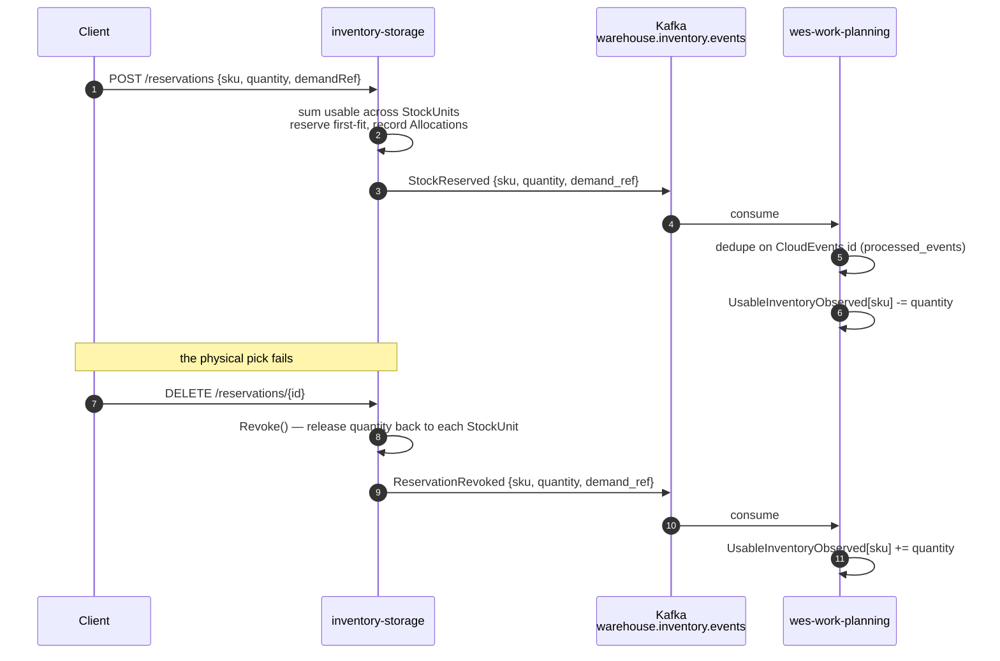

# Async API — Narrative

This page is the prose walkthrough of `inventory-storage`'s asynchronous
contract. The authoritative, machine-checked source is
`apis/asyncapi.yaml` (AsyncAPI 2.6.0), Spectral-linted in CI by the
`api-lint` job — everything below is drawn from it. For the full generated
reference (every message schema, in full), see
**[`/api-reference/async/inventory-storage`](/api-reference/async/inventory-storage)**.

## Topic

| | |
| --- | --- |
| **Topic** | `warehouse.inventory.events` |
| **Protocol** | Kafka |
| **Client library** | `github.com/segmentio/kafka-go` |
| **Balancer** | `LeastBytes`, `AllowAutoTopicCreation: true` — **no partition key**, so ordering is not guaranteed, even per SKU |
| **Broker** | `KAFKA_BROKERS`, default `localhost:9092` (shared broker at `~/warehouse-systems/docker-compose.kafka.yml`) |
| **Selected by** | `EVENT_PUBLISHER=kafka` (default is `log`, so tests and local runs never need a broker) |
| **Direction** | Publish on this topic. (Separately, this service consumes `warehouse.facility.events` into its location-classification cache — see [the canvas](/contexts/inventory-storage/bounded-context-canvas), inventory-storage ADR-0013.) |
| **Primary consumer** | `wes-work-planning`, projecting into its own `UsableInventoryObserved` read model, keyed by SKU |
| **Default content type** | `application/cloudevents+json` |

There is a second, separate topic, `warehouse.inventory.analytics`, carrying
the wider event set for this service's own analytical read model
(the Inventory Flow & Accuracy report). That topic has exactly one
consumer — this service's own `cmd/inventory-projector` — and is not part of
the cross-context integration contract described on this page.

## What events are on the topic

Only **two** of this context's eleven domain events are actually published:
`StockReserved` and `ReservationRevoked`. Everything else hits the Kafka
adapter's `default: return nil` branch and stays in-process. This is a
deliberate, small public surface — the internal model can evolve freely
because the wire contract only exposes two events, not all ten messages the
AsyncAPI catalog documents (`ProductClassified` is not in the catalog at
all). See [Domain Events](/contexts/inventory-storage/domain-events) for the
complete catalog and which of the other nine are in-process only.

## The envelope: CloudEvents 1.0 (mandatory)

Every message is a CloudEvents 1.0 event in structured content mode, per
the fleet-wide, mandatory [Event Standard](/strategic-design/event-standard-cloudevents). Kafka header
`content-type: application/cloudevents+json; charset=UTF-8`; context
attributes carry routing and identity; the business payload lives entirely
under `data`:

```json
{
  "specversion": "1.0",
  "id": "1f7a4c30-9b2d-4e85-a6c1-7d3f0b5e8a94",
  "source": "/warehouse/inventory-storage",
  "type": "com.warehouse.wms.inventory-storage.reservation.StockReserved",
  "subject": "res-1",
  "time": "2026-08-21T22:00:00Z",
  "datacontenttype": "application/json",
  "dataschema": "urn:warehouse:inventory-storage:events:StockReserved:v1",
  "data": { "sku": "SKU-1", "quantity": 5, "demand_ref": "order-42" }
}
```

| Attribute | Required | Value |
| --- | --- | --- |
| `specversion` | ✅ | Always `"1.0"` |
| `id` | ✅ | UUID v4 minted once per domain event and persisted with the outbox row (stable across redelivery). `(source, id)` is the deduplication key. |
| `source` | ✅ | Always `/warehouse/inventory-storage` |
| `type` | ✅ | Reverse-DNS event type, pinned per message |
| `subject` | ✅ | The aggregate instance the event is about — a reservation id, a stock unit id, or a bin id |
| `time` | ✅ | RFC 3339 UTC, taken from the injected `Clock` port — the time it occurred *in the domain*, not at publish |
| `datacontenttype` | ✅ | Always `application/json` |
| `dataschema` | ✅ | `urn:warehouse:inventory-storage:events:<EventName>:v1` (integration topic) or `urn:warehouse:inventory-storage:analytics:<EventName>:v1` (analytics topic) |

There is no flat envelope and no envelope toggle; consumers reject (skip,
never parse) any message that is not a valid CloudEvent.

## The `type` convention

The platform-wide convention:

```text
com.warehouse.<subdomain>.<bounded-context>.<entity>.<EventName>
```

All lowercase except the final PascalCase event name. For this context,
`<subdomain>` is `wms` (Warehouse Management System, a Core subdomain);
`<bounded-context>` is `inventory-storage`; `<entity>` is the aggregate that
raises the event — `stock`, `reservation`, or `bin`. Each concrete message
pins `type` to a single enum value, so consumers can discriminate safely and
a typo fails validation instead of producing a silently-unrouted message.

## ReservationRevoked's enrichment, on the wire

The domain event `ReservationRevoked` carries only a `reservationId` — the
aggregate has no reason to repeat data the reservation already holds. But the
integration contract promises `{sku, quantity, demand_ref}`, because the
downstream projection is keyed by SKU and cannot afford a lookup. The Kafka
adapter bridges that gap by re-reading the reservation through
`ReservationRepo` at publish time, so the shape on the wire is identical to
`StockReserved`'s:

```json
{
  "specversion": "1.0",
  "id": "4b9e2f61-7c3a-4d08-85e2-1a6f9c0d3b72",
  "source": "/warehouse/inventory-storage",
  "type": "com.warehouse.wms.inventory-storage.reservation.ReservationRevoked",
  "subject": "res-1",
  "time": "2026-08-21T22:10:00Z",
  "datacontenttype": "application/json",
  "dataschema": "urn:warehouse:inventory-storage:events:ReservationRevoked:v1",
  "data": { "sku": "SKU-1", "quantity": 5, "demand_ref": "order-42" }
}
```

The use case saves the reservation before publishing, so this lookup always
succeeds in practice; the `ErrReservationNotFound` guard exists but is not an
expected path.

## Who consumes it

**`wes-work-planning`** is the one live consumer. It projects both events
into `UsableInventoryObserved`, a read model keyed by SKU: `StockReserved`
decrements the observed usable count, `ReservationRevoked` increments it
back. Because the two events are exact inverses, the downstream projection
stays trivially simple — one decrement, one increment.



## Idempotency and consumer-group notes

- **At-least-once delivery is every consumer's problem.** `wes-work-planning`
  deduplicates with a `processed_events` table keyed by the CloudEvents
  `id` (`(source, id)`), so a redelivery does not
  double-decrement or double-increment its usable count.
- **No ordering guarantee.** The `LeastBytes` balancer with no partition key
  means no per-SKU ordering. Acceptable for an increment/decrement
  projection, which tolerates reordering of independent events — but it is
  why the REST read remains authoritative.
- **Tolerate unknown `type` values.** The catalog grows as more
  of it is wired to the outbound adapter; a consumer that fails closed on an
  unrecognised type will break the first time that happens.
- **The authoritative answer is always the REST read.** The event stream is
  a convenience projection for keeping a cheap local view warm, not a
  substitute for `GET /inventory/{sku}/usable` when correctness matters.
- **Publish failures propagate.** `Publish` errors surface out of the use
  case, so a broker outage surfaces as a `500` on the triggering request —
  the honest behaviour today, though it couples request success to broker
  availability; a transactional outbox would decouple them and is not built.

## Building another consumer

1. Read `apis/asyncapi.yaml`, not this page — it is the linted contract.
2. Only two events are on the wire; the document's other eight messages are
   catalog-only, each says so in its own description.
3. Deduplicate on the event id; do not assume ordering.
4. Treat the event stream as a projection — call `GET
   /inventory/{sku}/usable` for the authoritative answer.

## Full reference

The complete, generated AsyncAPI HTML — every message schema, in full, built
directly from `apis/asyncapi.yaml` — is at
**[`/api-reference/async/inventory-storage`](/api-reference/async/inventory-storage)**.
