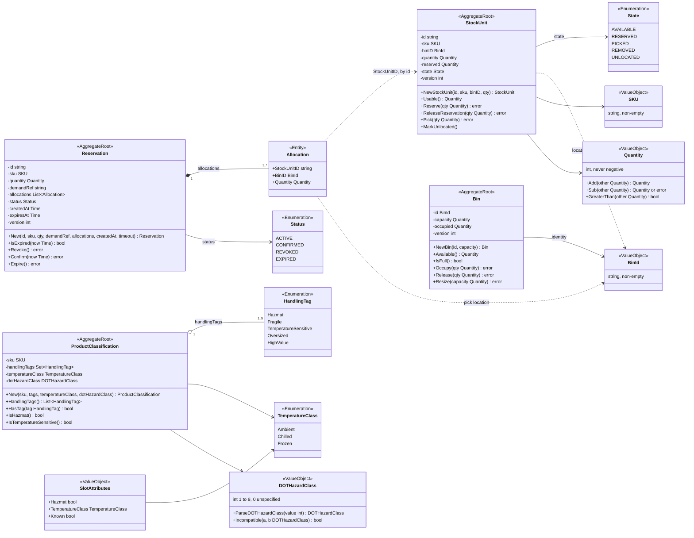
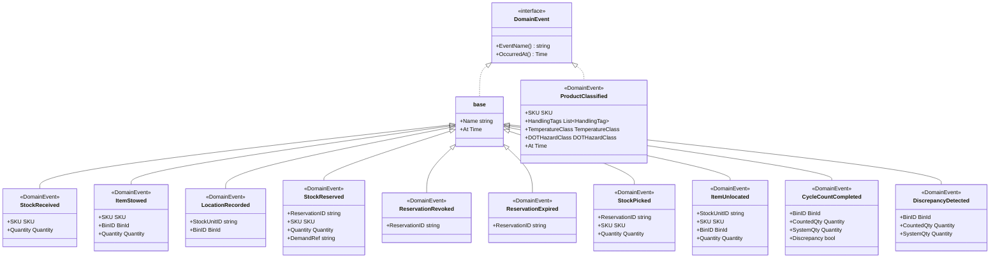
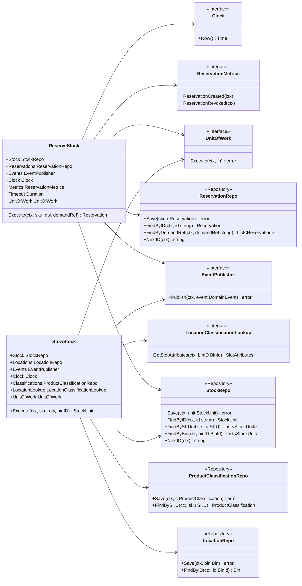
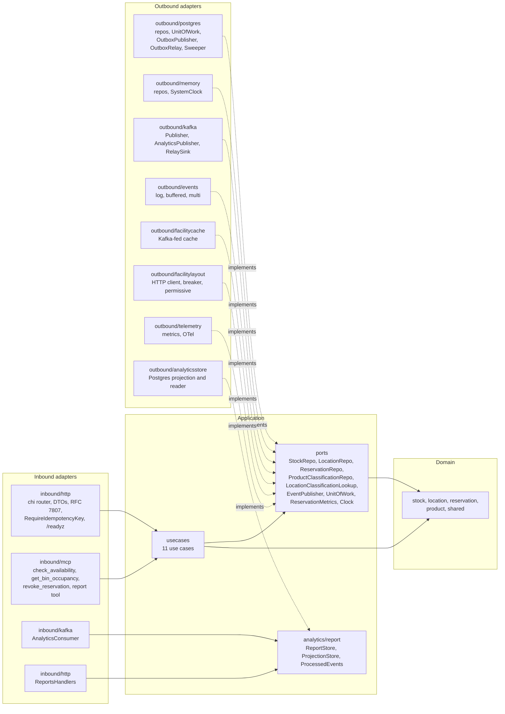

# UML Class Diagrams

:::info[Synced from inventory-storage]
This page is a copy of [`docs/docs/ddd/class-diagram.md`](https://github.com/IQVO/inventory-storage/blob/develop/docs/docs/ddd/class-diagram.md) on `develop`, derived from that repository's code. Edit it there, then re-sync.
:::

Real type names, key fields and every state-changing method from
`internal/domain/**`, split into three diagrams to stay readable, followed
by the ports and the hexagonal adapter map. Go has no classes: a "class"
here is a Go type; private fields are shown with `-`, exported methods with
`+`. Stereotypes: `<<AggregateRoot>>`, `<<Entity>>`, `<<ValueObject>>`,
`<<Enumeration>>`, `<<DomainEvent>>`, `<<Repository>>` (an outbound port).

## 1. Aggregates, value objects and enumerations

Source: `internal/domain/stock/stock_unit.go`, `stock/state.go`,
`internal/domain/location/bin.go`, `internal/domain/reservation/reservation.go`,
`internal/domain/product/classification.go`, `product/segregation.go`,
`internal/domain/shared/sku.go`, `bin_id.go`, `quantity.go`.
Omitted: getters, `Rehydrate*` constructors, `Version()`, the `Parse*`
helpers of the enumerations, and the `Err*` sentinels (listed on the
[Aggregate Design Canvas](/contexts/inventory-storage/aggregate-design-canvas)). Dotted arrows are
references **by identity** across aggregate boundaries — no aggregate holds
a pointer to another. `Allocation` has no identity of its own outside its
`Reservation`; it is shown as `<<Entity>>` because it is persisted as a row
keyed by `(reservation_id, stock_unit_id)`.

## 2. Domain events

Source: `internal/domain/shared/events.go`, `internal/domain/product/classification.go`.
Omitted: the `New*` constructors. The `base <|--` edges are Go struct
**embedding**, drawn as inheritance; `ProductClassified` implements the
interface directly in package `product`.

## 3. Application ports

Source: `internal/application/ports/ports.go`,
`internal/application/usecases/reserve_stock.go`, `stow_stock.go`.
Omitted: the other nine use cases, which follow the same struct-of-ports
shape (see [Use Cases](https://github.com/IQVO/inventory-storage/blob/develop/docs/docs/ddd/use-cases.md)); `ctx` is `context.Context`.

## 4. Hexagonal ports and adapters

Source: `internal/adapters/**`, `internal/application/ports/ports.go`,
`internal/analytics/report/ports.go`, the four `cmd/*/main.go` composition
roots. Omitted: `cmd/mcp`'s reports REST client (`inboundmcp.NewReportsRESTClient`)
and `internal/adapters/kafka/cloudevents`, the shared envelope helper used
by every Kafka adapter. The MCP adapter reads `StockRepo.FindByBin`
directly for `get_bin_occupancy`; the HTTP adapter reads
`ProductClassificationRepo` directly for `GET /products/{sku}/classification`.
