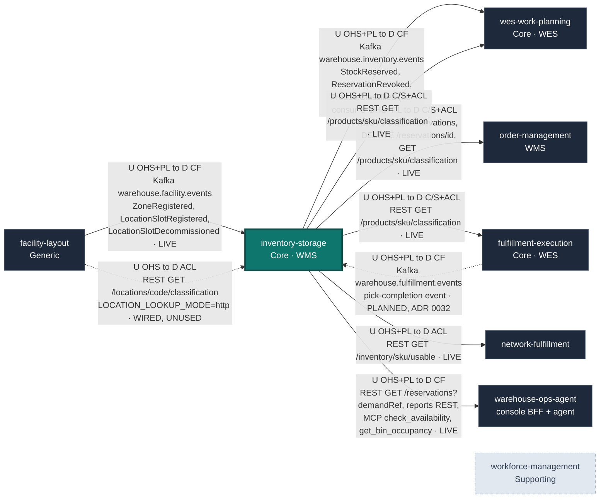

# Context Map

:::info[Synced from inventory-storage]
This page is a copy of [`docs/docs/ecosystem/context-map.md`](https://github.com/IQVO/inventory-storage/blob/develop/docs/docs/ecosystem/context-map.md) on `develop`, derived from that repository's code. Edit it there, then re-sync.
:::

Following [ddd-crew Context Mapping](https://github.com/ddd-crew/context-mapping),
this page is `inventory-storage`'s slice of the platform map: every bounded
context it exchanges messages with, which side is **U**pstream and
**D**ownstream, the pattern(s) on each end, and the technology. Every row
was checked against adapter code in both repositories on `develop`, not
against intent. Contexts with no relationship at all are listed under
[Separate Ways](#separate-ways), not drawn.

Pattern legend: **OHS** Open Host Service · **PL** Published Language ·
**CF** Conformist · **ACL** Anti-Corruption Layer · **C/S**
Customer/Supplier · **P** Partnership · **SK** Shared Kernel. This context
has no Partnership and no Shared Kernel with anyone — it shares no Go types
with any sibling.

## The map

Arrows point **upstream → downstream**, not in the direction of the network
call: `order-management` *calls* `POST /reservations`, but it is the
downstream customer of this service's Open Host Service. The dashed arrow is
wired in code but not selected in any deployed configuration (or, for the
`fulfillment-execution` → `inventory-storage` edge, planned and not yet built
— ADR 0032); the
unconnected `workforce-management` node is a deliberate Separate Ways.
Path parameters are written without braces in the diagram (`/reservations/id`
for `/reservations/{id}`).

Source: `internal/adapters/outbound/kafka/publisher.go`,
`internal/adapters/outbound/facilitycache/consumer.go`,
`internal/adapters/outbound/facilitylayout/client.go`,
`internal/adapters/inbound/http/server.go`, `internal/adapters/inbound/mcp/tools.go`,
`cmd/inventory/main.go`, and each caller's adapter listed below.
Omitted: this service's own analytics topic and projector (internal, not a
context relationship), the `inventory-mfe` remote in `web/` (this context's
own UI), and the `e2e-tests` warehouse-day simulator (a test harness, not a
bounded context).

## Relationships and evidence

| # | Upstream → Downstream | Patterns (U / D) | Technology and messages | Evidence | Status |
| --- | --- | --- | --- | --- | --- |
| 1 | `facility-layout` → `inventory-storage` | OHS + PL / CF | Kafka `warehouse.facility.events`: `com.warehouse.wms.facility-layout.zone.ZoneRegistered`, `com.warehouse.wms.facility-layout.locationslot.LocationSlotRegistered`, `com.warehouse.wms.facility-layout.locationslot.LocationSlotDecommissioned` | here: `internal/adapters/outbound/facilitycache/consumer.go` (per-process group, FirstOffset replay, DLQ `warehouse.facility.events.dlq`); there: facility-layout's Kafka publisher | **Live** when `LOCATION_LOOKUP_MODE=kafka` (what `warehouse-infra` sets); the binary default `permissive` does no lookup |
| 2 | `facility-layout` → `inventory-storage` | OHS / ACL | REST `GET /locations/{locationCode}/classification` | here: `internal/adapters/outbound/facilitylayout/client.go` + `breaker.go` (circuit breaker, ADR 0020); there: `internal/adapters/inbound/http/server.go` route `/locations/{locationCode}/classification` | **Wired, unused** — `LOCATION_LOOKUP_MODE=http` is the documented rollback for #1 |
| 3 | `inventory-storage` → `wes-work-planning` | OHS + PL / CF | Kafka `warehouse.inventory.events`: `com.warehouse.wms.inventory-storage.reservation.StockReserved`, `com.warehouse.wms.inventory-storage.reservation.ReservationRevoked`; also published there (no consumer yet): `com.warehouse.wms.inventory-storage.product.ProductClassified` ([ADR 0031](https://iqvo.github.io/inventory-storage/docs/adr/0031)) | here: `internal/adapters/outbound/kafka/publisher.go` (via outbox relay); there: `internal/adapters/inbound/kafka/consumer.go`, group `wes-work-planning`, projects `UsableInventoryObserved` | **Live** (`EVENT_PUBLISHER=kafka`) |
| 4 | `inventory-storage` → `order-management` | OHS + PL / C/S + ACL | REST `POST /reservations` (with `Idempotency-Key`), `DELETE /reservations/{id}`, `GET /products/{sku}/classification` | there: `internal/adapters/outbound/inventorystorage/client.go`, `internal/adapters/outbound/productclassification/client.go`; gated by `INVENTORY_STORAGE_MODE` / `PRODUCT_CLASSIFICATION_MODE` + `INVENTORY_STORAGE_BASE_URL` | **Live** in the cluster; caller default `permissive` |
| 5 | `inventory-storage` → `wes-work-planning` | OHS + PL / C/S + ACL | REST `GET /products/{sku}/classification` | there: `internal/adapters/outbound/productclassification/client.go`; `PRODUCT_CLASSIFICATION_MODE` + `INVENTORY_STORAGE_BASE_URL` | **Live** when the caller sets `http` |
| 6 | `inventory-storage` → `fulfillment-execution` | OHS + PL / C/S + ACL | REST `GET /products/{sku}/classification` | there: `internal/adapters/outbound/productclassification/client.go`; `PRODUCT_CLASSIFICATION_MODE` + `INVENTORY_STORAGE_BASE_URL` | **Live** when the caller sets `http` |
| 7 | `fulfillment-execution` → `inventory-storage` | OHS + PL / CF | **Planned (decided 2026-10-06, [ADR 0032](https://iqvo.github.io/inventory-storage/docs/adr/0032), *Proposed*)**: Kafka `warehouse.fulfillment.events`, a pick-completion event this service consumes to confirm the reservation itself. No sync call: the REST route `POST /reservations/{id}/confirm-pick` stays for operators and the simulator only | here: the route exists, no consumer yet; there: no event carries a reservation correlation (`reservation_id` or `demand_ref` + `sku`) or the picked quantity — `TaskCompleted` has `task_id`, `station_id`, `work_unit_id`, `associate_id`, `duration_seconds`, `task_type` | **Not built — blocked on fulfillment-execution / wes-work-planning fields (ADR 0032)**; only the `e2e-tests` simulator confirms picks today |
| 8 | `inventory-storage` → `network-fulfillment` | OHS + PL / ACL | REST `GET /inventory/{sku}/usable` | there: `internal/adapters/outbound/inventoryclient/client.go`, `INVENTORY_STORAGE_URL` (default `http://localhost:8080`, no mode switch) | **Live** |
| 9 | `inventory-storage` → `warehouse-ops-agent` | OHS + PL / CF | REST `GET /reservations?demandRef=`; reports REST `GET /reports/flow-accuracy`, `/reports/flow-accuracy/freshness`; MCP (Streamable HTTP) `check_availability`, `get_bin_occupancy` | there: `internal/adapters/outbound/restclient/clients.go`, `reports_clients.go`, `internal/adapters/outbound/mcpclient/inventory_storage.go`; `INVENTORY_STORAGE_REST_URL`, `INVENTORY_STORAGE_REPORTS_REST_URL`, `INVENTORY_STORAGE_MCP_ENDPOINT` | **Live**, read-only; the MCP write tool `revoke_reservation` exists here but the agent does not call it |
| 10 | `inventory-storage` ↔ `workforce-management` | Separate Ways | — | no client, topic or type in either repo | **Deliberately absent** |

All REST and MCP surfaces are unauthenticated (ADR 0015). Every Kafka
message is CloudEvents 1.0 structured mode (ADR 0024).

## Separate Ways

- **`workforce-management`** — labour planning and inventory truth share no
  concepts. Worker identity, shift patterns and floor conditions must never
  leak into the system of record.
- **`process-path-management`, `labor-performance`, `warehouse-planning`** —
  no relationship in either direction today.
- **`fulfillment-execution` events** — this service does not subscribe to
  `warehouse.fulfillment.events` **yet**. The decided direction (2026-10-06,
  [ADR 0032](https://iqvo.github.io/inventory-storage/docs/adr/0032), *Proposed*) reverses the earlier "explicit
  `confirm-pick` command" stance: a pick-completion event will be consumed
  here (idempotent consumer, existing `ConfirmPick` use case) rather than
  fulfillment-execution or wes-work-planning calling REST/MCP — still no
  shared types, and this service remains the one that decides whether
  consumption is legal. Blocked until the event carries a reservation
  correlation and the picked quantity.

## This service's edges, in prose

### → `wes-work-planning` (live)

The only consumer of this service's integration topic. Full technical
detail — envelope, payloads, smoke test — is on the
[Integration](https://github.com/IQVO/inventory-storage/blob/develop/docs/docs/ecosystem/integration.md) page. Strategically **Customer/Supplier with
a Conformist downstream**: `wes-work-planning` takes `StockReserved` /
`ReservationRevoked` in the shape they are published and never gets write
access to a `StockUnit`, a `Bin` or a `Reservation`.

`warehouse-systems-ddd.md` is explicit that this boundary is an
**Anti-Corruption Layer in both directions**:

> WMS never reaches into WES's `Assignment` aggregate to pick a worker; WES
> never reaches into WMS's `Order` aggregate to check inventory truth.

Concretely: there is no `path_id`, `cpt`, `work_unit`, `station` or `worker`
anywhere in this domain, and `wes-work-planning`'s `inventoryview` holds only
an observed usable count per SKU, with no concept of a bin.

### ← `order-management` (live, synchronous)

This service's only synchronous **command** caller among the sibling
contexts: order allocation reserves stock with `POST /reservations` (one
call per order line, with a derived `Idempotency-Key`), cancellation
revokes it with `DELETE /reservations/{id}`, and order intake reads
`GET /products/{sku}/classification`. Every call runs through this service's
own invariants.

### Read-only callers

`wes-work-planning` and `fulfillment-execution` read product classification
master data (they can move to the published `ProductClassified` event,
[ADR 0031](https://iqvo.github.io/inventory-storage/docs/adr/0031), whenever they choose); `network-fulfillment` reads usable inventory to answer
availability for its external network; `warehouse-ops-agent` reads
reservations by demand reference for the Order Lifecycle console, the Flow &
Accuracy report, and two MCP read tools. Each caller translates the response
into its own model in its own outbound adapter.

Per [ADR-0012](https://iqvo.github.io/inventory-storage/docs/adr/0012-adopt-mfe-console-architecture) this service
also ships `inventory-mfe` (`web/`), a Module Federation remote mounted by
the `warehouse-console` shell, which calls only this service's own
`GET /inventory/{sku}/usable` and `GET /reservations?demandRef=`.

### ← `facility-layout` (live: Kafka-fed local read model)

:::info[Status as of ADR 0013]
`inventory-storage` is a **Conformist** consumer of `facility-layout`'s
Published Language. With `LOCATION_LOOKUP_MODE=kafka`,
`internal/adapters/outbound/facilitycache` replays
`warehouse.facility.events` from the earliest offset on every start (a
fresh, per-process consumer group), applies the three types above, and
blocks startup until the replay is complete (60 s timeout). `StowStock` then
reads zone attributes from memory — `facility-layout` is no longer a runtime
dependency of a stow. See
[ADR 0013](https://iqvo.github.io/inventory-storage/docs/adr/0013-location-classification-via-facility-events).
:::

The synchronous `GET /locations/{locationCode}/classification` of ADR 0009
survives as `LOCATION_LOOKUP_MODE=http`, the rollback. The binary's default
remains `permissive` (no lookup), so a deployment that sets neither mode
enforces no placement rules at all. **Decided 2026-10-06: kept permissive**
(ADR 0013/0020) — a cold facility cache would reject every receipt, and the
`warehouse-infra` cluster already injects `kafka`.

**What is still not built:** `StowStock` only confirms that the bin exists in
this service's own `LocationRepo` — it does not validate the bin against
facility-layout's slot catalogue as "real, active, correctly typed". The
consumed data is used narrowly, for hazmat/temperature placement on
classified SKUs only; placement policy for `Oversized`/`HighValue`/`Fragile`
remains unbuilt. A `Bin` here is an id, a capacity and an occupancy,
registered over REST by `PUT /bins/{binId}` (ADR 0025).

## Where this sits in the reference model

`amazon-fulfillment-ddd.md`'s context map places Inventory & Storage exactly
where this service sits:

> **Planning ↔ Inventory & Storage:** Customer/Supplier. Planning asks "can I
> allocate?"; Inventory is the authoritative supplier of stock + bin location
> (its Open-Host Service exposes bin-accurate location as Published Language).
>
> **Work Orchestration (WES core) is downstream** of both Planning and
> Inventory: it consumes the *plan* and the *stock reality* and turns them into
> real-time work — the "conductor."

`wes-work-planning` is that conductor. "Stock reality" is what this service
supplies to it, and `warehouse.inventory.events` is the pipe it travels down.
See also the strategic narrative in
[Context Relationships](https://iqvo.github.io/inventory-storage/docs/ddd/context-relationships) and the
[DDD artifacts index](https://iqvo.github.io/inventory-storage/docs/ddd/ddd-artifacts).
