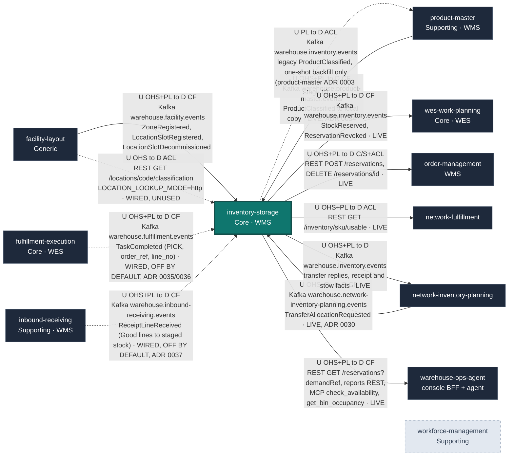

# Context Map

:::info[Synced from inventory-storage]
This page is a copy of [`docs/docs/ecosystem/context-map.md`](https://github.com/IQVO/inventory-storage/blob/develop/docs/docs/ecosystem/context-map.md) on `develop`, derived from that repository's code. Edit it there, then re-sync.
:::

Following [ddd-crew Context Mapping](https://github.com/ddd-crew/context-mapping),
this page is `inventory-storage`'s slice of the platform map: every bounded
context it exchanges messages with, which side is **U**pstream and
**D**ownstream, the pattern(s) on each end, and the technology. Every row
was checked against adapter code in both repositories on `develop`, not
against intent. Contexts with no relationship at all are listed under
[Separate Ways](#separate-ways), not drawn.

Pattern legend: **OHS** Open Host Service · **PL** Published Language ·
**CF** Conformist · **ACL** Anti-Corruption Layer · **C/S**
Customer/Supplier · **P** Partnership · **SK** Shared Kernel. This context
has no Partnership and no Shared Kernel with anyone — it shares no Go types
with any sibling.

## The map

Arrows point **upstream → downstream**, not in the direction of the network
call: `order-management` *calls* `POST /reservations`, but it is the
downstream customer of this service's Open Host Service. A dashed arrow is
wired in code but not part of steady-state traffic: the
`fulfillment-execution` → `inventory-storage` edge is built here and off by
default, `TASK_COMPLETED_CONSUMER_MODE`; it acts once fulfillment-execution
publishes the additive `order_ref` and `line_no` — ADR 0035, ADR 0036), the
`inventory-storage` → `product-master` edge carries only the one-shot
`republish-product-classifications` backfill (run once, on 2026-10-07), and the
unconnected `workforce-management` node is a deliberate Separate Ways.
Path parameters are written without braces in the diagram (`/reservations/id`
for `/reservations/{id}`).

Source: `internal/adapters/outbound/kafka/publisher.go`,
`internal/adapters/outbound/facilitycache/consumer.go`,
`internal/adapters/outbound/facilitylayout/client.go`,
`internal/adapters/inbound/kafka/product_master_consumer.go`,
`internal/adapters/inbound/http/server.go`, `internal/adapters/inbound/mcp/tools.go`,
`cmd/inventory/main.go`, `cmd/inventory/republish.go`, and each caller's
adapter listed below.
Omitted: this service's own analytics topic and projector (internal, not a
context relationship), the `inventory-mfe` remote in `web/` (this context's
own UI), and the `e2e-tests` warehouse-day simulator (a test harness, not a
bounded context).

## Relationships and evidence

| # | Upstream → Downstream | Patterns (U / D) | Technology and messages | Evidence | Status |
| --- | --- | --- | --- | --- | --- |
| 1 | `facility-layout` → `inventory-storage` | OHS + PL / CF | Kafka `warehouse.facility.events`: `com.warehouse.wms.facility-layout.zone.ZoneRegistered`, `com.warehouse.wms.facility-layout.locationslot.LocationSlotRegistered`, `com.warehouse.wms.facility-layout.locationslot.LocationSlotDecommissioned` | here: `internal/adapters/outbound/facilitycache/consumer.go` (per-process group, FirstOffset replay, DLQ `warehouse.facility.events.dlq`); there: facility-layout's Kafka publisher | **Live** when `LOCATION_LOOKUP_MODE=kafka` (what `warehouse-infra` sets); the binary default `permissive` does no lookup |
| 2 | `facility-layout` → `inventory-storage` | OHS / ACL | REST `GET /locations/{locationCode}/classification` | here: `internal/adapters/outbound/facilitylayout/client.go` + `breaker.go` (circuit breaker, ADR 0020); there: `internal/adapters/inbound/http/server.go` route `/locations/{locationCode}/classification` | **Wired, unused** — `LOCATION_LOOKUP_MODE=http` is the documented rollback for #1 |
| 3 | `product-master` → `inventory-storage` | OHS + PL / CF | Kafka `warehouse.product-master.events`: `com.warehouse.wms.product-master.product.ProductClassified` (key and subject = SKU; every other product-master type is committed past) → version-guarded local copy in `product_classifications`, read by `StowStock` ([ADR 0034](https://iqvo.github.io/inventory-storage/docs/adr/0034)) | here: `internal/adapters/inbound/kafka/product_master_consumer.go`, `internal/application/usecases/apply_product_classification.go`, group from `PRODUCT_MASTER_CONSUMER_GROUP` (unset = consumer off); there: product-master's outbox relay and `internal/adapters/outbound/kafka/encoder.go` | **Live** (`warehouse-infra` sets the group `inventory-storage-product-master`) |
| 4 | `inventory-storage` → `product-master` | PL / ACL | Kafka `warehouse.inventory.events`: the legacy `com.warehouse.wms.inventory-storage.product.ProductClassified`, emitted **only** by the one-shot `republish-product-classifications` backfill (product-master ADR 0003 stage B); no write path raises it since ADR 0034 | here: `cmd/inventory/republish.go`, `internal/application/usecases/republish_product_classifications.go` (via the outbox); there: `internal/adapters/inbound/kafka/legacy_importer.go`, group from `LEGACY_IMPORT_CONSUMER_GROUP` | **One-shot** — run once on 2026-10-07; removed at product-master ADR 0003 stage E |
| 5 | `inventory-storage` → `wes-work-planning` | OHS + PL / CF | Kafka `warehouse.inventory.events`: `com.warehouse.wms.inventory-storage.reservation.StockReserved`, `com.warehouse.wms.inventory-storage.reservation.ReservationRevoked` | here: `internal/adapters/outbound/kafka/publisher.go` (via outbox relay); there: `internal/adapters/inbound/kafka/consumer.go`, group `wes-work-planning`, projects `UsableInventoryObserved` | **Live** (`EVENT_PUBLISHER=kafka`) |
| 6 | `inventory-storage` → `order-management` | OHS + PL / C/S + ACL | REST `POST /reservations` (with `Idempotency-Key`), `DELETE /reservations/{id}` | there: `internal/adapters/outbound/inventorystorage/client.go` (+ `breaker.go`); gated by `INVENTORY_STORAGE_MODE` + `INVENTORY_STORAGE_BASE_URL` | **Live** in the cluster; caller default `permissive` |
| 7 | `fulfillment-execution` → `inventory-storage` | OHS + PL / CF | **Decided 2026-10-06, built ([ADR 0035](https://iqvo.github.io/inventory-storage/docs/adr/0035), supersedes ADR 0032); per line since 2026-10-07 ([ADR 0036](https://iqvo.github.io/inventory-storage/docs/adr/0036))**: Kafka `warehouse.fulfillment.events`, `com.warehouse.wes.fulfillment-execution.task.TaskCompleted`. For `task_type=PICK` with the additive optional `order_ref` (the OrderId = a reservation's `demand_ref`) and `line_no` this service confirms exactly the ACTIVE reservation of (`order_ref`, `line_no`) itself (the reservation stores `line_no`, sent by order-management as `lineNo`; the order's other lines stay ACTIVE), idempotently and atomically; a task without `line_no`, or a reservation without one, falls back to ADR 0035's counting (`order_pick_progress`, confirm on the order's **last** completed PICK task, never early). No sync call: the REST route `POST /reservations/{id}/confirm-pick` stays for operators and the simulator. **Short picks not modelled** (a Task has no SKU or quantity) | here: `internal/adapters/inbound/kafka/task_completed_consumer.go`, `internal/application/usecases/confirm_picks_for_order.go` (fixed group `inventory-storage-confirm-pick`, DLQ `warehouse.fulfillment.events.dlq`); there: `TaskCompleted` publisher, which adds `order_ref` and `line_no` in sibling changes (a message without `order_ref` is a no-op here, one without `line_no` takes the counting fallback) | **Wired, off by default** (`TASK_COMPLETED_CONSUMER_MODE=kafka`; needs `DATABASE_URL`, `KAFKA_BROKERS`, and `EVENT_PUBLISHER=kafka` for `StockPicked` to leave the service) |
| 8 | `inventory-storage` → `network-fulfillment` | OHS + PL / ACL | REST `GET /inventory/{sku}/usable` | there: `internal/adapters/outbound/inventoryclient/client.go`, `INVENTORY_STORAGE_URL` (default `http://localhost:8080`, no mode switch) | **Live** |
| 9 | `inventory-storage` → `warehouse-ops-agent` | OHS + PL / CF | REST `GET /reservations?demandRef=`; reports REST `GET /reports/flow-accuracy`, `/reports/flow-accuracy/freshness`; MCP (Streamable HTTP) `check_availability`, `get_bin_occupancy` | there: `internal/adapters/outbound/restclient/clients.go`, `reports_clients.go`, `internal/adapters/outbound/mcpclient/inventory_storage.go`; `INVENTORY_STORAGE_REST_URL`, `INVENTORY_STORAGE_REPORTS_REST_URL`, `INVENTORY_STORAGE_MCP_ENDPOINT` | **Live**, read-only; the MCP write tool `revoke_reservation` exists here but the agent does not call it |
| 10 | `inventory-storage` ↔ `workforce-management` | Separate Ways | — | no client, topic or type in either repo | **Deliberately absent** |
| 11 | `network-inventory-planning` → `inventory-storage` | OHS + PL / CF | Kafka `warehouse.network-inventory-planning.events`: `com.warehouse.wes.network-inventory-planning.transfer.TransferAllocationRequested` (a command, ADR 0030) | here: `internal/adapters/inbound/kafka/transfer_consumer.go` (`TRANSFER_ALLOCATION_CONSUMER_MODE`, group `TRANSFER_ALLOCATION_CONSUMER_GROUP`, default `inventory-storage-transfer-allocation`) | **Live** (`warehouse-infra` sets `kafka`); binary default `off` |
| 12 | `inventory-storage` → `network-inventory-planning` | OHS + PL / — | Kafka `warehouse.inventory.events`: `com.warehouse.wms.inventory-storage.reservation.TransferStockAllocated`, `com.warehouse.wms.inventory-storage.reservation.TransferStockAllocationRejected` (ADR 0030), `com.warehouse.wms.inventory-storage.stock.TransferReceiptStaged`, `com.warehouse.wms.inventory-storage.stock.TransferStockStowed` (ADR 0033) | here: `internal/adapters/outbound/kafka/publisher.go` (via outbox relay); there: `internal/adapters/inbound/kafka/transfer_reply_consumer.go` | **Live** |
| 13 | `inbound-receiving` → `inventory-storage` | OHS + PL / CF | **Built ([ADR 0037](https://iqvo.github.io/inventory-storage/docs/adr/0037)); inbound-receiving's ADR 0003 is the producer side.** Kafka `warehouse.inbound-receiving.events`, `com.warehouse.wms.inbound-receiving.receipt.ReceiptLineReceived` (key = ASN number, subject = receipt id; every other inbound-receiving type is committed past). A `condition=Good` line runs the existing `ReceiveStock` use case (the same `StockReceived` as `POST /stock/receive`, quantity staged and not yet usable, stow still the RF action) in one transaction with the CloudEvents-id claim; `Damaged` is not booked in v1 (counted in `inventory.inbound_receipt_units`). No sync call either way, no acknowledgement event back | here: `internal/adapters/inbound/kafka/inbound_receipt_consumer.go`, `internal/application/usecases/book_inbound_receipt_line.go` (group from `INBOUND_RECEIPT_CONSUMER_GROUP`, unset = consumer off); there: inbound-receiving's outbox relay | **Wired, off by default** (`INBOUND_RECEIPT_CONSUMER_GROUP`; needs `DATABASE_URL`, `KAFKA_BROKERS`, and `EVENT_PUBLISHER=kafka` for `StockReceived` to leave the service; the cluster does not set the group yet) |

All REST and MCP surfaces are unauthenticated (ADR 0015). Every Kafka
message is CloudEvents 1.0 structured mode (ADR 0024).

## Separate Ways

- **`workforce-management`** — labour planning and inventory truth share no
  concepts. Worker identity, shift patterns and floor conditions must never
  leak into the system of record.
- **`process-path-management`, `labor-performance`, `warehouse-planning`** —
  no relationship in either direction today.

## This service's edges, in prose

### → `wes-work-planning` (live)

The consumer of `StockReserved` / `ReservationRevoked` on this service's
integration topic (product-master's legacy importer reads the same topic, but
only for the backfill's legacy `ProductClassified`). Full technical
detail — envelope, payloads, smoke test — is on the
[Integration](https://github.com/IQVO/inventory-storage/blob/develop/docs/docs/ecosystem/integration.md) page. Strategically **Customer/Supplier with
a Conformist downstream**: `wes-work-planning` takes `StockReserved` /
`ReservationRevoked` in the shape they are published and never gets write
access to a `StockUnit`, a `Bin` or a `Reservation`.

`warehouse-systems-ddd.md` is explicit that this boundary is an
**Anti-Corruption Layer in both directions**:

> WMS never reaches into WES's `Assignment` aggregate to pick a worker; WES
> never reaches into WMS's `Order` aggregate to check inventory truth.

Concretely: there is no `path_id`, `cpt`, `work_unit`, `station` or `worker`
anywhere in this domain, and `wes-work-planning`'s `inventoryview` holds only
an observed usable count per SKU, with no concept of a bin.

### ← `order-management` (live, synchronous)

This service's only synchronous **command** caller among the sibling
contexts: order allocation reserves stock with `POST /reservations` (one
call per order line, with a derived `Idempotency-Key`; since
[ADR 0036](https://iqvo.github.io/inventory-storage/docs/adr/0036) the call can carry the optional `lineNo` of that order
line, which this service stores and returns), and cancellation
revokes it with `DELETE /reservations/{id}`. Every call runs through this
service's own invariants. Order intake no longer reads product
classification here: order-management keeps its own local copy of
product-master's `ProductClassified` (its ADR 0036).

### ← `product-master` (live: Kafka-fed local copy)

`product-master` is the single source of truth for SKU product master data,
including the handling classification (handling tags, temperature class, DOT
hazard class). This service is a **Conformist** consumer of its Published
Language ([ADR 0034](https://iqvo.github.io/inventory-storage/docs/adr/0034)): with `PRODUCT_MASTER_CONSUMER_GROUP`
set, `internal/adapters/inbound/kafka/product_master_consumer.go` reads
`warehouse.product-master.events`, acts only on
`com.warehouse.wms.product-master.product.ProductClassified`, and
`ApplyProductClassification` upserts the version-guarded local copy in
`product_classifications` and claims the CloudEvents `id` in
`processed_events` in one transaction. `StowStock`'s placement and DOT
segregation rules (ADR 0009, ADR 0010) read that copy and stay owned here.

`PUT /products/{sku}/classification` answers `410 classification-moved`;
`GET /products/{sku}/classification` is deprecated and served from the local
copy until product-master ADR 0003 stage E. In the other direction, the legacy
`com.warehouse.wms.inventory-storage.product.ProductClassified` is emitted only
by the one-shot `republish-product-classifications` backfill, for
product-master's legacy importer (run once, 2026-10-07).

### Read-only callers

`network-fulfillment` reads usable inventory to answer
availability for its external network; `warehouse-ops-agent` reads
reservations by demand reference for the Order Lifecycle console, the Flow &
Accuracy report, and two MCP read tools. Each caller translates the response
into its own model in its own outbound adapter. No sibling reads product
classification here any more: `order-management`, `wes-work-planning` and
`fulfillment-execution` each keep a local copy fed by product-master's
`ProductClassified`.

Per [ADR-0012](https://iqvo.github.io/inventory-storage/docs/adr/0012-adopt-mfe-console-architecture) this service
also ships `inventory-mfe` (`web/`), a Module Federation remote mounted by
the `warehouse-console` shell, which calls only this service's own
`GET /inventory/{sku}/usable` and `GET /reservations?demandRef=`.

### ← `fulfillment-execution` (wired, off by default: one event)

This service consumes exactly one fulfillment-execution type, `TaskCompleted`,
as published (Conformist, no shared Go types), and turns a completed PICK task
into the physical decrement of the order's reserved stock through its own
`ConfirmPick` use case — fulfillment-execution and wes-work-planning never call
REST/MCP here, and this service stays the one that decides whether a
confirmation is legal (an expired or revoked reservation is skipped, ADR 0003).
A PICK task is per order line. It names its line (`line_no`) and the reservation of
that line stores the same number (order-management sends `lineNo`), so the pick
confirms exactly its own line's reservation; a task or reservation without a line
falls back to counting the order's picks (`order_pick_progress`) and confirming
when the **last** one completes. The correlation is two additive fields,
`order_ref` and `line_no`; nothing else on the topic
is read, and the other types on it are committed past. See
[ADR 0036](https://iqvo.github.io/inventory-storage/docs/adr/0036) and [ADR 0035](https://iqvo.github.io/inventory-storage/docs/adr/0035).

### ← `facility-layout` (live: Kafka-fed local read model)

:::info[Status as of ADR 0013]
`inventory-storage` is a **Conformist** consumer of `facility-layout`'s
Published Language. With `LOCATION_LOOKUP_MODE=kafka`,
`internal/adapters/outbound/facilitycache` replays
`warehouse.facility.events` from the earliest offset on every start (a
fresh, per-process consumer group), applies the three types above, and
blocks startup until the replay is complete (60 s timeout). `StowStock` then
reads zone attributes from memory — `facility-layout` is no longer a runtime
dependency of a stow. See
[ADR 0013](https://iqvo.github.io/inventory-storage/docs/adr/0013-location-classification-via-facility-events).
:::

The synchronous `GET /locations/{locationCode}/classification` of ADR 0009
survives as `LOCATION_LOOKUP_MODE=http`, the rollback. The binary's default
remains `permissive` (no lookup), so a deployment that sets neither mode
enforces no placement rules at all. **Decided 2026-10-06: kept permissive**
(ADR 0013/0020) — a cold facility cache would reject every receipt, and the
`warehouse-infra` cluster already injects `kafka`.

**What is still not built:** `StowStock` only confirms that the bin exists in
this service's own `LocationRepo` — it does not validate the bin against
facility-layout's slot catalogue as "real, active, correctly typed". The
consumed data is used narrowly, for hazmat/temperature placement on
classified SKUs only; placement policy for `Oversized`/`HighValue`/`Fragile`
remains unbuilt. A `Bin` here is an id, a capacity and an occupancy,
registered over REST by `PUT /bins/{binId}` (ADR 0025).

## Where this sits in the reference model

`amazon-fulfillment-ddd.md`'s context map places Inventory & Storage exactly
where this service sits:

> **Planning ↔ Inventory & Storage:** Customer/Supplier. Planning asks "can I
> allocate?"; Inventory is the authoritative supplier of stock + bin location
> (its Open-Host Service exposes bin-accurate location as Published Language).
>
> **Work Orchestration (WES core) is downstream** of both Planning and
> Inventory: it consumes the *plan* and the *stock reality* and turns them into
> real-time work — the "conductor."

`wes-work-planning` is that conductor. "Stock reality" is what this service
supplies to it, and `warehouse.inventory.events` is the pipe it travels down.
See also the strategic narrative in
[Context Relationships](https://iqvo.github.io/inventory-storage/docs/ddd/context-relationships) and the
[DDD artifacts index](https://iqvo.github.io/inventory-storage/docs/ddd/ddd-artifacts).
