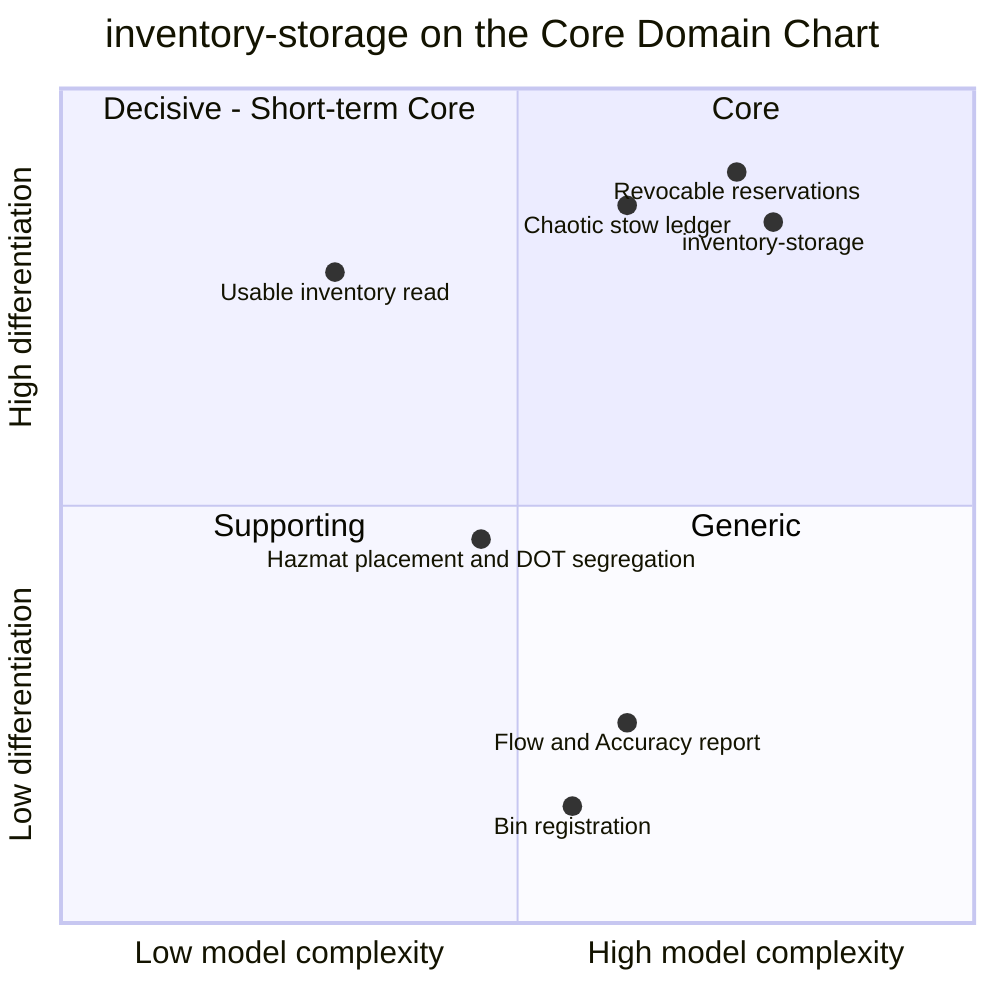

# Core Domain Chart

:::info[Synced from inventory-storage]
This page is a copy of [`docs/docs/ddd/core-domain-chart.md`](https://github.com/IQVO/inventory-storage/blob/develop/docs/docs/ddd/core-domain-chart.md) on `develop`, derived from that repository's code. Edit it there, then re-sync.
:::

Following the [ddd-crew Core Domain Charts](https://github.com/ddd-crew/core-domain-charts),
this context is plotted on **business differentiation** (y) against **model
complexity** (x). The classification is the one already recorded on the
[Subdomain Classification](https://github.com/IQVO/inventory-storage/blob/develop/docs/docs/ddd/subdomain-classification.md) page: **Core
subdomain, WMS tier** ("Inventory & Slotting" in the reference model). This
chart does not re-decide it; it shows where inside the Core quadrant the
context sits, and where its own capabilities fall.

Source: classification from `docs/docs/ddd/subdomain-classification.md`;
complexity evidence from `internal/domain/**`, `internal/application/usecases/**`,
`migrations/*.up.sql` and `docs/docs/adr/`. Coordinates are **estimates** —
ddd-crew charts are a conversation aid, not a measurement. Omitted: sibling
contexts (each repository charts itself).

## Why this position

### Business differentiation — high

| Evidence | Where |
| --- | --- |
| The reference model classifies "Inventory & Slotting (chaotic storage, bin-accurate location, stow strategy)" as **Core**: "random stow + bin-accurate tracking is a genuine operational innovation and the backbone of pick-path efficiency." | [Subdomain Classification](https://github.com/IQVO/inventory-storage/blob/develop/docs/docs/ddd/subdomain-classification.md) |
| Every promise the platform makes to a customer is only as good as this context's **usable** answer — `order-management` reserves against it, `network-fulfillment` quotes it to an external network. | `GET /inventory/{sku}/usable`, `POST /reservations` |
| Revocable reservations are what keep a failed physical pick from stranding an order. | [ADR 0003](https://iqvo.github.io/inventory-storage/docs/adr/0003-revocable-reservations) |
| Build-not-buy was chosen explicitly; the invariants are implemented as domain code, not a vendor model. | [ADR 0001](https://iqvo.github.io/inventory-storage/docs/adr/0001-hexagonal-ports-and-adapters), [ADR 0002](https://iqvo.github.io/inventory-storage/docs/adr/0002-chaotic-storage-over-fixed-slotting) |

### Model complexity — high

| Measure (counted in code on `develop`) | Value |
| --- | --- |
| Aggregate roots in `internal/domain/` | 4 — `StockUnit`, `Bin`, `Reservation`, `ProductClassification` |
| Enforced invariants with a failing-path test | 30 aggregate invariants + 4 stow-time cross-aggregate rules ([Aggregate Design Canvas](/contexts/inventory-storage/aggregate-design-canvas)) |
| Lifecycle states | 5 `StockUnit` states, 4 `Reservation` statuses |
| Application use cases | 11 |
| Domain events | 11 (2 integration, 9 analytics) |
| Regulatory rule set | 9 × 9 DOT segregation matrix derived from 49 CFR §177.848 with four documented simplifications ([ADR 0010](https://iqvo.github.io/inventory-storage/docs/adr/0010-dot-hazard-class-and-same-bin-segregation)) |
| Consistency mechanisms | transactional outbox, Idempotency-Key, optimistic concurrency, lazy expiry (ADRs 0017-0019, 0003) |
| ADRs | 29 |

### The capability points

- **Revocable reservations** and the **chaotic stow ledger** are the
  differentiators and carry most of the invariants — top right.
- **Usable inventory** is high-value but computationally simple (a sum over
  `StockUnit.Usable()`), so it sits in the Decisive quadrant: a short-term
  core that is valuable precisely because the ledger under it is right.
- **Hazmat placement and DOT segregation** is genuinely intricate
  (regulation-grounded, fail-open/fail-closed asymmetry) but supports rather
  than defines the business — Supporting, on the border towards Core.
- **Flow and Accuracy report** (ADR 0011) and **bin registration**
  (ADR 0025) are Generic: necessary plumbing any WMS needs and could buy.

Quadrant layout follows the ddd-crew template used across the fleet:
top-right Core, top-left Decisive (short-term core), bottom-left Supporting,
bottom-right Generic.

## Evolution

| Stage (Wardley) | Assessment |
| --- | --- |
| Genesis | Passed — chaotic stow and revocable reservations are well understood. |
| **Custom-built** | **Where the model sits today**: a hand-built, heavily tested model (90% coverage gate on domain + application, blocking mutation testing on `internal/domain/stock`, arch-go fitness tests, Gherkin acceptance specs) that is still evolving — pick location (ADR 0025), lazy expiry, the transactional outbox (ADR 0017) and the housekeeping sweeper (ADR 0026) were all added well after the initial model (ADRs 0001-0003). |
| Product | The direction of travel: the REST and event contracts are frozen-by-version Published Language that several contexts build against unchanged. |
| Commodity | Not expected while bin-accurate truth and revocable allocation remain the platform's edge. |

The design obligation that follows from Core: protect the model hard —
no framework types in the domain, no adapter imports from the application
layer, no write access from any other bounded context.
