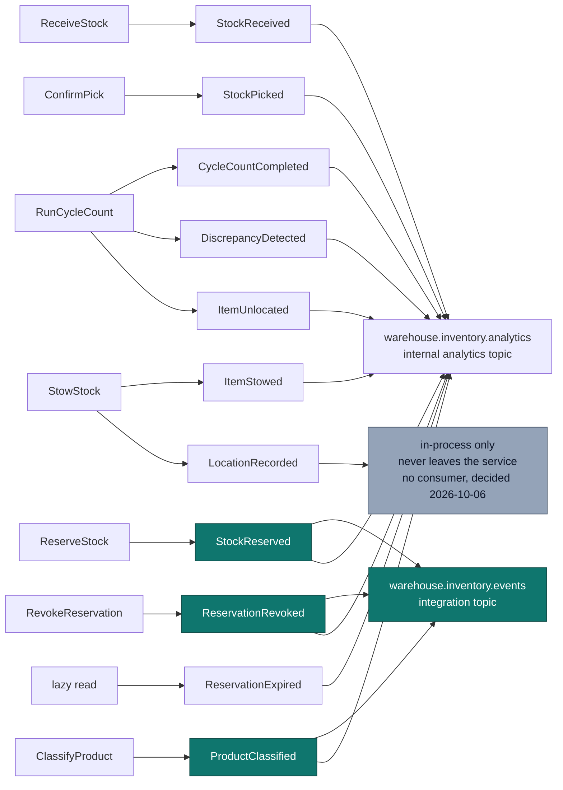

# Domain Events

:::info[Synced from inventory-storage]
This page is a copy of [`docs/docs/ddd/domain-events.md`](https://github.com/IQVO/inventory-storage/blob/develop/docs/docs/ddd/domain-events.md) on `develop`, derived from that repository's code. Edit it there, then re-sync.
:::


Eleven past-tense events, raised by four aggregates. Every event carries an
`occurredAt` taken from the injected `Clock` port — never wall-clock time at
publish — so ordering is a domain fact rather than an infrastructure artefact.

```go
// internal/domain/shared/events.go
type DomainEvent interface {
	EventName() string
	OccurredAt() time.Time
}
```

The domain never depends on the publishing mechanism. Use cases hand events to
`ports.EventPublisher`; which adapter is behind it (log, buffered, Postgres
table, Kafka) is a composition-root decision.

## The catalog

| Event | Raised by | Raised when | Payload |
| --- | --- | --- | --- |
| `StockReceived` | StockUnit *(pre-location)* | `ReceiveStock` acknowledges inbound goods | `sku`, `quantity` |
| `ItemStowed` | StockUnit | `StowStock` succeeds — item-scan + location-scan both present | `sku`, `binId`, `quantity` |
| `LocationRecorded` | StockUnit | Immediately after `ItemStowed`; the bin now authoritatively holds this unit | `stockUnitId`, `binId` |
| `StockReserved` | Reservation | `ReserveStock` succeeds | `reservationId`, `sku`, `quantity`, `demandRef` |
| `ReservationExpired` | Reservation | A reservation's timeout elapses and is discovered at the next read (`GetReservationsByDemandRef`, `RevokeReservation`, `ConfirmPick`, or `ReserveStock`'s own idempotency lookup) — **lazy, not swept**, see below | `reservationId` |
| `ReservationRevoked` | Reservation | `RevokeReservation` succeeds | `reservationId` |
| `StockPicked` | Reservation | `ConfirmPick` consumes a reservation | `reservationId`, `sku`, `quantity` |
| `ItemUnlocated` | StockUnit | A cycle-count shortfall cannot account for stock | `stockUnitId`, `sku`, `binId`, `quantity` |
| `CycleCountCompleted` | Bin | Any cycle count finishes, clean or not | `binId`, `countedQty`, `systemQty`, `discrepancy` |
| `DiscrepancyDetected` | Bin | A cycle count finds counted ≠ system | `binId`, `countedQty`, `systemQty` |
| `ProductClassified` | ProductClassification | `ClassifyProduct` registers or replaces a SKU's classification | `sku`, `handlingTags`, `temperatureClass`, `dotHazardClass` — **published on both topics since 2026-10-06** ([ADR 0031](https://iqvo.github.io/inventory-storage/docs/adr/0031)); wire fields below |

## Which events flow where



**`StockReserved`, `ReservationRevoked` and, since 2026-10-06,
`ProductClassified` are the integration events on the reservation and
master-data paths** (plus the two transfer replies,
[ADR 0030](https://iqvo.github.io/inventory-storage/docs/adr/0030)). The integration publisher's `Encode` returns
nothing for every other event — deliberate, not an oversight: those are the
published integration contract. Ten of the eleven events also go to the
internal analytics topic (the projector ignores `ProductClassified`);
only `LocationRecorded` goes nowhere (no outbox row, no Kafka message — it has
no consumer, so it stays in-process by decision). `apis/asyncapi.yaml`
documents both channels, so a downstream team cannot mistake a documented
analytics event for a wired integration one.

## Wire catalogue

Every published event, from the publishers' `Encode` methods
(`internal/adapters/outbound/kafka/publisher.go`,
`analytics_publisher.go`). All messages are CloudEvents 1.0 structured mode,
`source=/warehouse/inventory-storage`, routed with the `Hash` balancer on the
Kafka key (ADR 0021), and — with Postgres and `EVENT_PUBLISHER=kafka` —
enqueued in `outbox_events` by the producing use case's transaction and
relayed by `cmd/inventory`.

| Event | Full CloudEvents `type` | Topic | Kafka key / `subject` | `data` fields | Producer use case | Known consumers |
| --- | --- | --- | --- | --- | --- | --- |
| StockReserved | `com.warehouse.wms.inventory-storage.reservation.StockReserved` | `warehouse.inventory.events` | reservation id / reservation id | `sku`, `quantity`, `demand_ref` | `ReserveStock` | `wes-work-planning` (decrements its observed usable) |
| StockReserved | same `type` | `warehouse.inventory.analytics` | reservation id / reservation id | `sku`, `reservation_id`, `quantity` | `ReserveStock` | `cmd/inventory-projector` |
| ReservationRevoked | `com.warehouse.wms.inventory-storage.reservation.ReservationRevoked` | `warehouse.inventory.events` | reservation id / reservation id | `sku`, `quantity`, `demand_ref` (enriched by repo lookup) | `RevokeReservation` (REST and MCP) | `wes-work-planning` (increments its observed usable) |
| ReservationRevoked | same `type` | `warehouse.inventory.analytics` | reservation id / reservation id | `reservation_id`, `sku` (enriched) | `RevokeReservation` | `cmd/inventory-projector` |
| ReservationExpired | `com.warehouse.wms.inventory-storage.reservation.ReservationExpired` | `warehouse.inventory.analytics` | reservation id / reservation id | `reservation_id`, `sku` (enriched) | lazy expiry in `GetReservationsByDemandRef`, `ReserveStock`, `RevokeReservation`, `ConfirmPick` | `cmd/inventory-projector` |
| StockPicked | `com.warehouse.wms.inventory-storage.reservation.StockPicked` | `warehouse.inventory.analytics` | reservation id / reservation id | `sku`, `reservation_id`, `quantity` | `ConfirmPick` | `cmd/inventory-projector` |
| StockReceived | `com.warehouse.wms.inventory-storage.stock.StockReceived` | `warehouse.inventory.analytics` | SKU / SKU | `sku`, `quantity` | `ReceiveStock` | `cmd/inventory-projector` |
| ItemStowed | `com.warehouse.wms.inventory-storage.stock.ItemStowed` | `warehouse.inventory.analytics` | SKU / SKU | `sku`, `bin_id`, `quantity` | `StowStock` | `cmd/inventory-projector` |
| ItemUnlocated | `com.warehouse.wms.inventory-storage.stock.ItemUnlocated` | `warehouse.inventory.analytics` | SKU / stock unit id | `sku`, `bin_id`, `stock_unit_id`, `quantity` | `RunCycleCount` | `cmd/inventory-projector` |
| CycleCountCompleted | `com.warehouse.wms.inventory-storage.bin.CycleCountCompleted` | `warehouse.inventory.analytics` | bin id / bin id | `bin_id`, `counted`, `system`, `discrepancy` | `RunCycleCount` | `cmd/inventory-projector` |
| DiscrepancyDetected | `com.warehouse.wms.inventory-storage.bin.DiscrepancyDetected` | `warehouse.inventory.analytics` | bin id / bin id | `bin_id`, `counted`, `system` | `RunCycleCount` | `cmd/inventory-projector` |
| LocationRecorded | — (not published; **decided 2026-10-06: stays in-process**, no consumer) | — | — | — | `StowStock` | none |
| ProductClassified | `com.warehouse.wms.inventory-storage.product.ProductClassified` | `warehouse.inventory.events` | SKU / SKU | `sku`, `handling_tags`, `temperature_class?`, `dot_hazard_class?` (full-state replacement) | `ClassifyProduct` (via the outbox, same transaction as the save) | none yet — siblings may keep a local copy instead of polling `GET /products/{sku}/classification` ([ADR 0031](https://iqvo.github.io/inventory-storage/docs/adr/0031)) |
| ProductClassified | same `type` | `warehouse.inventory.analytics` | SKU / SKU | same shape | `ClassifyProduct` | none — `cmd/inventory-projector` ignores it |

`dataschema` is `urn:warehouse:inventory-storage:events:<EventName>:v1` on
the integration topic and `urn:warehouse:inventory-storage:analytics:<EventName>:v1`
on the analytics topic.

### Consumed events

| Event | Full CloudEvents `type` | Topic | Consumer (group) | Effect |
| --- | --- | --- | --- | --- |
| ZoneRegistered | `com.warehouse.wms.facility-layout.zone.ZoneRegistered` | `warehouse.facility.events` | `facilitycache.Consumer` (per-process group `inventory-storage-facility-location-cache-<host>-<pid>-<ns>`, FirstOffset replay) | caches zone `hazmat` + `temperatureClass` by `zoneId` |
| LocationSlotRegistered | `com.warehouse.wms.facility-layout.locationslot.LocationSlotRegistered` | `warehouse.facility.events` | same | maps `locationCode` → `zoneId` (derived from the code when absent) |
| LocationSlotDecommissioned | `com.warehouse.wms.facility-layout.locationslot.LocationSlotDecommissioned` | `warehouse.facility.events` | same | drops the slot, so it answers `Known=false` |
| all nine analytics types above | `com.warehouse.wms.inventory-storage.*` | `warehouse.inventory.analytics` | `cmd/inventory-projector` (group `inventory-analytics`, FirstOffset) | upserts `flow_accuracy_rollup`, dedupes on the CloudEvents `id`; `ProductClassified` on the same topic is acknowledged and ignored |

Any other `type` on `warehouse.facility.events` is ignored; a message that
is not a valid CloudEvent is dead-lettered to `warehouse.facility.events.dlq`.
The projector WARN-logs and skips invalid messages instead.

## Lazy expiry: no sweeper, resolved at the next read

`ReservationExpired` and `Reservation.Expire()` exist in the domain and are
unit-tested, and **are now genuinely raised** — but not by a background
sweeper. The decision (2026-09-26, see [ADR 0003](https://iqvo.github.io/inventory-storage/docs/adr/0003-revocable-reservations))
is **lazy expiry**: a timed-out reservation is discovered and resolved the
next time it is read, not on a schedule. Every read path that can return a
`Reservation` runs the same check first — `GetReservationsByDemandRef`,
`RevokeReservation`, `ConfirmPick`, and `ReserveStock`'s own idempotency
lookup — so there is no window where a stale `ACTIVE` reservation can be
returned to a caller:

- if the reservation is `ACTIVE` and past `expiresAt`, the read transitions
  it to `EXPIRED`, returns its allocated quantity to the owning `StockUnit`'s
  usable pool, persists both changes, and publishes `ReservationExpired`
  through the same `ports.EventPublisher` every other domain event uses —
  all before the read returns;
- if it is already `EXPIRED`, `CONFIRMED`, or `REVOKED`, the read is a no-op:
  the event is never raised twice for the same reservation;
- `Reservation.Confirm(now)` still independently returns `ErrExpired` past
  `expiresAt` as a second line of defence — but by the time `ConfirmPick`
  reaches that call, the lazy-expiry check on its own read has usually
  already resolved the reservation to `EXPIRED`, so the caller sees
  `ErrAlreadyResolved` instead.

The practical consequence: a reservation nobody revokes still holds quantity
out of usable until it is *read* — there remains no proactive reclaim of
quantity for a reservation that both times out **and** is never looked up
again. **Decided 2026-10-06: kept** — lazy expiry stays, with no sweeper
(ADR 0003; pick confirmation moving to a pick-completion event, ADR 0032,
narrows the gap further once it lands). That is judged an acceptable
trade-off for this service's read
volume; if it stops being one, the fix is a scheduled read (e.g. a periodic
call to `GetReservationsByDemandRef` or a dedicated sweep use case), not a
change to the lazy check itself. `apis/asyncapi.yaml` documents
`ReservationExpired`'s payload; it reaches the analytics topic
(`warehouse.inventory.analytics`) the same way `ReservationRevoked` does, via
`kafka/analytics_publisher.go`.

## Naming conventions

Two conventions coexist, and the difference is worth understanding.

### In-process: bare past-tense names

`shared.DomainEvent.EventName()` returns the bare name — `"StockReserved"`,
`"ItemStowed"`. That is the domain's own vocabulary and it deliberately carries
no transport or platform naming.

### On the wire: reverse-DNS CloudEvents `type`

The platform-wide convention, shared across the fleet's services:

```text
com.warehouse.<subdomain>.<bounded-context>.<entity>.<EventName>
```

All lowercase except the final PascalCase event name. For this context the
subdomain segment is `wms` and the bounded context is `inventory-storage`:

```text
com.warehouse.wms.inventory-storage.stock.ItemStowed
com.warehouse.wms.inventory-storage.reservation.ReservationRevoked
com.warehouse.wms.inventory-storage.bin.CycleCountCompleted
```

Entity segments group by the aggregate that raises the event: `stock`,
`reservation`, `bin`.

`StockPicked` is grouped under `reservation` rather than `stock`, because it is
emitted by `ConfirmPick` when a reservation is consumed and the reservation id
is the only identity it carries.

## What the Kafka adapters emit

Every message is a **CloudEvents 1.0** event in structured mode — the only
envelope ([ADR-0024](https://github.com/IQVO/inventory-storage/blob/develop/docs/docs/adr/0024-cloudevents-mandatory-envelope.md)). The
integration publisher (`warehouse.inventory.events`) and the analytics
publisher (`warehouse.inventory.analytics`) both build it through
`internal/adapters/kafka/cloudevents`:

```json
{
  "specversion": "1.0",
  "id": "9f1c2d3e-4b5a-4c6d-8e7f-0a1b2c3d4e5f",
  "source": "/warehouse/inventory-storage",
  "type": "com.warehouse.wms.inventory-storage.reservation.StockReserved",
  "subject": "res-1",
  "time": "2026-08-21T22:00:00Z",
  "datacontenttype": "application/json",
  "dataschema": "urn:warehouse:inventory-storage:events:StockReserved:v1",
  "data": { "sku": "SKU-1", "quantity": 6, "demand_ref": "order-42" }
}
```

The `id` is minted once when the event is encoded and stored inside the
outbox row, so a relay redelivery carries the same `id`. See the
[Events page](https://iqvo.github.io/inventory-storage/docs/api-reference/events) for every type and payload.

## A detail worth knowing: `ReservationRevoked` enrichment

The domain event `ReservationRevoked` carries only a `reservationId` — the
aggregate has no reason to repeat data the reservation already holds. But the
integration contract promises `{sku, quantity, demand_ref}`, because the
downstream projection is keyed by SKU and cannot do a lookup.

The Kafka adapter bridges that gap by re-reading the reservation through
`ReservationRepo` at publish time:

```go
case shared.ReservationRevoked:
	res, err := p.reservations.FindByID(ctx, e.ReservationID)
	if err != nil { return err }
	if res == nil { return ErrReservationNotFound }
	data = reservationData{SKU: res.SKU().String(), Quantity: res.Quantity().Int(), DemandRef: res.DemandRef()}
```

This is the right place for it: enrichment for a downstream consumer's
convenience is an **adapter** concern, and putting the extra fields on the
domain event to save a lookup would let an integration requirement leak into
the domain model. The use case saves the reservation before publishing, so the
lookup always succeeds; `ErrReservationNotFound` exists as a guard, not as an
expected path.

## Read models are projections

`CLAUDE.md` states it as a rule: read models (usable-by-SKU, bin occupancy) are
**projections from events**, not separately-maintained aggregates. Inside this
service, `GetUsable` projects from `StockUnit`s at read time. Across the
boundary, `wes-work-planning` projects `StockReserved` / `ReservationRevoked`
into its own `UsableInventoryObserved` read model keyed by SKU. Same discipline,
two scopes.
