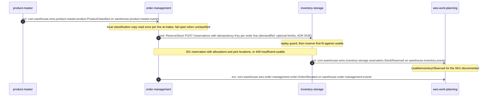
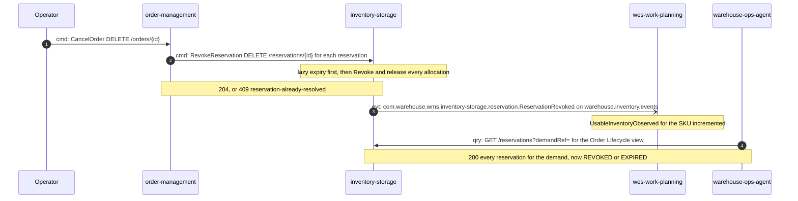
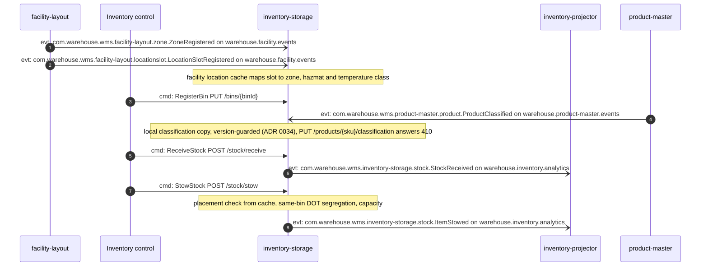
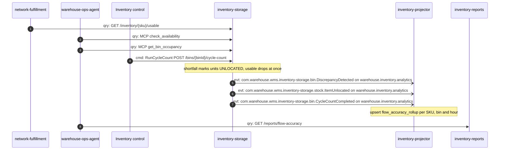
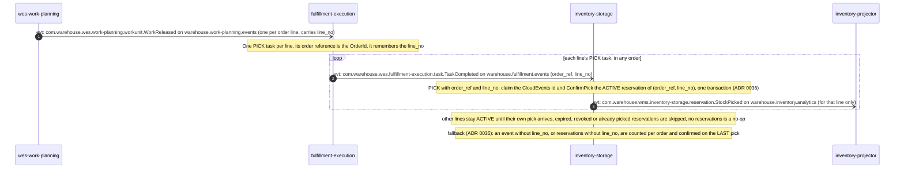

# Domain Message Flow

:::info[Synced from inventory-storage]
This page is a copy of [`docs/docs/ddd/domain-message-flow.md`](https://github.com/IQVO/inventory-storage/blob/develop/docs/docs/ddd/domain-message-flow.md) on `develop`, derived from that repository's code. Edit it there, then re-sync.
:::

Following [ddd-crew Domain Message Flow Modelling](https://github.com/ddd-crew/domain-message-flow-modelling).
Each scenario is a sequence of messages between bounded contexts (and the
people or tools acting on them). Every arrow is prefixed **`cmd:`**
(command), **`qry:`** (query) or **`evt:`** (event) and numbered; every
message is a real REST route, MCP tool or CloudEvents `type` — nothing is
invented. Solid arrows are synchronous calls; open arrows are Kafka events.
Responses are folded into notes so that every arrow is a domain message.

## 1. Order allocation reserves usable stock

`order-management` takes in an order, checks handling classification against
its own local copy of product-master's `ProductClassified` (no call to this
service since its ADR 0036), then reserves each line. Work Planning learns
about the reservations from events, never by asking.

Source: `order-management/internal/application/usecases/receive_order.go`,
`allocation.go`, `internal/adapters/outbound/inventorystorage/client.go`,
`internal/adapters/outbound/productclassificationcopy/postgres.go`;
this repo's `internal/adapters/inbound/http/server.go`,
`internal/application/usecases/reserve_stock.go`,
`internal/adapters/outbound/kafka/publisher.go`;
`wes-work-planning/internal/adapters/inbound/kafka/consumer.go`.
Omitted: the analytics copy of `StockReserved`, `OrderPartiallyAllocated`,
and what Work Planning does with the order afterwards.

## 2. Order cancellation gives the stock back

A cancelled order revokes every reservation it holds. The revoke is the
compensation: quantity returns to usable and can be re-reserved from any
holding.

Source: `order-management/internal/application/usecases/cancel_order.go`
and its `DELETE /orders/{id}` route;
this repo's `revoke_reservation.go`, `reservation_expiry.go`,
`get_reservations_by_demand_ref.go`;
`warehouse-ops-agent/internal/adapters/outbound/restclient/clients.go`.
Omitted: `OrderCancelled` from order-management and the analytics copies of
the events.

## 3. Inbound: register, classify, receive and stow a hazmat SKU

facility-layout's zone data reaches this context only as events, cached
locally. A stow of a classified SKU is checked against that cache and
against the bin's current occupants.

Source: `internal/adapters/outbound/facilitycache/consumer.go`,
`internal/application/usecases/register_bin.go`, `apply_product_classification.go`,
`receive_stock.go`, `stow_stock.go`, `internal/adapters/outbound/kafka/analytics_publisher.go`.
"Inventory control" is whoever drives these routes — an operator or the
`e2e-tests` warehouse-day simulator; no sibling context does.
Omitted: `LocationRecorded` (in-process only by decision — no consumer) and
the 409 rejections.

## 4. Availability, cycle count and the accuracy report

Read-side consumers ask for usable stock; a cycle count corrects the ledger
and its effect becomes visible in the Flow & Accuracy report.

Source: `network-fulfillment/internal/adapters/outbound/inventoryclient/client.go`,
`warehouse-ops-agent/internal/adapters/outbound/mcpclient/inventory_storage.go`,
`reports_clients.go`; this repo's `run_cycle_count.go`,
`internal/adapters/inbound/kafka/analytics_consumer.go`,
`internal/adapters/inbound/http/reports_handler.go`.
`inventory-projector` and `inventory-reports` are this context's own
binaries, drawn separately because they talk to it only through the
analytics topic. Omitted: the overage branch (no `ItemUnlocated`) and the
MCP report tool.

## 5. A completed pick confirms exactly its own line's reservation

The physical pick is reported by `fulfillment-execution`, one PICK task per order
**line**, every one carrying the order's reference and (since ADR 0036) the line
number; this context turns **each** of them into the decrement of that line's
reserved stock without anyone calling it. The reservations were made in scenario 1
with `demandRef` = the OrderId and `lineNo` = the order line.

Source: this repo's `internal/adapters/inbound/kafka/task_completed_consumer.go`,
`internal/application/usecases/confirm_picks_for_order.go`, `confirm_pick.go`;
`fulfillment-execution`'s `TaskCompleted` publisher (it adds the optional
`order_ref` and `line_no`). The consumer is off by default
(`TASK_COMPLETED_CONSUMER_MODE`). A `Reservation` stores the order line it was
made for (`line_no`, sent by order-management as `lineNo`), so lines 1 and 3 being
picked confirms exactly lines 1 and 3 and leaves line 2 `ACTIVE`. Reservations
created before `line_no` existed, and `TaskCompleted` events from a producer that
does not send it, keep the older counting (confirm on the order's last pick, never
early). Short picks are not modelled, because a Task carries no SKU or quantity.
Omitted: the DLQ and the redelivery branch.
