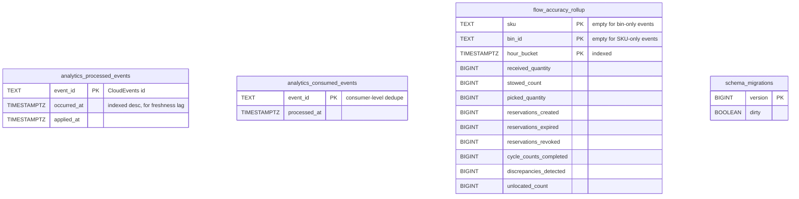

# Entity-Relationship Diagram

:::info[Synced from inventory-storage]
This page is a copy of [`docs/docs/ddd/entity-relationship.md`](https://github.com/IQVO/inventory-storage/blob/develop/docs/docs/ddd/entity-relationship.md) on `develop`, derived from that repository's code. Edit it there, then re-sync.
:::

The schema after applying `migrations/0001`…`0008`, `0033` (`processed_events`),
`0034` (`order_pick_progress`) and `0035` (`reservations.line_no`) (OLTP database,
`DATABASE_URL`) and `migrations/analytics/0001` (analytical database,
`ANALYTICS_DATABASE_URL`) in order. Relationship lines are drawn **only**
where a real `FOREIGN KEY` (`REFERENCES`) exists in the migrations.

## OLTP database

```mermaid
erDiagram
    bins {
        TEXT id PK
        INTEGER capacity "CHECK capacity > 0"
        INTEGER occupied "CHECK occupied >= 0"
        INTEGER version "optimistic concurrency, default 1"
    }
    stock_units {
        TEXT id PK
        TEXT sku "indexed"
        TEXT bin_id FK "REFERENCES bins, indexed"
        INTEGER quantity "CHECK quantity >= 0"
        INTEGER reserved "CHECK reserved >= 0"
        TEXT state "AVAILABLE RESERVED PICKED REMOVED UNLOCATED"
        INTEGER version "default 1"
    }
    reservations {
        TEXT id PK
        TEXT sku
        INTEGER quantity "CHECK quantity > 0"
        TEXT demand_ref "indexed, not unique"
        TEXT status "ACTIVE CONFIRMED REVOKED EXPIRED"
        TIMESTAMPTZ created_at
        TIMESTAMPTZ expires_at
        INTEGER version "default 1"
        INTEGER line_no "nullable order line, 32-bit: 1..2147483647 (CHECK >= 1, 0035, ADR 0036)"
    }
    reservation_allocations {
        TEXT reservation_id PK,FK "REFERENCES reservations"
        TEXT stock_unit_id PK,FK "REFERENCES stock_units"
        INTEGER quantity "CHECK quantity > 0"
        TEXT bin_id "nullable pick location, no FK"
    }
    product_classifications {
        TEXT sku PK
        TEXT_ARRAY handling_tags "TEXT array"
        TEXT temperature_class "default empty string"
        SMALLINT dot_hazard_class "nullable, 1 to 9"
    }
    outbox_events {
        BIGSERIAL id PK
        TEXT topic
        TEXT event_type "full CloudEvents type"
        BYTEA key "Kafka key"
        BYTEA value "CloudEvent JSON"
        JSONB headers "content-type and W3C trace"
        TIMESTAMPTZ created_at
        TIMESTAMPTZ published_at "null until relayed, partial index"
        INTEGER attempts
        TEXT last_error
    }
    idempotency_keys {
        TEXT key PK
        TEXT method
        TEXT path
        TEXT request_hash "SHA-256 of body"
        INTEGER status_code
        BYTEA response_body
        JSONB response_headers
        TIMESTAMPTZ created_at "indexed"
        TIMESTAMPTZ completed_at
    }
    schema_migrations {
        BIGINT version PK
        BOOLEAN dirty
    }
    processed_events {
        TEXT consumer PK "inbound flow, e.g. task-completed-confirm-pick"
        TEXT event_id PK "CloudEvents id"
        TIMESTAMPTZ processed_at
    }
    order_pick_progress {
        TEXT demand_ref PK "an OrderId, = reservations.demand_ref, no FK"
        INTEGER picked_tasks "completed PICK tasks, one per order line"
        TIMESTAMPTZ updated_at "indexed, what the sweeper ages out"
    }

    bins ||--o{ stock_units : "bin_id"
    reservations ||--|{ reservation_allocations : "reservation_id"
    stock_units ||--o{ reservation_allocations : "stock_unit_id"
```

Source: `migrations/0001_init.up.sql` … `migrations/0008_reservation_allocation_bin_id.up.sql`,
plus `0033_product_master_local_copy.up.sql` (`processed_events`),
`0034_order_pick_progress.up.sql` (`order_pick_progress`, ADR 0035) and
`0035_reservation_line_no.up.sql` (`reservations.line_no`, ADR 0036);
`schema_migrations` is created by golang-migrate (`internal/adapters/outbound/postgres/migrate.go`).
Omitted: the `events` table created by `0001` — `0005` drops it, so it is
not part of the final schema — and the tables and columns that migrations
`0030`…`0032` and `0033`'s `product_classifications` columns added (stock custody,
transfer ledger, transfer receipts, exceptions), which this diagram has not yet
been extended to cover. `TEXT_ARRAY` stands for Postgres `TEXT[]`
(kept as a plain token so the Mermaid type parses).

### Links with no foreign key (aggregate boundaries)

| Column | Points at | Why there is no FK |
| --- | --- | --- |
| `reservation_allocations.bin_id` | `bins.id` | Denormalised pick location (ADR 0025), copied from the stock unit at reserve time; nullable for rows the 0008 backfill could not resolve. |
| `stock_units.sku`, `reservations.sku` | `product_classifications.sku` | A SKU does not need a classification — unclassified SKUs are valid and fail open (ADR 0009). |
| `reservations.demand_ref` | an order line in `order-management` | Another bounded context's identity; stored opaquely, never parsed. |
| `reservations.line_no` | the order's line number in `order-management` | Another bounded context's identity, sent as `lineNo` on `POST /reservations` (ADR 0036); nullable (NULL for reservations made before migration 0035 or by a client that does not send it); with `demand_ref` it identifies the line the consumer confirms. |
| `order_pick_progress.demand_ref` | `reservations.demand_ref` | Not unique on `reservations` (one reservation per order line), and the counter row is swept independently of the reservations; correlated by value only (ADR 0035). Only written by the counting fallback for events or reservations without `line_no` (ADR 0036). |
| `outbox_events`, `idempotency_keys`, `processed_events`, `order_pick_progress` | any aggregate row | Infrastructure tables; written in the same transaction as the aggregate change, never joined to it. |

## Analytical database

Source: `migrations/analytics/0001_report.up.sql`. This database is written
only by `cmd/inventory-projector` and read only by `cmd/inventory-reports`
(ADR 0011). It has no foreign keys at all: the rollup is keyed by SKU, bin
and hour, and the two event-id tables are idempotency ledgers.

## Table ≠ aggregate

| Table | Kind | Maps to |
| --- | --- | --- |
| `stock_units` | aggregate root | `stock.StockUnit` |
| `bins` | aggregate root | `location.Bin` |
| `reservations` | aggregate root | `reservation.Reservation` |
| `reservation_allocations` | part of an aggregate | `reservation.Allocation` values inside `Reservation` — saved and loaded with it by `postgres.ReservationRepo` |
| `product_classifications` | aggregate root | `product.ProductClassification` |
| `outbox_events` | infrastructure — transactional outbox | `postgres.OutboxPublisher` / `OutboxRelay` (ADR 0017); published rows pruned by the sweeper after `OUTBOX_RETENTION` (ADR 0026) |
| `idempotency_keys` | infrastructure — HTTP idempotency | `RequireIdempotencyKey` middleware (ADR 0018); pruned after `IDEMPOTENCY_KEY_TTL` |
| `processed_events` | infrastructure — inbound CloudEvents dedupe | `postgres.ProcessedEventRepo` (ADR 0034, ADR 0035); claim inserted in the same transaction as the effect; not swept |
| `order_pick_progress` | infrastructure — per-order completed-PICK counter, the ADR 0035 counting fallback | `postgres.OrderPickProgressRepo` (ADR 0035); written only for a PICK without `line_no` or one served by line-less reservations (ADR 0036), never on the per-line path; incremented in the same transaction as the `processed_events` claim; rows not updated for `ORDER_PICK_PROGRESS_RETENTION` (default 30 days) pruned by the sweeper (ADR 0026) |
| `schema_migrations` | infrastructure — golang-migrate | migration version per database |
| `analytics_processed_events` | analytics projection | projection idempotency + freshness (`GET /reports/flow-accuracy/freshness`) |
| `analytics_consumed_events` | analytics projection | consumer-level dedupe (`report.ProcessedEvents`) |
| `flow_accuracy_rollup` | analytics projection | `report.Row`, the Inventory Flow & Accuracy report |

The OLTP `processed_events` table (migration 0033) is the inbox of the Kafka
consumers that must be exactly-once (`ApplyProductClassification`,
`ConfirmPicksForOrder`); the facility location cache, by contrast, is in memory
and rebuilt from offset 0 on every start, with idempotent upserts instead of an
id ledger.
