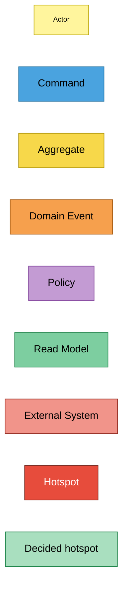
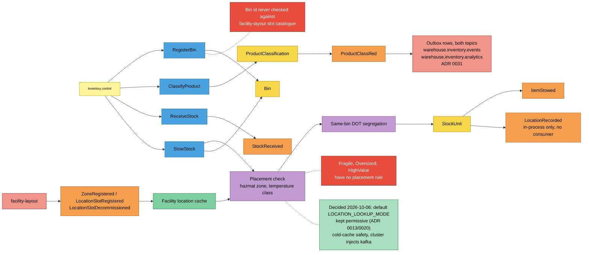
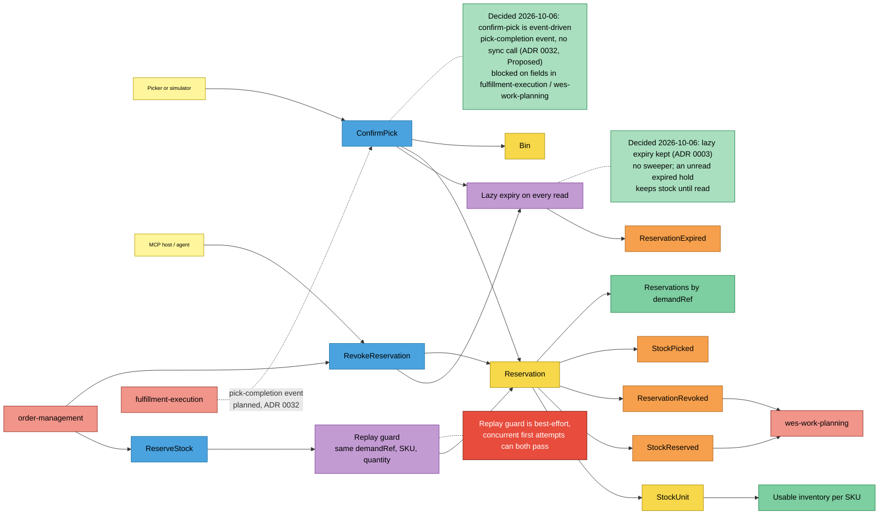
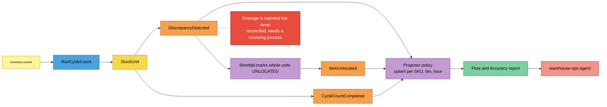

# EventStorming

:::info[Synced from inventory-storage]
This page is a copy of [`docs/docs/ddd/eventstorming.md`](https://github.com/IQVO/inventory-storage/blob/develop/docs/docs/ddd/eventstorming.md) on `develop`, derived from that repository's code. Edit it there, then re-sync.
:::

Design-level [EventStorming](https://github.com/ddd-crew/eventstorming-glossary-cheat-sheet),
reconstructed from the code rather than from a workshop: every sticky below
is a real use case, aggregate, domain event, policy or read model, and every
hotspot is a gap already documented in an ADR, a code comment or these docs.
Time flows left to right.

## Legend

## Process 1 — Inbound: register, classify, receive, stow

Source: `internal/application/usecases/register_bin.go`, `classify_product.go`,
`receive_stock.go`, `stow_stock.go`, `internal/adapters/outbound/facilitycache/consumer.go`,
`internal/domain/product/segregation.go`,
`internal/adapters/outbound/kafka/publisher.go` and `analytics_publisher.go`
(`ProductClassified`).
Omitted: the rejection paths (they raise no event) and the HTTP fallback
lookup.

## Process 2 — Reservation lifecycle

Source: `internal/application/usecases/reserve_stock.go`,
`revoke_reservation.go`, `confirm_pick.go`, `reservation_expiry.go`,
`get_usable.go`, `get_reservations_by_demand_ref.go`,
`internal/domain/reservation/reservation.go`, `internal/adapters/inbound/mcp/tools.go`.
Omitted: the analytics copies of the events and the 409 paths.

## Process 3 — Cycle count and accuracy

Source: `internal/application/usecases/run_cycle_count.go`,
`internal/adapters/inbound/kafka/analytics_consumer.go`,
`internal/adapters/outbound/analyticsstore/postgres_projection.go`,
`internal/adapters/inbound/http/reports_handler.go`.
Omitted: the clean-count branch (only `CycleCountCompleted` with
`discrepancy=false`).

## Stickies and their evidence

| Sticky | Kind | Code evidence |
| --- | --- | --- |
| Inventory control, Picker or simulator, MCP host / agent | Actor | REST callers of `PUT /bins/{binId}`, `POST /stock/*`, `POST /bins/{binId}/cycle-count`, `POST /reservations/{id}/confirm-pick`; MCP `revoke_reservation` |
| RegisterBin, ClassifyProduct, ReceiveStock, StowStock, ReserveStock, RevokeReservation, ConfirmPick, RunCycleCount | Command | `internal/application/usecases/*.go`, routed in `internal/adapters/inbound/http/server.go` |
| StockUnit, Bin, Reservation, ProductClassification | Aggregate | `internal/domain/stock`, `location`, `reservation`, `product` |
| StockReceived, ItemStowed, LocationRecorded, StockReserved, ReservationRevoked, ReservationExpired, StockPicked, ItemUnlocated, CycleCountCompleted, DiscrepancyDetected | Domain Event | `internal/domain/shared/events.go` |
| ProductClassified | Domain Event | `internal/domain/product/classification.go` |
| ZoneRegistered, LocationSlotRegistered, LocationSlotDecommissioned | Domain Event (external) | consumed in `internal/adapters/outbound/facilitycache/consumer.go` |
| Placement check | Policy | `StowStock.checkPlacement` |
| Same-bin DOT segregation | Policy | `StowStock.checkSegregation`, `product.Incompatible` |
| Replay guard | Policy | `ReserveStock.activeReservationFor`, `isReplayOf` |
| Lazy expiry on every read | Policy | `expireIfDue`, `expireAllIfDue` |
| Shortfall marks whole units UNLOCATED | Policy | `RunCycleCount.markShortfallUnlocated` |
| Projector upsert | Policy | `inbound/kafka.AnalyticsConsumer`, `analyticsstore.PostgresProjection` |
| Facility location cache | Read Model | `facilitycache.Consumer.GetSlotAttributes` |
| Usable inventory per SKU | Read Model | `usecases.GetUsable` |
| Reservations by demandRef | Read Model | `usecases.GetReservationsByDemandRef` |
| Flow and Accuracy report | Read Model | `internal/analytics/report`, table `flow_accuracy_rollup` |
| facility-layout, order-management, wes-work-planning, fulfillment-execution, warehouse-ops-agent | External System | see the [Context Map](/contexts/inventory-storage/context-map) |

## Hotspots and where they are documented

| # | Hotspot | Documented in |
| --- | --- | --- |
| H1 | A bin id is never validated against facility-layout's slot catalogue | [Context Map](/contexts/inventory-storage/context-map), "What is still not built" |
| H2 | `Fragile`, `Oversized`, `HighValue` carry no placement rule | [Context Map](/contexts/inventory-storage/context-map); ADR 0009 |
| H3 | **Decided 2026-10-06: kept permissive** (ADR 0013/0020) — the binary default `LOCATION_LOOKUP_MODE=permissive` stays: a cold facility cache would reject every receipt, and the cluster already injects `kafka` | `cmd/inventory/main.go` `buildLocationLookup`; ADR 0013, ADR 0020 |
| H4 | ~~`ProductClassified` is raised but never published~~ **Resolved 2026-10-06**: published through the outbox on both topics (ADR 0031); `LocationRecorded` stays in-process (no consumer) | [ADR 0031](https://iqvo.github.io/inventory-storage/docs/adr/0031), [Domain Events](/contexts/inventory-storage/domain-events) |
| H5 | **Decided 2026-10-06: kept** (ADR 0003) — no background sweeper for timed-out reservations; expiry stays lazy | [Domain Events](/contexts/inventory-storage/domain-events#lazy-expiry-no-sweeper-resolved-at-the-next-read); ADR 0003 |
| H6 | The `ReserveStock` replay guard is best-effort under concurrency | code comment on `activeReservationFor` in `reserve_stock.go` |
| H7 | **Decided 2026-10-06: event-driven** (ADR 0032, *Proposed*) — picks are confirmed from a pick-completion event published by fulfillment-execution, never a sync REST/MCP call; blocked on fields that event does not carry yet | [ADR 0032](https://iqvo.github.io/inventory-storage/docs/adr/0032), [Context Relationships](https://github.com/IQVO/inventory-storage/blob/develop/docs/docs/ddd/context-relationships.md) |
| H8 | Cycle-count overage is reported, never reconciled | `run_cycle_count.go` comment; [Use Cases](https://github.com/IQVO/inventory-storage/blob/develop/docs/docs/ddd/use-cases.md) |
