# Sequence Diagrams

:::info[Synced from inventory-storage]
This page is a copy of [`docs/docs/ddd/sequence-diagrams.md`](https://github.com/IQVO/inventory-storage/blob/develop/docs/docs/ddd/sequence-diagrams.md) on `develop`, derived from that repository's code. Edit it there, then re-sync.
:::

One diagram per command use case (REST and MCP), plus the background flows
(outbox relay, facility location cache, analytics projector) and the one
read with side effects (lazy expiry). Each follows the actual function body:
the order of calls, the `UnitOfWork` transaction boundary (shaded), and the
error branches as `alt`. Unless stated otherwise the diagrams show the
deployed configuration: Postgres (`DATABASE_URL` set) and
`EVENT_PUBLISHER=kafka`, so `Publish` means "insert an `outbox_events` row
in the current transaction". In-memory mode skips the idempotency middleware
and the transaction and logs events instead.

Participants: **Client**, the inbound adapter (**HTTP**, **MCP** or a Kafka
consumer), the **use case**, the **aggregate**, the **repository** port,
**Outbox** (`postgres.OutboxPublisher`, running the Kafka encoders) and the
downstream system.

## 1. ReceiveStock — `POST /stock/receive`

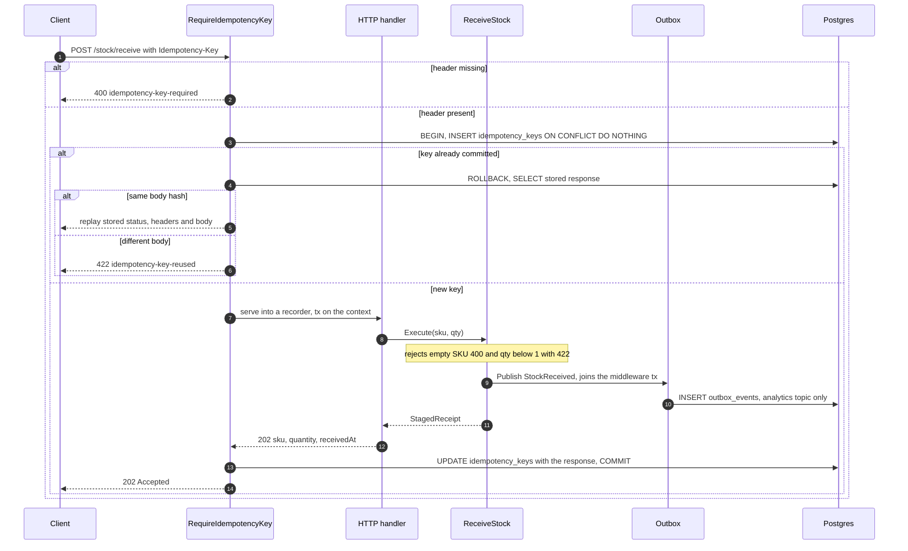

Source: `internal/adapters/inbound/http/idempotency.go`, `server.go`
(`handleReceiveStock`), `internal/application/usecases/receive_stock.go`,
`internal/adapters/outbound/postgres/outbox_publisher.go`.
Omitted: the 500 branches of the middleware; no aggregate is persisted —
a staged receipt is not an aggregate.

## 2. StowStock — `POST /stock/stow`

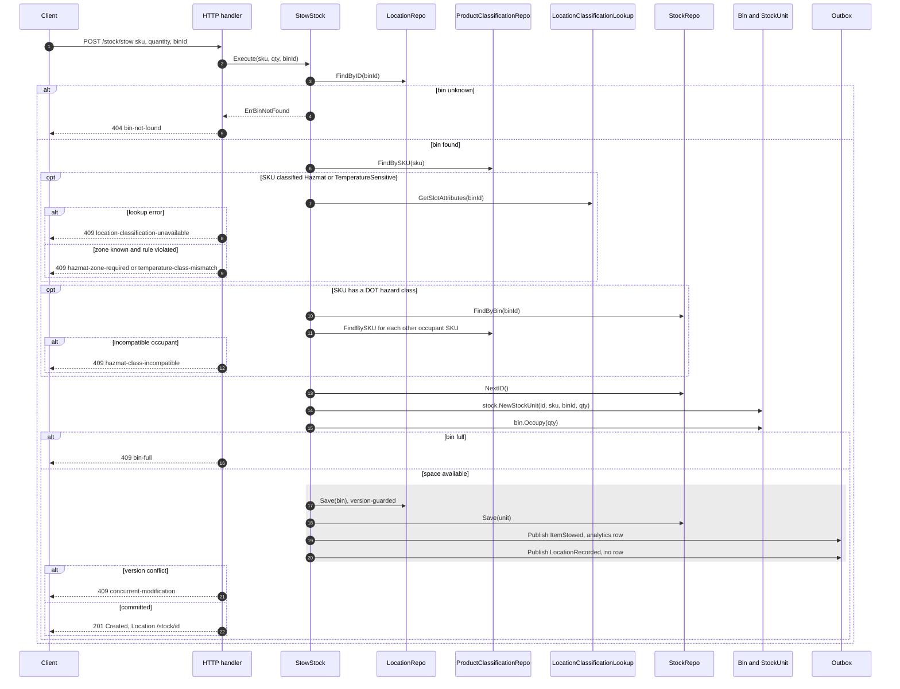

Source: `internal/application/usecases/stow_stock.go`,
`internal/adapters/outbound/postgres/location_repo.go`, `stock_repo.go`.
Omitted: the 400 and 422 validation in the handler, and the in-memory
`facilitycache` versus HTTP lookup detail (the cache never errors).

## 3. ReserveStock — `POST /reservations`

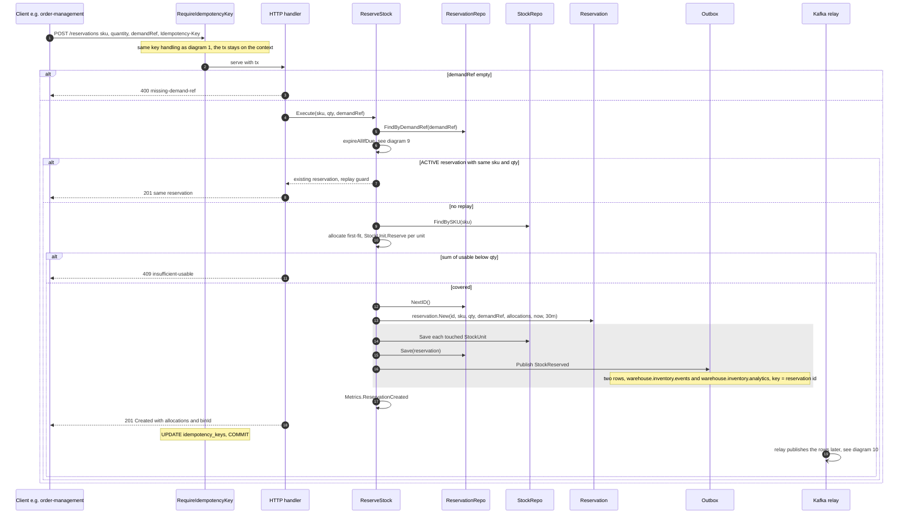

Source: `internal/application/usecases/reserve_stock.go`,
`reservation_expiry.go`, `internal/adapters/inbound/http/server.go`
(`handleReserveStock`), `internal/adapters/outbound/kafka/publisher.go`.
Note: the touched `StockUnit` saves, the reservation save and the publish all
run inside the use case's own `UnitOfWork` scope, so they commit or roll back
together whether or not an outer (middleware) transaction is on the context.
The grey block is that scope.
Omitted: `ErrConcurrentModification` (409) on a racing unit save.

## 4. RevokeReservation — `DELETE /reservations/{id}` and MCP `revoke_reservation`

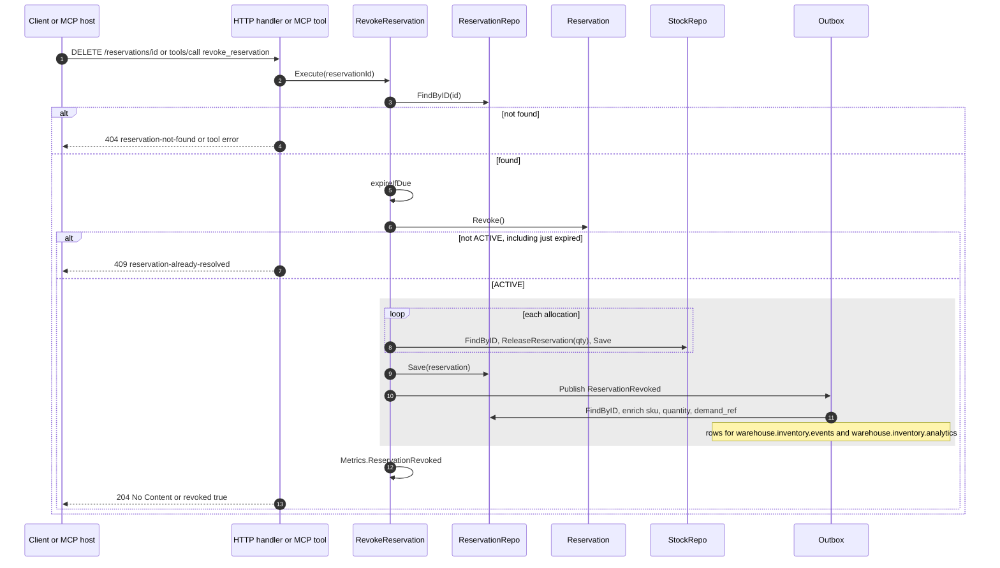

Source: `internal/application/usecases/revoke_reservation.go`,
`internal/adapters/inbound/mcp/tools.go`, `internal/adapters/outbound/kafka/publisher.go`
(`Encode` enrichment). Omitted: `ErrStockUnitNotFound` and version
conflicts inside the loop (404 and 409, transaction rolled back).

## 5. ConfirmPick — `POST /reservations/{id}/confirm-pick`

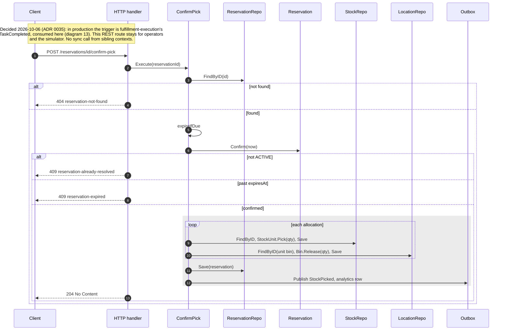

Source: `internal/application/usecases/confirm_pick.go`.
Omitted: `ErrStockUnitNotFound` / `ErrBinNotFound` (404) and version
conflicts (409) inside the transaction.

## 6. RunCycleCount — `POST /bins/{binId}/cycle-count`

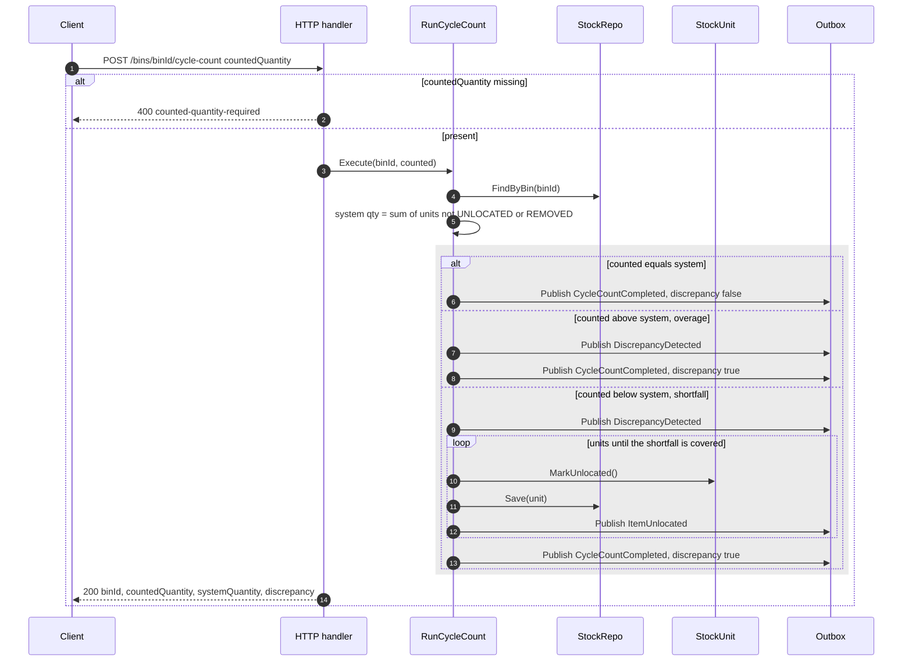

Source: `internal/application/usecases/run_cycle_count.go`.
Omitted: an unknown bin is not an error here — it simply has system
quantity 0.

## 7. ApplyProductClassification — product-master's `ProductClassified` (ADR 0034)

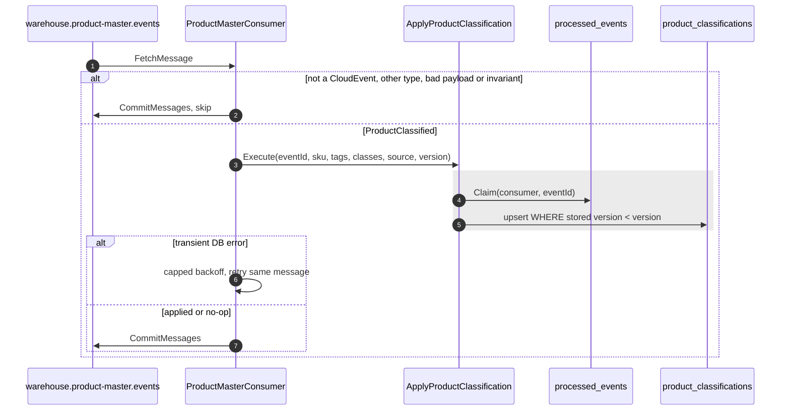

`PUT /products/{sku}/classification` answers `410 classification-moved`
without reading the body. Source:
`internal/adapters/inbound/kafka/product_master_consumer.go`,
`internal/application/usecases/apply_product_classification.go`,
`internal/adapters/outbound/postgres/product_classification_repo.go`.
Omitted: the deprecated read `GET /products/{sku}/classification`, a direct
repository lookup on the local copy with no use case.

## 8. RegisterBin — `PUT /bins/{binId}`

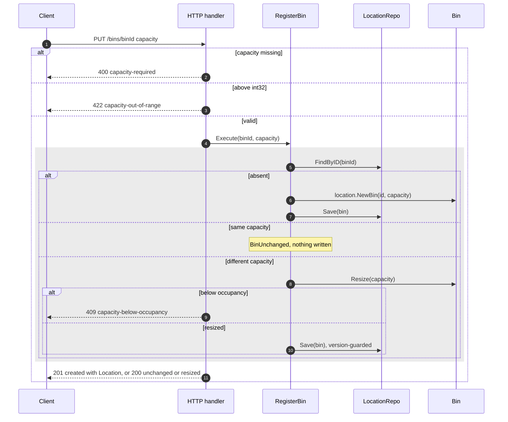

Source: `internal/application/usecases/register_bin.go`,
`internal/adapters/inbound/http/server.go` (`handleRegisterBin`).
Omitted: 422 `invalid-bin-capacity` for capacity below 1, and 409
`concurrent-modification` when a stow races the resize. No event is
published (ADR 0025).

## 9. Lazy expiry — `GET /reservations?demandRef=`

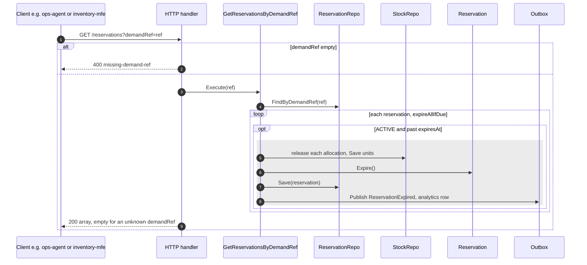

Source: `internal/application/usecases/get_reservations_by_demand_ref.go`,
`reservation_expiry.go`. The same `expireIfDue` runs inside diagrams 3, 4
and 5. Each expired reservation gets its own transaction. Omitted: the
read-only `GET /inventory/{sku}/usable` and `GET /bins/{binId}` (no side
effects).

## 10. Outbox relay to Kafka

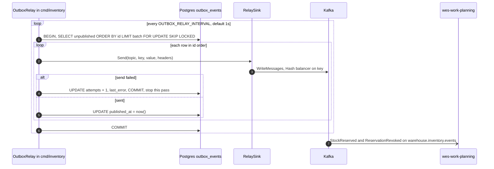

Source: `internal/adapters/outbound/postgres/outbox_relay.go`,
`internal/adapters/outbound/kafka/relay_sink.go`, `cmd/inventory/main.go`.
Omitted: the housekeeping `Sweeper` that later deletes published rows older
than `OUTBOX_RETENTION` (ADR 0026). `cmd/mcp` writes outbox rows but runs no
relay — the relay in `cmd/inventory` drains them.

## 11. Facility location cache — consuming `warehouse.facility.events`

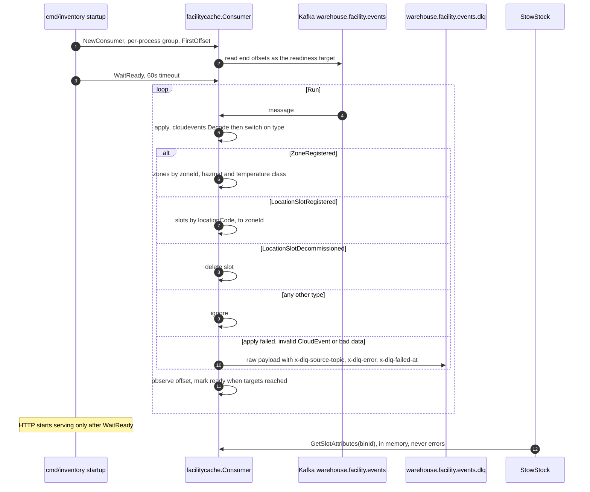

Source: `internal/adapters/outbound/facilitycache/consumer.go`,
`cmd/inventory/main.go` (`buildLocationLookup`).
Omitted: the `bootretry` around the initial dial and the empty-cache
warning.

## 12. Analytics projector — consuming `warehouse.inventory.analytics`

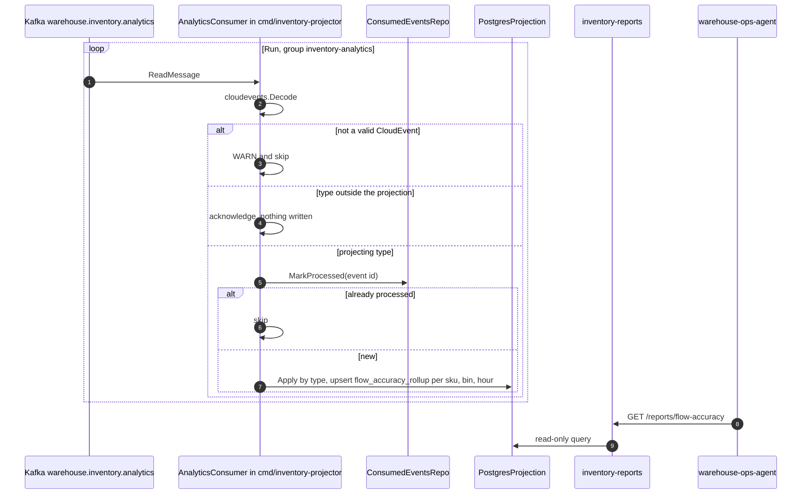

Source: `internal/adapters/inbound/kafka/analytics_consumer.go`,
`internal/adapters/outbound/analyticsstore/consumed_events_repo.go`,
`postgres_projection.go`, `internal/adapters/inbound/http/reports_handler.go`.
Omitted: tracing spans and the freshness endpoint.

## 13. ConfirmPicksForOrder — fulfillment-execution's `TaskCompleted`, confirm exactly the picked line (ADR 0036; counting fallback ADR 0035)

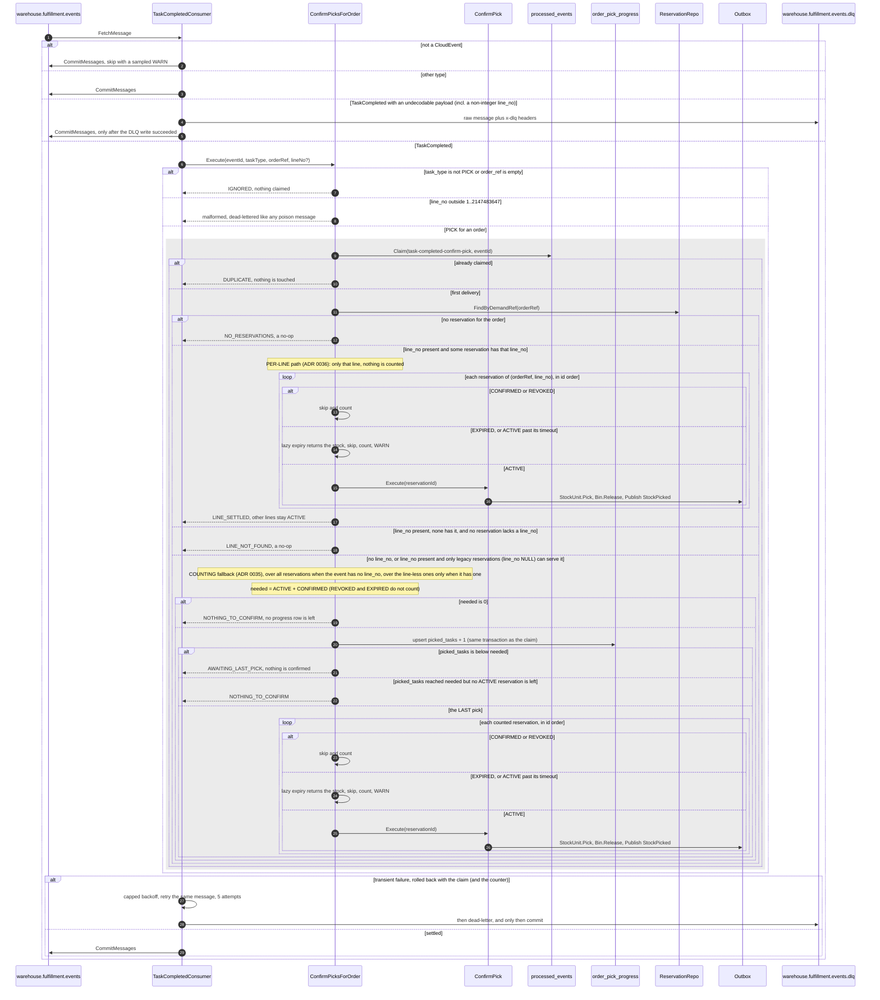

A PICK task is per order **line**. Since ADR 0036 the `Reservation` stores the
order line it was made for (`reservations.line_no`, sent by order-management as
`lineNo`) and `TaskCompleted` carries the task's `line_no`, so a pick confirms
**exactly its own line**: lines 1 and 3 picked, line 2 not, confirms 1 and 3 and
leaves 2 `ACTIVE` with its stock still reserved. Nothing is counted on that path
and no `order_pick_progress` row is written, so ADR 0035's "one pick early"
edge (a revoked or expired line shifting the count) is closed for line-aware
events. The counting of ADR 0035 stays as the backward-compatible fallback: for
an event without `line_no`, or for reservations made before `line_no` existed
(`NULL`), the consumer counts the order's completed PICK tasks and confirms only
on the **last** one (confirming early would mark unpicked lines as picked with no
undo, confirming late is safe: the reservation keeps the stock unavailable, and
expires lazily if it is never confirmed). The counter row is deleted by the
housekeeping sweeper after `ORDER_PICK_PROGRESS_RETENTION` (default 30 days). A
redelivered event id is stopped by the claim before anything is touched. No
reservation for the order (a transfer or a non-inventory order) settles as a
successful no-op. Short picks are not modelled (a Task carries no SKU or
quantity). Source:
`internal/adapters/inbound/kafka/task_completed_consumer.go`,
`internal/application/usecases/confirm_picks_for_order.go`, `confirm_pick.go`,
`internal/adapters/outbound/postgres/order_pick_progress_repo.go`, `sweeper.go`,
`cmd/inventory/confirmpick.go`. Omitted: the `bootretry` around the first
broker dial and tracing spans.
