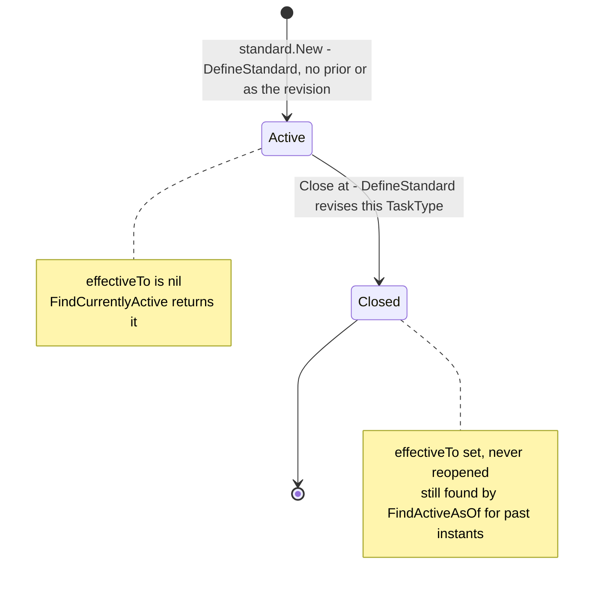
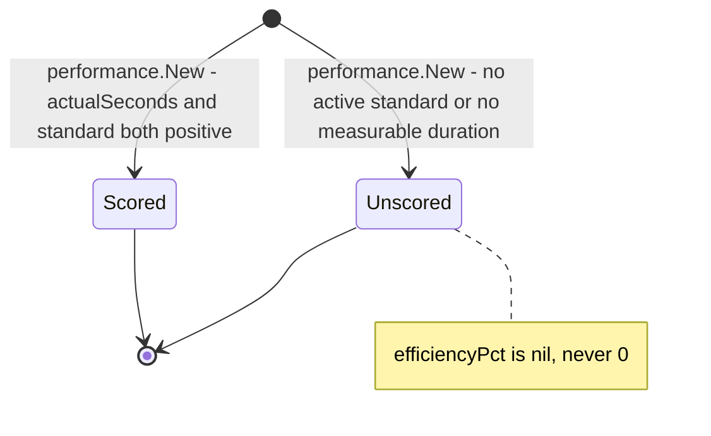
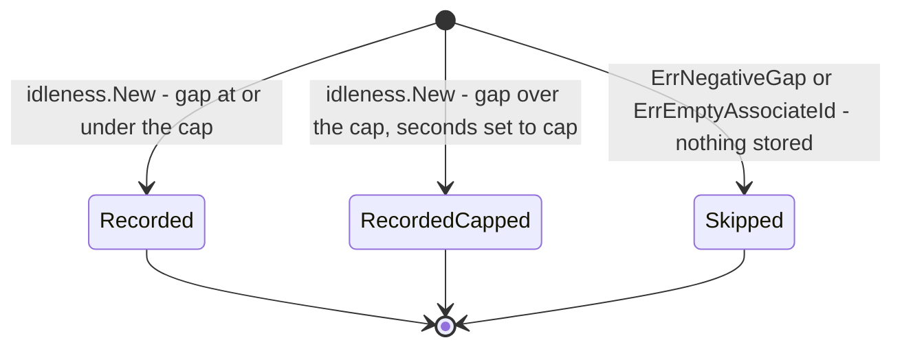

# Aggregate Design Canvas

:::info[Synced from labor-performance]
This page is a copy of [`docs/docs/ddd/aggregate-design-canvas.md`](https://github.com/IQVO/labor-performance/blob/develop/docs/docs/ddd/aggregate-design-canvas.md) on `develop`, derived from that repository's code. Edit it there, then re-sync.
:::

Following the [ddd-crew Aggregate Design Canvas v1.1](https://github.com/ddd-crew/aggregate-design-canvas),
one section per aggregate root found in `internal/domain/**`. None of the
three roots has a status enum: their lifecycle is either derived from a
nullable field (`LaborStandard.effectiveTo`) or they are immutable facts
once constructed. The state diagrams below are drawn from the constructor
and mutator methods that actually exist.

## LaborStandard

### 1. Name

`standard.LaborStandard` (`internal/domain/standard/standard.go`), keyed
by `shared.StandardId`. Persisted in `labor_standards`.

### 2. Description

How long one `TaskType` *should* take: `expectedSeconds`, an optional
`travelComponentSeconds` breakdown (ADR 0015) and an effective range
`[effectiveFrom, effectiveTo)`. History is append-only: a revision closes
the prior record and a new record (new `StandardId`) starts at the same
instant, so already-scored rows stay historically accurate (ADR 0004).
`version` is the optimistic-concurrency token (ADR 0022).

### 3. State Transitions

Source: `internal/domain/standard/standard.go` (`New`, `Close`,
`IsActiveAt`), `internal/application/usecases/define_standard.go`.
Omitted: `Rehydrate` (a persistence round-trip, not a transition) and the
`version` bump, which is a repository concern.

### 4. Enforced Invariants

| Invariant | Enforced by |
|---|---|
| `expectedSeconds > 0` | `standard.ErrNonPositiveExpectedSeconds` in `standard.New` (HTTP 422) |
| `travelComponentSeconds`, when present, is `>= 0` | `standard.ErrNegativeTravelComponentSeconds` in `validateTravelComponentSeconds` (HTTP 422); also the `CHECK` on `labor_standards.travel_component_seconds` |
| `travelComponentSeconds`, when present, is `<= expectedSeconds` | `standard.ErrTravelComponentExceedsExpectedSeconds` (HTTP 422); same `CHECK` |
| At most one open standard per `TaskType` | partial unique index `idx_labor_standards_one_open_per_task_type` → `ports.ErrOpenStandardConflict` (HTTP 409) in `postgres.StandardRepo.Save` |
| No lost update when two revisions race | `version` guard in `postgres.StandardRepo.Save` → `ports.ErrConcurrentModification` (HTTP 409) |
| `TaskType` is `PICK`, `PACK` or `SLAM` | `shared.ErrUnknownTaskType` from `shared.NewTaskType` at the REST boundary (HTTP 400) |

### 5. Corrective Policies

- A conflicting revision (409) is not retried by the server; the caller
  re-reads with `GET /standards/{taskType}` and resubmits.
- A repeated `POST /standards` with the same `Idempotency-Key` and body
  replays the stored response instead of revising twice; the same key with
  a different body is rejected with 422 (ADR 0016).

### 6. Handled Commands

- `DefineStandard(taskType, expectedSeconds, travelComponentSeconds)` —
  `usecases.DefineStandard.Execute`, exposed as `POST /standards`. Creates
  the new standard and, when one is open, closes the prior one in the same
  unit of work.

### 7. Created Events

- `com.warehouse.wes.labor-performance.standard.LaborStandardDefined`
  (no prior standard was open).
- `com.warehouse.wes.labor-performance.standard.LaborStandardRevised`
  (a prior standard was closed).

Both go to `warehouse.labor-performance.analytics` only.

### 8. Throughput (estimate)

*Estimate:* very low — a handful of definitions per `TaskType` per week,
driven by industrial-engineering studies. Concurrency on one `TaskType`
is rare, which is why optimistic concurrency is enough.

### 9. Size (estimate)

*Estimate:* one instance lives from definition until its revision (weeks
to months), produces exactly one event (`Defined` or `Revised`) and is
closed once. The history per `TaskType` grows by one row per revision.

## TaskPerformance

### 1. Name

`performance.TaskPerformance` (`internal/domain/performance/performance.go`),
keyed by the CloudEvents `id` of the consumed `TaskCompleted` (`eventId`).
Persisted in `task_performances`.

### 2. Description

One completed task, scored against the standard active at its completion
instant: `taskId`, `associateId` (may be empty), `taskType` (may be empty
= unclassified), `actualSeconds`, the frozen
`standardSecondsAtCompletion`, the derived `efficiencyPct` and
`completedAt`. Immutable once recorded — there is no update or delete use
case.

### 3. State Transitions

Source: `internal/domain/performance/performance.go` (`New`,
`computeEfficiencyPct`), `internal/application/usecases/record_task_performance.go`.
Omitted: `Rehydrate`. "Scored" and "Unscored" are not stored states;
they are the two shapes `New` can produce, distinguished by whether
`efficiencyPct` is nil. Neither ever changes afterwards.

### 4. Enforced Invariants

| Invariant | Enforced by |
|---|---|
| Event id is present (dedupe key) | `performance.ErrEmptyEventId` in `performance.New` |
| Task id is present | `performance.ErrEmptyTaskId` in `performance.New` |
| Never divide by zero, never fabricate | `computeEfficiencyPct` returns nil when `actualSeconds <= 0` or `standardSecondsAtCompletion <= 0` |
| Recorded at most once per CloudEvents `id` | `ports.ProcessedEvents.MarkProcessed` (`processed_events` PK) inside the same unit of work; `task_performances.event_id` is also the PK |
| Standard frozen at completion time | `RecordTaskPerformance.standardSecondsAtCompletion` uses `StandardRepo.FindActiveAsOf(taskType, completedAt)`; `Rehydrate` never recomputes |

### 5. Corrective Policies

- A redelivered `TaskCompleted` is a no-op (`MarkProcessed` returns
  false) — never a double count.
- If any write in the unit of work fails, the marker rolls back with it,
  so the redelivery is scored instead of dropped.
- The consumer retries a failing handle 3 times with exponential backoff,
  then dead-letters to `warehouse.fulfillment.events.dlq` (ADR 0017).
- An unknown `task_type` or empty `associate_id` is recorded, not
  rejected (`shared.ParseTaskTypeLenient`).

### 6. Handled Commands

- `RecordTaskPerformance(KafkaEventId, TaskId, AssociateId, TaskType,
  ActualSeconds, CompletedAt)` — `usecases.RecordTaskPerformance.Execute`,
  invoked only by the Kafka consumer for
  `com.warehouse.wes.fulfillment-execution.task.TaskCompleted`.

### 7. Created Events

- `com.warehouse.wes.labor-performance.performance.TaskPerformanceRecorded`
  — to `warehouse.labor-performance.analytics` (key `task_type`) **and**
  `warehouse.labor-performance.events` (key `associate_id`).

### 8. Throughput (estimate)

*Estimate:* the highest-volume write in the context — one per completed
pick/pack/SLAM task, i.e. tracks floor throughput (thousands per hour on
a busy site). Each write is an insert, so there is no contention on a
single instance.

### 9. Size (estimate)

*Estimate:* one event per instance, written once and kept forever (no
retention sweep on `task_performances`). Rows per associate grow with
tenure; reads only ever pull the 10 most recent
(`RecentByAssociateID`).

## IdlePeriod

### 1. Name

`idleness.IdlePeriod` (`internal/domain/idleness/idleness.go`). Persisted
in `idle_periods` (surrogate `BIGSERIAL` id).

### 2. Description

One associate's wait between finishing a task (`startedAt` = previous
`completedAt`) and claiming the next one (`endedAt` = this task's
`completedAt − actualSeconds`). `taskType` is the type of the task that
**ended** the gap. `seconds` is capped at construction and `capped` says
whether the cap applied (ADR 0014). An open gap (idle right now) is
computed at read time and never persisted.

Decided 2026-10-06: the open gap is an Associate-level concept and stays
per associate. `GetUtilization.ForAssociate` computes it;
`GetUtilization.ForTaskType` reports `openGapSeconds` as 0 by design,
because attributing a still-running gap to a task type would invent
semantics (the gap only gets a `taskType` when the next task ends it).

### 3. State Transitions

Source: `internal/domain/idleness/idleness.go` (`New`),
`internal/application/usecases/record_task_performance.go`
(`recordIdleGap`). Omitted: `Rehydrate`; the no-prior-completion case
(the use case never calls `New` at all).

### 4. Enforced Invariants

| Invariant | Enforced by |
|---|---|
| Associate id is present (robots are out of scope) | `idleness.ErrEmptyAssociateId` in `idleness.New` |
| Gap is strictly positive | `idleness.ErrNegativeGap` in `idleness.New` (`endedAt` must be after `startedAt`) |
| A shift-spanning gap cannot poison a mean | cap applied in `idleness.New` (`capSeconds`, default 3600 from `IDLE_GAP_CAP_SECONDS`) |
| Recorded at most once per consumed event | same unit of work and `processed_events` gate as `TaskPerformance` |

### 5. Corrective Policies

- `ErrNegativeGap` (out-of-order delivery) is logged and skipped; the
  enclosing `RecordTaskPerformance` still succeeds and publishes
  `idle_seconds_before: null`.
- First observation of an associate, an empty associate, or idleness not
  wired → no gap and `idle_seconds_before: null`.

### 6. Handled Commands

- None of its own: it is created inside `RecordTaskPerformance`, on the
  same unit of work as the `TaskPerformance` row.

### 7. Created Events

- None of its own. Its `seconds` travels as `idle_seconds_before` on
  `TaskPerformanceRecorded`.

### 8. Throughput (estimate)

*Estimate:* at most one per `TaskPerformance` with a non-empty associate
and a prior completion — the same order of magnitude as task completions.

### 9. Size (estimate)

*Estimate:* one row, no events, never modified; kept forever (no sweep).

## Read models (not aggregates)

| Read model | Where | Built from |
|---|---|---|
| `ports.Scorecard` (+ `TaskTypeBreakdown`, `Trend`, `CoachingFlag`) | `internal/application/ports/ports.go`, `usecases/get_associate_scorecard.go` | `task_performances` via `PerformanceRepo.ScorecardFor` and `RecentByAssociateID(…, 10)`; `performance.ClassifyTrend`, `performance.DetectCoachingFlag` |
| `ports.TaskTypePerformance` | `ports.go`, `usecases/get_task_type_performance.go` | `PerformanceRepo.TaskTypePerformanceFor` (`meanEfficiencyPct`, `meanActualSeconds`) |
| `usecases.UtilizationResult` | `usecases/get_utilization.go` | `PerformanceRepo.SumActualSeconds*` + `IdlePeriodRepo.Sum*` + open gap at read time; `idleness.UtilizationPct` |
| `report.LaborPerformanceReport` (`Row`, `TaskTypeBar`, `Totals`) | `internal/analytics/report/labor_performance.go` | analytical table `labor_performance_rollup`, written only by `cmd/labor-projector` |
