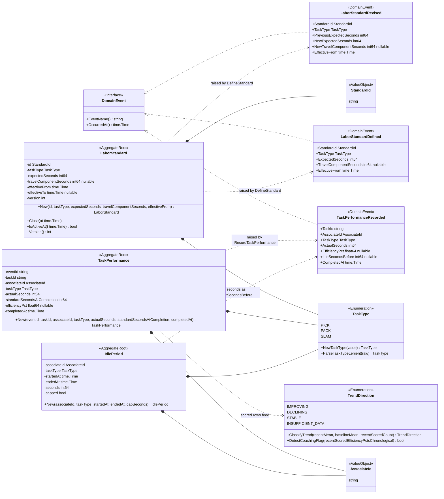
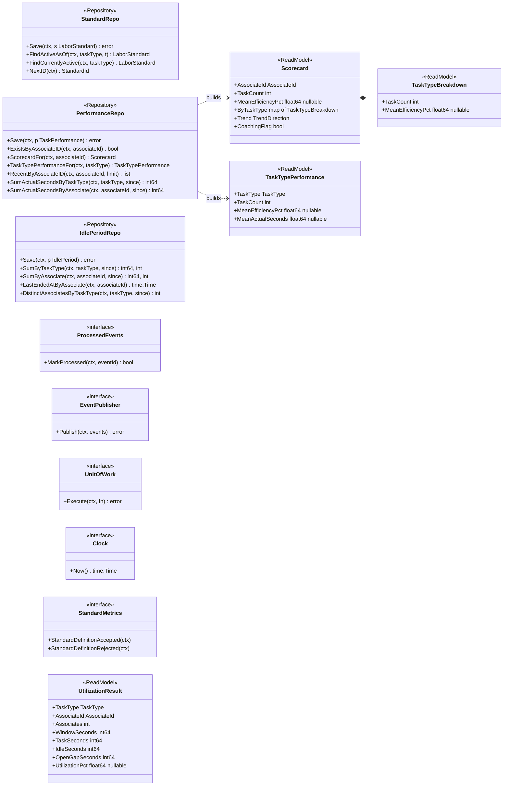
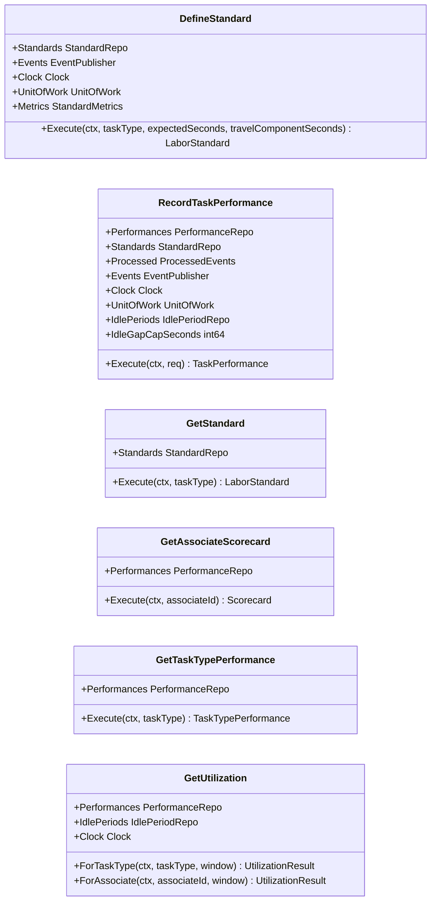
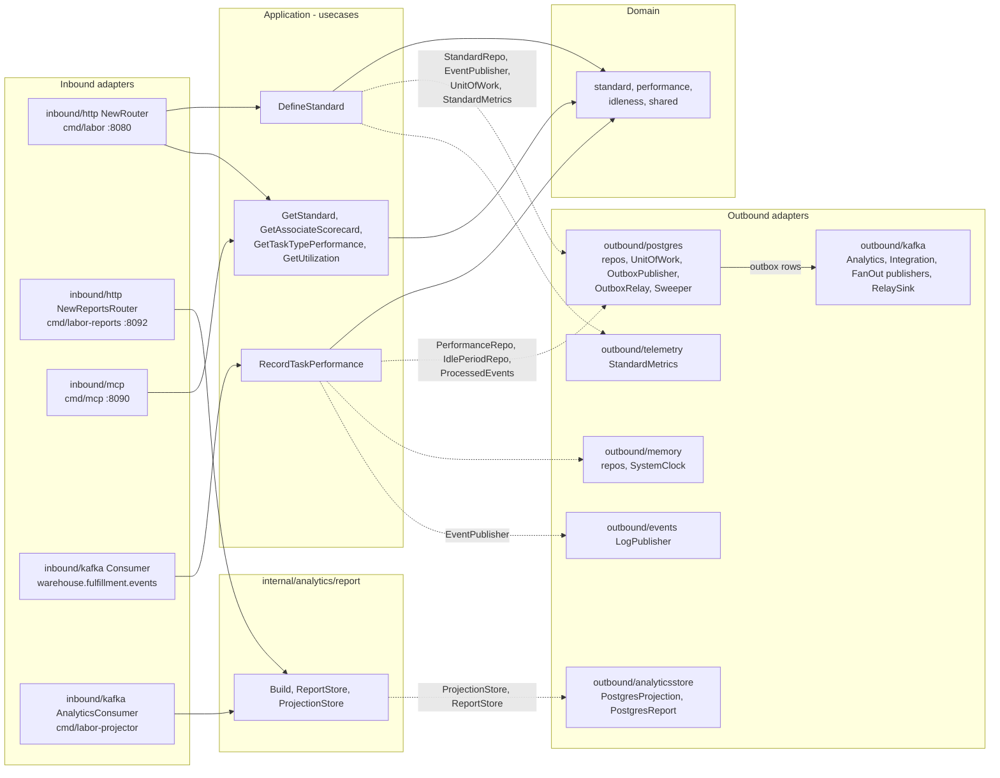

# Class diagrams

:::info[Synced from labor-performance]
This page is a copy of [`docs/docs/ddd/class-diagram.md`](https://github.com/IQVO/labor-performance/blob/develop/docs/docs/ddd/class-diagram.md) on `develop`, derived from that repository's code. Edit it there, then re-sync.
:::

Real type names from `internal/domain/**` and `internal/application/**`.
Go pointer fields (`*int64`, `*float64`, `*time.Time`) are shown as
`nullable`; unexported fields keep their Go names with a `-` prefix.
Getters that only return a field are omitted; constructors, mutators and
pure domain functions are shown.

## 1. Domain model

Source: `internal/domain/standard/standard.go`,
`internal/domain/performance/performance.go`,
`internal/domain/performance/trend.go`,
`internal/domain/idleness/idleness.go`, `internal/domain/shared/shared.go`,
`internal/domain/shared/events.go`. Omitted: `Rehydrate` constructors,
plain getters, the embedded `base` struct of every event (`Name`, `At`),
domain error variables (listed on the
[Aggregate Design Canvas](/contexts/labor-performance/aggregate-design-canvas)), and
`idleness.UtilizationPct` (a pure function, no type). `TrendDirection`'s
two functions are package-level functions in `performance`, drawn on the
enum for compactness. No aggregate holds a reference to another
aggregate — `TaskPerformance` copies the standard's seconds instead of
pointing at a `LaborStandard`.

## 2. Application ports and read models

Source: `internal/application/ports/ports.go`,
`internal/application/usecases/get_utilization.go`. Omitted: the two
sentinel errors in `ports/errors.go` (`ErrConcurrentModification`,
`ErrOpenStandardConflict`), and the analytical side's own ports
(`report.ReportStore`, `report.ProjectionStore` in
`internal/analytics/report/ports.go`), which depend on nothing in this
diagram by design (ADR 0007, arch-go enforced).

## 3. Use cases

Source: `internal/application/usecases/*.go`. Omitted: the optional
`Logger` field on `RecordTaskPerformance` and the private helper
functions (`atomically`, `trendAndCoachingFlag`, `openGapSeconds`).

## 4. Hexagonal view: ports and adapters

Source: `cmd/labor/main.go`, `cmd/mcp/main.go`,
`cmd/labor-projector/main.go`, `cmd/labor-reports/main.go`,
`internal/adapters/**`, `internal/architecture/architecture_test.go`.
Omitted: `adapters/kafka/cloudevents` and `adapters/kafka/otelkafka`
(shared helpers), `outbound/bootretry`, and the per-port wiring of the
in-memory adapters (`DATABASE_URL` unset swaps every Postgres adapter for
its `memory` twin and drops the unit of work). Dotted arrows are "port
implemented by adapter"; the domain depends on nothing and the analytics
package depends on nothing outside itself (arch-go).
