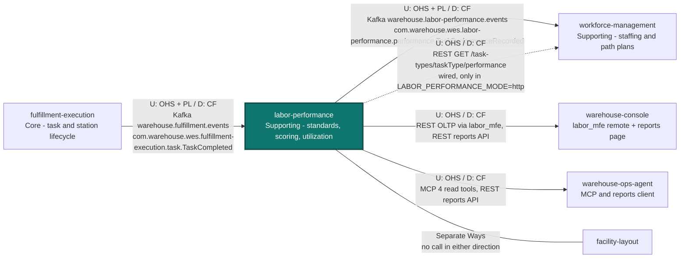

# Context Map

:::info[Synced from labor-performance]
This page is a copy of [`docs/docs/ecosystem/context-map.md`](https://github.com/IQVO/labor-performance/blob/develop/docs/docs/ecosystem/context-map.md) on `develop`, derived from that repository's code. Edit it there, then re-sync.
:::


Labor Performance has exactly **one** input: it is a pure Kafka
**Customer** of `fulfillment-execution`'s already-published
`TaskCompleted` integration event. Everything else points the other way —
it publishes its own integration event and exposes its own REST, reports
and MCP surfaces that other contexts read. It has **no outbound REST or
MCP client** to any sibling context (ADR 0003, restated for
facility-layout by ADR 0015): nothing under `internal/adapters/outbound/`
targets another service — the outbound packages are `postgres`,
`memory`, `analyticsstore`, `kafka` (its own topics), `events` (log),
`telemetry` and `bootretry`.

This is the ddd-crew [Context Mapping](https://github.com/ddd-crew/context-mapping)
view of this context's slice of the fleet map. Every edge is labelled
**U** (upstream) / **D** (downstream), the pattern on each side, and the
technology.



Source: `internal/adapters/inbound/kafka/consumer.go`,
`internal/adapters/kafka/cloudevents/cloudevents.go`,
`internal/adapters/outbound/kafka/integration_publisher.go`,
`internal/adapters/inbound/http/server.go`,
`internal/adapters/inbound/http/reports_handler.go`,
`internal/adapters/inbound/mcp/tools.go`, `web/src/screens/LaborPerformanceScreen.tsx`;
the collaborators' own `develop` branches as cited in the table below.
Omitted: this context's internal analytics topic
`warehouse.labor-performance.analytics` (consumed only by its own
`cmd/labor-projector`, ADR 0007 — not an integration contract), the DLQ
topic `warehouse.fulfillment.events.dlq` (nobody consumes it), and
`wes-work-planning`, which shares the `warehouse.fulfillment.events` topic
under its own consumer group but has no relationship with this context.

Edge legend: solid arrow = live relationship; dotted arrow = wired but not
the default path; undirected line = deliberately absent (Separate Ways).
Arrows point from upstream to downstream (data flow), never in the
direction of a call this service makes — it makes none.

## Relationship table

| Collaborator | Direction | Pattern(s) | Technology | Status | Evidence |
|---|---|---|---|---|---|
| `fulfillment-execution` | U → this (D) | Upstream OHS + Published Language; this context Conformist (Customer/Supplier with no influence) | Kafka `warehouse.fulfillment.events`, CE type `com.warehouse.wes.fulfillment-execution.task.TaskCompleted`, group `labor-performance` (`KAFKA_CONSUMER_GROUP`) | **Live** | this repo: `internal/adapters/inbound/kafka/consumer.go` (`handleFulfillmentEvent`), `cloudevents.TypeFulfillmentTaskCompleted` |
| `workforce-management` | this (U) → D | OHS + Published Language upstream; WFM Conformist (builds a local cache, ADR 0013) | Kafka `warehouse.labor-performance.events`, CE type `com.warehouse.wes.labor-performance.performance.TaskPerformanceRecorded`, key `associate_id` | **Live** | this repo: `internal/adapters/outbound/kafka/integration_publisher.go`; WFM: `internal/adapters/outbound/laborperformancecache/consumer.go` (`LABOR_PERFORMANCE_MODE=kafka-cache`) |
| `workforce-management` | this (U) → D | OHS (REST read) / CF | REST `GET /task-types/{taskType}/performance` (`meanActualSeconds`) | **Wired, not default** — WFM's `LABOR_PERFORMANCE_MODE` defaults to `permissive` | WFM: `internal/adapters/outbound/laborperformance/client.go`, `cmd/workforce/main.go` |
| `warehouse-console` | this (U) → D | OHS / CF | REST (OLTP) via the `labor_mfe` remote: `POST /standards`, `GET /associates/{associateId}/scorecard`, `GET /task-types/{taskType}/performance`; REST (reports): `GET /reports/performance`, `GET /reports/performance/freshness` | **Live** | this repo: `web/src/screens/LaborPerformanceScreen.tsx`; console: `src/App.tsx` (`labor_mfe/App`), `src/features/context-reports/laborPerformance.config.tsx` |
| `warehouse-ops-agent` | this (U) → D | OHS / CF | MCP (`cmd/mcp`, Streamable HTTP): `get_associate_scorecard`, `get_task_type_performance`, `get_labor_standard`, `get_task_type_utilization`; REST reports: `GET /reports/performance`, `GET /reports/performance/freshness` | **Live** | agent: `internal/adapters/outbound/mcpclient/labor_performance.go`, `internal/adapters/outbound/restclient/reports_clients.go`, `internal/application/usecases/flow_balance_advisory.go` |
| `facility-layout` | none | **Separate Ways** | — (an optional `travelComponentSeconds` on a standard is supplied by the caller, never looked up) | **Deliberately absent** | ADR 0015; `standard.LaborStandard` doc comment |
| Any sibling over REST/MCP | this → sibling | — | — | **Deliberately absent** | ADR 0003; no outbound HTTP/MCP client package exists |

## → `fulfillment-execution` (live, inbound Kafka only)

**Strategically: Customer/Supplier, with this context as a Conformist
downstream.** `fulfillment-execution` is the Open Host Service; this
context subscribes to its Published Language (the `TaskCompleted` event
shape) and never gets write access to a `Task` or `Station` aggregate.

This service subscribes to **`warehouse.fulfillment.events`** — the SAME
shared, fan-out topic `wes-work-planning` also consumes from — under its
own consumer group id (`KAFKA_CONSUMER_GROUP`, `labor-performance` by
default). Only the CloudEvents type
`com.warehouse.wes.fulfillment-execution.task.TaskCompleted` is acted on;
every other event type on this shared topic is skipped (committed, not an
error).

Every message is a CloudEvents 1.0 event in **structured mode** (ADR 0021;
Kafka header `content-type: application/cloudevents+json; charset=UTF-8`).
A message that fails CloudEvents decoding/validation is sent to
`warehouse.fulfillment.events.dlq` and committed, never parsed. A valid
`TaskCompleted` whose handling still fails after 3 attempts (exponential
backoff 100 ms → 2 s) is dead-lettered the same way (ADR 0017).

```json
{
  "specversion": "1.0",
  "id": "4f1c2a7e-9d31-4a6b-8f0e-6b2c1d5e7a90",
  "source": "/warehouse/fulfillment-execution",
  "type": "com.warehouse.wes.fulfillment-execution.task.TaskCompleted",
  "subject": "task-1",
  "time": "2026-08-29T22:00:00Z",
  "datacontenttype": "application/json",
  "dataschema": "urn:warehouse:fulfillment-execution:events:TaskCompleted:v1",
  "data": {
    "task_id": "...",
    "station_id": "...",
    "work_unit_id": "...",
    "associate_id": "...",
    "duration_seconds": 52,
    "task_type": "PICK"
  }
}
```

Only `task_id`, `associate_id`, `duration_seconds` and `task_type` are
read from `data`, plus the CloudEvents `id` (dedupe key) and `time`
(completion instant). `associate_id`, `duration_seconds` and `task_type`
are all optional on the wire: an older payload that omits a field
degrades to its Go zero value (`""` / `0`) — exactly the "no checked-in
occupant" / "unmeasurable duration" / "unclassified" business facts this
service's own aggregate invariants already model, not an error.

### `task_type` on the wire

`fulfillment-execution` ADR-0023 put `task_type` on the `TaskCompleted`
payload, and this service's consumer passes it to
`shared.ParseTaskTypeLenient`. A recognized `PICK`/`PACK`/`SLAM` passes
through; an unrecognized value (e.g. `REBIN`, which this context does not
model as an engineered-labor-standard task type) or an absent field
resolves to `""` — recorded and counted, but never scored against a
`LaborStandard` and never listed under `GetTaskTypePerformance`.

The same event also drives idleness (ADR 0014): the gap between an
associate's previous completion and this task's claim instant (the
CloudEvents `time` − `duration_seconds`) is recorded as an `IdlePeriod`,
with no additional upstream field required.

## → `workforce-management` (live, outbound Kafka)

**Strategically: this context is the upstream Supplier;
`workforce-management` is a Conformist Customer.** Since ADR 0013 this
service publishes `TaskPerformanceRecorded` onto its integration topic
**`warehouse.labor-performance.events`** (partition key = `associate_id`),
through the same transactional outbox as the analytics topic when
Postgres is configured (ADR 0010). `workforce-management`'s
`laborperformancecache` consumer (`LABOR_PERFORMANCE_MODE=kafka-cache`)
builds a local measured-rate read model from it for `ProposePathPlan`, and
reads the additive `idle_seconds_before` field (ADR 0014) as a staffing
signal.

`workforce-management` also keeps a `LABOR_PERFORMANCE_MODE=http` option
that calls this service's `GET /task-types/{taskType}/performance`; its
default mode is `permissive`. Either way the dependency points from
`workforce-management` to this context — this service has no Go import
from, REST call to, or Kafka subscription on `workforce-management`.

## ← `warehouse-console` (the `labor_mfe` remote and the reports page)

`web/` is this context's Module Federation remote (`labor_mfe`), mounted
by the console shell at `/labor`. It calls only this service's own OLTP
REST API: `POST /standards`, `GET /associates/{associateId}/scorecard` and
`GET /task-types/{taskType}/performance`. The console's own
context-reports page reads `GET /reports/performance` and
`GET /reports/performance/freshness` from `cmd/labor-reports`. CORS is
configured through `CORS_ALLOWED_ORIGINS` on both the OLTP and reports
routers.

## ← `warehouse-ops-agent` (reads over MCP and the reports API)

`warehouse-ops-agent` reads this context through two of its own surfaces:

- the MCP server (`cmd/mcp`) — all four read tools:
  `get_associate_scorecard`, `get_task_type_performance`,
  `get_labor_standard` and `get_task_type_utilization`, the last one
  feeding its flow-balance advisory;
- the reports API (`cmd/labor-reports`) — `GET /reports/performance` and
  `GET /reports/performance/freshness`.

Both are unauthenticated reads (ADR 0012). This service knows nothing
about the agent.

## Why this is not one bounded context with `fulfillment-execution`

`fulfillment-execution` follows a strict "Task/Station only" design
discipline — adding a labor-standard concept there would be scope creep
into a domain neither Task nor Station has any business modeling.
Splitting this context out means a standard revision, an efficiency
computation, or a scorecard projection never needs to touch
`fulfillment-execution`'s own release cadence or test suite, and vice
versa. See
[ADR 0002](https://iqvo.github.io/labor-performance/docs/adr/0002-new-bounded-context-not-extension-of-workforce-or-fulfillment)
and
[ADR 0003](https://iqvo.github.io/labor-performance/docs/adr/0003-kafka-choreography-consumer-of-fulfillment-execution)
for the full reasoning.
