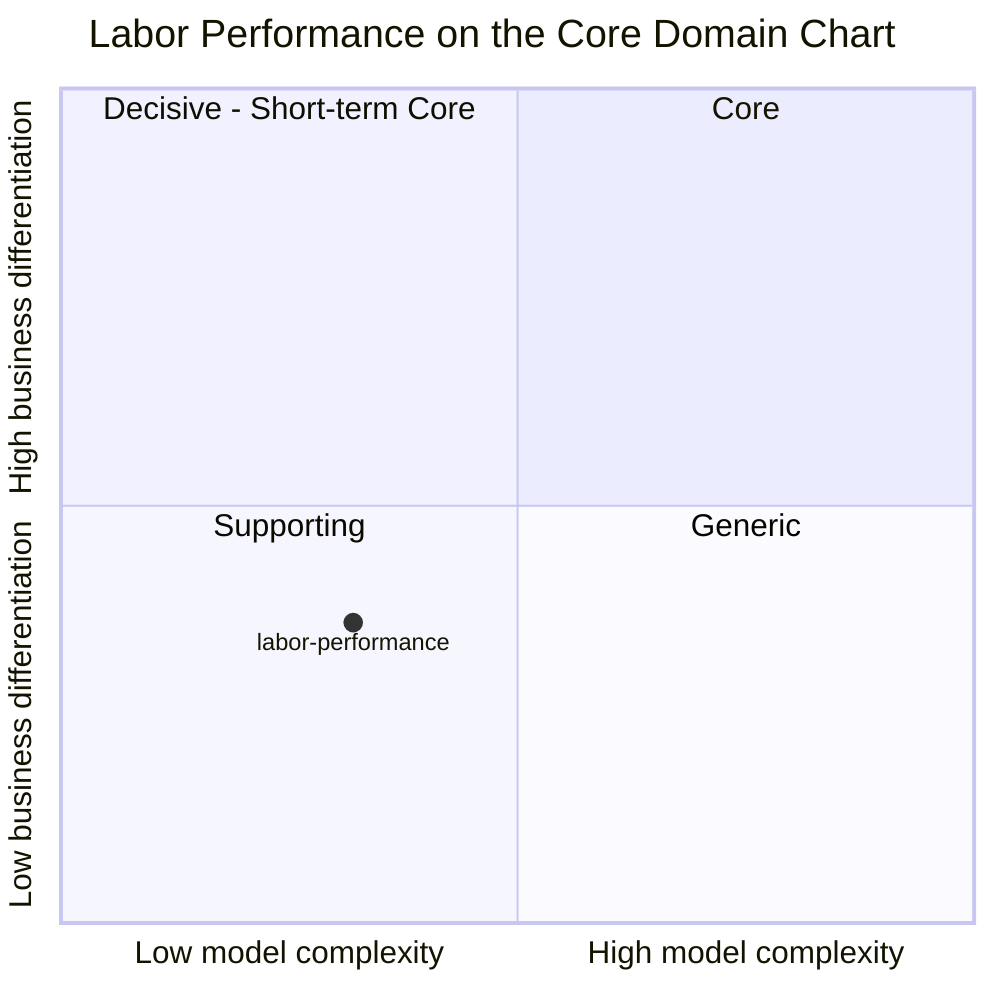

# Core Domain Chart

:::info[Synced from labor-performance]
This page is a copy of [`docs/docs/ddd/core-domain-chart.md`](https://github.com/IQVO/labor-performance/blob/develop/docs/docs/ddd/core-domain-chart.md) on `develop`, derived from that repository's code. Edit it there, then re-sync.
:::

Following the [ddd-crew Core Domain Charts](https://github.com/ddd-crew/core-domain-charts):
the bounded context is plotted on **model complexity** (x) against
**business differentiation** (y). The classification matches
[Subdomain classification](https://github.com/IQVO/labor-performance/blob/develop/docs/docs/ddd/subdomain-classification.md) and
[ADR 0002](https://github.com/IQVO/labor-performance/blob/develop/docs/docs/adr/0002-new-bounded-context-not-extension-of-workforce-or-fulfillment.md):
**Labor Performance is a Supporting subdomain.**

Source: `docs/docs/ddd/subdomain-classification.md`, `internal/domain/**`,
`docs/docs/adr/0002-new-bounded-context-not-extension-of-workforce-or-fulfillment.md`,
`docs/docs/adr/0004-standard-frozen-at-completion-time-not-recomputed.md`,
`docs/docs/adr/0005-associate-trend-and-coaching-flag.md`,
`docs/docs/adr/0014-labor-utilization-idleness.md`. Omitted: the other
fleet contexts (each plots itself on its own chart) and any time axis.

## Why this position

**Below-midline business differentiation (y ≈ 0.36).** Labor Performance
does not decide what work happens, in what order, or where — it only
measures how well already-finished work matched a standard someone else
configures. Engineered labor standards and actual-vs-standard scoring are
an industry-common capability (the [Domain vision](https://github.com/IQVO/labor-performance/blob/develop/docs/docs/business-context/domain-vision.md)
cites Manhattan Active Labor Management and Blue Yonder Workforce & Labor
Management shipping it as a standard module). It matters to the business
— it feeds `workforce-management`'s measured-rate planning (ADR 0013) and
the ops agent's flow-balance advisory — so it sits above a pure Generic
commodity, but it is not where a fulfillment operation wins. That is the
Supporting verdict ADR 0002 records ("Supporting, not Core").

**Modest model complexity (x ≈ 0.32).** The model is small and the rules
are few, but they are real business rules, not CRUD:

- **3 aggregate roots** — `standard.LaborStandard`,
  `performance.TaskPerformance`, `idleness.IdlePeriod` — each with its own
  repository port (`StandardRepo`, `PerformanceRepo`, `IdlePeriodRepo`).
- **7 domain error invariants** — `ErrNonPositiveExpectedSeconds`,
  `ErrNegativeTravelComponentSeconds`,
  `ErrTravelComponentExceedsExpectedSeconds` (standard),
  `ErrEmptyEventId`, `ErrEmptyTaskId` (performance), `ErrEmptyAssociateId`,
  `ErrNegativeGap` (idleness) — plus the "one open standard per TaskType"
  invariant backed by a partial unique index (ADR 0022).
- **Temporal rules** that make it more than a counter: a standard is
  resolved *as of* the task's completion instant and frozen on the row
  (ADR 0004); a revision closes the prior standard instead of overwriting
  it; the idle gap is derived from `time − duration_seconds` and capped
  (ADR 0014).
- **Never-fabricate-a-number semantics** — `EfficiencyPct`,
  `MeanEfficiencyPct`, `MeanActualSeconds` and `UtilizationPct` are `nil`
  rather than `0` whenever nothing was scorable (ADR 0006).
- Two pure, stateless signal functions — `ClassifyTrend` and
  `DetectCoachingFlag` (ADR 0005).

Three aggregates with single-digit invariants each is well left of the
Core contexts in the fleet (`fulfillment-execution`'s task/station
lifecycle, `wes-work-planning`'s release orchestration), hence the low-x
placement inside the Supporting quadrant.

## Evolution note

On a Wardley-style evolution axis (genesis → custom-built → product →
commodity) the capability sits at **product**: engineered labor standards
and performance scoring are sold off the shelf by every major WMS/LMS
vendor. This repository custom-builds it only because the study fleet
models every bounded context explicitly, not because the model is novel.

Likely movement:

- **Towards commodity.** If the fleet adopted a vendor LMS, this context
  would shrink to an anti-corruption layer that translates the vendor's
  scores into `TaskPerformanceRecorded` for `workforce-management`.
- **Not towards Core.** Nothing on the roadmap (ADRs 0001–0030) adds a
  decision this context makes for the floor. ADR 0005's coaching flag is
  explicitly "visibility, not enforcement", and ADR 0003 keeps the context
  a pure observer with no command path back into execution.
