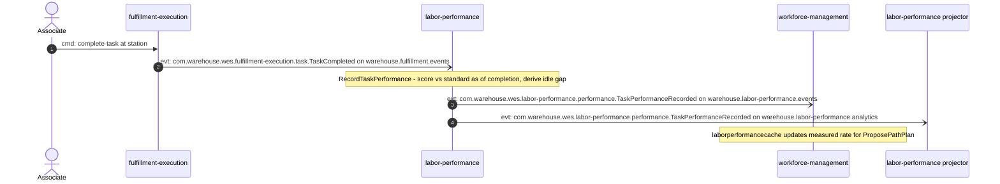
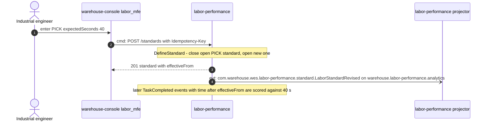
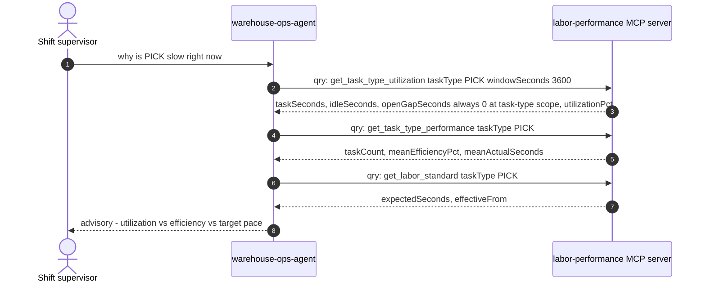
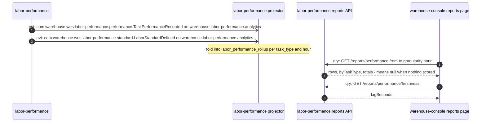

# Domain Message Flow

:::info[Synced from labor-performance]
This page is a copy of [`docs/docs/ddd/domain-message-flow.md`](https://github.com/IQVO/labor-performance/blob/develop/docs/docs/ddd/domain-message-flow.md) on `develop`, derived from that repository's code. Edit it there, then re-sync.
:::

Following [ddd-crew Domain Message Flow Modelling](https://github.com/ddd-crew/domain-message-flow-modelling).
Participants are contexts, people and external systems; every arrow is
numbered and prefixed `cmd:` (command), `evt:` (event) or `qry:` (query),
and names a real REST route, MCP tool or CloudEvents type. Internal
classes are on the [Sequence diagrams](/contexts/labor-performance/sequence-diagrams) page
instead.

## 1. A completed task is scored and reaches workforce planning

Source: `internal/adapters/inbound/kafka/consumer.go`,
`internal/application/usecases/record_task_performance.go`,
`internal/adapters/outbound/kafka/integration_publisher.go`,
`internal/adapters/outbound/kafka/analytics_publisher.go`; WFM's
`internal/adapters/outbound/laborperformancecache/consumer.go`. Omitted:
the outbox hop (see [Sequence diagrams](/contexts/labor-performance/sequence-diagrams)), the DLQ
branch, and how `fulfillment-execution` itself records the completion.

## 2. An industrial engineer revises a labor standard

Source: `web/src/screens/LaborPerformanceScreen.tsx`,
`internal/adapters/inbound/http/server.go`,
`internal/adapters/inbound/http/idempotency.go`,
`internal/application/usecases/define_standard.go`. Omitted: the
first-definition variant (`LaborStandardDefined`), the 409/422 error
branches. Standard events are **not** published on the integration
topic — no sibling receives them.

## 3. The ops agent explains a slow task type

Source: `internal/adapters/inbound/mcp/tools.go`,
`internal/adapters/inbound/mcp/mapping.go`; the agent's
`internal/adapters/outbound/mcpclient/labor_performance.go` and
`internal/application/usecases/flow_balance_advisory.go`. Omitted: the
agent's calls to other contexts, `get_associate_scorecard`, and the MCP
session handshake.

## 4. The hourly Labor Performance Report

Source: `internal/adapters/inbound/kafka/analytics_consumer.go`,
`internal/adapters/outbound/analyticsstore/postgres_projection.go`,
`internal/adapters/inbound/http/reports_handler.go`,
`internal/analytics/report/labor_performance.go`; console's
`src/features/context-reports/laborPerformance.config.tsx`. Omitted:
`LaborStandardRevised` (folded the same way) and the analytical DB, which
the projector writes and the reports API reads read-only (ADR 0007).
