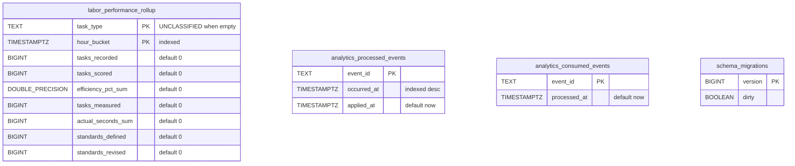

# Entity-relationship diagrams

:::info[Synced from labor-performance]
This page is a copy of [`docs/docs/ddd/entity-relationship.md`](https://github.com/IQVO/labor-performance/blob/develop/docs/docs/ddd/entity-relationship.md) on `develop`, derived from that repository's code. Edit it there, then re-sync.
:::

Labor Performance owns **two** Postgres databases (ADR 0007): the OLTP
database written by `cmd/labor` (migrations in `migrations/`, applied by
golang-migrate at boot of `cmd/labor` and `cmd/mcp`), and the analytical
database written only by `cmd/labor-projector` and read through a
read-only pool by `cmd/labor-reports` (migrations in
`migrations/analytics/`). Both diagrams show the **final** schema after
every `*.up.sql` is applied in order.

:::note[No foreign keys]
Not one table in either database declares a `FOREIGN KEY`, so neither
diagram draws a relationship line. The logical links that do exist are
explained in prose under each diagram — they are aggregate boundaries or
copied values, deliberately not enforced by the database.
:::

## OLTP database

```mermaid
erDiagram
    labor_standards {
        TEXT id PK
        TEXT task_type "indexed, partial UK where effective_to IS NULL"
        BIGINT expected_seconds
        TIMESTAMPTZ effective_from
        TIMESTAMPTZ effective_to "nullable"
        BIGINT travel_component_seconds "nullable, CHECK 0 to expected_seconds"
        INTEGER version "default 1, OCC token"
    }
    task_performances {
        TEXT event_id PK
        TEXT task_id
        TEXT associate_id "default empty, indexed"
        TEXT task_type "default empty, indexed"
        BIGINT actual_seconds
        BIGINT standard_seconds_at_completion
        DOUBLE_PRECISION efficiency_pct "nullable"
        TIMESTAMPTZ completed_at
    }
    idle_periods {
        BIGSERIAL id PK
        TEXT associate_id "indexed with ended_at"
        TEXT task_type "default empty, indexed with ended_at"
        TIMESTAMPTZ started_at
        TIMESTAMPTZ ended_at
        BIGINT seconds
        BOOLEAN capped "default false"
    }
    processed_events {
        TEXT event_id PK
        TIMESTAMPTZ processed_at "default now"
    }
    outbox_events {
        BIGSERIAL id PK
        TEXT topic
        TEXT event_type
        BYTEA key "nullable"
        BYTEA value
        JSONB headers "default empty array"
        TIMESTAMPTZ created_at "default now"
        TIMESTAMPTZ published_at "nullable, partial index where NULL"
        INTEGER attempts "default 0"
        TEXT last_error "nullable"
    }
    idempotency_keys {
        TEXT key PK
        TEXT method
        TEXT path
        TEXT request_hash
        INTEGER status_code "nullable"
        BYTEA response_body "nullable"
        JSONB response_headers "nullable"
        TIMESTAMPTZ created_at "default now, indexed"
        TIMESTAMPTZ completed_at "nullable"
    }
    schema_migrations {
        BIGINT version PK
        BOOLEAN dirty
    }
```

Source: `migrations/0001_init.up.sql`, `migrations/0002_outbox.up.sql`,
`migrations/0003_idle_periods.up.sql`,
`migrations/0004_travel_component_seconds.up.sql`,
`migrations/0005_idempotency_keys.up.sql`,
`migrations/0006_standard_version_and_one_open.up.sql`;
`schema_migrations` is golang-migrate's own bookkeeping table
(`internal/adapters/outbound/postgres/migrate.go`). Omitted: index names
(listed below) and the `.down.sql` files.

Indexes: `idx_labor_standards_task_type`,
`idx_labor_standards_one_open_per_task_type` (UNIQUE on `task_type`
WHERE `effective_to IS NULL`, ADR 0022),
`idx_task_performances_associate_id`, `idx_task_performances_task_type`,
`idx_idle_periods_associate_id_ended_at`,
`idx_idle_periods_task_type_ended_at`, `idx_outbox_events_unpublished`
(`id` WHERE `published_at IS NULL`), `idx_idempotency_keys_created_at`.
`DOUBLE_PRECISION` is written with an underscore only because Mermaid
attribute types cannot contain a space.

**Logical links without a foreign key**

- `task_performances.standard_seconds_at_completion` is a **copy** of the
  `labor_standards.expected_seconds` that was active as of
  `completed_at` (ADR 0004). There is deliberately no `standard_id`
  column: a later revision must never change a scored row.
- `task_performances.event_id` and `processed_events.event_id` hold the
  same CloudEvents `id`; both are written in the same transaction by
  `RecordTaskPerformance`, but `processed_events` is the idempotency gate
  and could in principle hold ids for events that produced no row.
- `idle_periods.associate_id` / `task_type` match the
  `task_performances` row recorded in the same transaction, but there is
  no link column — an `IdlePeriod` is its own aggregate.
- `task_id`, `associate_id` and `task_type` are foreign references into
  `fulfillment-execution`'s model; this context does not own or validate
  them.

## Analytical database

Source: `migrations/analytics/0001_report.up.sql`,
`internal/adapters/outbound/analyticsstore/postgres_projection.go`,
`internal/adapters/outbound/analyticsstore/consumed_events_repo.go`.
Omitted: index names (`idx_labor_performance_rollup_hour_bucket`,
`idx_analytics_processed_events_occurred_at`).

**Logical links without a foreign key**

- `analytics_consumed_events` (the consumer's dedupe gate) and
  `analytics_processed_events` (the projection's claim, also the source
  of freshness lag) hold the same CloudEvents ids from
  `warehouse.labor-performance.analytics`. They are kept as separate
  tables so the two idempotency layers never race for one row.
- The rollup stores only raw counters and sums; every mean is derived at
  read time by `report.mean`, so an hour with no scored tasks has a null
  mean, never `0`.

## Table ≠ aggregate

| Table | Database | What it is | Aggregate / model |
|---|---|---|---|
| `labor_standards` | OLTP | Aggregate state (append-only history) | `standard.LaborStandard` |
| `task_performances` | OLTP | Aggregate state; also the source of every OLTP read model | `performance.TaskPerformance`; read by `Scorecard`, `TaskTypePerformance`, `UtilizationResult` |
| `idle_periods` | OLTP | Aggregate state | `idleness.IdlePeriod` |
| `processed_events` | OLTP | **Infrastructure** — inbox / idempotency gate for consumed `TaskCompleted` | `ports.ProcessedEvents` |
| `outbox_events` | OLTP | **Infrastructure** — transactional outbox (ADR 0010), swept 7 days after publish (ADR 0023) | `postgres.OutboxPublisher`, `postgres.OutboxRelay` |
| `idempotency_keys` | OLTP | **Infrastructure** — HTTP `Idempotency-Key` store for `POST /standards` (ADR 0016), swept after 24 h | `http.RequireIdempotencyKey` |
| `schema_migrations` | both | **Infrastructure** — golang-migrate bookkeeping | — |
| `labor_performance_rollup` | analytics | **Projection** — rebuildable from the analytics topic | `report.Row` → `report.LaborPerformanceReport` |
| `analytics_processed_events` | analytics | **Projection infrastructure** — projection claim + freshness | `analyticsstore.PostgresProjection` |
| `analytics_consumed_events` | analytics | **Projection infrastructure** — consumer dedupe gate | `analyticsstore.ConsumedEventsRepo` |
