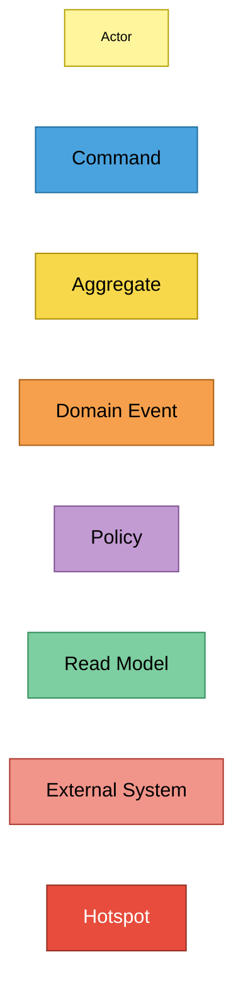
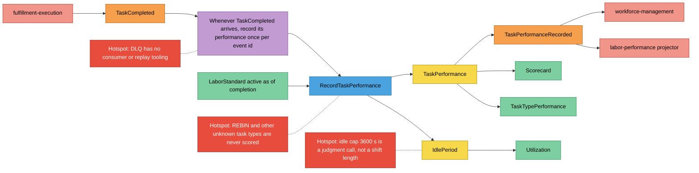
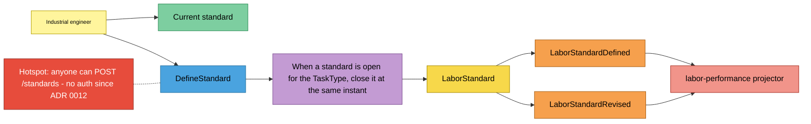
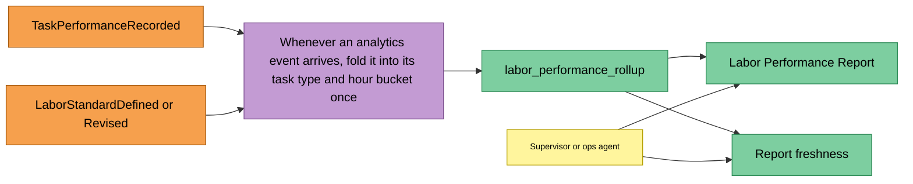

# EventStorming (design level)

:::info[Synced from labor-performance]
This page is a copy of [`docs/docs/ddd/eventstorming.md`](https://github.com/IQVO/labor-performance/blob/develop/docs/docs/ddd/eventstorming.md) on `develop`, derived from that repository's code. Edit it there, then re-sync.
:::

Notation follows the [ddd-crew EventStorming glossary & cheat sheet](https://github.com/ddd-crew/eventstorming-glossary-cheat-sheet).
Each board reads left to right. Every sticky is backed by code in the
table under it; hotspots are known gaps recorded in ADRs or visible in
the code, not invented ones.

## Legend

Source: ddd-crew cheat-sheet colours as specified for this fleet.
Omitted: nothing — this is the key only.

## Board 1 — Score a completed task

Source: `internal/adapters/inbound/kafka/consumer.go`,
`internal/application/usecases/record_task_performance.go`,
`internal/domain/performance/performance.go`,
`internal/domain/idleness/idleness.go`, `internal/domain/shared/events.go`,
`internal/application/ports/ports.go`. Omitted: the retry/backoff loop and
the outbox relay (infrastructure, not domain).

| Sticky | Kind | Code evidence |
|---|---|---|
| fulfillment-execution | External System | `cloudevents.TypeFulfillmentTaskCompleted`, topic `cloudevents.TopicFulfillmentEvents` |
| TaskCompleted | Domain Event (upstream) | `consumer.handleFulfillmentEvent`, `taskCompletedData` |
| Record once per event id | Policy | `ports.ProcessedEvents.MarkProcessed` inside `RecordTaskPerformance.Execute` |
| RecordTaskPerformance | Command | `usecases.RecordTaskPerformanceRequest` / `RecordTaskPerformance.Execute` |
| LaborStandard active as of completion | Read Model | `StandardRepo.FindActiveAsOf` in `standardSecondsAtCompletion` |
| TaskPerformance | Aggregate | `performance.New` |
| IdlePeriod | Aggregate | `idleness.New` in `recordIdleGap` |
| TaskPerformanceRecorded | Domain Event | `shared.NewTaskPerformanceRecorded`; CE type `com.warehouse.wes.labor-performance.performance.TaskPerformanceRecorded` |
| workforce-management | External System | integration topic `warehouse.labor-performance.events` (`integration_publisher.go`) |
| labor-performance projector | External System (own process) | analytics topic `warehouse.labor-performance.analytics` (`analytics_publisher.go`) |
| Scorecard | Read Model | `ports.Scorecard`, `GetAssociateScorecard` |
| TaskTypePerformance | Read Model | `ports.TaskTypePerformance`, `GetTaskTypePerformance` |
| Utilization | Read Model | `usecases.UtilizationResult`, `GetUtilization` |
| Unknown task types never scored | Hotspot | `shared.ParseTaskTypeLenient` doc comment (REBIN) |
| Idle cap is a judgment call | Hotspot | ADR 0014 "Negative / accepted"; `defaultIdleGapCapSeconds = 3600` |
| DLQ has no consumer | Hotspot | `dlqTopicSuffix = ".dlq"` in `consumer.go`; no reader of that topic exists in the repo |

## Board 2 — Define or revise a labor standard

Source: `internal/adapters/inbound/http/server.go`,
`internal/application/usecases/define_standard.go`,
`internal/domain/standard/standard.go`, `internal/domain/shared/events.go`.
Omitted: the idempotency-key replay and the 409 concurrency branch (see
[Sequence diagrams](/contexts/labor-performance/sequence-diagrams)).

| Sticky | Kind | Code evidence |
|---|---|---|
| Industrial engineer | Actor | `web/src/screens/LaborPerformanceScreen.tsx` (`apiPost("/standards")`) |
| Current standard | Read Model | `GET /standards/{taskType}` → `GetStandard` → `StandardRepo.FindCurrentlyActive` |
| DefineStandard | Command | `POST /standards` → `usecases.DefineStandard.Execute` |
| Close the open standard | Policy | `prior.Close(now)` in `DefineStandard.Execute` |
| LaborStandard | Aggregate | `standard.New`, `LaborStandard.Close` |
| LaborStandardDefined | Domain Event | `shared.NewLaborStandardDefined`; CE type `com.warehouse.wes.labor-performance.standard.LaborStandardDefined` |
| LaborStandardRevised | Domain Event | `shared.NewLaborStandardRevised`; CE type `com.warehouse.wes.labor-performance.standard.LaborStandardRevised` |
| labor-performance projector | External System (own process) | `analytics_consumer.go` (`isProjecting`) |
| No auth on POST /standards | Hotspot | ADR 0012; `NewRouter` has no auth middleware |

## Board 3 — Build the Labor Performance Report

Source: `internal/adapters/inbound/kafka/analytics_consumer.go`,
`internal/adapters/outbound/analyticsstore/postgres_projection.go`,
`internal/analytics/report/labor_performance.go`,
`internal/adapters/inbound/http/reports_handler.go`. Omitted: there is no
command and no aggregate on this board — the analytical side is a pure
projection (ADR 0007).

| Sticky | Kind | Code evidence |
|---|---|---|
| TaskPerformanceRecorded, LaborStandardDefined/Revised | Domain Event | `isProjecting` in `analytics_consumer.go` |
| Fold once per event | Policy | `analytics_consumed_events` gate (`ConsumedEventsRepo`) + `claim` into `analytics_processed_events`, applied in ONE `analyticsstore.UnitOfWork` transaction; offset committed only after it succeeds (`FetchMessage` + `CommitMessages`), a failed fold is retried with capped backoff |
| labor_performance_rollup | Read Model | `migrations/analytics/0001_report.up.sql` |
| Supervisor or ops agent | Actor | console `laborPerformance.config.tsx`; agent `restclient/reports_clients.go` |
| Labor Performance Report | Read Model | `report.Build`, `GET /reports/performance` |
| Report freshness | Read Model | `ReportStore.FreshnessLag`, `GET /reports/performance/freshness` |
