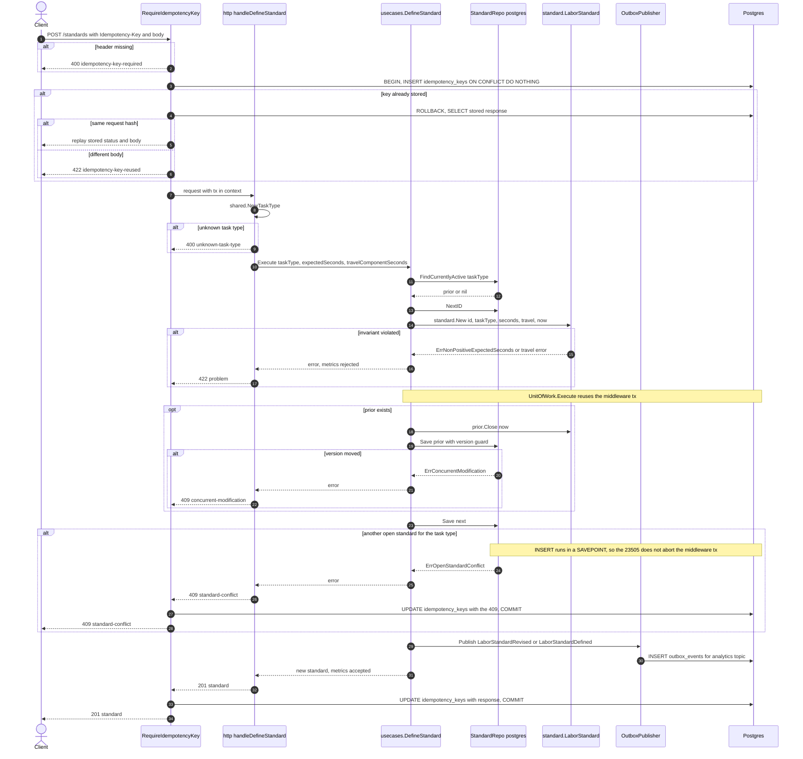
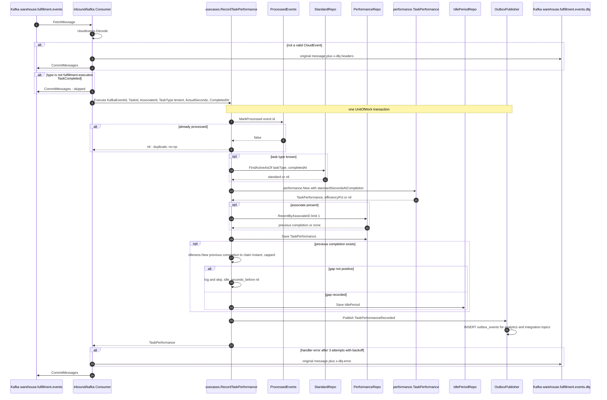
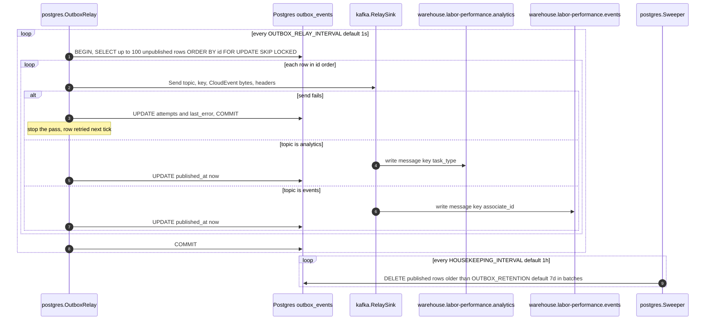
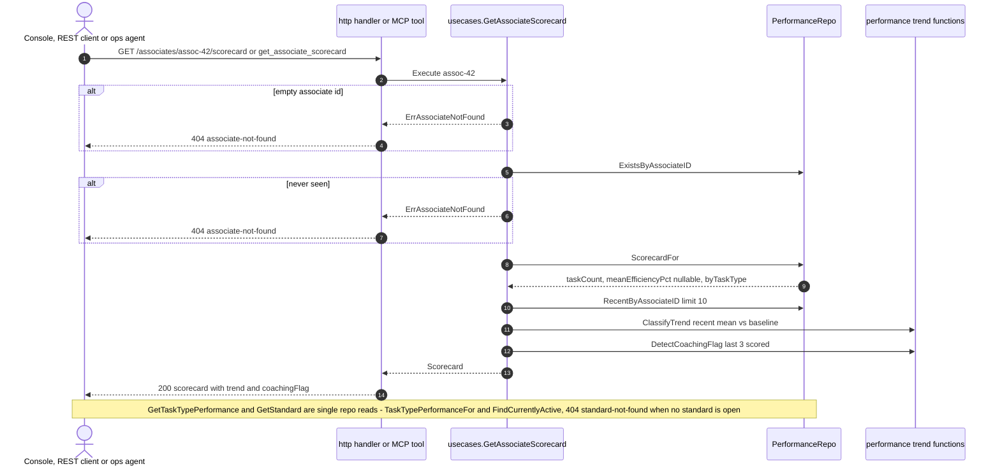
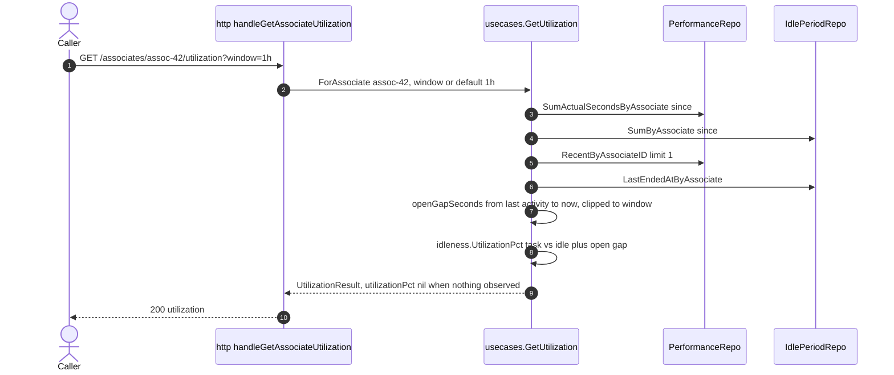
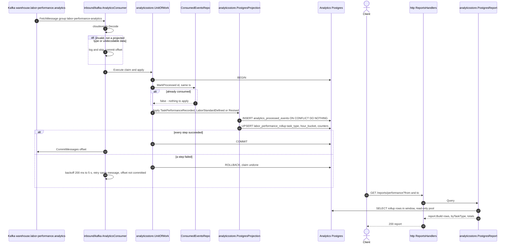

# Sequence diagrams

:::info[Synced from labor-performance]
This page is a copy of [`docs/docs/ddd/sequence-diagrams.md`](https://github.com/IQVO/labor-performance/blob/develop/docs/docs/ddd/sequence-diagrams.md) on `develop`, derived from that repository's code. Edit it there, then re-sync.
:::

One diagram per use case or group of use cases, drawn from the function
bodies. Participants are the inbound adapter, the use case, the domain
aggregate, the repositories (ports with their Postgres adapters), the
outbox and the downstream. Error branches are `alt` blocks. When
`DATABASE_URL` is unset the same use cases run on the in-memory adapters
with no unit of work and the log publisher; these diagrams show the
Postgres + `EVENT_PUBLISHER=kafka` configuration.

## 1. DefineStandard — `POST /standards`

Source: `internal/adapters/inbound/http/idempotency.go`,
`internal/adapters/inbound/http/server.go` (`handleDefineStandard`),
`internal/adapters/inbound/http/errors.go`,
`internal/application/usecases/define_standard.go`,
`internal/adapters/outbound/postgres/standard_repo.go`,
`internal/adapters/outbound/postgres/unit_of_work.go`,
`internal/adapters/outbound/postgres/outbox_publisher.go`. Omitted: the
log publisher that runs alongside the outbox in the fan-out and body
decoding errors. The `ErrOpenStandardConflict` branch (partial unique
index violation on `Save next`, the database backstop of ADR 0022) is
shown; `postgres.execGuarded` wraps `Save`'s statement in a savepoint when
a transaction is in the context, which keeps that branch a recorded 409
instead of an aborted transaction and a 500.

## 2. RecordTaskPerformance — Kafka `TaskCompleted`

Source: `internal/adapters/inbound/kafka/consumer.go`,
`internal/application/usecases/record_task_performance.go`,
`internal/domain/performance/performance.go`,
`internal/domain/idleness/idleness.go`,
`internal/adapters/outbound/postgres/processed_event_repo.go`,
`internal/adapters/outbound/postgres/outbox_publisher.go`. Omitted: OTel
consume spans, and the transaction rollback on any write error (the
whole unit of work, including the `processed_events` marker, rolls back,
so the retry re-scores the event).

## 3. Outbox relay — publishing committed events

Source: `internal/adapters/outbound/postgres/outbox_relay.go`,
`internal/adapters/outbound/kafka/relay_sink.go`,
`internal/adapters/outbound/postgres/sweeper.go`, `cmd/labor/main.go`.
Omitted: the sweeper's `idempotency_keys` deletion (TTL 24 h), the outbox
lag gauge, and the immediate follow-up pass when a full batch was sent.

## 4. Queries — scorecard, task-type performance, standard

Source: `internal/application/usecases/get_associate_scorecard.go`,
`internal/application/usecases/get_task_type_performance.go`,
`internal/application/usecases/get_standard.go`,
`internal/adapters/inbound/http/server.go`,
`internal/adapters/inbound/mcp/tools.go`. Omitted: the MCP resource
`scorecard://labor/{associateId}`, which calls the same use case; the
400 for an unknown task type on the task-type routes.

## 5. GetUtilization — per associate

Source: `internal/application/usecases/get_utilization.go`,
`internal/domain/idleness/idleness.go`,
`internal/adapters/inbound/http/server.go` (`windowParam`). Omitted:
`ForTaskType` (REST `GET /task-types/{taskType}/utilization` and MCP
`get_task_type_utilization`), which sums the same two repos per task type,
adds `DistinctAssociatesByTaskType`, and computes no open gap.

## 6. Analytics projector and reports API

Source: `internal/adapters/inbound/kafka/analytics_consumer.go`,
`internal/adapters/outbound/analyticsstore/unit_of_work.go`,
`internal/adapters/outbound/analyticsstore/consumed_events_repo.go`,
`internal/adapters/outbound/analyticsstore/postgres_projection.go`,
`internal/adapters/outbound/analyticsstore/postgres_report.go`,
`internal/adapters/inbound/http/reports_handler.go`,
`internal/analytics/report/labor_performance.go`. Omitted: the
`/reports/performance/freshness` read (max `occurred_at` lag from
`analytics_processed_events`) and the 400 branches for missing or
malformed `from`/`to`.
