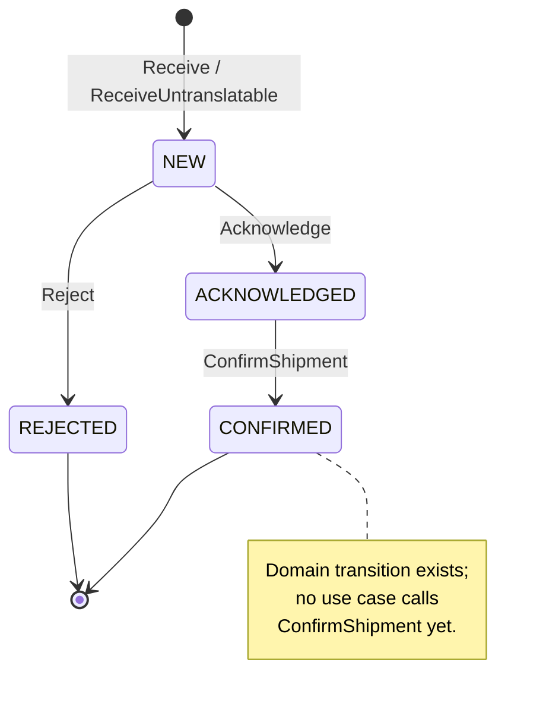

# Aggregate Design Canvas — NetworkOrder

Following the [ddd-crew Aggregate Design Canvas](https://github.com/ddd-crew/aggregate-design-canvas).
`NetworkOrder` (`internal/domain/networkorder`) is the only aggregate in
code. [ADR 0001](https://github.com/claudioed/network-fulfillment/blob/develop/docs/adr/0001-network-fulfillment-bounded-context.md) designs a second one, `CapabilityOffer`, which
is **not built** — see [Open Questions](/contexts/network-fulfillment/bounded-context-canvas#open-questions).

## Name

**NetworkOrder**

## Description

Demand that arrived from an external retail network, carrying a deadline
we did not choose. Fields: `networkRef` (identity, opaque), `siteId`,
`requiredShipBy`, `acknowledgeBy` (`receivedAt + 24h`, persisted),
`lines` (each `networkLineRef`, `networkProductId`, translated `sku`,
`quantity`), `state`, an optional `localOrderId`, and `receivedAt`. It
owns the network **protocol** — the answer, its deadline and the mapping
to local work — and none of the fulfillment: no allocation, no promise
computation, no release. Those belong to `order-management`.

## State Transitions

## Enforced Invariants

1. **Identity and content at receipt.** `Receive` requires a non-empty
   `NetworkRef` (`ErrEmptyNetworkRef`) and at least one line
   (`ErrNoLines`); each line needs a non-empty `NetworkLineRef`,
   `NetworkProductId`, a translated SKU (`ErrUnknownProduct` otherwise) and
   a positive quantity (`ErrNonPositiveQuantity`).
2. **The one legitimate lineless order is named.** `ReceiveUntranslatable`
   builds an order for demand containing an unmapped product, which exists
   only to be rejected and recorded — a separate constructor so
   `Receive`'s `ErrNoLines` rule is not weakened for everyone else.
3. **One answer, in full.** `Acknowledge` and `Reject` are valid only
   from `NEW`; a second answer is `ErrAlreadyAnswered`. `Acknowledge`
   takes no quantity — acknowledging part of a line is not expressible.
4. **Local work only for committed demand.** `LinkLocalOrder` is valid
   only when `ACKNOWLEDGED` (`ErrNotAcknowledged`) and only once
   (`ErrLocalOrderAlreadyLinked`). Restated in Postgres as
   `CHECK (local_order_id IS NULL OR state IN ('ACKNOWLEDGED','CONFIRMED'))`.
5. **No confirmation before acknowledgement.** `ConfirmShipment` is valid
   only from `ACKNOWLEDGED` (`ErrConfirmBeforeAcknowledge`).
6. **The deadline is fixed at receipt.** `acknowledgeBy` is derived from
   `receivedAt` (passed in, not read from a clock) and never recomputed.

## Corrective Policies

- **Deadline sweep** (`SweepAcknowledgementDeadlines`, every
  `SWEEP_INTERVAL` — `1m` binary default, `5m` in the chart): for each
  order where `AcknowledgementOverdue(now)` holds, cancel its held local
  order (if any), then `Reject` and save. One failing order does not abort
  the pass; it is retried next pass. It never acknowledges late.
- **Cancel before telling the network.** On rejection the held order is
  cancelled *before* the answer is submitted, so a failed submission is
  retried rather than leaving reservations for refused demand.
- **Save before telling the network, release last.** On acknowledgement
  the order is linked and saved, then acknowledged to the network, then
  released — release is the irreversible step.

## Handled Commands

| Command | Precondition | Result |
| --- | --- | --- |
| **Receive** (via `ReceiveNetworkDemand`) | `networkRef` not already stored (otherwise the existing order is returned — idempotent) | New order in `NEW`, then answered in the same use case |
| **ReceiveUntranslatable** | Some product has no SKU mapping | Lineless order in `NEW`, immediately rejected |
| **Acknowledge** | `NEW`, and `order-management` returned a promise | `ACKNOWLEDGED`; then `LinkLocalOrder`, save, submit, release |
| **Reject** | `NEW` | `REJECTED`; held order cancelled first |
| **LinkLocalOrder** | `ACKNOWLEDGED`, not yet linked | `localOrderId` set, permanently |
| **ConfirmShipment** | `ACKNOWLEDGED` | `CONFIRMED` — **no use case calls it yet** |

## Created Events

None. No typed domain event exists yet, and the `EventPublisher` port is
wired to a log-only publisher no use case calls. See
[Domain Events](/contexts/network-fulfillment/domain-events) for what ADR 0001 plans.

## Throughput

**Low.** Bounded by network demand volume and by the poll cadence
(`POLL_INTERVAL`, `1m`); each order is written once when answered (and
once more if swept). The external constraint that matters is time, not
volume: the 24-hour acknowledgement window runs against wall time
whether or not the poller is healthy.

## Size

**Small.** A handful of scalars plus a short list of lines (no child
aggregates). Persisted as one `network_orders` row keyed by
`network_ref` plus its `network_order_lines` rows.
