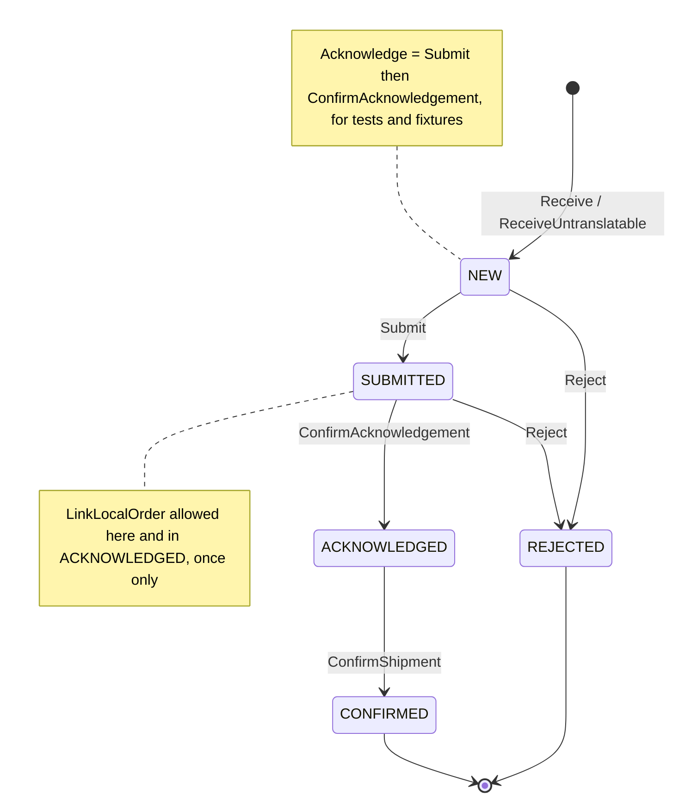
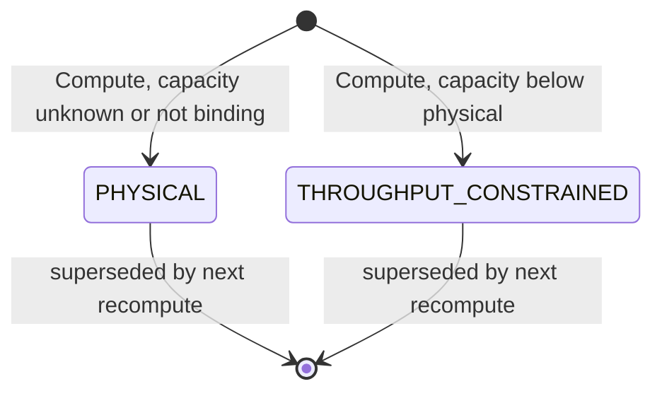

# Aggregate Design Canvas

:::info[Synced from network-fulfillment]
This page is a copy of [`docs/ddd/aggregate-design-canvas.md`](https://github.com/IQVO/network-fulfillment/blob/develop/docs/ddd/aggregate-design-canvas.md) on `develop`, derived from that repository's code. Edit it there, then re-sync.
:::

Following the ddd-crew [Aggregate Design Canvas v1.1](https://github.com/ddd-crew/aggregate-design-canvas).
There are two aggregate roots in `internal/domain/`: **NetworkOrder** and
**CapabilityOffer**. `internal/domain/shared` holds value objects, errors
and domain events only.

## NetworkOrder

### 1. Name

`NetworkOrder` (`internal/domain/networkorder/network_order.go`), identified
by `NetworkRef`.

### 2. Description

Demand that arrived from the external network, carrying a deadline we did
not choose. The aggregate owns the network **protocol**: the single answer,
its 24h deadline, and the mapping to the local order in `order-management`.
It owns none of the fulfillment (no allocation, promise or release). It
contains `Line` entities (`networkLineRef`, `networkProductId`, `sku`,
`quantity`) that are already translated into our vocabulary.

### 3. State Transitions

Source: `internal/domain/networkorder/network_order.go` (`State` constants,
`Submit`, `ConfirmAcknowledgement`, `Acknowledge`, `Reject`,
`LinkLocalOrder`, `ConfirmShipment`); `migrations/0003_submitted_state.up.sql`
(`network_orders_state_check`).

Omitted: `Rehydrate` (the repository's path back to any state, which
bypasses invariants), and `AcknowledgementOverdue`, a query rather than a
transition.

### 4. Enforced Invariants

| Invariant | Enforced by |
| --- | --- |
| A network order has a non-empty `NetworkRef` | `Receive`, `ReceiveUntranslatable` → `shared.ErrEmptyNetworkRef` |
| A translated order has at least one line | `Receive` → `shared.ErrNoLines` (only `ReceiveUntranslatable` may be lineless) |
| Each line has a ref, a product id, a SKU and a positive quantity | `NewLine` → `ErrEmptyNetworkLineRef`, `ErrEmptyNetworkProductId`, `ErrUnknownProduct` (empty SKU), `ErrNonPositiveQuantity` |
| Exactly one answer, in full | `Submit` (only from `NEW`), `Reject` (only from `NEW`/`SUBMITTED`) → `ErrAlreadyAnswered` |
| Only a submitted answer can be confirmed | `ConfirmAcknowledgement` → `ErrNotSubmitted` |
| No local work for demand we have not committed to | `LinkLocalOrder` → `ErrNotAcknowledged` (state must be `SUBMITTED`/`ACKNOWLEDGED`); also the DB `CHECK local_order_requires_answer` |
| The local-order mapping is set once and never overwritten | `LinkLocalOrder` → `ErrLocalOrderAlreadyLinked` |
| No shipment confirmation before acknowledgement | `ConfirmShipment` → `ErrConfirmBeforeAcknowledge` |
| `acknowledgeBy = receivedAt + 24h`, fixed at receipt | `Receive`/`ReceiveUntranslatable` compute it from `AcknowledgementWindow`; it is persisted and never recomputed |
| The line set cannot be mutated from outside | `Lines()` returns a copy |
| No network identifier crosses to `order-management` | `SKUQuantities()` returns only `map[SKU]int` |

### 5. Corrective Policies

- **Deadline sweep** (`SweepAcknowledgementDeadlines`): for every `NEW`
  order past `acknowledgeBy`, publish `AcknowledgementDeadlineAtRisk`. It
  never mutates the aggregate and re-fires on every pass.
- **Reject overdue** (`RejectOverdueOrders`): cancel the held local order
  if one is linked, then `Reject` with `ACKNOWLEDGEMENT_DEADLINE_MISSED`. It
  never acknowledges late.
- **Reconciliation** (`ReconcileSubmittedOrders`): `SUCCESS` →
  `ConfirmAcknowledgement`, then release the hold. `FAILURE` → cancel the
  hold, then `Reject` with `SUBMISSION_FAILED`. `PENDING` → retry on the
  next pass.
- **Idempotent receipt**: `ReceiveNetworkDemand` returns the existing order
  for a known `NetworkRef`, so the poller's re-delivery is safe.
- **Idempotent confirmation**: `ConfirmNetworkOrderShipment` returns an
  already-`CONFIRMED` order unchanged.

### 6. Handled Commands

| Command | Method | Issued by |
| --- | --- | --- |
| Receive demand | `Receive` / `ReceiveUntranslatable` | `ReceiveNetworkDemand` (poller) |
| Submit acceptance | `Submit` + `LinkLocalOrder` | `ReceiveNetworkDemand.acknowledge` |
| Reject | `Reject` | `ReceiveNetworkDemand.reject`, `RejectOverdueOrders`, `ReconcileSubmittedOrders.fail` |
| Confirm acknowledgement | `ConfirmAcknowledgement` | `ReconcileSubmittedOrders.confirm` |
| Confirm shipment | `ConfirmShipment` | `ConfirmNetworkOrderShipment` (REST `POST .../shipment-confirmation`) |

### 7. Created Events

The aggregate methods return only errors. The use cases raise these events
from `internal/domain/shared/events.go`. Each is published as
`com.warehouse.wes.network-fulfillment.networkorder.<Event>` on both topics.

| Event | Raised when | Full CloudEvents type |
| --- | --- | --- |
| `NetworkOrderReceived` | after `Receive`/`ReceiveUntranslatable` is saved | `com.warehouse.wes.network-fulfillment.networkorder.NetworkOrderReceived` |
| `NetworkOrderAcknowledged` | after `Submit` + `LinkLocalOrder` is saved (state `SUBMITTED`) | `com.warehouse.wes.network-fulfillment.networkorder.NetworkOrderAcknowledged` |
| `NetworkOrderRejected` | after every `Reject` (carries `reason`) | `com.warehouse.wes.network-fulfillment.networkorder.NetworkOrderRejected` |
| `NetworkOrderShipmentConfirmed` | after `ConfirmShipment` is saved | `com.warehouse.wes.network-fulfillment.networkorder.NetworkOrderShipmentConfirmed` |
| `AcknowledgementDeadlineAtRisk` | sweep, overdue `NEW` order (no transition) | `com.warehouse.wes.network-fulfillment.networkorder.AcknowledgementDeadlineAtRisk` |

`SUBMITTED -> ACKNOWLEDGED` (`ConfirmAcknowledgement`) raises **no** event.

### 8. Throughput

*Estimate, not measured.* Writes per order are low and bursty: one receipt,
one answer, at most one reconciliation and at most one confirmation.
Concurrency on a single instance is effectively nil. Each order is touched
by the poller pass, a reconcile pass and possibly an operator call, minutes
apart. There is no optimistic-concurrency version column: `Save` is an
upsert on `network_ref`.

### 9. Size

*Estimate.* A handful of lines per order (one row per network line in
`network_order_lines`). Lifetime: from receipt, it is answered within 24h,
then lives until shipment confirmation (days) and stays as a terminal
record. Event count per instance: **2–4** domain events (Received, then
Acknowledged or Rejected, possibly Rejected after a failed reconciliation,
then ShipmentConfirmed), plus one `AcknowledgementDeadlineAtRisk` per sweep
pass while the order is overdue.

## CapabilityOffer

### 1. Name

`CapabilityOffer` (`internal/domain/capabilityoffer/capability_offer.go`),
identified by `(SKU, SiteId)`.

### 2. Description

What this context would tell the network it can ship for one SKU at one
site: the advertised quantity is the lesser of physical availability and
what the eligible paths can carry before the next cutoff. It is a pure,
replaceable snapshot. Each recompute supersedes it, and it has no lifecycle
of its own. ADR 0001 calls it "the one genuinely new domain concept".

### 3. State Transitions

Source: `internal/domain/capabilityoffer/capability_offer.go` (`Basis`
constants, `New`, `Compute`); `migrations/0004_capability_offers.up.sql`.

The "states" are the two values of `Basis`. A new snapshot replaces an offer
(`CapabilityOfferRepo.Save` upserts on `(sku, site_id)`); an offer is never
mutated. Omitted: nothing else, because the type has no mutators.

### 4. Enforced Invariants

| Invariant | Enforced by |
| --- | --- |
| A SKU is named | `New` → `ErrEmptySKU` |
| A site is named | `New` → `ErrEmptySiteId` |
| The advertised quantity is never negative (zero is valid) | `New` → `ErrNegativeQuantity`; `Compute` clamps a negative capacity to 0; DB `CHECK advertised_quantity >= 0` |
| **Never advertise more than physically exists** | `New` → `ErrAdvertisedExceedsPhysical` |
| `Basis` is a closed set | `New` → `ErrUnknownBasis`; DB `CHECK basis IN (...)` |
| `computedAt` is stored in UTC | `New` normalises it with `.UTC()` |

### 5. Corrective Policies

- **Unknown capacity falls back to physical.** `Compute` with
  `throughputKnown=false` (no schedule or no observed path figure) yields
  `PHYSICAL` and never advertises zero on an unproven number.
- **One bad SKU never blocks the pass.** `RecomputeCapabilityOffers` logs
  and skips a SKU whose inventory lookup, compute or save fails.
- **Boot blocks until the caches replay** (`WaitReady`), so an empty cache
  never under-advertises.

### 6. Handled Commands

| Command | Method | Issued by |
| --- | --- | --- |
| Compute an offer | `Compute` (which calls `New`) | `RecomputeCapabilityOffers` (ticker, `RECOMPUTE_INTERVAL`) |

### 7. Created Events

None. The offer is persisted for `GET /capability-offers` and
`list_capability_offers` only. It is not published to Kafka and not yet
submitted to the network (`NetworkGateway.SubmitAvailability` has no
caller).

### 8. Throughput

*Estimate.* One write per known SKU per recompute pass (default every
minute) at a single `SITE_ID`. There is a single writer (the `cmd/netfulfil`
ticker) and no contention.

### 9. Size

*Estimate.* Five scalar fields per offer, one row per `(sku, site)`.
The row lives indefinitely and is overwritten in place each pass. It
produces 0 events.

## Not aggregates

These hold state but are read models, projections or infrastructure, not
aggregates:

- **Process-path capability cache** (`processpathcache.Consumer`): an
  in-memory view of paths, cycle times and the CPT schedule, behind
  `ports.ProcessPathCapability`.
- **Path capacity cache** (`pathcapacitycache.Consumer`): an in-memory
  remaining capacity per `(path, cutoff)`, behind `ports.PathCapacity`.
- **Poller stats** (`poller.Stats`): counters behind `GET /inbound-status`.
- **Acknowledgement report** (`acknowledgement_rollup`,
  `analytics_processed_events`, `analytics_consumed_events` in the
  analytical DB): the projection written by `cmd/netfulfil-projector`.
- **Outbox** (`outbox_events`): infrastructure for the transactional
  outbox.
- **Product translation** (`memory.ProductTranslation`): a dictionary
  loaded from a file.
